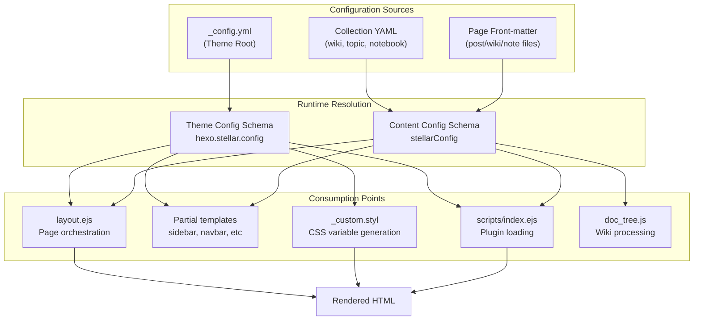
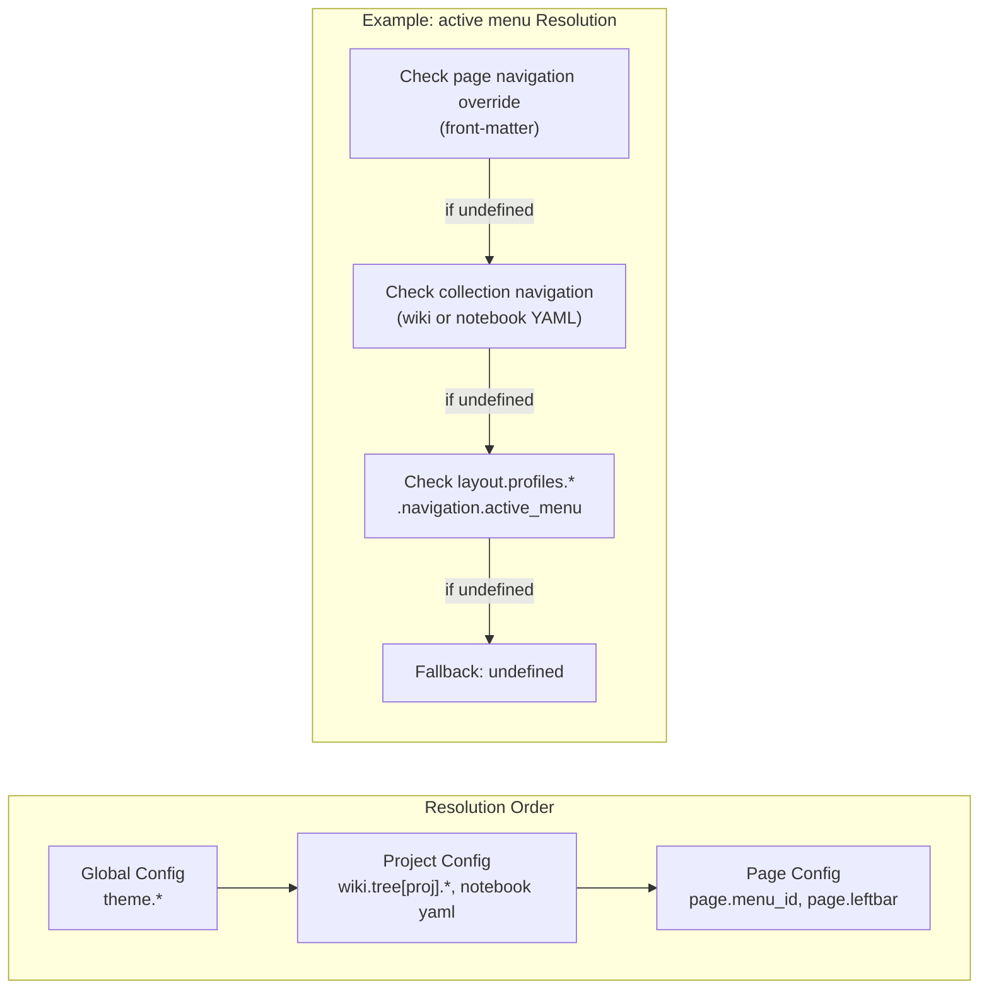
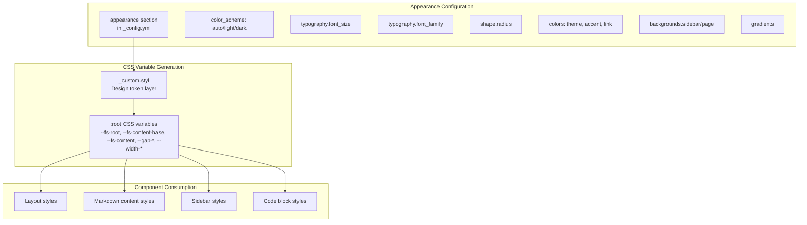
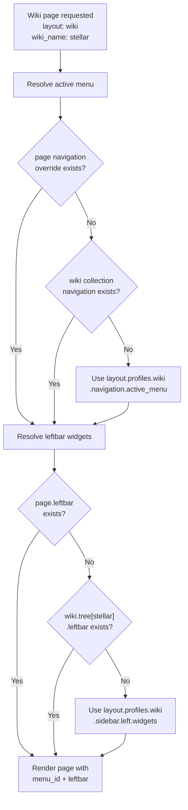

# 配置系统

> [!IMPORTANT]
> 本页保留部分 v1 配置示例用于说明系统组成。v2 的内容字段、页面 Front Matter 与命名规范以[内容配置 Schema v2](../03-内容系统/content-schema-v2.md)为准。

<details>
<summary>相关源码文件</summary>

生成此页面时参考的主题源码文件：

- [.github/workflows/npm-publish.yml](../../../.github/workflows/npm-publish.yml)
- [.npmignore](../../../.npmignore)
- [LICENSE](../../../LICENSE)
- [README.md](../../../README.md)
- [_config.yml](../../../_config.yml)
- [package.json](../../../package.json)
- [test/config-discoverability.test.js](../../../test/config-discoverability.test.js)

</details>

## 目的与范围

配置系统是驱动 Stellar 主题行为、外观与功能启用的核心控制机制。本文介绍主题默认 `_config.yml`、站点 `_config.stellar.yml`、Collection YAML 与 Front Matter 的职责边界，以及配置值在渲染流水线中的流向。

安装与初始化见[安装与启动](installation.md)，样式相关配置见[样式系统](../01-样式系统/styling-overview.md)，插件配置见[插件系统](../07-外部集成/plugin-system.md)。

## 配置架构

配置系统实现三级级联，值可以在越来越具体的范围内被覆盖：



**参考源码**：[_config.yml](../../../_config.yml)

### v2 配置迁移边界

Pre-alpha M1.5 已建立内部配置入口目录，并进一步把 v2 最终公开主题配置冻结为 `site`、`seo`、`layout`、`content`、`appearance`、`resources`、`extensions`、`inject` 八个职责根域。完整目标树、命名、级联和旧→新迁移矩阵见[最终配置契约](../../designs/2026-08-22-v2-config-target-contract/target-contract.md)。

head/SEO、site Shell、Layout Profile、内容默认值、Collection / Front Matter、Appearance、资源兜底、Extension 与服务纵向切片已把八根域的业务配置接入声明式 Schema。M1.5 最终切片已封闭根级未知字段，并把主题元数据、核心资源、URL 策略与构建派生对象移出公开 YAML。

已交付的主题字段从 Schema 与 `_config.stellar.yml` 解析到冻结的 `hexo.stellar.config`；Collection YAML 与 Front Matter 分别解析为冻结的 camelCase 对象，由生成器、数据树、ViewModel 与按需插件消费。Hexo 自有 Front Matter 保持原名，不进入 Stellar Reference。

Pre-alpha M3 的 Blueprint 只在 init 时把选择结果展开为上述显式配置，不增加 `blueprint` 或 `style` 配置根，也不参与运行时级联。`stellar doctor` 直接复用同一 Theme、Collection 与 Front Matter Schema 做只读检查；不存在 CLI 专用的第二套字段白名单。三套 Blueprint、两套 Visual Style 和命令契约的机器可读登记位于 `reference/v2-blueprints.json`。

Pre-alpha M9 允许 `_config.stellar.yml` 缺失或为空：Schema 默认值仍生成完整站点，doctor 会明确显示正在检查 `Schema defaults`。Blueprint 输出不得重复 Schema 默认值；默认 `stellar` Visual Style 是空覆盖，只有真实产品差异才写入站点配置。普通 Post/Page 只需 Hexo 自有最小 Front Matter，Collection 内容的唯一候选归属与冲突诊断由构建和 doctor 共用同一解析器。

## 配置文件结构

`_config.yml` 按逻辑小节组织，控制不同子系统：

| 小节 | 用途 |
|------|------|
| `seo` | SEO、Canonical、Open Graph 与结构化数据（v2 已交付） |
| `site` | 站点 Brand、主菜单、左栏操作与页尾内容（v2 已交付） |
| `layout.profiles` | 13 类页面的路径、导航与左右侧栏默认值（v2 已交付） |
| `content.article` | 文章显示、列表、Footer 与相关内容默认值（v2 已交付） |
| `content.notebook` | 笔记本列表、标签图标与 Footer 默认值（v2 已交付） |
| `appearance` | 排版、形状、颜色、渐变、动效、代码块与页面背景（v2 已交付） |
| `resources` | 预连接提示与图片资源兜底（v2 已交付） |
| `extensions.search` | Local / Algolia 搜索 provider |
| `extensions.comments` | 评论 provider 与第三方参数袋 |
| `extensions.tags` | 标签 Extension 行为 |
| `extensions.features` | 可选 Feature 的注册式配置 |
| `extensions.services` | 业务端点与 GitHub 完整 URL |
| `inject` | `<head>` 与 `<body>` 末尾的可信原文注入（v2 已交付） |

**参考源码**：[_config.yml](../../../_config.yml)

### 默认配置的可发现性契约

主题 `_config.yml` 同时是默认值镜像和用户可阅读的配置入口。每个封闭的主题级公开字段都必须以活动 YAML 键出现；未设置的值保持为空，并把示例值写在同一行的注释中。对象数组和动态映射必须给出完整结构示例或明确的键值契约；新增 Schema 字段但未同步默认配置会由配置可发现性测试阻断。

`site.brand.image.src`、`site.brand.name`、`site.brand.tagline.text` 等字段在默认配置中显示为空，运行时没有站点覆盖时仍由 Schema 从 Hexo 配置派生；在站点 `_config.stellar.yml` 中显式填写空值则表示用 `null` 覆盖。第三方 provider 参数袋只声明“透传给上游”并展示常用参数，不复制外部 SDK 的全部字段；主题内部常量不是公开配置。Collection YAML 与 Front Matter 属于独立配置边界，由相应 Reference 和内容文档说明，不混入主题 `_config.yml`。

**参考源码**：[_config.yml](../../../_config.yml)、[test/config-discoverability.test.js](../../../test/config-discoverability.test.js)

`inject.head_end/body_end` 是主题、站点与页面级的可信逃生口。主题默认与站点覆盖使用字符串，页面 Front Matter 也只接受字符串；渲染时站点文本在前、页面文本在后，以一个换行拼接，原文不解析、不格式化。

### 卡片 Hover 插件

`extensions.features.card_hover` 提供可复用的鼠标跟随光斑与 3D 倾斜，默认关闭：

```yaml
extensions:
  features:
    card_hover:
      enabled: false
```

Card Hover 只公开 `enabled`；光斑颜色和最大倾斜角是主题内部策略。插件采用 `.card-hover` 基础类与 `.card-hover--spotlight`、`.card-hover--tilt` 修饰类组合，关闭时这些类不会改变静态样式。完整的运行时接口与接入范围见[插件系统](../07-外部集成/plugin-system.md#card-hover卡片光效与倾斜)。

**参考源码**：[_config.yml](../../../_config.yml)、[source/js/runtime/extensions/feature.mjs](../../../source/js/runtime/extensions/feature.mjs)

### 可选配色选择器

`extensions.features.color_scheme_switch` 默认关闭。关闭时不进入 Runtime Manifest、不输出配色切换文案，也不请求客户端模块；主题不会自动添加 UI：

```yaml
extensions:
  features:
    color_scheme_switch:
      enabled: false
```

启用后提供 `window.setColorScheme('light' | 'dark' | 'auto')`。Footer Dropdown 的三项确定选择示例见[侧栏系统](../02-布局系统/sidebar-system.md#左栏footer-actions)。模块契约、存储键与事件见[前端交互概览](../05-前端交互/client-side-overview.md#可选配色选择器)。

**参考源码**：[_config.yml](../../../_config.yml)、[source/js/runtime/extensions/color-scheme-switch.mjs](../../../source/js/runtime/extensions/color-scheme-switch.mjs)

## 层级覆盖系统

配置值的解析遵循「越具体的范围覆盖越宽泛的范围」：



**参考源码**：[_config.yml](../../../_config.yml)（`layout.profiles` 小节）

### 示例：导航高亮解析

对 wiki 页面，配置 Profile 的最终字段是 `navigation.active_menu`；Collection / Front Matter 的 `navigation.menu` 在声明式 Schema 边界冻结为 `navigation.menu`。解析顺序为：

1. **页面级**：`page.navigation.menu`（front-matter）
2. **集合级**：Collection YAML 的 `navigation.menu`
3. **布局级**：`hexo.stellar.config.layout.profiles.wiki.navigation.activeMenu`
4. **全局兜底**：`undefined`

### 示例：侧边栏小部件分配

侧边栏小部件遵循同样模式：

1. **页面级**：`page.sidebar.left.widgets` / `page.sidebar.right.widgets`（front-matter）
2. **笔记本级**：笔记页使用笔记本 YAML 中的 `note_defaults.sidebar.left/right.widgets`
3. **布局级**：`hexo.stellar.config.layout.profiles[profile].sidebar.left/right.widgets`
4. **默认**：空侧边栏

**参考源码**：[_config.yml](../../../_config.yml)（`layout.profiles` 小节）

## 核心配置小节

### 主题元数据与核心资源

主题名称、版本、主页和仓库地址由 `package.json` 唯一提供；核心 CSS/JS 路径由内部资源清单固定。它们不属于站点可配置行为，因此 v2 不再暴露 `stellar` YAML 根域。模板通过 `stellar_info()` 获取只读元数据与内部资源路径。

**参考源码**：[package.json](../../../package.json)、[scripts/lib/theme-metadata.js](../../../scripts/lib/theme-metadata.js)、[scripts/helpers/stellar_info.js](../../../scripts/helpers/stellar_info.js)

### SEO 与 meta 标签

`seo` 小节统一控制索引、分享与结构化数据：

- **`seo.canonical`**：通过 `host` 与 `allowed_hosts` 校验域名，检测并警告克隆站
- **`seo.open_graph`**：启用 Open Graph meta 标签，用于社交分享
- **`seo.structured_data`**：通过 `same_as` 为 JSON-LD 作者/组织提供公开身份链接

Pre-alpha M1.5 的声明式 Schema 定义默认值、类型、站点覆盖、规范化、消费方与 Reference 元数据，冻结结果位于 `hexo.stellar.config.seo`。YAML 使用 snake_case，JavaScript 使用 `openGraph/structuredData/allowedHosts/twitterId/sameAs`；已迁移旧根和旧子字段直接报迁移错误。

```yaml
seo:
  canonical:
    host: example.com
    allowed_hosts:
      - mirror.example.com
  open_graph:
    enabled: true
    twitter_id:
  structured_data:
    same_as:
      - https://github.com/example
```

`seo` 子树与配置根均已封闭。`resources.preconnect` 数组由站点层完整替换；`inject.head_end/body_end` 是可信多行字符串。实现细节见[HTML Head 与 SEO 元数据](../02-布局系统/head-seo.md)和[Canonical URL 系统](../05-前端交互/canonical-url.md)。

**参考源码**：[_config.yml](../../../_config.yml)

### 站点 Shell：Brand、菜单与 Footer

`site` 小节统一承载站点外壳。Brand 的 `image.src/name/tagline.text` 省略时直接从 Hexo `avatar/title/subtitle` 派生：

```yaml
site:
  brand:
    image:
      variant: avatar
      href: /about/
    wordmark: /images/wordmark.svg
    tagline:
      text: 每个人的独立博客
      hover: example.com
    href: /
  menu:
    items:
      - id: post
        title: 博客
        icon: default:documents
        url: /
        accent: '#1BCDFC'
  footer:
    actions: []
    sections: []
    content: |
      本站由 [{author.name}](/) 使用 [{theme.name} {theme.version}]({theme.tree}) 主题创建。
```

Brand 图片展示变体使用 `image.variant`（`avatar/icon/plain`），图片和标题链接分别写入 `image.href` 与根级 `href`；`name` 只接受纯文本，HTML 字标使用 `wordmark`。菜单是有序对象数组，`id` 必须唯一且为 kebab-case，`url` 必须是安全导航地址，空标题必须配图标，`accent` 必须是 CSS Color。Footer `actions` 是 `link/dropdown/spacer` 判别联合数组，不接受 JavaScript；`sections.items` 使用 `{title,url}` 对象。`content` 保留可信 Markdown 原文。

解析后 JavaScript 只消费冻结的 `hexo.stellar.config.site`；菜单与 Footer 不再直接读取 `theme.menubar/footer`，Post 与 Topic 的全局 Brand 也不再从 `theme.brand` 推断。Collection 与 Front Matter 的 Brand 覆盖仍在内容边界适配，最终字段收敛留给后续切片。

**参考源码**：[_config.yml](../../../_config.yml)

### Layout Profile：页面默认布局

`layout.profiles` 是 v2 的页面布局契约。公开 YAML 固定使用 `home`、`blog_index`、`topic_index`、`wiki_index`、`post`、`topic`、`wiki`、`notebook_index`、`note_index`、`note`、`author`、`error`、`page` 十三个 Profile ID；解析后的 JavaScript ViewModel 使用 `blogIndex`、`wikiIndex` 等 camelCase 键。

每个 Profile 是封闭对象，可包含：

| 属性 | 类型 | 用途 |
|------|------|------|
| `path` | String | 仅六个真实生成器 Profile 可用：`blog_index/topic_index/wiki_index/notebook_index/author/error` |
| `navigation.active_menu` | String / null | 要高亮的 `site.menu.items[].id` |
| `sidebar.left` | Array | 左栏小部件列表 |
| `sidebar.right` | Array | 右栏小部件列表 |
| `navigation.tabs` | Array | 仅 `blog_index/wiki_index` 可用的 `{title,url}` 次级导航数组 |

#### 示例：博客文章布局

```yaml
layout:
  profiles:
    post:
      navigation:
        active_menu: post
      sidebar:
        left: [related, recent]
        right: [ghrepo, toc]
```

所有博客文章（`layout: post`）将：

- 高亮 `post` 菜单栏项
- 左栏显示 `related`、`recent` 小部件
- 右栏显示 `ghrepo`、`toc` 小部件

**参考源码**：[_config.yml](../../../_config.yml)

#### 示例：Wiki 布局

```yaml
layout:
  profiles:
    wiki_index:
      path: /wiki/
      navigation:
        active_menu: wiki
        tabs: []
      sidebar:
        left: [related, recent]
        right: []

    wiki:
      navigation:
        active_menu: wiki
      sidebar:
        left: [tree, related, recent]
        right: [ghrepo, toc]
```

`wiki_index` 定义 wiki 列表页，`wiki` 定义单个 wiki 页面。所有数组在站点层完整替换；`active_menu` 在菜单非空时必须引用真实菜单 ID。旧 `site_tree`、`base_dir`、`navigation.menu` 与旧 Profile ID 不保留兼容读取。

**参考源码**：[_config.yml](../../../_config.yml)

### 置顶内容轮播

置顶内容的展示样式由 `content.article.listing.pinned_layout` 控制：`carousel`（默认）为轮播；`flat`（平铺）时文章不进入轮播区，改为在首页第一页文章列表靠前展示（排序规则与轮播一致）。

`carousel`（默认）：所有带 navbar top 的博客类列表页（首页/归档/标签/分类/专栏等）上方自动展示置顶文章轮播，无需开关配置：只要有置顶内容即渲染，自动轮播间隔固定 5000ms；首页第一页列表不再重复展示置顶文章。

`flat`（平铺）：博客类列表页不渲染文章轮播；首页第一页文章列表顶部按轮播同款规则展示全部置顶文章（含超出单页切片的老文章），同页不重复；归档/分类/标签/首页第二页起的列表中置顶文章按日期正常出现。

- 置顶文章判定与排序（两种样式通用）：文章 front-matter `pin: true|number`，兼容 `sticky` 别名；只要设置即置顶，按数值降序排序，`true` 视作 1，0/负数同样参与，非数字视作 0，权重相同保持 `site.posts` 原顺序；
- wiki 列表放置顶 wiki 项目（数据文件 `pin: true|number`，规则同上），始终以轮播展示，不受 `content.article.listing.pinned_layout` 影响；
- 轮播区宽高比与非置顶文章统一，由 `content.article.listing.cover_ratio` 控制；
- 无置顶内容时不渲染；轮播进度按内容类型分组缓存到 localStorage（切换 tab 不重置）。

**参考源码**：[_config.yml](../../../_config.yml)、[layout/_partial/main/pin_slider.ejs](../../../layout/_partial/main/pin_slider.ejs)

### 笔记本配置

`content.notebook` 提供主题默认值，可被迁移期的单个笔记本 YAML 覆盖：

```yaml
content:
  notebook:
    listing:
      excerpt_length: 128
      per_page: null  # null 继承 Hexo 配置
      sort:
        field: updated
        direction: desc
    tag_icons: {}
    footer:
      license: null
      share: null
```

`per_page: 0` 关闭分页，`null` 继承 Hexo；`footer` 的 `null` 表示继承 Article，`false`（许可）或 `[]`（分享）表示关闭。冻结默认值进入 Notebook CollectionModel，单个笔记本 YAML 可继续覆盖最终字段。

**参考源码**：[_config.yml](../../../_config.yml)

### 文章配置

`content.article` 控制文章主题默认值；YAML 为 snake_case，冻结 JavaScript 为 camelCase：

| 字段 | 类型 | 默认 | 用途 |
|------|------|------|------|
| `type` | `tech` / `story` | `tech` | 布局风格（tech 紧凑、story 宽松） |
| `indent` | Boolean / null | `null` | null 保留 story 自动缩进；布尔值显式覆盖 |
| `listing.pinned_layout` | `carousel` / `flat` | `carousel` | 置顶文章布局 |
| `listing.cover_ratio` | 正数 | `2` | 文章卡片与置顶轮播封面宽高比 |
| `listing.card_layout` | `hero` / `classic` | `hero` | hero 全图文字封面；classic 普通卡片 |
| `banner.ratio` | 正数 | `2.5` | 文章横幅宽高比 |
| `listing.excerpt_length` | 非负数 | `128` | 自动摘要提取字符数 |
| `show_reading_time` | Boolean | `false` | 文章页显示字数与预计阅读时长 |
| `listing.show_tags` | Boolean | `false` | 文章卡片显示标签（最多 5 个） |
| `show_tags` | Boolean | `true` | 文章页末尾显示本文标签 |
| `ai_label` | Object | 四档默认 | 文章 AI 成分标签：`manual` / `polished` / `generated` / `reviewed` 的文字颜色（无底色）与可选 `icon`，front-matter 用 `ai_label` 字段选择；文案由多语言系统提供（`languages/*.yml` 的 `meta.ai_label.*`，缺失时不渲染）；`default` 为空时未标记文章不渲染，非空时未标记文章按默认档渲染；banner 含图片时文字用默认颜色 |
| `footer.license` | String/Boolean | 许可文本 | 文章默认许可声明 |
| `footer.share` | Boolean / Array | `false` | 分享按钮：`wechat`、`weibo`、`email`、`link` |
| `related_posts.enabled/limit` | Boolean / 非负数 | `false` / `5` | 相关文章开关与数量上限 |

主题级旧根 `article` / `notebook` 不再兼容读取。Collection / Front Matter 仍通过现有 `article`、`footer` 等局部覆盖进入模型，待后续统一 Schema 切片再改名。

**参考源码**：[_config.yml](../../../_config.yml)

### 页脚配置

`site.footer` 包含左栏底部操作、主内容区页脚分栏和 Markdown 文本：

| 字段 | 类型 | 用途 |
|------|------|------|
| `actions` | Array | 左栏底部有序操作列表 |
| `actions[].type` | `link` / `dropdown` / `spacer` | 判别条目类型；`spacer` 将后续按钮推至同一行右侧 |
| `actions[].icon` | String / null | link 或 dropdown 主按钮图标 |
| `actions[].title` | String | link tooltip 或 dropdown 无障碍标签 |
| `actions[].url` | String / null | link 安全导航地址；不接受 JavaScript |
| `actions[].items` | Array | dropdown 子项列表；`title`、`url` 必填，`icon` 可选 |
| `sections` | Array | 主内容区页脚的分组链接 |
| `content` | String | 主内容区页脚的 Markdown 文本；默认显示作者与主题署名，显式空字符串可关闭 |

dropdown 示例：

``@@BT@yaml
site:
  footer:
    actions:
      links:
        variant: dropdown
        icon: default:documents
        title: 更多链接
        items:
          - icon: default:documents
            title: 文档
            url: /wiki/
          - title: GitHub
            url: https://github.com/
``@@BT@

未设置 `variant` 的 action 保持普通链接或动作行为。若要在一组按钮中撑开中间空间，可在需要的位置加入 `spacer: {}`：

``@@BT@yaml
site:
  footer:
    actions:
      github:
        icon: default:github
        url: https://github.com/
      spacer: {}
      links:
        variant: dropdown
        icon: default:documents
        title: 更多链接
        items: []
``@@BT@

dropdown 子项图标可省略。菜单不关联语言或其它业务场景，也不支持嵌套；打开后挂载到 `body` 下的全局浮层，并根据触发按钮周围的可用空间自动调整上下和左右位置。菜单自身声明 glass surface，条目复用通用 collection list 的结构与交互样式。

**参考源码**：[_config.yml](../../../_config.yml)、[layout/_partial/sidebar/index_leftbar.ejs](../../../layout/_partial/sidebar/index_leftbar.ejs)、[layout/_partial/dropdown.ejs](../../../layout/_partial/dropdown.ejs)、[layout/_partial/main/footer.ejs](../../../layout/_partial/main/footer.ejs)

### Appearance 与资源兜底

`appearance` 小节定义视觉语义，`resources.fallbacks` 集中管理图片兜底；YAML 使用 snake_case，运行时由 Schema 投影为冻结的 camelCase：



**参考源码**：[_config.yml](../../../_config.yml)（`appearance`、`resources` 小节）

关键样式配置：

1. **字号与字体**：`appearance.typography.font_size.root` 设置桌面端根字号；`font_family.body/code` 分别控制正文和全部代码字体。
2. **圆角**：`appearance.shape.radius` 使用 `card_large/card/card_small` 与 `image_large/image/image_small` 的完整语义名。
3. **颜色**：`appearance.colors.primary/accent/link` 使用 CSS Color，便于精确调色。
4. **左栏外观**：支持纯色、渐变或带模糊效果的背景图
5. **资源兜底**：`resources.fallbacks` 只公开 `avatar/link_card/cover`；错误页插图使用可空的 `resources.error_page.image`，其余固定素材由主题内部维护。

完整样式细节见[设计令牌与 CSS 变量](../01-样式系统/design-tokens.md)。

**参考源码**：[_config.yml](../../../_config.yml)

### Extension 配置

可选能力位于 `extensions.features`，统一使用 `enabled`：

```yaml
extensions:
  features:
    lightbox:
      enabled: true
      selector: .timenode p>img
    adaptive_text:
      enabled: true
```

官方 JavaScript、CSS、inject 资源与固定 provider 由主题内部常量注册表所有，不是公开配置。Feature 只保留启用状态和真正会改变业务行为的参数；可替换实现仍以显式公开 provider 表达，例如 `extensions.features.math.provider`。

`adaptive_text` 为内置能力（默认 `enabled: true`）：背景图/背景色上方的文字颜色随背景亮度自适应，页面存在 `[data-text-adaptive]` 元素时才加载计算脚本并写入 `--text-banner` / `--text-banner-theme`。

插件加载机制见[插件系统](../07-外部集成/plugin-system.md)。

**参考源码**：[_config.yml](../../../_config.yml)（`extensions.features` 小节）

### 数据服务配置

`extensions.services` 以 `provider + providers` 定义可替换的第三方服务；官方客户端模块由主题内部注册表按需加载：

```yaml
extensions:
  services:
    site_info:
      provider: site_info_api
      providers:
        site_info_api:
          endpoint: https://api.xaox.cc/site_info/v1?url={href}
    rating:
      provider: star_vote
      providers:
        star_vote:
          endpoint: https://star-vote.xaox.cc/api/rating
    vote:
      provider: star_vote
      providers:
        star_vote:
          endpoint: https://star-vote.xaox.cc/api/vote
```

三项服务默认使用 xaox.cc 公共实例，站点可覆盖选中 provider 参数袋内的绝对 HTTP(S) URL，或将 `provider` 显式设为 `null` 关闭。服务仅在对应标签插件或组件生成匹配 DOM 时加载；公共实例不可用、响应异常或被关闭时保留静态内容，不显示错误，也不输出控制台日志。新增实现只扩展 provider ID、封闭参数袋和适配器，不改变服务根结构；未选中的参数袋不会投影给浏览器。

**参考源码**：[_config.yml](../../../_config.yml)（`extensions.services` 小节）

### 评论系统配置

`extensions.comments` 支持多种第三方 provider，采用单 provider 激活模型：

```yaml
extensions:
  comments:
    provider: beaudar
    providers:
      beaudar: {}
```

每个 provider 的上游字段位于 `providers.<provider>` 参数袋。页面与 Collection 覆盖统一使用 `comments.provider/options`。未显式设置 `comments.title` 时，标题使用当前语言的 `btn.comments`；显式标题仍保持站点配置值。

集成细节见[评论系统](../07-外部集成/comment-systems.md)。

**参考源码**：[_config.yml](../../../_config.yml)（`extensions.comments` 小节）

## 配置访问方式

### EJS 模板中

已交付的 Stellar 配置通过 `stellar_config()` 读取冻结运行时；主题元数据通过 `stellar_info()` 读取，构建派生数据通过 `stellar_data()` 读取：

```ejs
Version: <%= stellar_info('version') %>
<% var menuId = stellar_config(`layout.profiles.${profile}.navigation.activeMenu`) %>
<% var wiki = stellar_data('wiki') %>
```

### Stylus 文件中

`hexo-config()` 函数从 `_config.yml` 取值：

```stylus
$root-font-size = hexo-config('appearance.typography.font_size.root')
$theme-color = hexo-config('appearance.colors.primary')

:root
  font-size: $root-font-size
  --theme-color: $theme-color
```

**参考源码**：[source/css/_custom.styl](../../../source/css/_custom.styl)

### 数据处理脚本中

Node.js 脚本从 `hexo.stellar.config` 读取公开配置，从 `hexo.stellar.data` 读取注册数据与构建派生对象：

```javascript
// 在 scripts/events/lib/doc_tree.js 中
hexo.stellar.config.layout.profiles.wikiIndex.path
hexo.stellar.data.wiki.tree
```

## 配置解析示例

下面是系统为 wiki 页面解析配置的过程：



**参考源码**：[_config.yml](../../../_config.yml)

## 默认资源配置

`resources.fallbacks` 为缺失资源提供兜底：

| 资源类型 | 用途 | 示例 |
|----------|------|------|
| `avatar` | 用户头像 | 默认头像 |
| `cover` | 文章封面 | 缺失封面的占位 |
| `banner` | 文章横幅 | 默认头图 |
| `link_card` | 链接卡片图标 | 站点信息不可用时显示 |
| `project_icon` | 项目图标 | Wiki/项目缺少图标时显示 |
| `image.content` | 正文图片错误兜底 | 普通内容图片加载失败时使用 |
| `image.tag_plugin` | 标签图片错误兜底 | 图片型标签加载失败时使用 |
| `error_page` | 错误页插图 | 404 页面资源兜底 |

这些默认值避免出现破图，保证资源缺失时的一致性体验。

**参考源码**：[_config.yml](../../../_config.yml)

## 内部系统边界

v2 不公开 `system`、`cache` 或 `language_switcher` 兼容根。规范 URL 策略由构建集成固定；官方资源、固定 provider、request/cache 策略与交互计时由 `scripts/lib/internal-constants.js` 统一所有。Hexo 自有配置仍归 `hexo.config`，不会复制进主题配置。图标、Widget、作者、链接、Collection 树等运行时数据统一位于 `hexo.stellar.data`，不会回写 `theme.config`。

配置工程同时生成 [`docs/audits/2026-08-24-v2-config-field-audit.md`](../../../docs/audits/2026-08-24-v2-config-field-audit.md)，对每个当前字段和 M6 退出字段标注 `public/localize/derive/internalize/remove`，作为仓库内部的机器可核查证据，不进入公开 Reference 或 npm 包。

**参考源码**：[scripts/events/lib/config.js](../../../scripts/events/lib/config.js)、[scripts/lib/runtime-data.js](../../../scripts/lib/runtime-data.js)、[scripts/lib/internal-constants.js](../../../scripts/lib/internal-constants.js)、[scripts/lib/config-field-audit.js](../../../scripts/lib/config-field-audit.js)

## 配置最佳实践

### 1. 覆盖层级策略

只在必要层级做覆盖：

- 全局默认值保证全站一致
- 项目级用于 wiki 或笔记本的专属行为
- 页面级仅用于个别例外

### 2. 菜单 ID 一致性

保持相关 Profile 的 `navigation.active_menu` 一致。例如所有博客相关页面都使用 `post`：

```yaml
layout:
  profiles:
    blog_index:
      navigation:
        active_menu: post
    post:
      navigation:
        active_menu: post
    topic:
      navigation:
        active_menu: post
```

**参考源码**：[_config.yml](../../../_config.yml)

### 3. 小部件分配模式

常见组合：

| 页面类型 | 左栏 | 右栏 |
|----------|------|------|
| 博客文章 | `related, recent` | `ghrepo, toc` |
| Wiki 页面 | `tree, related, recent` | `ghrepo, toc` |
| 笔记页 | `tagtree, recent` | `toc` |

### 4. 样式令牌使用

优先使用设计令牌而非硬编码值：

- 用 `appearance.colors.primary`、`appearance.colors.accent` 保持一致配色
- 用 `appearance.shape.radius.*` 保持统一圆角
- 用 `appearance.typography.font_size.*` 实现可伸缩排版

### 5. 插件按需启用

只启用需要的插件以优化性能。`enabled: false` 的 Extension 不会贡献对应行为。

**参考源码**：[_config.yml](../../../_config.yml)

---

配置系统的强大之处在于层级覆盖模式与各子系统的紧密集成。理解解析顺序与可用配置点，即可在不改主题代码的前提下实现精确定制。
