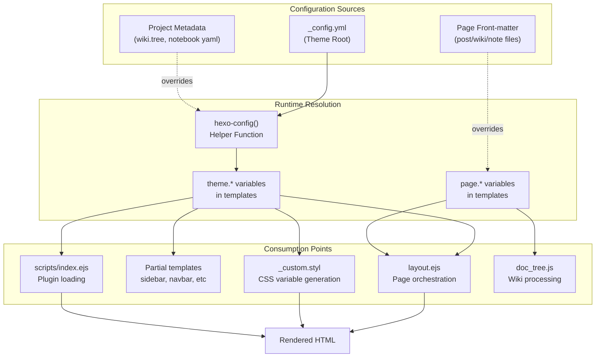
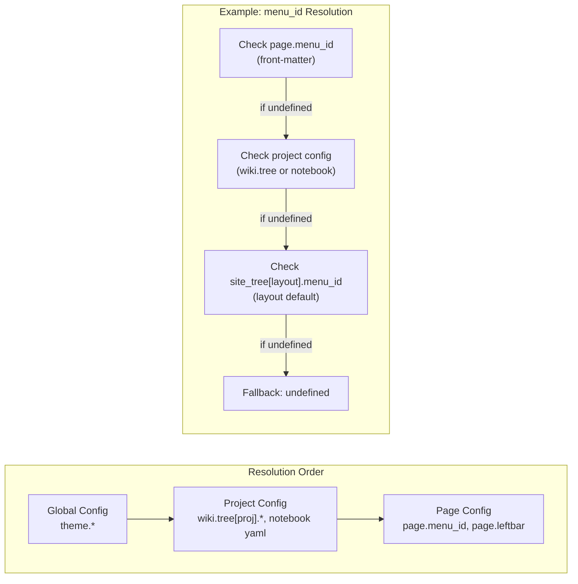
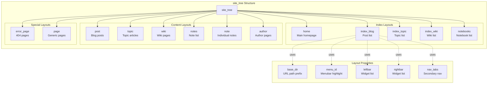
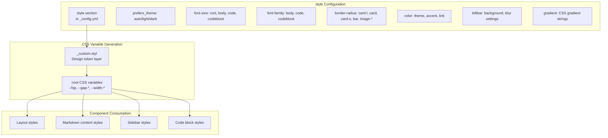
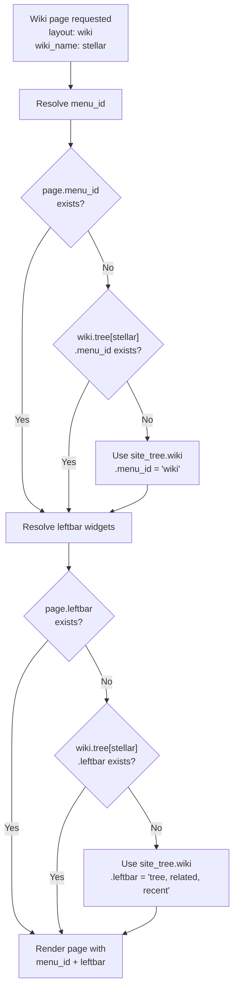

# 配置系统

<details>
<summary>相关源码文件</summary>

生成此页面时参考的主题源码文件：

- [.github/workflows/npm-publish.yml](../../../.github/workflows/npm-publish.yml)
- [.npmignore](../../../.npmignore)
- [LICENSE](../../../LICENSE)
- [README.md](../../../README.md)
- [_config.yml](../../../_config.yml)
- [package.json](../../../package.json)

</details>

## 目的与范围

配置系统是驱动 Stellar 主题行为、外观与功能启用的核心控制机制。本文介绍 `_config.yml` 的结构、层级覆盖模式、配置值在渲染流水线中的流向，以及各子系统如何消费配置。

安装与初始化见[安装与启动](installation.md)，样式相关配置见[样式系统](../01-样式系统/styling-overview.md)，插件配置见[插件系统](../07-外部集成/plugin-system.md)。

## 配置架构

配置系统实现三级级联，值可以在越来越具体的范围内被覆盖：



**参考源码**：[_config.yml](../../../_config.yml)

配置从 `_config.yml` 经由 Hexo 的主题变量系统（`theme.*`）流动，页面级覆盖通过 `page.*` 变量实现。`hexo-config()` 辅助函数让 Stylus 文件也能访问配置值。

## 配置文件结构

`_config.yml` 按逻辑小节组织，控制不同子系统：

| 小节 | 用途 |
|------|------|
| `stellar` | 主题元数据与资源路径 |
| `preconnect`、`canonical`、`open_graph`、`structured_data` | SEO 与 meta 标签 |
| `logo`、`menubar` | 侧边栏品牌与导航 |
| `site_tree` | 各页面类型布局定义与侧边栏小部件分配 |
| `notebook` | 笔记本系统配置 |
| `article` | 文章显示与元数据设置 |
| `search` | 搜索服务配置 |
| `comments` | 评论系统集成 |
| `footer` | 页脚内容与社交链接 |
| `tag_plugins` | 标签插件外观与行为 |
| `dependencies` | 核心 JavaScript 依赖（CDN） |
| `data_services` | 按需加载的数据服务 |
| `plugins` | 功能插件启用与 CDN 地址 |
| `style` | 设计令牌与主题变量 |
| `default` | 默认资源兜底 |
| `api_host` | API 端点主机 |
| `data_cache` | 数据缓存 |
| `system` | 内部 Hexo 覆盖 |

**参考源码**：[_config.yml](../../../_config.yml)

## 层级覆盖系统

配置值的解析遵循「越具体的范围覆盖越宽泛的范围」：



**参考源码**：[_config.yml](../../../_config.yml)（`site_tree` 小节）

### 示例：`menu_id` 解析

对 wiki 页面，`menu_id`（控制菜单栏高亮）的解析顺序为：

1. **页面级**：`page.menu_id`（front-matter）
2. **项目级**：`wiki.tree[project_name].menu_id`
3. **布局级**：`theme.site_tree.wiki.menu_id`
4. **全局兜底**：`undefined`

### 示例：侧边栏小部件分配

侧边栏小部件遵循同样模式：

1. **页面级**：`page.leftbar` / `page.rightbar`（front-matter）
2. **笔记本级**：笔记页使用笔记本 YAML 中的 `note_leftbar` / `note_rightbar`
3. **布局级**：`theme.site_tree[layout].leftbar` / `rightbar`
4. **默认**：空侧边栏

**参考源码**：[_config.yml](../../../_config.yml)（`site_tree` 小节）

## 核心配置小节

### Stellar 元数据

`stellar` 小节定义主题身份与核心资源路径：

```yaml
stellar:
  version: '1.39.1'
  homepage: 'https://xaoxuu.com/wiki/stellar/'
  repo: 'https://github.com/xaoxuu/hexo-theme-stellar'
  main_css: /css/main.css
  main_js: /js/main.js
```

这些值用于模板中的版本展示、资源加载与文档链接。

**参考源码**：[_config.yml](../../../_config.yml)

### SEO 与 meta 标签

`canonical`、`open_graph`、`structured_data` 小节控制 SEO 行为：

- **`canonical`**：通过 `originalHost` 与备用站主机列表校验域名，检测并警告克隆站
- **`open_graph`**：启用 Open Graph meta 标签，用于社交分享
- **`structured_data`**：为 JSON-LD 结构化数据生成提供数据

这些由 head 模板消费并生成相应 meta 标签。实现细节见[HTML Head 与 SEO 元数据](../02-布局系统/head-seo.md)。

**参考源码**：[_config.yml](../../../_config.yml)

### Logo 与菜单栏配置

`logo` 小节支持从 `_config.yml` 动态替换值：

```yaml
logo:
  avatar: '[{config.avatar}](/about/)'
  title: '[{config.title}](/)' 
  subtitle: '{config.subtitle}'
```

`{config.*}` 占位符会被替换为 Hexo 主 `_config.yml` 中的值。`menubar` 定义导航按钮（`id`、`theme`、`icon`、`title`、`url` 等属性）。

**参考源码**：[_config.yml](../../../_config.yml)

### 站点树：布局定义

`site_tree` 是最关键的配置块，为每种页面类型定义布局特征：



**参考源码**：[_config.yml](../../../_config.yml)（`site_tree` 小节）

每种布局定义可包含：

| 属性 | 类型 | 用途 |
|------|------|------|
| `base_dir` | String | 生成页面的 URL 路径前缀 |
| `menu_id` | String | 要高亮的菜单栏项 ID |
| `leftbar` | String/Array | 左栏小部件列表（逗号分隔） |
| `rightbar` | String/Array | 右栏小部件列表（逗号分隔） |
| `nav_tabs` | Object | 次级导航标签（标题-URL 对） |

#### 示例：博客文章布局

```yaml
post:
  menu_id: post
  leftbar: related, recent
  rightbar: ghrepo, toc
```

所有博客文章（`layout: post`）将：

- 高亮 `post` 菜单栏项
- 左栏显示 `related`、`recent` 小部件
- 右栏显示 `ghrepo`、`toc` 小部件

**参考源码**：[_config.yml](../../../_config.yml)

#### 示例：Wiki 布局

```yaml
index_wiki:
  base_dir: wiki
  menu_id: wiki
  leftbar: related, recent
  rightbar: 
  nav_tabs:
    # 'more': https://github.com/xaoxuu

wiki:
  menu_id: wiki
  leftbar: tree, related, recent
  rightbar: ghrepo, toc
```

`index_wiki` 定义 wiki 列表页，`wiki` 定义单个 wiki 页面。注意 wiki 页面左栏的 `tree` 小部件用于展示项目结构。

**参考源码**：[_config.yml](../../../_config.yml)

### 置顶内容轮播

置顶内容的展示样式由 `article.pin_style` 控制：`carousel`（默认）为轮播；`flat`（平铺）时文章不进入轮播区，改为在首页第一页文章列表靠前展示（排序规则与轮播一致）。

`carousel`（默认）：所有带 navbar top 的博客类列表页（首页/归档/标签/分类/专栏等）上方自动展示置顶文章轮播，无需开关配置：只要有置顶内容即渲染，自动轮播间隔固定 5000ms；首页第一页列表不再重复展示置顶文章。

`flat`（平铺）：博客类列表页不渲染文章轮播；首页第一页文章列表顶部按轮播同款规则展示全部置顶文章（含超出单页切片的老文章），同页不重复；归档/分类/标签/首页第二页起的列表中置顶文章按日期正常出现。

- 置顶文章判定与排序（两种样式通用）：文章 front-matter `pin: true|number`，兼容 `sticky` 别名；只要设置即置顶，按数值降序排序，`true` 视作 1，0/负数同样参与，非数字视作 0，权重相同保持 `site.posts` 原顺序；
- wiki 列表放置顶 wiki 项目（数据文件 `pin: true|number`，规则同上），始终以轮播展示，不受 `article.pin_style` 影响；
- 轮播区宽高比与非置顶文章统一，由 `article.cover_ratio` 控制（修改该值即可整体调整）；
- 无置顶内容时不渲染；轮播进度按内容类型分组缓存到 localStorage（切换 tab 不重置）。

**参考源码**：[_config.yml](../../../_config.yml)、[layout/_partial/main/pin_slider.ejs](../../../layout/_partial/main/pin_slider.ejs)

### 笔记本配置

`notebook` 小节提供默认值，可被单个笔记本 YAML 覆盖：

```yaml
notebook:
  auto_excerpt: 128
  per_page: null  # null 继承 Hexo 配置
  order_by: -updated
  license: false
  share: false
```

这些值会级联到笔记本 YAML（如 `source/_data/notebooks/mynotebook.yml`），后者可覆盖 `per_page`、`order_by`、`license`、`share`、`leftbar`、`rightbar`、`note_leftbar`、`note_rightbar` 等字段。

**参考源码**：[_config.yml](../../../_config.yml)

### 文章配置

`article` 小节控制内容显示特征：

| 字段 | 类型 | 默认 | 用途 |
|------|------|------|------|
| `type` | `tech` / `story` | `tech` | 布局风格（tech 紧凑、story 宽松） |
| `indent` | Boolean | `false` | 段落首行两字缩进 |
| `pin_style` | `carousel` / `flat` | `carousel` | 置顶文章展示样式：carousel 轮播；flat 平铺（不渲染轮播，置顶文章在首页列表靠前展示，排序规则与轮播一致） |
| `cover_ratio` | Number | `2` | 文章卡片封面宽高比 |
| `banner_ratio` | Number | `2.5` | 文章横幅宽高比 |
| `auto_banner` | Boolean | `false` | 根据标签自动从 Unsplash 获取横幅 |
| `auto_excerpt` | Number | `128` | 自动摘要提取字符数 |
| `license` | String/Boolean | 许可文本 | 文章默认许可声明 |
| `share` | Array | `[]` | 分享按钮：`wechat`、`weibo`、`email`、`link` |

这些可在专栏配置或页面 front-matter 中覆盖。

**参考源码**：[_config.yml](../../../_config.yml)

### 样式配置

`style` 小节定义设计令牌，由 `source/css/_custom.styl` 消费：



**参考源码**：[_config.yml](../../../_config.yml)（`style` 小节）

关键样式配置：

1. **字号**：`font-size.root` 设置基准字号（影响所有 `rem` 单位）；`font-size.body` 可用 `px` 或 `rem`
2. **圆角**：`border-radius` 从 `card-l`（24px，大卡片）到 `card-s`（12px，小卡片）渐进
3. **颜色**：`color.theme` / `color.accent` / `color.link` 使用 HSL 值，便于精确调色
4. **左栏外观**：支持纯色、渐变或带模糊效果的背景图

完整样式细节见[设计令牌与 CSS 变量](../01-样式系统/design-tokens.md)。

**参考源码**：[_config.yml](../../../_config.yml)

### 插件配置

`plugins` 小节采用条件加载模式：

```yaml
plugins:
  fancybox:
    enable: true
    js: https://gcore.jsdelivr.net/npm/@fancyapps/ui@5.0/dist/fancybox/fancybox.umd.js
    css: https://gcore.jsdelivr.net/npm/@fancyapps/ui@5.0/dist/fancybox/fancybox.css
    selector: .timenode p>img
```

每个插件配置通常包含：

- `enable`：布尔开关，控制是否加载
- JavaScript / CSS 的 CDN 地址
- 插件专属选项

`inject` 字段允许直接注入内联脚本/样式，而无需单独创建 EJS 文件。

插件加载机制见[插件系统](../07-外部集成/plugin-system.md)。

**参考源码**：[_config.yml](../../../_config.yml)（`plugins` 小节）

### 数据服务配置

`data_services` 小节定义数据组件的按需加载：

```yaml
data_services:
  mdrender:
    js: /js/services/mdrender.js
  siteinfo:
    js: /js/services/siteinfo.js
    api: https://api.xaox.cc/site_info/v1?url={href}
  rating:
    js: /js/services/rating.js
    api: https://star-vote.xaox.cc/api/rating
```

每个服务指定：

- `js`：客户端 JavaScript 实现路径
- `api`：（可选）后端 API 端点，支持 `{href}` 等占位符

服务仅在对应标签插件被使用时加载（如 `` 触发 `ghinfo.js`）。

**参考源码**：[_config.yml](../../../_config.yml)（`data_services` 小节）

### 评论系统配置

`comments` 小节支持多种第三方服务，采用单服务激活模型：

```yaml
comments:
  service: beaudar  # beaudar, utterances, giscus, twikoo, waline, artalk
  comment_title: 快来参与讨论吧~
```

每个服务有专属子配置小节。只有 `comments.service` 指定的服务会被加载。

集成细节见[评论系统](../07-外部集成/comment-systems.md)。

**参考源码**：[_config.yml](../../../_config.yml)（`comments` 小节）

## 配置访问方式

### EJS 模板中

通过 `theme` 对象访问配置：

```ejs
<% if (theme.stellar.version) { %>
  Version: <%= theme.stellar.version %>
<% } %>

<% const menuId = page.menu_id || theme.site_tree[layout]?.menu_id %>
```

### Stylus 文件中

`hexo-config()` 函数从 `_config.yml` 取值：

```stylus
$root-font-size = hexo-config('style.font-size.root')
$theme-color = hexo-config('style.color.theme')

:root
  font-size: $root-font-size
  --theme-color: $theme-color
```

**参考源码**：[source/css/_custom.styl](../../../source/css/_custom.styl)

### 数据处理脚本中

Node.js 脚本通过 Hexo 的 `config` 对象访问配置：

```javascript
// 在 scripts/events/lib/doc_tree.js 中
hexo.theme.config.site_tree.index_wiki.base_dir
```

## 配置解析示例

下面是系统为 wiki 页面解析配置的过程：



**参考源码**：[_config.yml](../../../_config.yml)

## 默认资源配置

`default` 小节为缺失资源提供兜底：

| 资源类型 | 用途 | 示例 |
|----------|------|------|
| `avatar` | 用户头像 | 默认头像 |
| `cover` | 文章封面 | 缺失封面的占位 |
| `banner` | 文章横幅 | 默认头图 |
| `loading` | 加载指示 | 加载动画 SVG |
| `image_onerror` | 图片加载失败兜底 | 图片加载失败时显示的图标 |

这些默认值避免出现破图，保证资源缺失时的一致性体验。

**参考源码**：[_config.yml](../../../_config.yml)

## 系统配置

`system` 小节包含内部覆盖：

```yaml
system:
  override_pretty_urls: true
```

这确保 URL 格式化不受 Hexo `pretty_urls` 配置影响，减少边界情况、提升可靠性。

**参考源码**：[_config.yml](../../../_config.yml)

## 配置最佳实践

### 1. 覆盖层级策略

只在必要层级做覆盖：

- 全局默认值保证全站一致
- 项目级用于 wiki 或笔记本的专属行为
- 页面级仅用于个别例外

### 2. 菜单 ID 一致性

保持相关布局的 `menu_id` 一致。例如所有博客相关页面都用 `menu_id: post`：

```yaml
site_tree:
  index_blog:
    menu_id: post
  post:
    menu_id: post
  topic:
    menu_id: post
```

**参考源码**：[_config.yml](../../../_config.yml)

### 3. 小部件分配模式

常见组合：

| 页面类型 | 左栏 | 右栏 |
|----------|------|------|
| 博客文章 | `related, recent` | `ghrepo, toc` |
| Wiki 页面 | `tree, related, recent` | `ghrepo, toc` |
| 笔记页 | `tagtree, recent` | `toc` |

### 4. 样式令牌使用

优先使用设计令牌而非硬编码值：

- 用 `style.color.theme`、`style.color.accent` 保持一致配色
- 用 `style.border-radius.*` 保持统一圆角
- 用 `style.font-size.*` 实现可伸缩排版

### 5. 插件按需启用

只启用需要的插件以优化性能。`enable: false` 的插件不会贡献任何代码。

**参考源码**：[_config.yml](../../../_config.yml)

---

配置系统的强大之处在于层级覆盖模式与各子系统的紧密集成。理解解析顺序与可用配置点，即可在不改主题代码的前提下实现精确定制。
