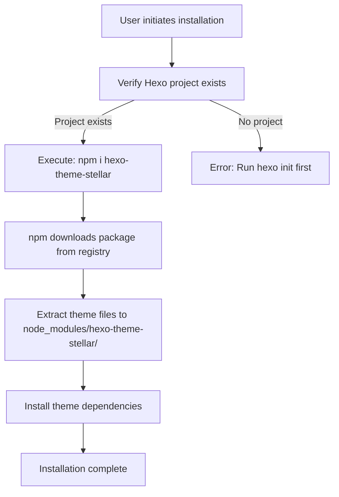
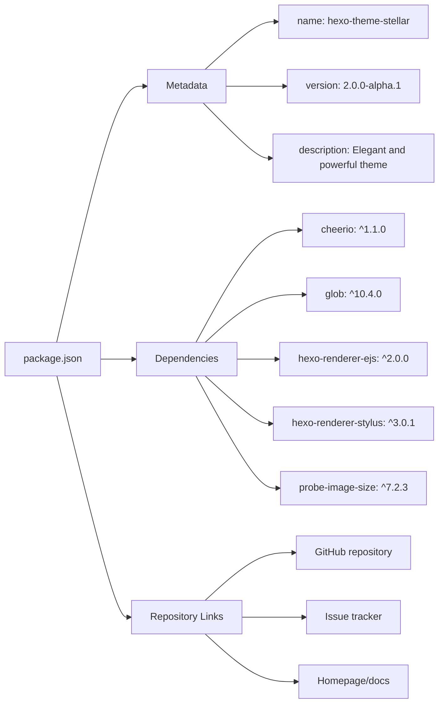
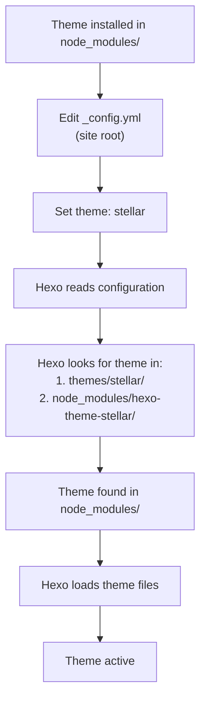
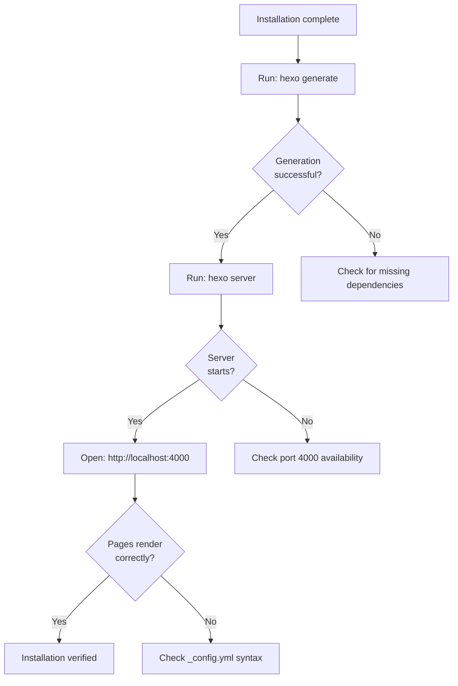
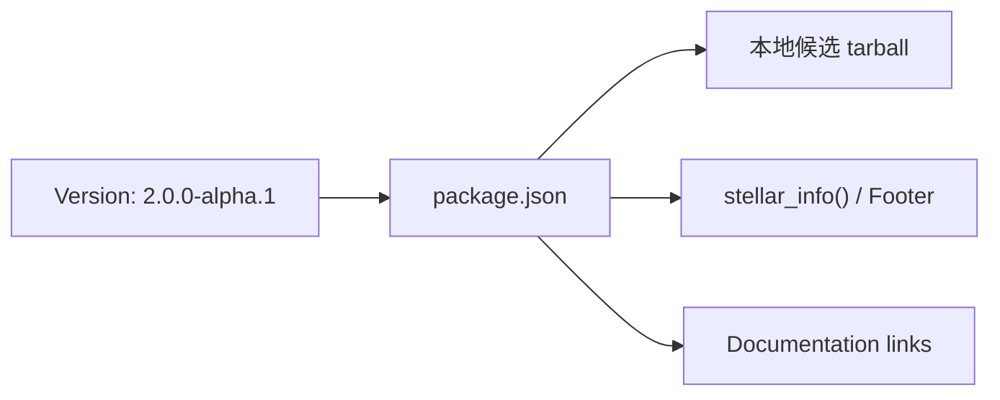

# 安装与启动

<details>
<summary>相关源码文件</summary>

生成此页面时参考的主题源码文件：

- [.github/workflows/npm-publish.yml](../../../.github/workflows/npm-publish.yml)
- [.npmignore](../../../.npmignore)
- [LICENSE](../../../LICENSE)
- [README.md](../../../README.md)
- [_config.yml](../../../_config.yml)
- [package.json](../../../package.json)
- [scripts/commands/stellar.js](../../../scripts/commands/stellar.js)
- [scripts/events/lib/config-hot-reload.js](../../../scripts/events/lib/config-hot-reload.js)

</details>

本文介绍 Stellar Hexo 主题的安装过程，包括环境要求、依赖安装与首次启用。重点是让主题文件进入你的 Hexo 项目并完成首次启用。

详细配置见[配置系统](configuration.md)，样式与主题定制见[样式系统](../01-样式系统/styling-overview.md)。

---

## 目的与范围

本文说明如何：

- 确认开发环境满足 Stellar 的要求
- 通过 npm 安装主题包
- 在 Hexo 配置中启用主题
- 理解主题的依赖结构
- 验证安装是否成功

本文**不**涉及内容创作、高级配置或具体功能设置，这些内容见后续章节。

---

## 环境要求

Stellar 面向现代 Hexo 环境构建，需要兼容的 Node.js 版本。

### 版本要求

| 组件 | 版本要求 | 说明 |
|------|----------|------|
| **Hexo** | 6.3.0 ~ latest（已验证至 8.1.2） | 核心静态站点生成器 |
| **hexo-cli** | 4.3.0 ~ latest | 命令行工具 |
| **Node.js** | >= 22 | 建议选择 LTS 版本 |
| **npm** | 随 Node.js 安装 | 包管理器 |

**重要**：请选择 Node.js LTS（长期支持）版本，过新的非 LTS 版本可能与 Hexo 生态兼容性不佳。

### 验证命令

```bash
# 检查已安装版本
hexo version
node --version
npm --version
```

**参考源码**：[README.md](../../../README.md)

---

## 安装方式

Stellar 以 npm 包形式分发，安装到 Hexo 项目的 `node_modules` 目录，遵循标准 Hexo 主题安装模式。

### 安装流程



### 安装命令

在 Hexo 项目根目录执行：

```bash
npm i hexo-theme-stellar
```

该命令会：

1. 从 npm registry 下载主题包
2. 安装到 `node_modules/hexo-theme-stellar/`
3. 自动安装 `package.json` 中声明的全部依赖
4. 使主题对 Hexo 可用

**参考源码**：[README.md](../../../README.md)、[package.json](../../../package.json)

---

## 主题包结构

`package.json` 定义了主题的身份、依赖与元数据，理解它有助于排查安装问题。

### 包元数据



### 核心依赖

主题依赖以下包，安装时会自动装入：

| 依赖 | 版本 | 用途 |
|------|------|------|
| **cheerio** | ^1.1.0 | HTML/XML 解析与操作（内容处理） |
| **glob** | ^10.4.0 | 文件通配匹配 |
| **hexo-renderer-ejs** | ^2.0.0 | EJS 模板渲染引擎（渲染布局文件） |
| **hexo-renderer-stylus** | ^3.0.1 | Stylus CSS 预处理器（编译主题样式） |
| **js-yaml** | ^4.1.0 | doctor、站点配置与内容数据的 YAML 读取 |
| **probe-image-size** | ^7.2.3 | 图片尺寸探测（懒加载占位） |

这些依赖分别负责：

- **cheerio**：标签插件与辅助函数中的 DOM 操作
- **glob**：脚本中的文件批量匹配
- **hexo-renderer-ejs**：渲染 `.ejs` 布局模板
- **hexo-renderer-stylus**：把 `.styl` 编译为 CSS
- **js-yaml**：读取 doctor 检查所需的站点配置与内容数据，不负责自动改写
- **probe-image-size**：无需下载完整图片即可获取图片尺寸

**参考源码**：[package.json](../../../package.json)

---

## 主题启用

安装完成后，必须显式在 Hexo 站点配置中启用主题，Hexo 不会自动切换到新安装的主题。

### 启用流程



### 修改配置

打开 Hexo 站点根目录的 `_config.yml`（不是主题的 `_config.yml`），设置：

```yaml
theme: stellar
```

这一行告诉 Hexo 使用 Stellar 主题。如果主题不在传统的 `themes/` 目录，Hexo 会自动在 `node_modules/hexo-theme-stellar/` 中查找。

**参考源码**：[README.md](../../../README.md)

---

## Blueprint 创建与站点检查

完整 Blueprint 由独立的 [Stellar Examples](https://github.com/xaoxuu/hexo-theme-stellar-examples) 仓库维护与分发。`lightblog`、`blog`、`knowledge`、`stellar` 分别是一套可以独立运行的完整示例站点；创建器只写入新目录，不覆盖、合并或迁移已有站点。

```bash
curl -fsSL https://github.com/xaoxuu/hexo-theme-stellar-examples/releases/latest/download/install.sh | sh
```

创建器会交互选择 Blueprint、目标目录、版本和依赖安装方式，再下载与该版本绑定的单站归档并校验 SHA-256。主题 npm 包不再包含示例内容，也不再注册 `hexo stellar init`。

Blueprint 不是构建前置条件。只有普通 Post/Page 的站点可以不创建 `_config.stellar.yml`，直接使用 Schema 默认值运行 doctor 和 generate；空文件与缺失文件语义相同。Wiki/Topic/Notebook 内容在已注册数据与源码关系唯一时也不必重复写 `collection`，冲突时按 doctor 给出的候选与最小修复处理。

生成后运行只读检查：

```bash
npx hexo stellar doctor --format text
npx hexo stellar doctor --format json --silent
```

JSON 模式必须使用 Hexo 全局 `--silent`，避免命令加载前的 Hexo 启动日志混入标准输出，保证 stdout 是可直接解析的单一 JSON 文档。doctor 检查 Node.js、Hexo、`theme: stellar`、Schema 默认值或主题覆盖、Collection YAML、Markdown Front Matter 与成员归属；失败问题包含来源、字段路径、实际类型、期望结构、候选集合和迁移章节，但不会修改文件。

**参考源码**：[scripts/commands/stellar.js](../../../scripts/commands/stellar.js)、[scripts/lib/doctor.js](../../../scripts/lib/doctor.js)、[Stellar Examples](https://github.com/xaoxuu/hexo-theme-stellar-examples)

---

## 主题配置文件

Stellar 自带一份覆盖全部主题功能的配置文件，位于主题包内，是主题功能的集中控制点。

### 配置文件位置

```
node_modules/hexo-theme-stellar/_config.yml
```

该文件按主题域分成若干小节，主要小节如下：

| 小节 | 用途 |
|------|------|
| `brand/menu/settings/footer` | Brand、菜单与 Footer 站点外壳 |
| `topbar/leftbar/rightbar/profiles` | 页面 Profile：路径、导航与左右侧栏 |
| `article/notebook` | Article 与 Notebook 内容默认值 |
| `appearance` | 排版、颜色、形状、动效和背景 |
| `canonical/open_graph/structured_data` | canonical、Open Graph 与结构化数据 |
| `preconnect/fallbacks/error_page` | preconnect 与按角色命名的资源兜底 |
| `search/comments/tags/features/services` | 搜索、评论、标签、Feature 与服务 |
| `inject` | 站点 `_config.stellar.yml` 与页面 Front Matter 的受信任原文注入 |

### 主题元数据

主题版本、主页与仓库地址来自 `package.json`，核心 CSS/JS 路径来自内部资源清单。它们不是站点配置项，v2 不允许在 `_config.stellar.yml` 中覆盖。

**参考源码**：[package.json](../../../package.json)、[scripts/lib/theme-metadata.js](../../../scripts/lib/theme-metadata.js)

---

## 安装后的目录结构

安装成功后，项目结构包含：

```
your-hexo-site/
├── _config.yml                          # 站点配置（theme: stellar）
├── package.json                         # 站点依赖
├── node_modules/
│   └── hexo-theme-stellar/              # 主题包
│       ├── _config.yml                  # 主题配置
│       ├── package.json                 # 主题包定义
│       ├── layout/                      # EJS 模板
│       ├── source/                      # CSS/JS/图片
│       │   ├── css/
│       │   └── js/
│       ├── scripts/                     # Hexo 脚本（helpers、标签插件）
│       └── languages/                   # i18n 文件
└── source/                              # 你的内容
```

主题完全从 `node_modules/hexo-theme-stellar/` 运行，Hexo 会自动发现并加载该位置的全部主题组件。

**参考源码**：[package.json](../../../package.json)

---

## 验证步骤

安装并启用后，验证主题是否正常工作。

### 验证清单



### 要执行的命令

1. **生成静态文件**：
   ```bash
   hexo generate
   ```
   用 Stellar 主题编译你的内容，确认无报错。

2. **启动开发服务器**：
   ```bash
   hexo server
   ```
   在 `http://localhost:4000` 启动本地服务。

   `server` 是 Hexo 命令，不是 Stellar 子命令；请勿写成 `hexo stellar server`。如果环境限制监听所有网卡，可使用 `hexo server --ip 127.0.0.1`。站点工程需要安装 `hexo-server`，缺失时 Hexo 只会显示通用命令帮助。

   开发服务器运行期间，Stellar 会监听站点根目录的 `_config.stellar.yml`。保存后会先执行与启动时相同的 Schema 校验，通过后重读配置并触发重新生成，无需重启 `hexo server`。配置非法时保留上一次有效输出并在终端警告。站点 `_config.yml` 属于 Hexo 核心配置，修改它仍可能需要重启。

3. **浏览器访问**：
   打开 `http://localhost:4000`，检查：
   - 页面是否带 Stellar 样式渲染
   - 导航元素是否出现
   - 浏览器开发者工具控制台无报错

### 常见安装问题

| 问题 | 原因 | 解决 |
|------|------|------|
| `Cannot find module 'hexo-theme-stellar'` | 主题未安装 | 执行 `npm i hexo-theme-stellar` |
| `hexo-renderer-ejs not found` | 缺少渲染器 | 应自动安装；可手动 `npm i hexo-renderer-ejs` |
| `hexo-renderer-stylus not found` | 缺少渲染器 | 应自动安装；可手动 `npm i hexo-renderer-stylus` |
| `Usage: hexo <command>` 且没有 `server` | 站点未安装 Hexo 预览服务器 | 执行 `npm i hexo-server`，再运行 `hexo server --ip 127.0.0.1` |
| `Usage: hexo stellar <init\|doctor\|new note>` | 把 Hexo 的 `server` 误写成 Stellar 子命令 | 使用 `hexo server`；`stellar` 只提供 `init`、`doctor` 与 `new note` |
| 页面显示 Hexo 默认主题 | 主题未启用 | 修改 `_config.yml`，设置 `theme: stellar` |
| CSS 未加载 | 资源路径错误 | 主题资源应自动从 `node_modules/` 加载 |

**参考源码**：[README.md](../../../README.md)、[package.json](../../../package.json)

主题启动时只在 npm `latest` 按 SemVer 严格新于本地版本时显示升级提示。内部 v2 候选版本高于当前 v1 `latest` 时不会提示反向安装 v1；无法解析的版本号静默跳过检查结果。

---

## 版本管理

主题采用语义化版本，版本信息由 `package.json` 唯一维护。

### 版本位置



- **package.json**：`"version": "2.0.0-alpha.1"`，当前仅作为 v2 本地候选 tarball 的 SemVer 字符，不发布到 npm

版本号遵循 SemVer `MAJOR.MINOR.PATCH`。Alpha、Beta 只是 v2 项目的内部里程碑，不进入正式发版流程；发版脚本只接受稳定版或 `-rc.N`，并同步 package 版本到安装知识库。

### 更新主题

```bash
npm update hexo-theme-stellar
```

或指定版本：

```bash
npm install hexo-theme-stellar@1.44.0
```

更新后请重新生成站点：

```bash
hexo clean
hexo generate
```

**参考源码**：[package.json](../../../package.json)、[release.js](../../../release.js)、[.github/workflows/npm-publish.yml](../../../.github/workflows/npm-publish.yml)

---

## 下一步

安装成功后：

1. **配置主题**：见[配置系统](configuration.md)，全面了解 `_config.yml` 选项
2. **搭建内容类型**：见[内容系统](../03-内容系统/content-overview.md)，了解博客、wiki、笔记本系统
3. **定制样式**：见[样式系统](../01-样式系统/styling-overview.md)的设计令牌配置
4. **启用插件**：见[插件系统](../07-外部集成/plugin-system.md)，了解 fancybox、mermaid、katex 等可选功能

主题现在已按默认设置可用。所有功能都可以通过配置文件启用和定制，无需修改主题源码。

**参考源码**：[README.md](../../../README.md)、[_config.yml](../../../_config.yml)
