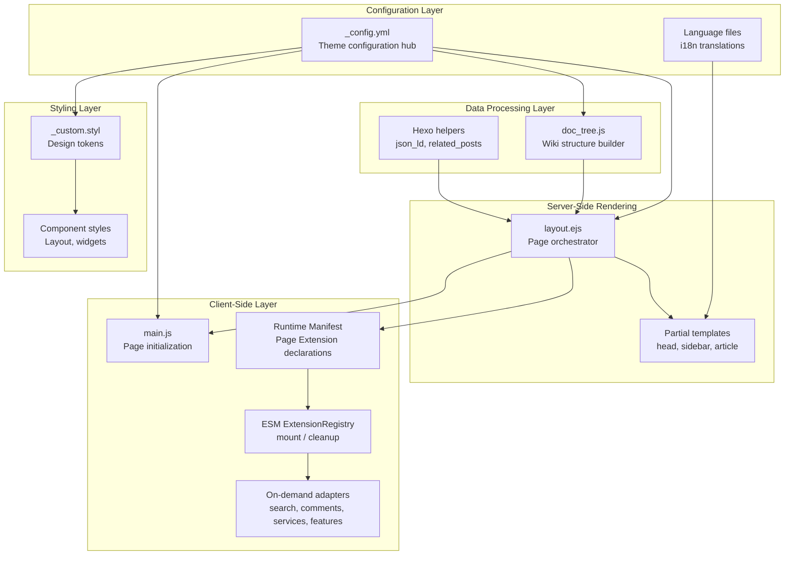
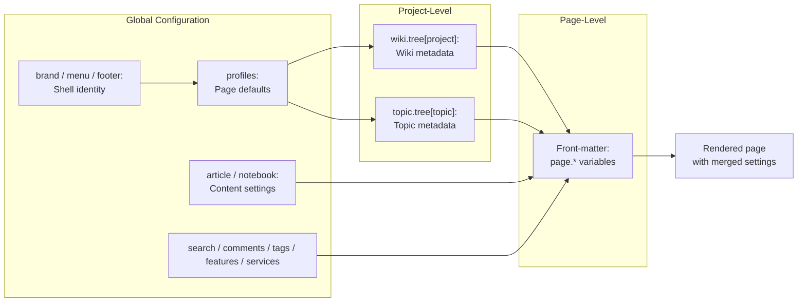
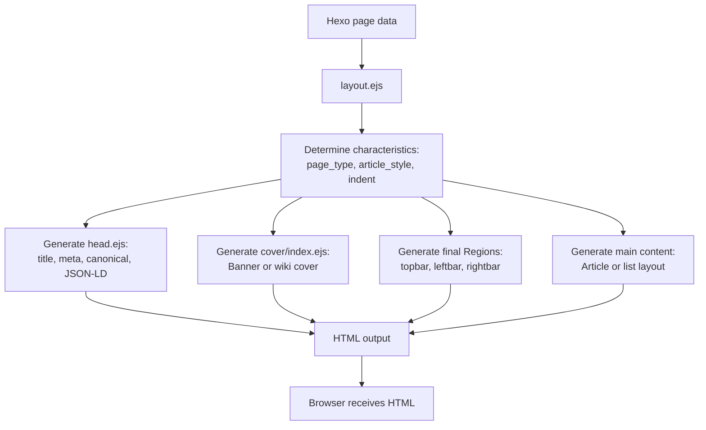
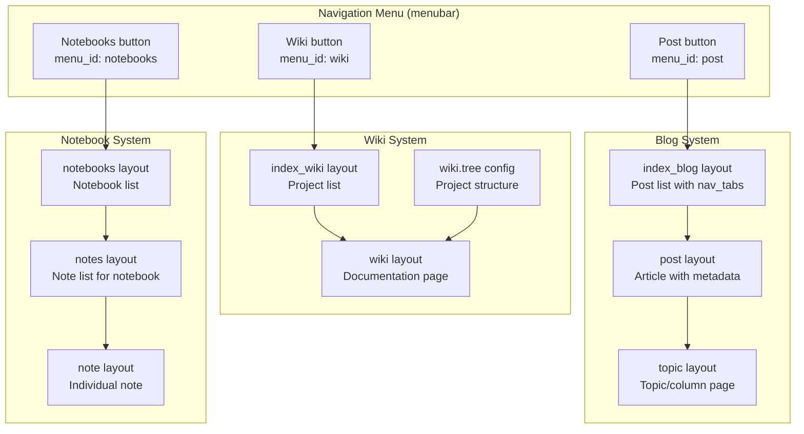
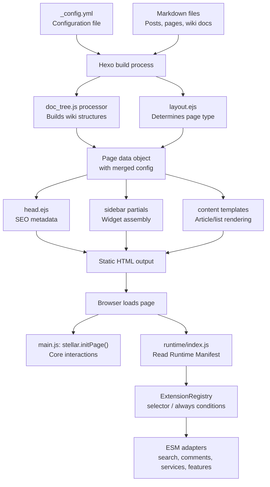

# 总览

相关源码文件

生成此页面时参考的主题源码文件：

- [.github/workflows/npm-publish.yml](../../../.github/workflows/npm-publish.yml)
- [.npmignore](../../../.npmignore)
- [LICENSE](../../../LICENSE)
- [README.md](../../../README.md)
- [_config.yml](../../../_config.yml)
- [layout/_partial/head.ejs](../../../layout/_partial/head.ejs)
- [source/js/runtime/extensions/feature.js](../../../source/js/runtime/extensions/feature.js)
- [layout/layout.ejs](../../../layout/layout.ejs)
- [package.json](../../../package.json)
- [scripts/helpers/json_ld.js](../../../scripts/helpers/json_ld.js)
- [scripts/schema/config-schema.js](../../../scripts/schema/config-schema.js)
- [source/css/_plugins/index.styl](../../../source/css/_plugins/index.styl)
- [source/js/main.js](../../../source/js/main.js)

Stellar 是一个功能全面的 Hexo 主题，内置四套并行内容管理系统：博客系统、文档（wiki）系统、专栏（topic）系统与笔记本（notebook）系统。本文从架构层面概述这些系统如何协同工作，以及主题如何把内容从配置、服务端渲染一路处理到客户端交互。

安装说明见[安装与启动](installation.md)，详细配置选项见[配置系统](configuration.md)。

## 架构理念

Stellar 采用**五层架构**，把配置、数据处理、渲染、客户端行为与样式分离，使主题可以支持多种内容类型并保持一致性，同时允许深度定制。

主题是**配置驱动**的：[_config.yml](../../../_config.yml) 镜像 Schema 默认值，站点可通过 `_config.stellar.yml` 覆盖；该文件缺失或为空时仍可直接构建。v2 声明式 Schema 已交付并封闭 `brand`、`menu`、`profiles`、`article`、`notebook`、`appearance`、`canonical`、`preconnect`、`search`、`comments`、`tags`、`features`、`services` 和 `inject` 等根配置。

### 核心架构分层

**参考源码**：[_config.yml](../../../_config.yml)、[scripts/schema/config-schema.js](../../../scripts/schema/config-schema.js)、[layout/layout.ejs](../../../layout/layout.ejs)、[source/js/main.js](../../../source/js/main.js)、[scripts/helpers/json_ld.js](../../../scripts/helpers/json_ld.js)

## 配置级联

配置系统采用三级层级：页面级设置覆盖项目级设置，项目级设置再覆盖主题全局默认值。这一模式贯穿整个主题，用于控制布局、样式与行为。

**参考源码**：[_config.yml](../../../_config.yml)、[layout/layout.ejs](../../../layout/layout.ejs)

`profiles` 为不同类型的页面（博客文章、Wiki、笔记本页面等）定义路径、导航和侧边栏默认值，单个页面与 Collection 覆盖继续由模型层级联。`article` 与 `notebook` 根配置提供内容默认值，所有公开主题配置均通过已封闭的声明式 Schema 进入运行时。

## 页面渲染流水线

主题遵循四阶段渲染流水线，从构建期一直到客户端交互状态：

### 阶段 1：构建期数据处理

在 Hexo 构建阶段，主题处理内容文件并构造数据结构。其中 `doc_tree.js` 脚本（见[文档系统](../03-内容系统/wiki-docs.md)）尤其重要——它处理 wiki 配置，构建带小节、标签与交叉引用的层级化文档结构。

### 阶段 2：服务端渲染

`layout.ejs` 负责组装页面：

1. **确定页面特征**（[layout/layout.ejs](../../../layout/layout.ejs)）：
   - `page_type`："index" 或 "content"
   - `article_style`："tech" 或 "story"（影响排版与间距）
   - `indent`：是否段落首行缩进

2. **组装 HTML 结构**（[layout/layout.ejs](../../../layout/layout.ejs)）：
   - `<head>` 元数据、SEO 标签与样式
   - `#site-cover` 页面封面/横幅
   - `#start.site-shell` 按最终 ViewModel 组合 Topbar 与 `.site-workspace`
   - `.site-workspace` 只包含 Leftbar、`#main.site-main` 与 Rightbar；Scrim、Dock 位于 Grid 外
   - 脚本与初始化代码

**参考源码**：[layout/layout.ejs](../../../layout/layout.ejs)、[layout/_partial/head.ejs](../../../layout/_partial/head.ejs)

### 阶段 3：客户端初始化

页面在浏览器中加载后，`stellar.initPage()`（[source/js/main.js](../../../source/js/main.js)）初始化交互功能：

- **目录（TOC）** 滚动同步
- **侧边栏** 交互处理
- **相对时间** 时间戳显示
- **标签页组件** tab 内容切换
- **评论系统** 重新初始化（如有）

### 阶段 4：页面导航与预加载

主题使用普通整页导航；可选的 `features.link_prefetch`（flying_pages）会在鼠标悬停时预加载站内链接，提升导航体验。PJAX 已于 v1.35.0 移除。

**参考源码**：[source/js/main.js](../../../source/js/main.js)、[_config.yml](../../../_config.yml)（`features.link_prefetch`）

## 内容类型系统

Stellar 支持四套并行内容系统，各有独立的页面类型与导航模式：

### 系统对比

| 系统 | 列表页 | 内容页 | 主要特性 |
|------|--------|--------|----------|
| **博客** | `index_blog` | `post` | 分类、标签、分页、相关文章 |
| **文档（wiki）** | `index_wiki` | `wiki` | 项目树、小节、层级导航 |
| **专栏（topic）** | `index_topic` | `topic` | 系列文章、沉浸式阅读 |
| **笔记本** | `notebooks` → `notes` | `note` | 标签树导航、轻量笔记 |

**参考源码**：[_config.yml](../../../_config.yml)（`profiles` 小节）、[README.md](../../../README.md)

每个系统通过对应的 `profiles.*.leftbar.widgets` 和 `profiles.*.rightbar.widgets` 决定侧边栏显示哪些小部件。例如 Wiki 页面左侧显示 tree（页面树）小部件，博客文章显示相关文章小部件。表格与图中的 `index_blog`、`index_wiki` 等仍是 Hexo 内部模板 / layout 名，公开配置 Profile ID 分别为 `blog_index`、`wiki_index`。

## 关键子系统

### SEO 与元数据

`head.ejs` 局部模板生成完整的元数据（[layout/_partial/head.ejs](../../../layout/_partial/head.ejs)）：

- **标题生成**：支持 wiki/分类/标签上下文
- **Meta 描述**：来自页面摘要或项目描述
- **规范链接（canonical URL）**：处理重复内容
- **JSON-LD 结构化数据**：供搜索引擎使用（[scripts/helpers/json_ld.js](../../../scripts/helpers/json_ld.js)）
- **Open Graph 标签**：社交分享

### 插件系统

Extension 采用 Runtime Manifest 条件加载模式（[scripts/lib/contribution-registry.js](../../../scripts/lib/contribution-registry.js)、[scripts/lib/browser-runtime.js](../../../scripts/lib/browser-runtime.js)、[source/js/runtime/](../../../source/js/runtime/)）。主题读取冻结的 `features.*.enabled` 与页面 `render.math/render.diagrams`，从内置 descriptor 注册表投影页面声明，再由 ESM Registry 按 DOM 条件加载对应 CSS 与 JavaScript，包括：

- 图片增强（fancybox、swiper）
- 代码功能（copycode、语法高亮）
- 数学渲染（katex、mathjax）
- 图表（mermaid）
- 性能（原生 reveal、preload/flying_pages）

详见[插件系统](../07-外部集成/plugin-system.md)。

### 评论集成

评论系统根据 `comments.provider` 与页面 `comments.provider/options` 选择实现。Beaudar、Utterances、Giscus、Twikoo、Waline、Artalk 的 markup 由评论 partial 输出，初始化统一交给 [source/js/runtime/extensions/comments.js](../../../source/js/runtime/extensions/comments.js)；官方脚本和样式来自主题内部资源注册表。

详见[评论系统](../07-外部集成/comment-systems.md)。

### 规范链接与克隆站检测

主题实现了两阶段规范链接系统（[source/js/main.js](../../../source/js/main.js)）：

1. 检查当前域名是否匹配配置的原始站点
2. 校验官方备用域名
3. 对非官方克隆站显示警告
4. 在适当时机注入 `noindex` meta 标签

这有助于防止内容被未经授权的站点复制，同时支持合法的备份部署。

## 数据流总结

下图展示数据从配置到渲染输出的完整流向：

**参考源码**：[_config.yml](../../../_config.yml)、[layout/layout.ejs](../../../layout/layout.ejs)、[source/js/main.js](../../../source/js/main.js)

## 技术栈

主题基于以下技术构建：

- **Hexo**：静态站点生成器（Node.js）
- **EJS**：HTML 模板引擎
- **Stylus**：CSS 预处理器，带设计令牌体系
- **原生 JavaScript**：客户端代码无框架依赖
- **外部库（CDN）**：marked.js（运行时 Markdown 渲染）、vanilla-lazyload（图片懒加载）

**依赖** 定义在 [package.json](../../../package.json)；Extension 的可配置行为位于 `_config.yml` 的 `search/comments/tags/features/services` 根配置，官方资源路径由内部注册表管理。

## 目录结构概览

主题关键目录：

- `layout/` — EJS 模板
  - `layout.ejs` — 主布局编排
  - `_partial/` — 可复用模板组件
    - `layout/_partial/scripts/runtime.ejs` — Runtime Manifest 与单一 ESM 入口
- `source/` — 客户端资源
  - `css/` — Stylus 样式
  - `js/` — JavaScript
    - `main.js` — 核心初始化
    - `runtime/` — ESM Registry、request/cache、资源加载与 Extension adapters
    - `plugins/` — 可选功能
    - `services/` — 数据服务
- `scripts/` — Hexo 构建期脚本
  - `helpers/` — 模板辅助函数
  - `generators/` — 页面生成器
  - `tags/` — 标签插件
  - `events/` — 构建事件处理

## 版本与分发

主题版本只由 [package.json](../../../package.json) 的 `version` 字段定义，模板通过 `stellar_info('version')` 读取相同的 package metadata。

Stellar 通过 npm 以 `hexo-theme-stellar` 分发，采用 MIT 协议开源。

完整 Blueprint 已迁移到独立的 [Stellar Examples](https://github.com/xaoxuu/hexo-theme-stellar-examples) 仓库。四套示例分别作为可下载、可预览和可独立运行的新站方案；主题包只保留 `stellar doctor` 与 `stellar new note`，不再携带示例内容或注册 init。Blueprint 不进入页面运行时，也不会成为新的配置根。

Pre-alpha M9 完成默认内容体验：空配置或缺少 `_config.stellar.yml` 的普通 Post/Page 可直接生成，Wiki/Topic/Notebook 只在唯一候选时推断归属。主题候选 tarball 门禁直接覆盖 Post、Topic、Wiki、Notebook 与无主题覆盖站点的 doctor → generate；完整产品旅程由 examples 仓库验证。Alpha、Beta 只是内部成熟度里程碑，不会发布 npm 版本、tag 或 GitHub Release；M10/Alpha 必须等待站长对 Region/Widget 新契约生成的候选重新人工验收。

**参考源码**：[package.json](../../../package.json)、[ci/check-package-integration.js](../../../ci/check-package-integration.js)、[scripts/commands/stellar.js](../../../scripts/commands/stellar.js)、[scripts/lib/theme-metadata.js](../../../scripts/lib/theme-metadata.js)、[README.md](../../../README.md)、[Stellar Examples](https://github.com/xaoxuu/hexo-theme-stellar-examples)

---

本文为理解 Stellar 架构提供了基础。更深入的子系统细节请参考后续各章节。
