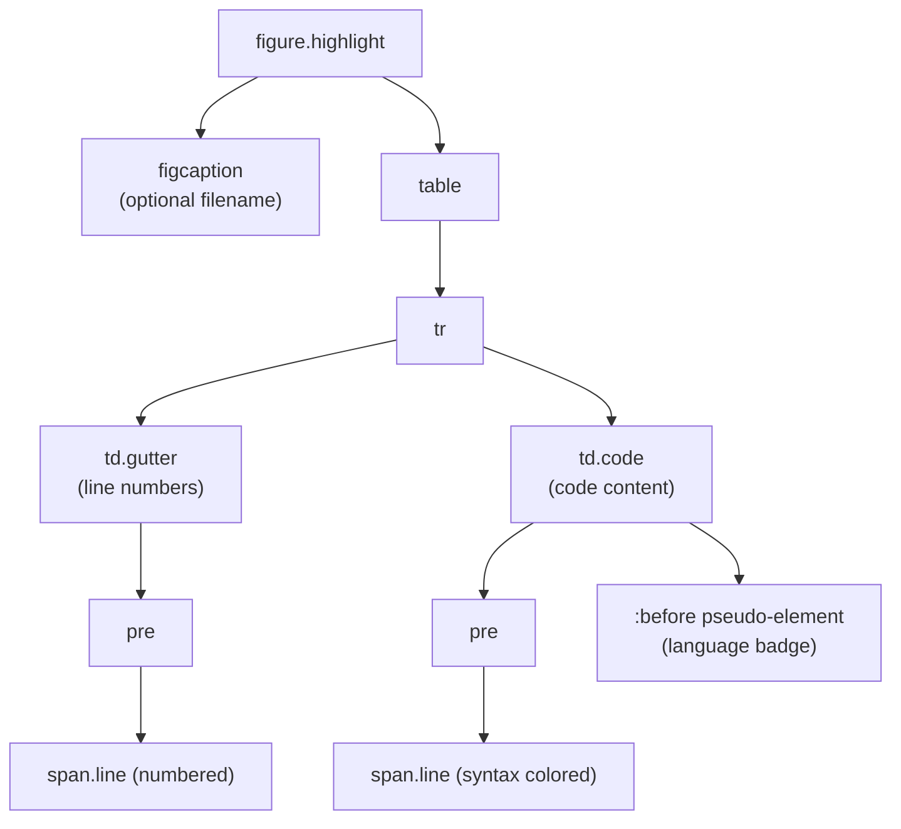
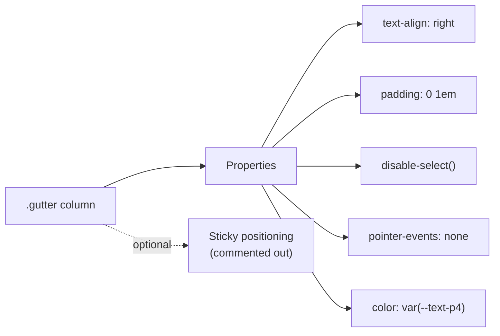
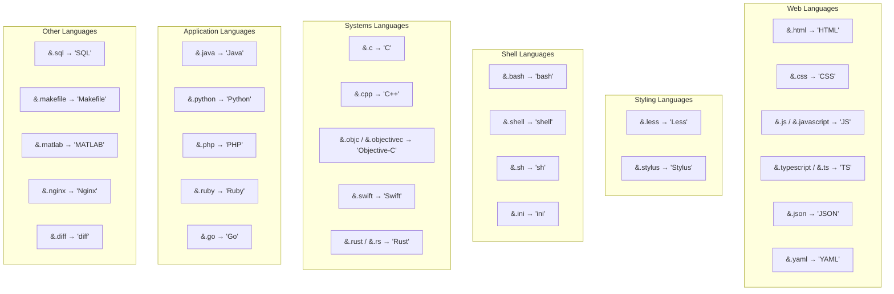
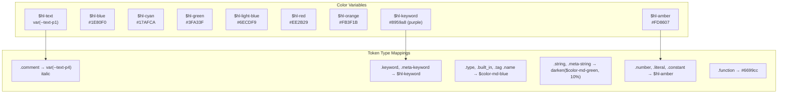
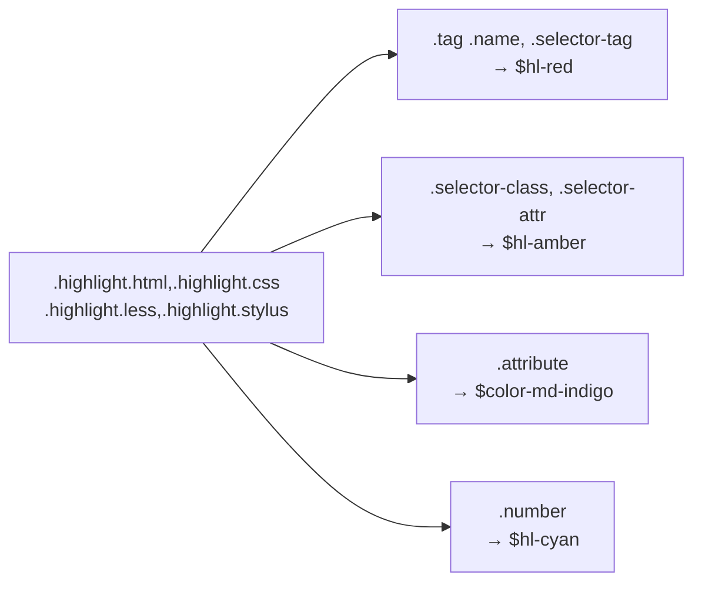
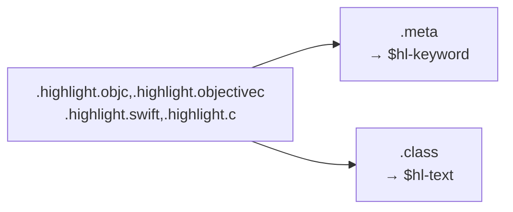
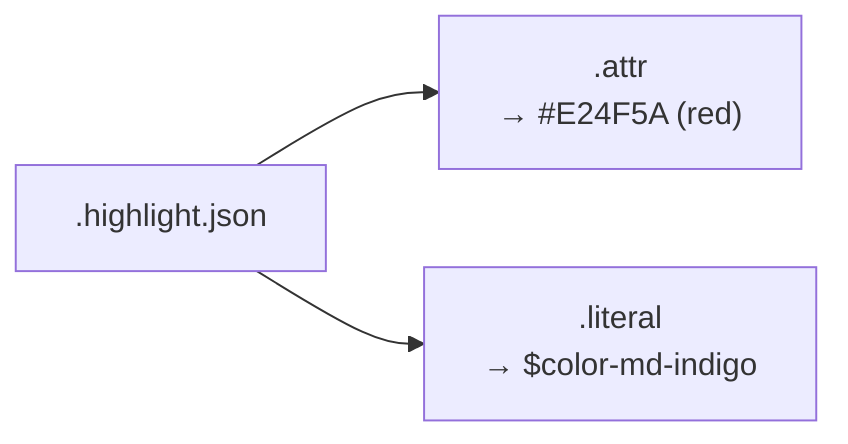
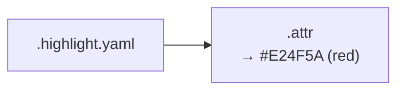
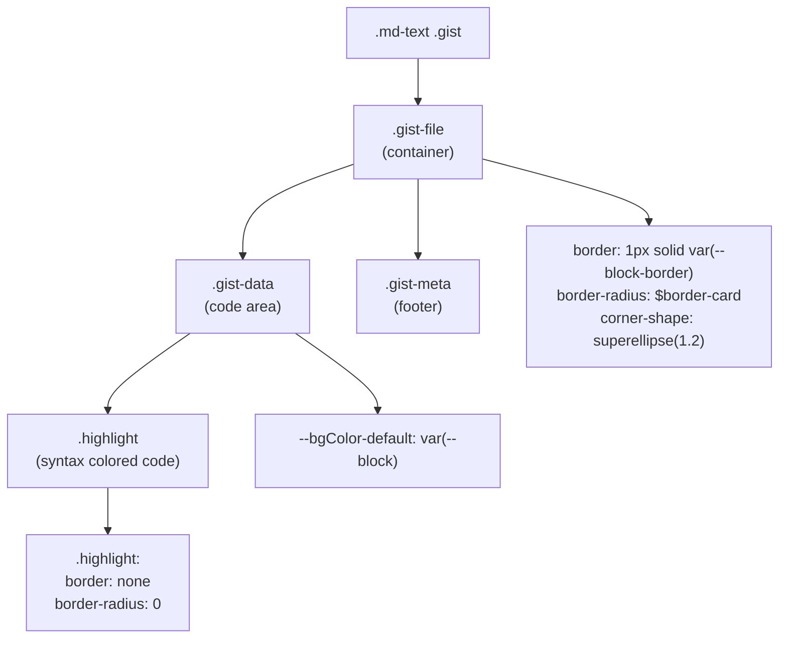
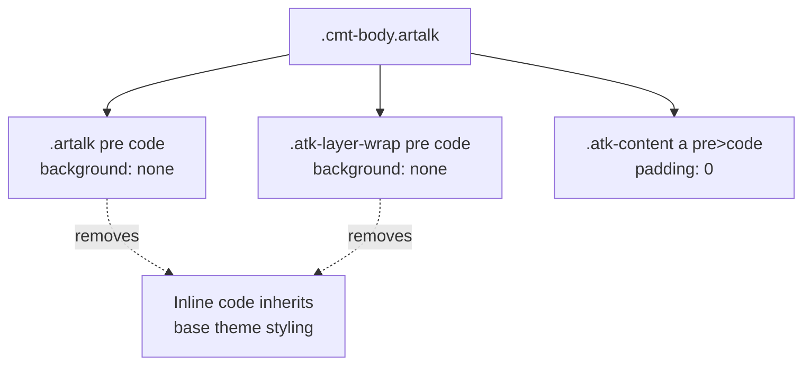

# 代码块与语法高亮

<details>
<summary>相关源码文件</summary>

生成此页面时参考的主题源码文件：

- [source/css/_common/base.styl](../../../source/css/_common/base.styl)
- [source/css/_common/highlight.styl](../../../source/css/_common/highlight.styl)
- [source/css/_plugins/comments/artalk.styl](../../../source/css/_plugins/comments/artalk.styl)

</details>

本文介绍 Stellar 的代码块样式与语法高亮系统：行内代码样式、多行代码块结构、语法令牌配色、语言专属样式与 GitHub Gist 集成。样式系统全部实现在 [source/css/_common/highlight.styl](../../../source/css/_common/highlight.styl)，包含语言检测与令牌配色逻辑。

copycode、mermaid 等插件化语法高亮/图表功能见[插件系统](../07-外部集成/plugin-system.md)。

---

## 代码块结构

Stellar 用基于表格的布局实现代码块，以便在代码旁显示可选行号。结构为 `.highlight` 容器内嵌 `<table>`，含两列：`.gutter`（行号）与 `.code`（代码内容）。

### DOM 结构



**参考源码**：[source/css/_common/highlight.styl](../../../source/css/_common/highlight.styl)

### 关键结构元素

`.highlight` 容器实现：

- **基础样式**：圆角用 `$border-card`，背景用 `--block` CSS 变量，`corner-shape: superellipse(1.2)` 实现平滑圆角
- **溢出处理**：容器与嵌套表格自动溢出，支持横向滚动
- **字体族**：`$ff-codeblock` 等宽字体
- **最小宽度**：移动端及以上 180px

表格结构移除默认表格样式（透明背景、无边框），并通过 `scrollbar-codeblock()` 配置自定义滚动条。

**参考源码**：[source/css/_common/highlight.styl](../../../source/css/_common/highlight.styl)

---

## 行内代码样式

行内代码元素按上下文使用不同样式规则，主题区分通用行内代码与样式化代码块。

### 行内代码变体

| 选择器 | 场景 | 样式 |
|--------|------|------|
| `p>code:not([class])` | 段落内代码 | `--block` 背景、`0.2em` padding、4px 圆角 |
| `li>code:not([class])` | 列表项内代码 | 同段落代码 |
| `code`（裸选择器） | 字体配置 | 字体族 `$ff-code`、平滑调整 |

`:not([class])` 确保带语言类（如 `<code class="language-javascript">`）的代码块不受行内样式规则影响。

**样式细节：**

- **字号**：`$fs-code`
- **颜色**：`var(--text-code)`，随主题切换的语义色
- **字体平滑**：显式设置 `-webkit-font-smoothing: auto` 与 `-moz-osx-font-smoothing: auto`

**参考源码**：[source/css/_common/highlight.styl](../../../source/css/_common/highlight.styl)

---

## 行号列（Gutter）

`.gutter` 列显示行号，样式设计为不打扰阅读。

### Gutter 配置



gutter 实现：

- **禁用指针事件**：`pointer-events: none` 防止交互
- **禁止选中**：`disable-select()` 混入
- **右对齐**：数字靠右
- **低对比颜色**：`var(--text-p4)` 弱化存在感
- **可选 sticky 定位**：`position: sticky` 与 `background: var(--block)` 被注释掉，窄屏体验更好

有 gutter 时，代码列调整 padding：

```stylus
.gutter+.code pre
  padding-left: 0.25em
```

**参考源码**：[source/css/_common/highlight.styl](../../../source/css/_common/highlight.styl)

---

## 语言徽章系统

主题用 CSS `:before` 伪元素在代码块右上角自动显示语言标签，系统检测 `.highlight` 元素上的语言类。

### 徽章实现

语言徽章绝对定位：

- **位置**：`top: 0, right: 0`
- **样式**：透明度 0.25、font-weight 700、颜色用 `--theme` 变量
- **内边距**：`4px 0.5rem`

### 支持的语言



徽章系统用 Stylus 父引用语法（`&`）生成复合选择器。例如 `&.python .code:before` 生成 `.highlight.python .code:before`。

**参考源码**：[source/css/_common/highlight.styl](../../../source/css/_common/highlight.styl)

---

## 语法令牌配色

主题为语法高亮令牌定义完整调色板，组合预定义颜色与 CSS 自定义属性。

### 颜色令牌定义



**参考源码**：[source/css/_common/highlight.styl](../../../source/css/_common/highlight.styl)

### 令牌类型分类

语法高亮系统把令牌分为语义组：

| 分类 | 令牌类 | 颜色 |
|------|--------|------|
| **注释** | `.comment` | `var(--text-p4)` + 斜体 |
| **关键字** | `.keyword`、`.meta-keyword`、`.javascript .function` | `$hl-keyword`（#8959a8） |
| **类型** | `.type`、`.built_in`、`.tag .name` | `$color-md-blue` |
| **变量** | `.variable`、`.regexp` 及各类 XML/HTML/CSS | `$hl-amber` |
| **数字** | `.number`、`.preprocessor`、`.literal`、`.constant` | `$hl-amber` |
| **字符串** | `.string`、`.meta-string` | `darken($color-md-green, 10%)` |
| **属性** | `.title`、`.attr`、`.attribute` | `$color-md-indigo` |
| **函数** | `.function` 及各类语言专属 | `#6699cc` |

`.marked` 类提供行高亮，使用半透明黄色背景（`alpha(#FED542, .4)`）。

**参考源码**：[source/css/_common/highlight.styl](../../../source/css/_common/highlight.styl)

---

## 语言专属令牌覆盖

部分语言需要不同于默认方案的专属配色。主题为 HTML、CSS、JSON、YAML 与 Objective-C 家族提供覆盖。

### HTML/CSS/Less/Stylus 覆盖



这些语言：

- **标签名**：红色（`$hl-red`）用于 HTML/CSS 元素选择器
- **类与属性选择器**：琥珀色（`$hl-amber`）
- **属性名**：靛蓝（`$color-md-indigo`）
- **数字**：青色（`$hl-cyan`）而非默认琥珀

**参考源码**：[source/css/_common/highlight.styl](../../../source/css/_common/highlight.styl)

### Objective-C/Swift/C 覆盖



C 家族语言：

- **Meta 指令**：预处理器指令用关键字色（紫）
- **类名**：用文本色而非默认橙色

**参考源码**：[source/css/_common/highlight.styl](../../../source/css/_common/highlight.styl)

### JSON 令牌覆盖



JSON：

- **属性名**：红色（`#E24F5A`）用于对象键
- **字面量**：靛蓝用于 `true`、`false`、`null`

**参考源码**：[source/css/_common/highlight.styl](../../../source/css/_common/highlight.styl)

### YAML 令牌覆盖



YAML 属性名用红色（`#E24F5A`），与 JSON 保持一致。

**参考源码**：[source/css/_common/highlight.styl](../../../source/css/_common/highlight.styl)

---

## 文件名显示

代码块可在 `<figcaption>` 元素中显示可选文件名，位于代码上方。

figcaption 样式包括：

- **颜色**：`var(--text-p2)` 次级文本
- **字号**：`$fs-codeblock`
- **字重**：500 中等强调
- **定位**：inline-block，左边距 0.5rem
- **徽章样式**：内部 `<span>` 有底部圆角与 `--block` 背景

结构让文件名像标签页一样出现在代码块顶部。

**参考源码**：[source/css/_common/highlight.styl](../../../source/css/_common/highlight.styl)

---

## GitHub Gist 集成

主题为内嵌 GitHub Gist 提供专属样式，使其与 Stellar 设计体系视觉融合。

### Gist 样式系统



Gist 集成覆盖 GitHub 默认样式：

- **容器边框**：用主题 `--block-border`、`$border-card` 圆角与 superellipse 形状
- **背景颜色**：把 `--bgColor-default` 设为 `var(--block)`，保持主题一致
- **高亮样式**：移除嵌套 `.highlight` 的边框/圆角，加 1em 垂直 padding
- **代码内部**：文字用 `var(--text-p1)`，字体用 `$ff-codeblock`
- **Meta 页脚**：`var(--block)` 背景

保证内嵌 Gist 与主题视觉语言一致，同时保留其语法高亮。

**参考源码**：[source/css/_common/highlight.styl](../../../source/css/_common/highlight.styl)

---

## Pre 标签与 HLJS 集成

主题通过专门的 `<pre>` 样式支持 highlight.js（HLJS）等替代高亮系统。

### HLJS 风格代码块

带 `.hljs` 类的代码块：

```stylus
.md-text pre
  >.caption
    color: var(--text-p3)
  >.hljs
    padding: 1rem
    border-radius: $border-card
    line-height: 1.5
    box-sizing: border-box
```

应用：

- **标题颜色**：`var(--text-p3)`
- **内边距**：1rem
- **圆角**：`$border-card`
- **行高**：1.5

无类的裸 `<pre>` 标签同样按代码块处理，`--block` 背景与标准边距。

**参考源码**：[source/css/_common/highlight.styl](../../../source/css/_common/highlight.styl)

---

## 滚动条配置

代码块通过 `scrollbar-codeblock()` 函数配置自定义滚动条，值来自主题配置。

### 滚动条应用

滚动条应用到 `.highlight` 内的嵌套表格：

```stylus
scrollbar-codeblock(convert(hexo-config('style.codeblock.scrollbar')))
```

该调用：

1. 从 `_config.yml` 读取 `style.codeblock.scrollbar`
2. 用 `convert()` 转换
3. 通过 `scrollbar-codeblock()` 混入应用滚动条样式

代码行超出容器宽度出现横向溢出时才显示滚动条。

**参考源码**：[source/css/_common/highlight.styl](../../../source/css/_common/highlight.styl)

---

## 评论系统代码样式

Artalk 评论系统包含专属代码块样式，保证评论内容一致性。

### Artalk 代码覆盖



Artalk 集成：

- **背景移除**：`pre code` 设置 `background: none`，防止双重背景
- **文本域样式**：移除背景、边框，设置编辑器 padding/margin
- **链接内代码**：`padding: 0`

避免主题行内代码样式与 Artalk 评论渲染冲突。

**参考源码**：[source/css/_plugins/comments/artalk.styl](../../../source/css/_plugins/comments/artalk.styl)

---

## 基础 Pre 元素样式

基础 `<pre>` 元素在 `.highlight` 系统之前获得基础样式。

### Pre 元素配置

```stylus
pre
  font-family: $ff-codeblock
  font-size: $fs-codeblock
  tab-size: 4
  -moz-tab-size: 4
  -o-tab-size: 4
  -webkit-tab-size: 4
```

设定：

- **字体族**：`$ff-codeblock` 等宽字体
- **字号**：`$fs-codeblock`
- **制表符**：全浏览器 4 空格（标准、Mozilla、Opera、WebKit）

这些基础样式保证在语言专属或高亮专属样式应用前的一致渲染。

**参考源码**：[source/css/_common/base.styl](../../../source/css/_common/base.styl)

---

## 视觉效果集成

代码块与工具层定义的模糊与圆角效果集成。

### 应用效果

`.highlight` 容器使用：

- **圆角**：`$border-card` 设计令牌
- **圆角形状**：`corner-shape: superellipse(1.2)`，iOS 风格平滑圆角
- **背景**：`var(--block)` 主题感知 CSS 变量

这些效果是主题整体视觉语言的一部分，详见[Stylus 工具与混入](stylus-utilities.md)。

**参考源码**：[source/css/_common/highlight.styl](../../../source/css/_common/highlight.styl)
