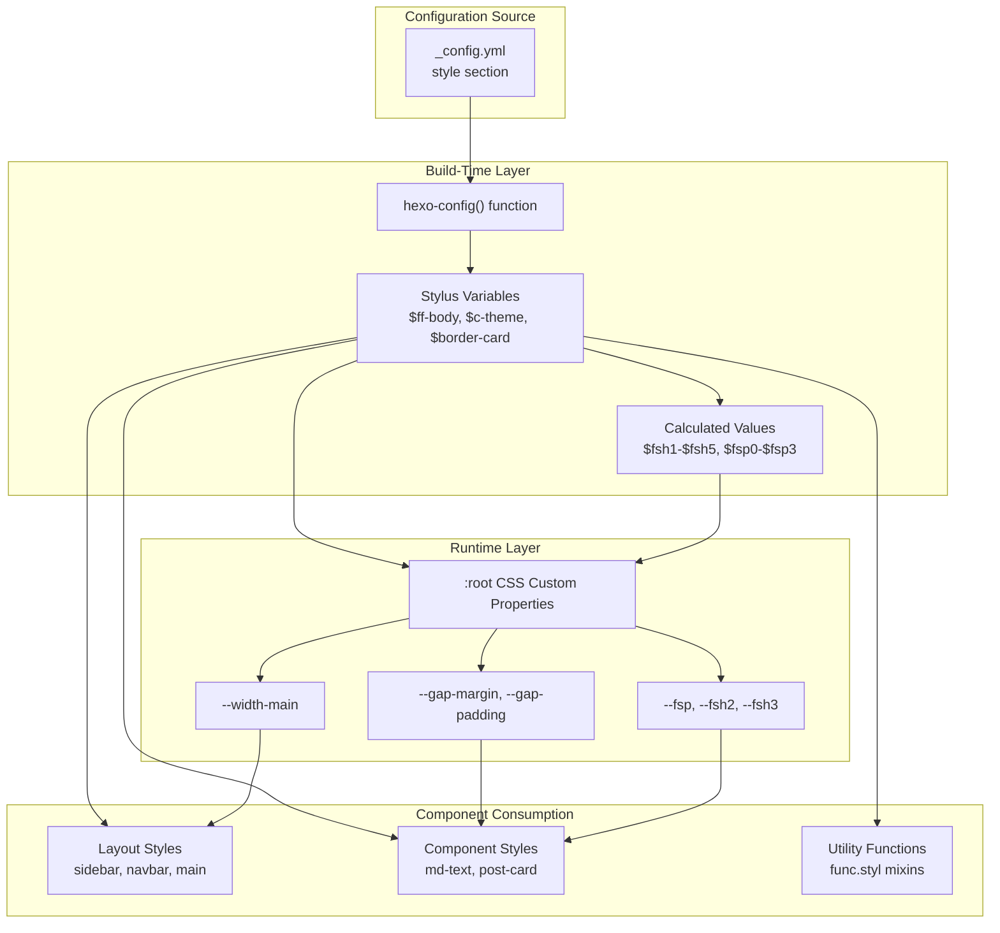
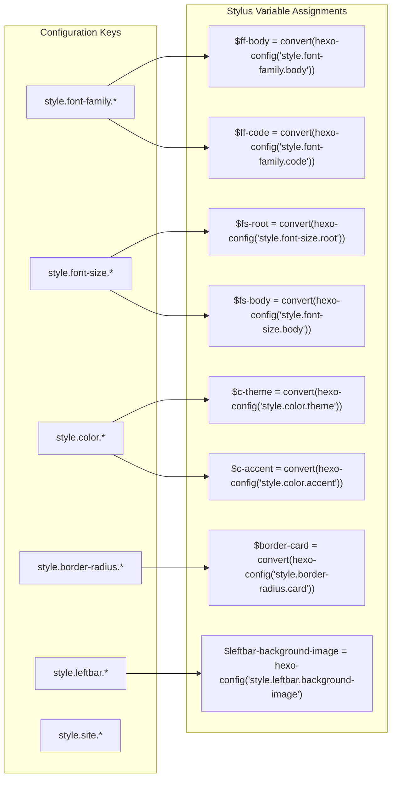
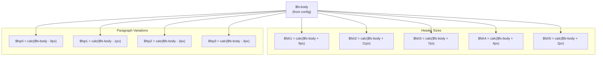
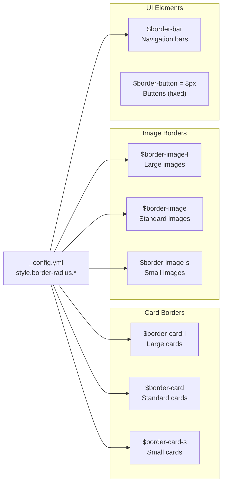
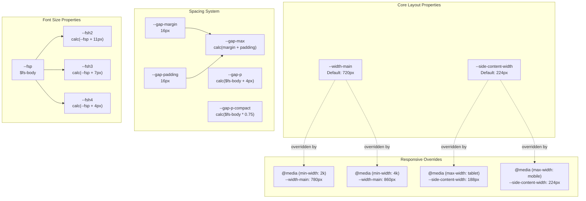
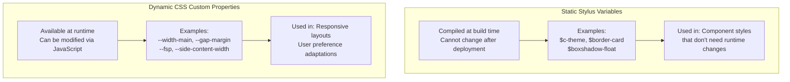
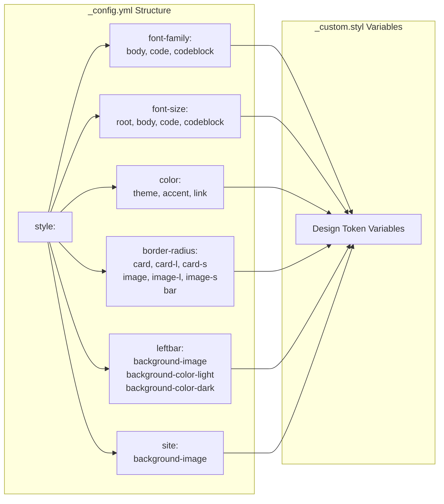

# 设计令牌与 CSS 变量

<details>
<summary>相关源码文件</summary>

生成此页面时参考的主题源码文件：

- [source/css/_custom.styl](../../../source/css/_custom.styl)

</details>

## 目的与范围

本文介绍 `_custom.styl` 中实现的设计令牌系统，它是 Stellar 主题的基础样式层。设计令牌是保存视觉设计属性（字体、颜色、间距、边框等）的命名变量。主题采用双层方案：Stylus 变量用于构建期配置，CSS 自定义属性用于运行时主题与响应式适配。

排版细节（字号策略与响应式缩放）见[排版系统](typography.md)；颜色系统与深色模式见[颜色与深色模式](colors-dark-mode.md)；响应式模式与断点见[响应式设计](responsive-design.md)。

**参考源码**：[source/css/_custom.styl](../../../source/css/_custom.styl)

## 架构概览

设计令牌系统以三层级联把配置值转化为可用的设计原语：



`hexo-config()` 函数在构建期读取配置并转换为 Stylus 变量；部分值以 CSS 自定义属性暴露在 `:root` 选择器中，支持响应式设计与用户偏好的运行时修改。

**参考源码**：[source/css/_custom.styl](../../../source/css/_custom.styl)

## 配置驱动的变量生成

### hexo-config 函数模式

所有设计令牌都通过 `hexo-config()` 函数来自主题的 `_config.yml`，按键路径取值：



`convert()` 是 Stylus 辅助函数，确保取回的值类型正确。

**参考源码**：[source/css/_custom.styl](../../../source/css/_custom.styl)

## Stylus 变量分类

### 字体变量

主题定义三类字体变量，均取自配置：

| 变量 | 配置键 | 用途 |
|------|--------|------|
| `$ff-body` | `style.font-family.body` | 正文字体 |
| `$ff-code` | `style.font-family.code` | 行内代码字体 |
| `$ff-codeblock` | `style.font-family.codeblock` | 代码块字体 |
| `$fs-root` | `style.font-size.root` | 根 HTML 字号 |
| `$fs-body` | `style.font-size.body` | 默认正文字号 |
| `$fs-code` | `style.font-size.code` | 行内代码字号 |
| `$fs-codeblock` | `style.font-size.codeblock` | 代码块字号 |

额外的固定字号令牌：

```
$fs-15 = .9375rem  // 约 15px
$fs-14 = .875rem   // 约 14px
$fs-13 = .8125rem  // 约 13px
$fs-12 = .75rem    // 约 12px
```

**参考源码**：[source/css/_custom.styl](../../../source/css/_custom.styl)

### 计算字号令牌

主题基于 `$fs-body` 生成标题与段落的计算字号：



这些计算用字符串插值配合 CSS `calc()` 保持动态尺寸，实际 Stylus 代码格式：

```stylus
$fsh1 = 'calc(%s + 9px)' % $fs-body
$fsp1 = 'calc(%s - 1px)' % $fs-body
```

**参考源码**：[source/css/_custom.styl](../../../source/css/_custom.styl)

### 颜色变量

颜色令牌定义主题的视觉身份：

| 变量 | 配置键 | 用途 |
|------|--------|------|
| `$c-theme` | `style.color.theme` | 主题色 |
| `$c-accent` | `style.color.accent` | 强调色 |
| `$c-link` | `style.color.link` | 链接色 |
| `$c-base-hue` | 固定 `210deg` | 背景/文字色的基础色相 |

`$c-base-hue` 控制 HSL 颜色系统中生成背景色与文字色的基础色相，通常不需要修改。

**参考源码**：[source/css/_custom.styl](../../../source/css/_custom.styl)

### 背景变量

背景配置支持图片与颜色定制：

| 变量 | 配置键 | 用途 |
|------|--------|------|
| `$site-background-image` | `style.site.background-image` | 全站背景图 |
| `$leftbar-background-image` | `style.leftbar.background-image` | 左栏背景图 |
| `$leftbar-background-color-light` | `style.leftbar.background-color-light` | 左栏浅色模式颜色 |
| `$leftbar-background-color-dark` | `style.leftbar.background-color-dark` | 左栏深色模式颜色 |

**参考源码**：[source/css/_custom.styl](../../../source/css/_custom.styl)

### 圆角变量

主题采用三档圆角体系保持视觉一致：



`$border-button` 硬编码为 `8px`，不从配置派生。

**参考源码**：[source/css/_custom.styl](../../../source/css/_custom.styl)

### 图标 Data URI

主题把 SVG 图标以内嵌 data URI 形式打包，提升性能：

| 变量 | 用途 |
|------|------|
| `$iQuoteLeft` | 左引号图标 |
| `$iQuoteRight` | 右引号图标 |
| `$iH3Left` | H3 前缀图标（左 V 形） |
| `$iH3Right` | H3 前缀图标（右 V 形） |
| `$iLoadingIcon` | 加载动画图标 |

这些 data URI 是完整且 URL 编码的 SVG 字符串，可直接用于 CSS `url()`，无需外部文件依赖。

**参考源码**：[source/css/_custom.styl](../../../source/css/_custom.styl)

### 阴影定义

盒阴影令牌提供一致的层级效果：

| 变量 | 用途 | 阴影值 |
|------|------|--------|
| `$boxshadow-card` | 标准卡片 | `0 1px 2px 0px rgba(0,0,0,0.1)` |
| `$boxshadow-float` | 浮动元素 | `0 4px 8px 0px rgba(0,0,0,0.05)` |
| `$boxshadow-card-float` | 悬停抬升卡片 | `0 12px 16px -4px rgba(0,0,0,0.2)` |
| `$boxshadow-button` | 按钮立体感 | `0 0 2px 0px rgba(0,0,0,0.04), 0 0 8px 0px rgba(0,0,0,0.04)` |
| `$boxshadow-block` | 块级元素 | `0 1px 4px 0px rgba(0,0,0,0.02), 0 2px 8px 0px rgba(0,0,0,0.02)` |
| `$boxshadow-toast` | Toast 通知 | `0 4px 8px 0px rgba(0,0,0,0.1), 0 12px 16px -4px rgba(0,0,0,0.2)` |

阴影系统使用低透明度值营造深度，避免过重视觉。

**参考源码**：[source/css/_custom.styl](../../../source/css/_custom.styl)

## CSS 自定义属性系统

### 动态布局变量

`:root` 选择器定义可运行时修改的 CSS 自定义属性：



**参考源码**：[source/css/_custom.styl](../../../source/css/_custom.styl)

### 宽度与布局属性

主内容宽度随屏幕尺寸通过媒体查询适配：

| 属性 | 默认 | 2K+ 屏幕 | 4K+ 屏幕 |
|------|------|----------|----------|
| `--width-main` | 720px | 780px | 860px |

渐进加宽充分利用大屏，同时保持可读的行长。

**参考源码**：[source/css/_custom.styl](../../../source/css/_custom.styl)

### 间距系统变量

间距系统采用两级层级：

```
--gap-margin: 16px    // 元素轮廓到容器边缘
--gap-padding: 16px   // 文本内容到元素轮廓
--gap-max: calc(var(--gap-margin) + var(--gap-padding))  // 总间距
```

段落间距按字号计算：

```
--gap-p: calc($fs-body + 4px)           // 标准段落间距
--gap-p-compact: calc($fs-body * 0.75)  // 紧凑段落间距
```

这样间距随字号变化按比例缩放。

**参考源码**：[source/css/_custom.styl](../../../source/css/_custom.styl)

### 侧边栏宽度适配

侧边栏宽度随设备类别调整：

| 屏幕宽度 | `--side-content-width` |
|----------|------------------------|
| 桌面（默认） | 224px |
| 平板（max-width: tablet） | 188px |
| 手机（max-width: mobile） | 224px |

注意手机端回到 224px，以保证触控目标尺寸。

**参考源码**：[source/css/_custom.styl](../../../source/css/_custom.styl)

### 动态字号属性

字号 CSS 自定义属性引用 Stylus 变量，同时暴露给运行时修改：

```
--fsp: $fs-body                           // 基准字号
--fsh2: calc(var(--fsp) + 11px)          // H2 标题字号
--fsh3: calc(var(--fsp) + 7px)           // H3 标题字号
--fsh4: calc(var(--fsp) + 4px)           // H4 标题字号
```

标题计算引用 `var(--fsp)`，运行时修改 `--fsp` 会级联到所有依赖尺寸，无需重新计算即可实现动态字号调整。

**参考源码**：[source/css/_custom.styl](../../../source/css/_custom.styl)

## 变量使用模式

### 静态与动态变量

设计令牌系统使用两类变量：



不会变化的值优先用静态变量（性能更好）；需要随视口、用户偏好或运行时条件变化的值用 CSS 自定义属性。

**参考源码**：[source/css/_custom.styl](../../../source/css/_custom.styl)

### 组件样式消费

各组件以标准化模式消费这些令牌：

| 令牌类型 | 消费模式 | 示例 |
|----------|----------|------|
| 字体族 | 直接赋给 `font-family` | `font-family: $ff-body` |
| 字号 | 直接赋值或用于 `calc()` | `font-size: $fs-14` |
| 颜色 | 用于 color/background/border | `color: $c-link` |
| 边框 | border-radius 属性 | `border-radius: $border-card` |
| 阴影 | box-shadow 属性 | `box-shadow: $boxshadow-card` |
| CSS 变量 | 用 `var()` 引用 | `width: var(--width-main)` |

Stylus 编译器在构建期解析静态变量，CSS 自定义属性在浏览器运行时解析。

**参考源码**：[source/css/_custom.styl](../../../source/css/_custom.styl)

## 与配置系统的集成

### 配置结构映射

设计令牌直接映射 `_config.yml` 的 `style` 小节：



这种一对一映射保证配置修改直接影响编译出的 CSS，无需手动更新变量。

**参考源码**：[source/css/_custom.styl](../../../source/css/_custom.styl)

### 构建期与运行时配置

理解值的解析时机对定制至关重要：

**构建期解析：**
- 所有 `hexo-config()` 调用在 `hexo generate` 时解析
- Stylus 变量编译为静态 CSS 值
- 修改后需要重新生成站点

**运行时解析：**
- CSS 自定义属性可被 JavaScript 修改
- 媒体查询覆盖自动生效
- 响应式适配无需重新生成

这种混合方案在性能（编译期解析）与灵活性（响应式运行时适配）之间取得平衡。

**参考源码**：[source/css/_custom.styl](../../../source/css/_custom.styl)
