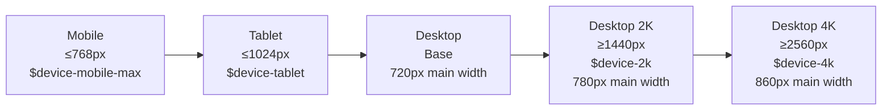
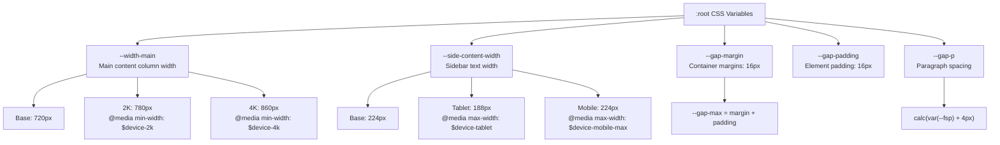
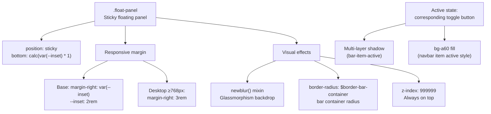
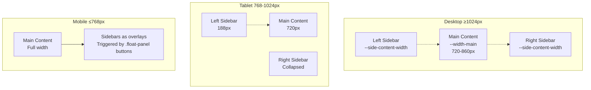
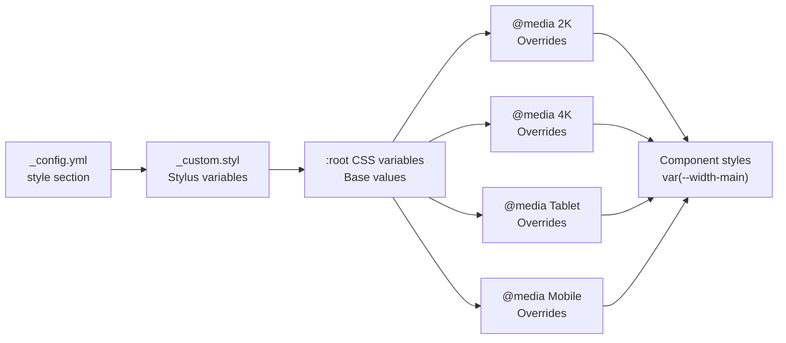

# 响应式设计

<details>
<summary>相关源码文件</summary>

生成此页面时参考的主题源码文件：

- [source/css/_common/device.styl](../../../source/css/_common/device.styl)
- [source/css/_custom.styl](../../../source/css/_custom.styl)
- [source/css/_defines/const.styl](../../../source/css/_defines/const.styl)

</details>

## 目的与范围

本文介绍 Stellar 的响应式设计系统：断点层级、媒体查询策略、响应式 CSS 变量与设备专属工具类。系统让内容与布局在手机、平板、桌面与高分屏（2K/4K）之间无缝适配。

配合响应式系统的颜色与排版见[颜色与深色模式](colors-dark-mode.md)与[排版系统](typography.md)；布局专属的响应式行为见[侧边栏系统](../02-布局系统/sidebar-system.md)。

---

## 断点层级

主题在 `_defines/const.styl` 中定义四个命名断点，构成响应式设计层级：

| 断点变量 | 屏幕宽度 | 目标设备 |
|----------|----------|----------|
| `$device-mobile-max` | ≤768px | 手机 |
| `$device-tablet` | ≤1024px | iPad 竖屏、小平板 |
| `$device-2k` | ≥1440px | 2K 桌面显示器 |
| `$device-4k` | ≥2560px | 4K 桌面显示器 |

设计理念是**移动优先 + 桌面增强**：基础样式面向移动/小屏，媒体查询为更大屏幕渐进增强布局。



**参考源码**：[source/css/_custom.styl](../../../source/css/_custom.styl)

---

## 响应式 CSS 变量

### 核心布局变量

主题在 `:root` 中定义 CSS 自定义属性，不同断点下改变其值。组件只引用一个变量名，就能获得适合当前屏幕的值：



#### 主内容宽度缩放

`--width-main` 采用渐进增强：

```stylus
:root
  --width-main: 720px
  
  @media screen and (min-width: $device-2k)
    --width-main: 780px
  
  @media screen and (min-width: $device-4k)
    --width-main: 860px
```

该变量控制文章内容最大宽度，保证最优阅读行长。组件引用 `var(--width-main)`，无需各自的断点逻辑。

#### 侧边栏内容宽度适配

`--side-content-width` 在平板显示时缩小：

```stylus
:root
  --side-content-width: 224px
  
  @media screen and (max-width: $device-tablet)
    --side-content-width: 188px
  
  @media screen and (max-width: $device-mobile-max)
    --side-content-width: 224px
```

移动断点恢复 224px，因为移动端侧边栏是全宽遮罩层，不是受约束的列。

#### 间距系统变量

| 变量 | 值 | 用途 |
|------|-----|------|
| `--gap-margin` | 16px | 元素轮廓到容器边缘 |
| `--gap-padding` | 16px | 文本内容到元素轮廓 |
| `--gap-max` | calc(margin + padding) | 文本到容器边缘（计算值） |
| `--gap-p` | calc(var(--fsp) + 4px) | 段落垂直间距 |
| `--gap-p-compact` | calc(var(--fsp) * 0.75) | 紧凑段落间距 |

这些变量保证所有组件间距一致，同时随 `--fsp` 字号变化适配。

**参考源码**：[source/css/_custom.styl](../../../source/css/_custom.styl)

---

## 设备专属工具类

### 移动端可见性控制

`_common/device.styl` 提供显示控制类：

| 类 | 行为 | 实现 |
|----|------|------|
| `.mobile-only` | 默认隐藏，≤768px 显示 | `display: none` → `display: block !important` |
| `.mobile-hidden` | 默认显示，≤768px 隐藏 | → `display: none !important` |

```stylus
.mobile-only
  display: none
  @media screen and (max-width: $device-mobile-max)
    display: block !important

.mobile-hidden
  @media screen and (max-width: $device-mobile-max)
    display: none !important
```

这些类无需 JavaScript 即可条件渲染 UI 元素，用于导航控件、侧边栏与布局开关。

**参考源码**：[source/css/_common/device.styl](../../../source/css/_common/device.styl)

---

## 浮动面板系统

### 响应式粘性定位

`.float-panel` 类实现响应式浮动 UI 面板（用于侧边栏开关按钮）：



关键响应式行为：

1. **边距适配**：
   - 基础：`margin-right: var(--inset)`（2rem）
   - 桌面：宽度 ≥768px 时 `margin-right: 3rem`
   - 避免大屏与滚动条冲突

2. **灵活定位**：
   ```stylus
   .float-panel
     position: sticky
     grid-column-end: span 3
     --inset: 2rem
     right: 0
     bottom: calc(var(--inset) * 1)
   ```
   面板在滚动时保持视口角落位置，同时适配网格布局变化。

3. **激活状态视觉反馈**：
   ```stylus
   .l_body[leftbar] .float-panel button.leftbar-toggle, .l_body[rightbar] .float-panel button.rightbar-toggle
     bar-item-active()
   ```
   侧边栏打开时，对应的切换按钮完整复用 navbar item 激活样式（`var(--bg-a60)` 背景 + 多层阴影 + `saturate(300%)`），观感与 navbar item 一致；面板本身保持 `bar-glass()` 玻璃效果，按钮图标仍用主题色提示当前打开的侧栏。

### 按钮图标变换

按钮状态实现：

```stylus
.float-panel button
  bar-item() // 与 navbar item 共用基础 UI（圆角 $border-bar、连续曲率）
  box-sizing: border-box
  width: 40px
  height: 40px
  padding: 4px
  display: flex
  justify-content: center
  align-items: center
  >*
    path#sep
      trans1 transform
    height: 28px

.l_body[leftbar] .float-panel button.leftbar-toggle
  color: var(--theme)
  path#sep
    transform: translateX(2px)
```

侧边栏激活时 `path#sep` 变换位移图标元素，提供面板状态变化的视觉反馈。

**参考源码**：[source/css/_common/device.styl](../../../source/css/_common/device.styl)

---

## 组件响应式策略

### 布局网格适配

三栏布局（左栏、主内容、右栏）跨断点适配：



- **桌面**：三栏布局，固定侧栏宽度
- **平板**：左栏变窄（188px），右栏可能折叠
- **移动**：侧边栏变为全宽遮罩，由 `.float-panel` 按钮控制

### 排版缩放

字号变量随视口适配。基础字号静态定义，但 CSS 变量 `--fsp` 可动态调整，级联到：

- `--fsh2`：calc(var(--fsp) + 11px)——H2 标题
- `--fsh3`：calc(var(--fsp) + 7px)——H3 标题
- `--fsh4`：calc(var(--fsp) + 4px)——H4 标题
- `--gap-p`：calc(var(--fsp) + 4px)——段落间距

这保证字号偏好变化时按比例缩放。

### 图片与媒体处理

圆角令牌（`_custom.styl` 中实际值）：

| 令牌 | 用途 | 当前配置值 |
|------|------|-----------|
| `$border-card-l` | 大卡片 | 24px |
| `$border-card` | 标准卡片 | 16px |
| `$border-card-s` | 小卡片 | 12px |
| `$border-image-l` | 大图片 | 24px |
| `$border-image` | 标准图片 | 16px |
| `$border-image-s` | 小图片/缩略图 | 8px |

这些值跨断点保持不变以维持视觉一致，但组件可根据设备上下文选择不同档位。

**参考源码**：[source/css/_custom.styl](../../../source/css/_custom.styl)、[source/css/_common/device.styl](../../../source/css/_common/device.styl)

---

## 响应式设计模式总结

### 变量级联策略



1. **配置层**：`_config.yml` 定义基础值
2. **预处理层**：`_custom.styl` 的 Stylus 变量处理配置
3. **CSS 变量层**：`:root` 定义运行时可访问变量
4. **媒体查询层**：断点专属覆盖更新 CSS 变量
5. **组件层**：组件引用 CSS 变量，无需断点逻辑

这种级联集中管理响应式行为，同时保持组件样式简单。

### 移动优先原则

1. **渐进增强**：基础样式面向移动端，媒体查询为桌面增强
2. **触控友好**：`.float-panel button` 为 40×40（1:1，触控面积更大），按钮圆角直接用 `$border-bar`（12px），容器圆角 `$border-bar-container`（16px）与其同心；条内按钮与按钮之间、按钮距条边均为 `$bar-item-gap`（4px，容器 `gap`/`padding` 统一引用），navbar 导航项与 float-panel 按钮共用 `bar-item()`（连续曲率），一处修改两处生效
3. **内容优先**：主内容始终可访问，移动端侧边栏为可选遮罩
4. **性能**：移动端工具（`.mobile-only`）用 `display: none` 避免渲染开销

### 断点选择依据

| 断点 | 依据 |
|------|------|
| 768px（mobile-max） | 常见手机横屏/小平板竖屏边界 |
| 1024px（tablet） | iPad 横屏/桌面边界 |
| 1440px（2K） | 标准 QHD 显示宽度 |
| 2560px（4K） | 超高清显示宽度 |

这些断点与常见设备分辨率对齐，保证主题在绝大多数设备上呈现原生效果。

**参考源码**：[source/css/_custom.styl](../../../source/css/_custom.styl)、[source/css/_common/device.styl](../../../source/css/_common/device.styl)

---

## 实现说明

### 新增响应式变量

新增响应式 CSS 变量的步骤：

1. 在 `:root` 块定义基础值
2. 为相关断点添加媒体查询覆盖
3. 组件样式中用 `var(--variable-name)` 引用

示例模式：

```stylus
:root
  --my-variable: 100px
  
  @media screen and (min-width: $device-2k)
    --my-variable: 120px
```

### 使用设备专属类

把 `.mobile-only` 或 `.mobile-hidden` 应用到任意元素：

```html
<div class="mobile-only">
  <!-- 仅 ≤768px 屏幕可见 -->
</div>

<nav class="mobile-hidden">
  <!-- ≤768px 屏幕隐藏 -->
</nav>
```

`!important` 标志确保这些工具覆盖组件专属的 display 属性。

### 浮动面板集成

`.float-panel` 自动处理：

- 带可配置 inset 的粘性定位
- 响应式边距
- 经 `newblur()` 混入的玻璃拟态模糊
- `.l_body` 带 `[leftbar]` / `[rightbar]` 属性时，对应的切换按钮复用 navbar item 激活样式（`bar-item-active()`），面板保持玻璃效果
- 圆角（容器 `$border-bar-container`、按钮 `$border-bar`，均由 `style.border-radius.bar` 派生）随全局 `superellipse(1.25)` 连续曲率渲染（`bar-glass()` / `bar-item()` 显式应用 `corner-shape: $corner-shape`），不再使用 `corner-shape: round` 覆盖

`.float-panel` 内的按钮继承响应式尺寸与悬停状态。

**参考源码**：[source/css/_custom.styl](../../../source/css/_custom.styl)、[source/css/_common/device.styl](../../../source/css/_common/device.styl)
