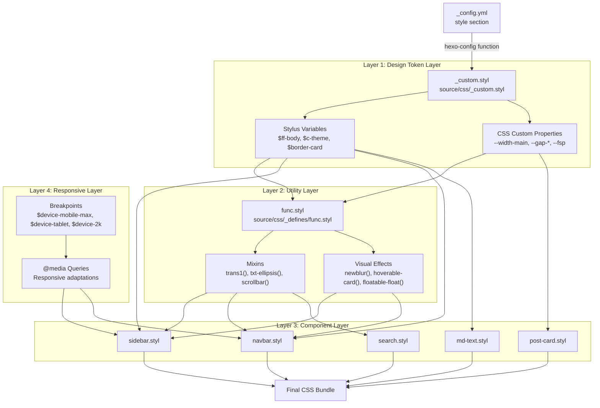
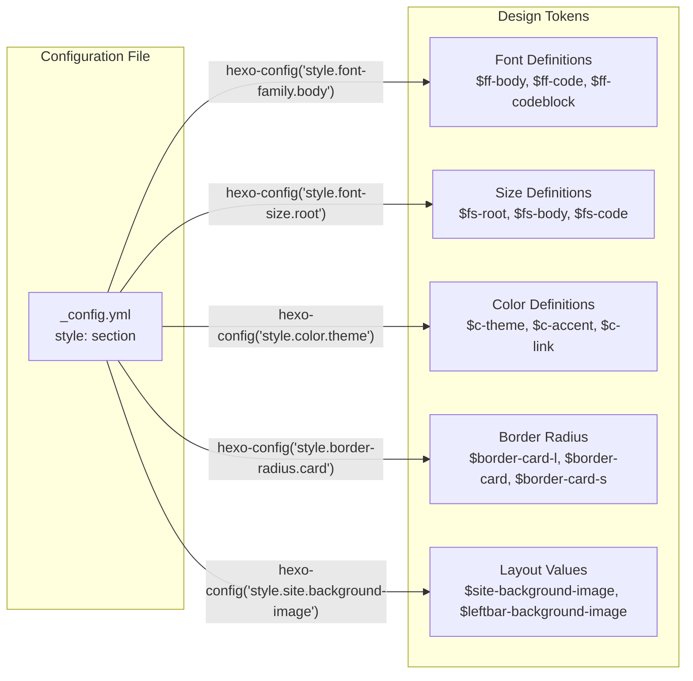
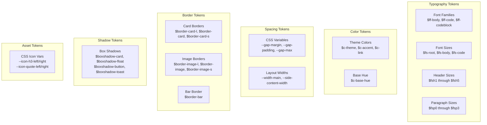
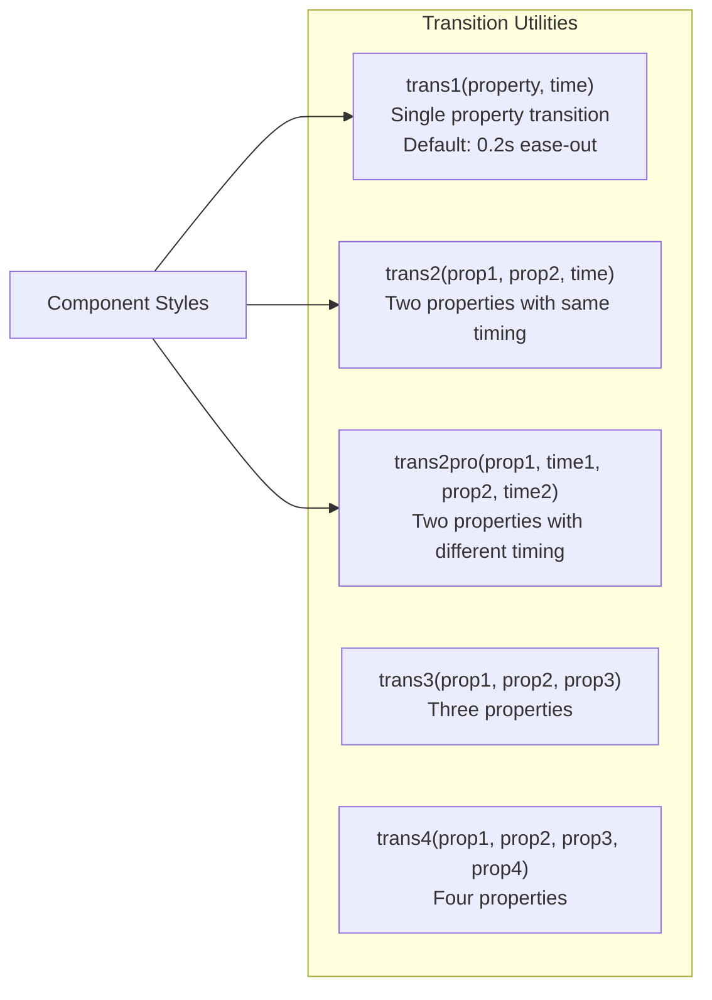
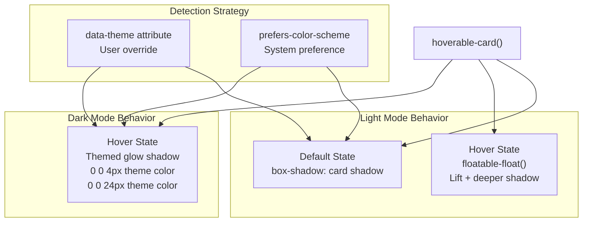
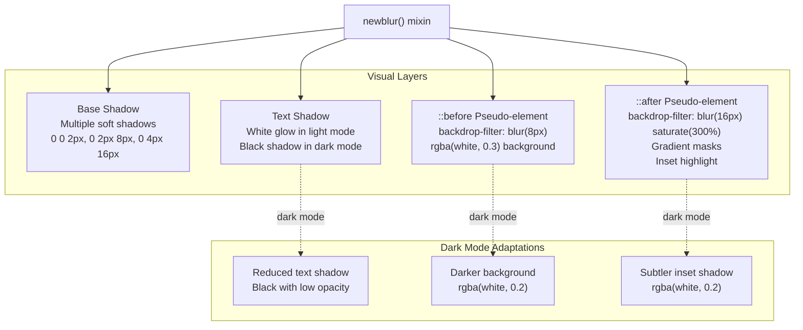
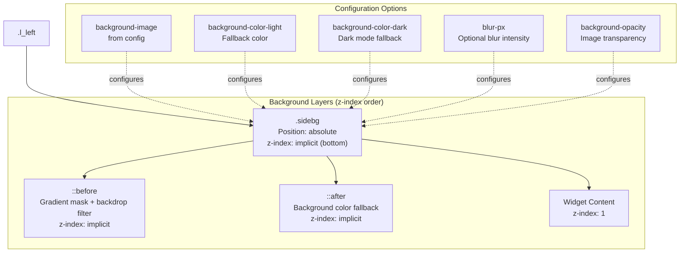
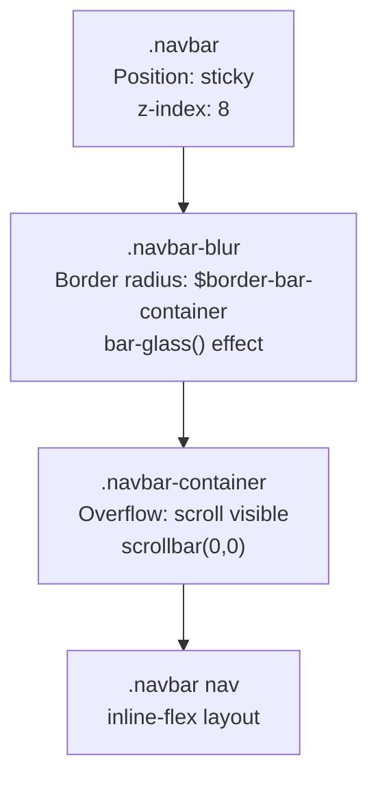
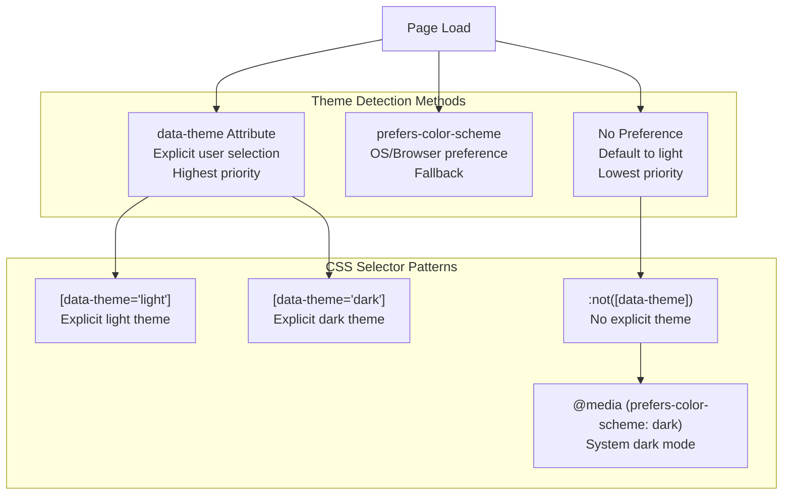

# 样式与主题定制

<details>
<summary>相关源码文件</summary>

生成此页面时参考的主题源码文件：

- [source/css/_components/partial/navbar.styl](../../../source/css/_components/partial/navbar.styl)
- [source/css/_components/sidebar/search.styl](../../../source/css/_components/sidebar/search.styl)
- [source/css/_components/sidebar/sidebar.styl](../../../source/css/_components/sidebar/sidebar.styl)
- [source/css/_custom.styl](../../../source/css/_custom.styl)
- [source/css/_defines/func.styl](../../../source/css/_defines/func.styl)

</details>

本文全面介绍 Stellar 主题的样式架构，包括设计令牌系统、CSS 自定义属性、工具混入（mixin），以及主题如何跨组件实现样式。样式层通过四级级联把 `_config.yml` 的配置值转化为统一的视觉设计。

各子系统见：

- 设计令牌与 CSS 变量：[2.1](design-tokens.md)
- 排版配置：[2.2](typography.md)
- 颜色系统与深色模式：[2.3](colors-dark-mode.md)
- 响应式断点：[2.4](responsive-design.md)
- 工具混入：[2.5](stylus-utilities.md)
- 代码高亮：[2.6](code-highlighting.md)

## 样式架构概览

Stellar 实现了一套分层样式系统，通过四个层级把配置转化为最终 CSS，确保所有视觉组件的一致性、可维护性与可配置性。

### 四级级联模型



**参考源码**：[source/css/_custom.styl](../../../source/css/_custom.styl)、[source/css/_defines/func.styl](../../../source/css/_defines/func.styl)

### 配置驱动设计

Stylus 中的 `hexo-config()` 函数从 `_config.yml` 读取值并转换为 Stylus 变量，实现不改源码即可定制主题：



**参考源码**：[source/css/_custom.styl](../../../source/css/_custom.styl)

### 文件组织

样式系统由若干关键文件组成：

| 文件 | 用途 | 主要内容 |
|------|------|----------|
| `source/css/_custom.styl` | 设计令牌定义 | 字体族、字号、颜色、间距、边框、阴影、CSS 自定义属性 |
| `source/css/_defines/func.styl` | 工具库 | 过渡混入、文本工具、滚动条样式、视觉效果 |
| `source/css/_defines/const.styl` | 常量 | 设备断点、基础颜色 |
| `source/css/_components/*.styl` | 组件样式 | 各组件实现，使用令牌与工具 |
| `source/css/main.styl` | 主入口 | 按插件配置条件导入 |

**参考源码**：[source/css/_custom.styl](../../../source/css/_custom.styl)、[source/css/_defines/func.styl](../../../source/css/_defines/func.styl)

## 设计令牌系统

`_custom.styl` 中的设计令牌是所有视觉属性的唯一事实来源，来源于配置并提供语义化命名，提升可维护性。

### 令牌分类



**参考源码**：[source/css/_custom.styl](../../../source/css/_custom.styl)

### 字体系统

字体令牌为不同内容类型提供三层体系：

```stylus
$ff-body = convert(hexo-config('style.font-family.body'))
$ff-code = convert(hexo-config('style.font-family.code'))
$ff-codeblock = convert(hexo-config('style.font-family.codeblock'))
```

字号基于正文字号计算缩放：

| 令牌 | 计算 | 用途 |
|------|------|------|
| `$fsh1` | `calc($fs-body + 9px)` | 最大标题 |
| `$fsh2` | `calc($fs-body + 11px)` | 二级标题 |
| `$fsh3` | `calc($fs-body + 7px)` | 三级标题 |
| `$fsh4` | `calc($fs-body + 4px)` | 四级标题 |
| `$fsh5` | `calc($fs-body + 2px)` | 五级标题 |
| `$fsp0` | `calc($fs-body - 0px)` | 普通段落 |
| `$fsp1` | `calc($fs-body - 1px)` | 略小文本 |
| `$fsp2` | `calc($fs-body - 2px)` | 元信息文本 |
| `$fsp3` | `calc($fs-body - 3px)` | 最小文本 |

**参考源码**：[source/css/_custom.styl](../../../source/css/_custom.styl)

### 圆角系统

主题为卡片与图片定义三档圆角以维持视觉层级：

```stylus
$border-card-l = convert(hexo-config('style.border-radius.card-l'))    // 大卡片
$border-card = convert(hexo-config('style.border-radius.card'))          // 标准卡片
$border-card-s = convert(hexo-config('style.border-radius.card-s'))      // 小卡片
$border-bar = convert(hexo-config('style.border-radius.bar'))            // 横条与控件
```

**参考源码**：[source/css/_custom.styl](../../../source/css/_custom.styl)

### 阴影系统

盒阴影定义为可复用令牌，提供一致的层级感：

| 令牌 | 阴影值 | 用途 |
|------|--------|------|
| `$boxshadow-card` | `0 1px 2px 0px rgba(0, 0, 0, 0.1)` | 默认卡片阴影 |
| `$boxshadow-float` | `0 4px 8px 0px rgba(0, 0, 0, 0.05)` | 浮动元素 |
| `$boxshadow-card-float` | `0 12px 16px -4px rgba(0, 0, 0, 0.2)` | 悬停抬升卡片 |
| `$boxshadow-button` | `0 0 2px 0px rgba(0, 0, 0, 0.04), 0 0 8px 0px rgba(0, 0, 0, 0.04)` | 按钮立体感 |
| `$boxshadow-block` | `0 1px 4px 0px rgba(0, 0, 0, 0.02), 0 2px 8px 0px rgba(0, 0, 0, 0.02)` | 内容块 |
| `$boxshadow-toast` | `0 4px 8px 0px rgba(0, 0, 0, 0.1), 0 12px 16px -4px rgba(0, 0, 0, 0.2)` | Toast 通知 |

**参考源码**：[source/css/_custom.styl](../../../source/css/_custom.styl)

## CSS 自定义属性

CSS 自定义属性（CSS 变量）支持运行时主题与响应式调整。与构建期编译的 Stylus 变量不同，自定义属性可以动态变化。

### 核心布局变量

`:root` 选择器定义全局可用的自定义属性：

```mermaid
graph TB
    ROOT[":root CSS Variables"]
    
    subgraph "Layout Properties"
        MAIN["--width-main<br/>Main content width<br/>720px → 780px (2k) → 860px (4k)"]
        SIDE["--side-content-width<br/>Sidebar width<br/>224px → 188px (tablet)"]
    end
    
    subgraph "Spacing Properties"
        MARGIN["--gap-margin<br/>Container margins: 16px"]
        PADDING["--gap-padding<br/>Content padding: 16px"]
        MAX["--gap-max<br/>Combined: calc(--gap-margin + --gap-padding)"]
        PGAP["--gap-p<br/>Paragraph spacing<br/>calc($fs-body + 4px)"]
    end
    
    subgraph "Typography Properties"
        FSP["--fsp<br/>Dynamic font size<br/>Defaults to $fs-body"]
        FSH2["--fsh2<br/>H2 size: calc(--fsp + 11px)"]
        FSH3["--fsh3<br/>H3 size: calc(--fsp + 7px)"]
        FSH4["--fsh4<br/>H4 size: calc(--fsp + 4px)"]
    end
    
    ROOT --> MAIN
    ROOT --> SIDE
    ROOT --> MARGIN
    ROOT --> PADDING
    ROOT --> MAX
    ROOT --> PGAP
    ROOT --> FSP
    ROOT --> FSH2
    ROOT --> FSH3
    ROOT --> FSH4
```



**参考源码**：[source/css/_custom.styl](../../../source/css/_custom.styl)

### 响应式自定义属性

自定义属性随视口尺寸在 `:root` 内用媒体查询适配：

```stylus
:root
  --width-main: 720px
  // 2k 及以上桌面
  @media screen and (min-width: $device-2k)
    --width-main: 780px
  // 4k 及以上桌面
  @media screen and (min-width: $device-4k)
    --width-main: 860px
```

这样所有使用 `var(--width-main)` 的组件都会自动适配，无需各自的媒体查询。

**参考源码**：[source/css/_custom.styl](../../../source/css/_custom.styl)

### 动态排版变量

字号变量用 `calc()` 表达式按比例缩放：

| 变量 | 表达式 | 用途 |
|------|--------|------|
| `--fsp` | `$fs-body` | 基准段落字号，可被组件覆盖 |
| `--fsh2` | `calc(var(--fsp) + 11px)` | H2 相对当前 `--fsp` 的字号 |
| `--fsh3` | `calc(var(--fsp) + 7px)` | H3 相对当前 `--fsp` 的字号 |
| `--fsh4` | `calc(var(--fsp) + 4px)` | H4 相对当前 `--fsp` 的字号 |

组件只需改变 `--fsp` 即可调整整个排版比例尺。

**参考源码**：[source/css/_custom.styl](../../../source/css/_custom.styl)

### 派生变量

部分自定义属性由其他属性派生，保证一致性：

```stylus
:root
  // 元素文本内容到容器边缘的间距
  --gap-max: calc(var(--gap-margin) + var(--gap-padding))
```

**参考源码**：[source/css/_custom.styl](../../../source/css/_custom.styl)

## 工具混入库

`func.styl` 提供可复用的 Stylus 混入，封装常见 CSS 模式，组件样式用它保持一致、减少重复。

### 过渡混入

多个过渡混入处理跨浏览器动画并带厂商前缀：



navbar 组件中的用法示例：

```stylus
a
  trans1 all
  &:hover
    background: var(--bg-a50)
```

**参考源码**：[source/css/_defines/func.styl](../../../source/css/_defines/func.styl)、[source/css/_components/partial/navbar.styl](../../../source/css/_components/partial/navbar.styl)

### 文本工具

常见文本处理模式：

| 混入 | CSS 输出 | 用途 |
|------|----------|------|
| `txt-ellipsis()` | `white-space: nowrap`<br/>`overflow: hidden`<br/>`text-overflow: ellipsis` | 长文本省略号截断 |
| `disable-select()` | `-webkit-user-select: none`<br/>`user-select: none` | 禁止文本选中 |
| `placeholder(rules)` | 跨浏览器 placeholder 样式 | 输入框占位符样式 |

**参考源码**：[source/css/_defines/func.styl](../../../source/css/_defines/func.styl)

### 滚动条样式

`scrollbar()` 混入提供可定制滚动条外观与合理默认值：

```stylus
scrollbar($w = 4px, $b = 2px, $c = var(--text-meta), $h = var(--text-p3))
  &::-webkit-scrollbar
    height: $w
    width: $w
  &::-webkit-scrollbar-track-piece
    background: transparent
  &::-webkit-scrollbar-thumb
    background: $c
    cursor: pointer
    border-radius: $b
    &:hover
      background: $h
```

代码块专用变体在悬停前隐藏滚动条：

```stylus
scrollbar-codeblock($height = 4px)
  &::-webkit-scrollbar-thumb
    background: transparent
  &:hover
    &::-webkit-scrollbar-thumb
      background: var(--text-meta)
```

**参考源码**：[source/css/_defines/func.styl](../../../source/css/_defines/func.styl)

### SVG 图标遮罩

`svg-mask-icon()` 混入用 SVG data URI 作为遮罩，实现可着色图标：

```stylus
svg-mask-icon($svg)
  -webkit-mask-image: url($svg)
  -webkit-mask-repeat: no-repeat
  -webkit-mask-position: center
  -webkit-mask-size: contain
  mask-image: url($svg)
  mask-repeat: no-repeat
  mask-position: center
  mask-size: contain
```

这样 `_custom.styl` 中定义的图标（如 `$iQuoteLeft`）可以继承文字颜色。

**参考源码**：[source/css/_defines/func.styl](../../../source/css/_defines/func.styl)

### 悬停与浮动效果

交互元素工具提供一致的悬停行为：

```stylus
hover-block($v, $h, $br = 4px)
  border-radius: $br
  padding: $v $h
  trans2 color background
  &:hover
    background: var(--block-border)
```

抬升卡片的浮动效果：

```stylus
floatable-trans()
  trans2 transform box-shadow

floatable-float()
  box-shadow: 0 12px 20px -4px rgba(0, 0, 0, 0.15)
  transform: translate3d(0, -2px, 0)
```

**参考源码**：[source/css/_defines/func.styl](../../../source/css/_defines/func.styl)

## 视觉效果系统

高级视觉效果提供玻璃拟态与主题感知的悬停状态。

### 可悬停卡片效果

`hoverable-card()` 混入创建主题感知的悬停状态：



混入实现处理三种场景：

1. 显式浅色主题：`[data-theme="light"]`
2. 显式深色主题：`[data-theme="dark"]`
3. 无显式主题：回退到系统偏好

**参考源码**：[source/css/_defines/func.styl](../../../source/css/_defines/func.styl)

### 玻璃拟态效果（newblur）

`newblur()` 混入通过模糊、饱和度与阴影实现玻璃拟态效果：



应用在 navbar 组件：

```stylus
.navbar-blur
  bar-glass() // 容器圆角默认 $border-bar-container，由 style.border-radius.bar 派生
```

效果使用多种技术：

1. **backdrop-filter** 实现模糊与饱和度
2. **伪元素** 实现分层背景
3. **渐变遮罩** 实现边缘淡出
4. **文字阴影** 提升可读性
5. **主题感知适配** 深浅模式

**参考源码**：[source/css/_defines/func.styl](../../../source/css/_defines/func.styl)、[source/css/_components/partial/navbar.styl](../../../source/css/_components/partial/navbar.styl)

## 组件样式模式

组件消费设计令牌与工具，构建一致界面。

### 侧边栏背景系统

左栏实现多层背景系统：



`.sidebg` 元素对背景图应用滤镜：

```stylus
.sidebg
  --saturate: 400%
  --blur-px: convert(hexo-config('style.leftbar.blur-px'))
  --background-opacity: 1
  filter: saturate(var(--saturate)) blur(var(--blur-px)) opacity(var(--background-opacity))
```

`::before` 伪元素叠加渐变遮罩与额外模糊：

```stylus
&:before
  backdrop-filter: saturate(300%)
  -webkit-backdrop-filter: saturate(300%)
  mask: linear-gradient(black, rgba(black, 0.5), 70%, transparent, 90%, transparent)
```

**参考源码**：[source/css/_components/sidebar/sidebar.styl](../../../source/css/_components/sidebar/sidebar.styl)

### 导航栏模糊容器

导航栏使用嵌套容器模式实现玻璃拟态：



容器隐藏滚动条同时允许横向滚动：

```stylus
.navbar-container
  overflow: scroll visible
  scrollbar(0, 0)
```

**参考源码**：[source/css/_components/partial/navbar.styl](../../../source/css/_components/partial/navbar.styl)

### 搜索组件状态管理

搜索组件用属性选择器驱动状态样式：

```stylus
.search-wrapper
  &[searching='true']
    .search-button path[p-id="1562"]
      color: $c-green
  &.noresult[searching='true']
    .search-button path[p-id="1562"]
      color: $c-red
```

悬停与聚焦状态增强搜索表单：

```stylus
.search-form
  &:hover,&:has(input:focus),&:has(input:not(:placeholder-shown))
    &:before
      background: var(--bg-a100)
      height: 100%
```

**参考源码**：[source/css/_components/sidebar/search.styl](../../../source/css/_components/sidebar/search.styl)

## 响应式设计集成

样式系统与 `_defines/const.styl` 中定义的响应式断点集成。

### 断点驱动的适配

CSS 自定义属性随视口变化：

| 断点 | 媒体查询 | 适配 |
|------|----------|------|
| 2k 桌面 | `min-width: $device-2k` | `--width-main: 780px` |
| 4k 桌面 | `min-width: $device-4k` | `--width-main: 860px` |
| 平板 | `max-width: $device-tablet` | `--side-content-width: 188px` |
| 手机 | `max-width: $device-mobile-max` | `--side-content-width: 224px` |

**参考源码**：[source/css/_custom.styl](../../../source/css/_custom.styl)

### 组件级响应式模式

组件通过媒体查询实现响应式：

```stylus
@media screen and (max-width: $device-mobile-max)
  .l_left
    overflow: hidden
    background: var(--bg-a100)
    .sidebg
      --saturate: 300%
```

2k 屏幕下的侧边栏定位：

```stylus
@media screen and (min-width: $device-2k)
  .l_left
    margin-left: auto
    margin-right: calc(2 * var(--gap-max))
  .l_right
    margin-left: var(--gap-max)
    margin-right: auto
```

**参考源码**：[source/css/_components/sidebar/sidebar.styl](../../../source/css/_components/sidebar/sidebar.styl)

### 移动端微调

导航栏在小屏手机调整位置：

```stylus
@media screen and (max-width: $device-mobile-iphone-max)
  .navbar.top
    top: 36px
```

**参考源码**：[source/css/_components/partial/navbar.styl](../../../source/css/_components/partial/navbar.styl)

## 主题检测与深色模式

样式系统通过 `data-theme` 属性与系统偏好实现三种深色模式检测机制。

### 检测策略



### 实现模式

组件用嵌套选择器实现深色模式：

```stylus
hoverable-card()
  trans1 all
  onlight()
    box-shadow: $boxshadow-card
    &:hover
      floatable-float()
  ondark()
    &:hover
      box-shadow: 0 0 4px -2px var(--theme), 0 0 24px -8px var(--theme)
  :root[data-theme="light"] &
    onlight()
  :root[data-theme="dark"] &
    ondark()
  :root:not([data-theme]) &
    onlight()
    @media (prefers-color-scheme: dark)
      ondark()
```

该模式保证：

1. 显式主题选择永远优先
2. 无显式选择时应用系统偏好
3. 两者皆无时默认浅色

**参考源码**：[source/css/_defines/func.styl](../../../source/css/_defines/func.styl)

### 深色模式变量调整

许多组件针对深色模式调整 CSS 变量：

```stylus
.leftbar-container
  &:before
    background: rgba(white, 0.05)
    :root[data-theme="dark"] &
      background: rgba(white, 0.05)
      box-shadow: inset 0 0 32px 1px rgba(white, 0.1)
    @media (prefers-color-scheme: dark)
      background: rgba(white, 0.05)
      box-shadow: inset 0 0 32px 1px rgba(white, 0.1)
```

**参考源码**：[source/css/_components/sidebar/sidebar.styl](../../../source/css/_components/sidebar/sidebar.styl)

---

这套样式架构让 Stellar 在所有组件与浏览条件下提供一致、可配置、高性能的视觉体验。层级化设计令牌、工具库与响应式模式在保证可维护性的同时，允许通过配置深度定制。
