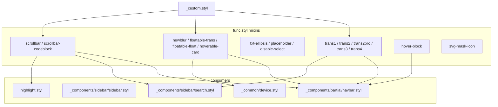
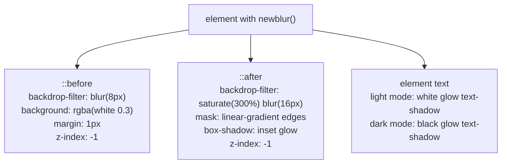
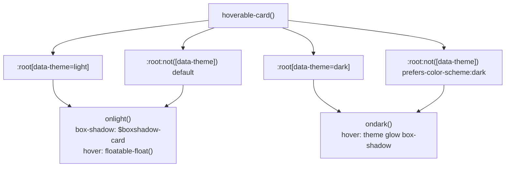
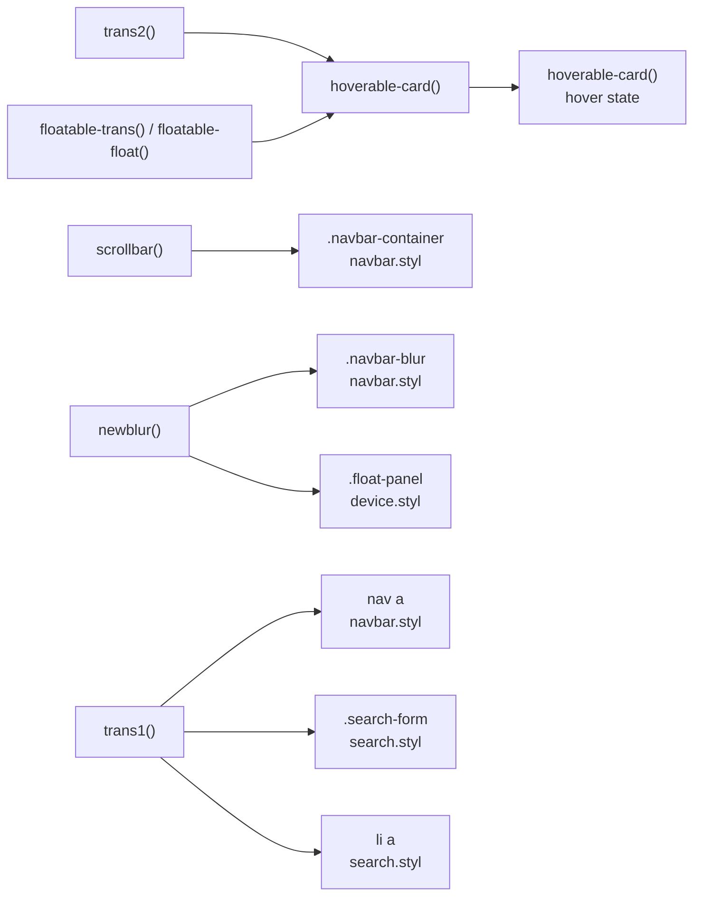

# Stylus 工具与混入

<details>
<summary>相关源码文件</summary>

生成此页面时参考的主题源码文件：

- [source/css/_components/partial/navbar.styl](../../../source/css/_components/partial/navbar.styl)
- [source/css/_components/sidebar/search.styl](../../../source/css/_components/sidebar/search.styl)
- [source/css/_components/sidebar/sidebar.styl](../../../source/css/_components/sidebar/sidebar.styl)
- [source/css/_defines/func.styl](../../../source/css/_defines/func.styl)
- [source/css/_common/device.styl](../../../source/css/_common/device.styl)

</details>

本页介绍 `func.styl` 中定义的工具混入与辅助函数，它们构成 Stellar 三层样式架构的中间层。这些混入为过渡、视觉效果、文本处理、滚动条样式与悬停交互提供可复用模式，贯穿主题所有组件样式。

设计令牌与 CSS 变量见[设计令牌与 CSS 变量](design-tokens.md)；响应式工具与媒体查询见[响应式设计](responsive-design.md)；代码块滚动条行为见[代码块与语法高亮](code-highlighting.md)。

---

## 架构概览

`func.styl` 位于设计令牌层与组件样式之间，提供封装常见样式模式与跨浏览器兼容问题的混入库。

**func.styl 混入依赖图**



**参考源码**：[source/css/_defines/func.styl](../../../source/css/_defines/func.styl)、[source/css/_components/sidebar/sidebar.styl](../../../source/css/_components/sidebar/sidebar.styl)、[source/css/_components/partial/navbar.styl](../../../source/css/_components/partial/navbar.styl)、[source/css/_common/device.styl](../../../source/css/_common/device.styl)

---

## 过渡混入

主题提供五个过渡混入，处理带厂商前缀的跨浏览器 CSS transition。所有过渡默认使用 `ease-out` 缓动。

### 混入签名

| 混入 | 参数 | 默认时长 | 用途 |
|------|------|----------|------|
| `trans1($op, $time)` | 单属性 | 0.2s | 简单属性变化 |
| `trans2($op1, $op2, $time)` | 双属性 | 0.2s | 双属性动画 |
| `trans2pro($op1, $t1, $op2, $t2)` | 双属性独立时长 | N/A | 高级时长控制 |
| `trans3($op1, $op2, $op3)` | 三属性 | 0.2s（固定） | 三属性动画 |
| `trans4($op1, $op2, $op3, $op4)` | 四属性 | 0.2s（固定） | 复杂动画 |

### 实现细节

每个混入输出四条带厂商前缀的 `transition` 声明（`-moz-`、`-webkit-`、`-o-` 与无前缀），全部使用 `ease-out` 缓动。

`trans2pro` 支持每个属性独立时长（`$t1`、`$t2`）；`trans3` 与 `trans4` 固定 0.2s，不提供时长参数。

**组件中的示例用法：**

- `trans1 all`——导航链接悬停过渡
- `trans1 all`——搜索表单边框动画
- `trans1 background`——搜索结果列表项

**参考源码**：[source/css/_defines/func.styl](../../../source/css/_defines/func.styl)、[source/css/_components/partial/navbar.styl](../../../source/css/_components/partial/navbar.styl)、[source/css/_components/sidebar/search.styl](../../../source/css/_components/sidebar/search.styl)

---

## 视觉效果

### newblur() 混入

`newblur()` 混入用 backdrop filter、文字阴影与伪元素实现精细的玻璃拟态效果，是导航栏的标志性视觉效果，也可用于其他浮动 UI 元素。

**newblur() 伪元素层结构**



**关键特性：**

- **多层模糊**：`::before` 基础模糊（8px），`::after` 高级模糊（16px）+ 饱和度（300%）
- **文字阴影**：浅色模式白色光晕、深色模式黑色光晕，提升可读性
- **边框光晕**：inset box-shadow 形成微妙发光边框
- **渐变遮罩**：线性渐变遮罩实现边缘淡出
- **主题感知**：深色模式调整透明度与阴影值

**主题专属行为：**

浅色模式下 `text-shadow` 在文字周围产生白色光晕，保证模糊背景上的可读性。深色模式（`[data-theme="dark"]` 或 `prefers-color-scheme: dark`）下阴影切换为深色光晕。

**组件中的应用：**

- `.navbar nav a` 与 `.float-panel button` 通过 `bar-item()` 共用基础 UI（尺寸、间距、与容器同心的圆角），一处修改两处生效
- `.navbar-blur` 与 `.float-panel` 通过 `bar-glass()`（默认圆角 `$border-bar-container`，由 `style.border-radius.bar` 派生）复用 `newblur()` 玻璃层，共用「长条圆角矩形 + 玻璃」UI
- 侧边栏打开时，`.float-panel` 中对应的按钮（`leftbar-toggle` / `rightbar-toggle`）调用 `bar-item-active()` 复用 navbar item 激活样式（背景 + 阴影 + saturate），面板保持玻璃效果
- 左栏在 `sidebar.styl` 中手写 backdrop-filter 规则，不直接调用该混入（便于精细控制饱和度、模糊半径与透明度）

**参考源码**：[source/css/_defines/func.styl](../../../source/css/_defines/func.styl)、[source/css/_components/partial/navbar.styl](../../../source/css/_components/partial/navbar.styl)、[source/css/_common/device.styl](../../../source/css/_common/device.styl)

### 浮动效果

floatable 混入为交互卡片创建抬升效果：

| 混入 | 用途 | 效果 |
|------|------|------|
| `floatable-trans()` | 准备 | 定义 `transform` 与 `box-shadow` 的过渡 |
| `floatable-float()` | 激活 | 上移（-2px）并加阴影 |

`floatable-trans()` 调用 `trans2 transform box-shadow` 设置平滑过渡；`floatable-float()` 通过 `translate3d` 上移 `-2px` 并加投影。

**参考源码**：[source/css/_defines/func.styl](../../../source/css/_defines/func.styl)

### 可悬停卡片效果

`hoverable-card()` 混入组合浮动效果与主题感知阴影，用于文章卡片与交互元素：

**hoverable-card() 主题分支逻辑**



**浅色模式行为：**

- 基础阴影来自 `$boxshadow-card` 设计令牌
- 悬停触发 `floatable-float()` 抬升效果

**深色模式行为：**

- 无基础阴影
- 悬停创建主题色光晕：`0 0 4px -2px var(--theme), 0 0 24px -8px var(--theme)`

**参考源码**：[source/css/_defines/func.styl](../../../source/css/_defines/func.styl)

---

## 文本处理工具

### 文本省略号

`txt-ellipsis()` 设置 `white-space: nowrap`、`overflow: hidden`、`text-overflow: ellipsis`，截断超出的单行文本。用于受限布局中的标题、面包屑与元信息。

**参考源码**：[source/css/_defines/func.styl](../../../source/css/_defines/func.styl)

### 占位符样式

`placeholder(rules)` 接收一个 Stylus 规则块，输出到四种浏览器专属 placeholder 伪选择器：`::-webkit-input-placeholder`、`:-moz-placeholder`、`::-moz-placeholder`、`:-ms-input-placeholder`。

**参考源码**：[source/css/_defines/func.styl](../../../source/css/_defines/func.styl)

### 禁止选中

`disable-select()` 输出带 `-moz-`、`-ms-`、`-webkit-` 前缀的 `user-select: none`。用于按钮、图标与导航，防止误选文本。

**参考源码**：[source/css/_defines/func.styl](../../../source/css/_defines/func.styl)

---

## 滚动条定制

主题提供两个滚动条混入，适用于不同场景：

### 通用滚动条

`scrollbar()` 混入定制滚动条外观，尺寸与颜色可配置：

```stylus
scrollbar($w = 4px, $b = 2px, $c = var(--text-meta), $h = var(--text-p3))
```

**参数：**

| 参数 | 默认 | 用途 |
|------|------|------|
| `$w` | 4px | 滚动条宽/高 |
| `$b` | 2px | 滑块的圆角 |
| `$c` | `var(--text-meta)` | 滑块颜色 |
| `$h` | `var(--text-p3)` | 滑块悬停颜色 |

**组件中的应用：**

- `.navbar-container` 用 `scrollbar(0, 0)` 隐藏滚动条，同时保留元素可滚动（横向溢出的导航项）
- `#search-result` 用 `scrollbar(0, 0)` 配合 `scrollbar-width: none` 完全隐藏滚动条

**参考源码**：[source/css/_defines/func.styl](../../../source/css/_defines/func.styl)、[source/css/_components/partial/navbar.styl](../../../source/css/_components/partial/navbar.styl)、[source/css/_components/sidebar/search.styl](../../../source/css/_components/sidebar/search.styl)

### 代码块滚动条

`scrollbar-codeblock()` 为代码块创建更低调的滚动条：

```stylus
scrollbar-codeblock($height = 4px)
```

**关键差异：**

- 滑块默认透明
- 仅悬停时可见
- 圆角使用 `$border-bar` 设计令牌
- 同时应用于横向与纵向滚动条

滑块初始为 `transparent`，容器悬停时变为 `var(--text-meta)`，直接悬停滑块时进一步变深为 `var(--text-p3)`。避免代码块中常驻滚动条 UI。

**参考源码**：[source/css/_defines/func.styl](../../../source/css/_defines/func.styl)

---

## 悬停效果

### 悬停块

`hover-block($v, $h, $br = 4px)` 对元素应用 padding、`border-radius` 与 `trans2 color background` 过渡，`:hover` 时设置 `background: var(--block-border)`。用于行内可点击标签或导航项，需要轻微高亮但不需要完整卡片效果。

| 参数 | 默认 | 用途 |
|------|------|------|
| `$v` | — | 垂直 padding |
| `$h` | — | 水平 padding |
| `$br` | `4px` | 圆角 |

**参考源码**：[source/css/_defines/func.styl](../../../source/css/_defines/func.styl)

---

## SVG 工具

### SVG 遮罩图标

`svg-mask-icon($svg)` 输出 `-webkit-mask-*` 与标准 `mask-*` 属性（`mask-image`、`mask-repeat`、`mask-position`、`mask-size`），指向给定 SVG URL。遮罩居中并按元素边界包含。

这实现颜色自适应图标：SVG 作为背景色上的遮罩，图标颜色跟随 `background-color`（或 `currentColor` 时的 `color`），并随主题自动切换。

**参考源码**：[source/css/_defines/func.styl](../../../source/css/_defines/func.styl)

---

## 组件中的使用模式

**关键文件中的混入调用点**



### 导航栏实现

`.navbar-blur` 调用 `newblur()` 产生磨砂玻璃导航栏。`.navbar-container` 调用 `scrollbar(0, 0)` 隐藏滚动条同时保留横向溢出滚动（宽导航菜单）。导航链接 `a` 调用 `trans1 all` 实现悬停过渡。

### 浮动面板（移动端侧边栏开关）

`.float-panel` 调用 `newblur()` 把相同玻璃效果应用到移动端浮动侧边栏开关按钮。侧边栏打开时，通过显式 `box-shadow` 规则叠加主题色光晕。

### 侧边栏实现

左栏 `.leftbar-container:before` 在 `sidebar.styl` 中自行实现内联 `backdrop-filter` 与 `mask` 规则，不直接调用 `newblur()`，以便对侧边栏背景图变体的饱和度、模糊半径与透明度做更精细控制。

**参考源码**：[source/css/_components/partial/navbar.styl](../../../source/css/_components/partial/navbar.styl)、[source/css/_components/sidebar/sidebar.styl](../../../source/css/_components/sidebar/sidebar.styl)、[source/css/_common/device.styl](../../../source/css/_common/device.styl)

---

## 混入参考汇总

| 混入 | 分类 | 参数 | 主要用途 |
|------|------|------|----------|
| `svg-mask-icon($svg)` | SVG | SVG 路径 | 颜色自适应图标 |
| `trans1($op, $time)` | 过渡 | 属性、时长 | 单属性动画 |
| `trans2($op1, $op2, $time)` | 过渡 | 双属性、时长 | 双属性动画 |
| `trans2pro($op1, $t1, $op2, $t2)` | 过渡 | 双属性独立时长 | 高级时长控制 |
| `trans3($op1, $op2, $op3)` | 过渡 | 三属性 | 三属性动画 |
| `trans4($op1, $op2, $op3, $op4)` | 过渡 | 四属性 | 复杂动画 |
| `txt-ellipsis()` | 文本 | 无 | 文本截断 |
| `placeholder(rules)` | 文本 | 规则块 | 输入占位符样式 |
| `disable-select()` | 文本 | 无 | 禁止文本选中 |
| `scrollbar($w, $b, $c, $h)` | 滚动条 | 宽、圆角、颜色 | 通用滚动条 |
| `scrollbar-codeblock($height)` | 滚动条 | 高 | 代码块滚动条 |
| `hover-block($v, $h, $br)` | 悬停 | padding、圆角 | 可点击文本块 |
| `floatable-trans()` | 视觉 | 无 | 启用浮动过渡 |
| `floatable-float()` | 视觉 | 无 | 应用浮动效果 |
| `hoverable-card()` | 视觉 | 无 | 交互卡片样式 |
| `newblur($radius)` | 视觉 | 圆角（默认 64px） | 玻璃拟态效果 |
| `bar-glass($radius)` | 视觉 | 圆角（默认 `$border-bar-container`） | 长条圆角玻璃 UI（圆角 + newblur + 连续曲率） |
| `bar-item()` | 视觉 | 无 | 横条 item/按钮基础 UI（padding `.25rem .75rem`、圆角 `$border-bar`、连续曲率；间距由容器 `gap`/`padding` 控制） |
| `bar-item-active()` | 视觉 | 无 | 横条 item 激活样式（背景 + 阴影 + saturate） |

**参考源码**：[source/css/_defines/func.styl](../../../source/css/_defines/func.styl)
