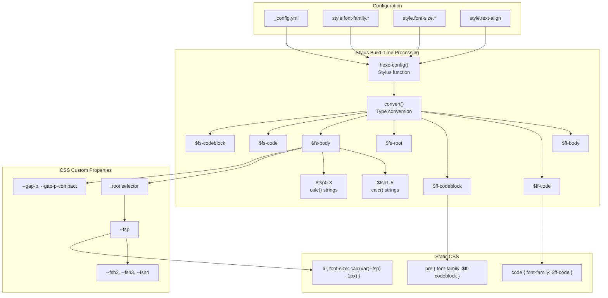
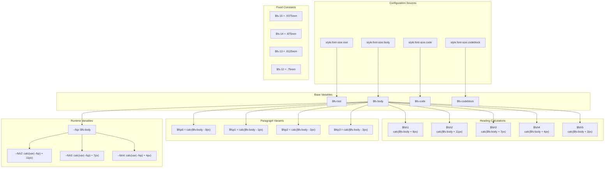
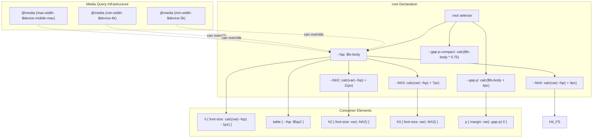

# 排版系统

<details>
<summary>相关源码文件</summary>

生成此页面时参考的主题源码文件：

- [source/css/_custom.styl](../../../source/css/_custom.styl)
- [source/css/_common/base.styl](../../../source/css/_common/base.styl)
- [source/css/_common/highlight.styl](../../../source/css/_common/highlight.styl)

</details>

排版系统通过配置驱动流水线控制 Stellar 的文本渲染：把 `_config.yml` 设置转换为 Stylus 变量与 CSS 自定义属性。系统定义字体族（`$ff-body`、`$ff-code`、`$ff-codeblock`）、字号比例（`$fs-root`、`$fsh*`、`$fsp*`），并通过媒体查询做响应式调整。

相关文档：[设计令牌与 CSS 变量](design-tokens.md)、[颜色与深色模式](colors-dark-mode.md)、[响应式设计](responsive-design.md)。

---

## 配置到 CSS 的架构

排版配置经三个阶段流动：`hexo-config()` 提取配置、Stylus 变量编译、CSS 输出生成。系统同时使用静态 Stylus 变量（固定值）与 CSS 自定义属性（`:root` 变量，运行时可调）。

**排版编译流水线**



### 构建期函数

- **`hexo-config(path)`**：构建期从 `_config.yml` 取值，例如 `hexo-config('style.font-family.body')` 取正文字体族。
- **`convert(value)`**：确保 YAML 字符串正确转换为 Stylus 值，处理单位与引号。

Stylus 字符串插值生成动态 `calc()` 表达式：`'calc(%s + 9px)' % $fs-body` 在 `$fs-body` 为 `1rem` 时输出 `"calc(1rem + 9px)"`。

**参考源码**：[source/css/_custom.styl](../../../source/css/_custom.styl)

---

## 字体族系统

三个字体族变量定义不同内容类型的排版：

| 变量 | 配置路径 | 应用目标 | 文件 |
|------|----------|----------|------|
| `$ff-body` | `style.font-family.body` | 全局正文、标题、段落 | 通过继承隐式应用 |
| `$ff-code` | `style.font-family.code` | `code` 元素（行内代码） | [highlight.styl](../../../source/css/_common/highlight.styl) |
| `$ff-codeblock` | `style.font-family.codeblock` | `pre` 元素、`.highlight` 块 | [base.styl](../../../source/css/_common/base.styl)、[highlight.styl](../../../source/css/_common/highlight.styl) |

### 变量定义

字体族从配置提取并保存为静态 Stylus 变量：

```stylus
// source/css/_custom.styl
$ff-body = convert(hexo-config('style.font-family.body'))
$ff-code = convert(hexo-config('style.font-family.code'))
$ff-codeblock = convert(hexo-config('style.font-family.codeblock'))
```

### 应用位置

**行内代码**：通过 `font-family: $ff-code` 应用到 `<code>` 元素：

```stylus
// source/css/_common/highlight.styl
code
  -webkit-font-smoothing: auto
  -moz-osx-font-smoothing: auto
  font-family: $ff-code
```

**代码块**：通过 `font-family: $ff-codeblock` 应用到 `<pre>` 元素：

```stylus
// source/css/_common/base.styl
pre
  font-family: $ff-codeblock
  font-size: $fs-codeblock
```

**语法高亮**：`.md-text .highlight` 选择器同样使用 `$ff-codeblock`：

```stylus
// source/css/_common/highlight.styl
.md-text .highlight
  font-family: $ff-codeblock
```

**参考源码**：[source/css/_custom.styl](../../../source/css/_custom.styl)、[source/css/_common/highlight.styl](../../../source/css/_common/highlight.styl)、[source/css/_common/base.styl](../../../source/css/_common/base.styl)

---

## 字号系统

字号变量分四类：来自配置的基础字号、固定 rem 常量、计算出的标题字号、计算出的段落变体。所有标题与段落字号都从 `$fs-body` 派生，保持比例缩放。

**字号变量依赖**



### 基础字号变量

配置值在构建期提取为 Stylus 变量：

```stylus
// source/css/_custom.styl
$fs-root = convert(hexo-config('style.font-size.root'))
$fs-body = convert(hexo-config('style.font-size.body'))
$fs-code = convert(hexo-config('style.font-size.code'))
$fs-codeblock = convert(hexo-config('style.font-size.codeblock'))
```

| 变量 | 用途 | 应用 |
|------|------|------|
| `$fs-root` | 根元素（html）尺寸，设定 rem 基准 | 决定 1rem 的值 |
| `$fs-body` | 默认段落/正文字号 | 所有计算尺寸的基础 |
| `$fs-code` | 行内代码字号 | 应用于 `p>code`、`li>code` |
| `$fs-codeblock` | 代码块字号 | 应用于 `pre`、`.highlight` |

### 固定尺寸常量

四个 rem 常量提供元信息与次级文本的标准尺寸：

```stylus
// source/css/_custom.styl
$fs-15 = .9375rem  // 根字号 16px 时约 15px
$fs-14 = .875rem   // 约 14px
$fs-13 = .8125rem  // 约 13px
$fs-12 = .75rem    // 约 12px
```

组件中需要绝对尺寸时使用，不受 `$fs-body` 配置影响。

**参考源码**：[source/css/_custom.styl](../../../source/css/_custom.styl)

---

## 标题字号层级

标题字号用 Stylus 字符串插值创建 CSS `calc()` 表达式，在 `$fs-body` 基础上加固定像素偏移，保证基础字号变化时所有标题按比例缩放。

| 变量 | 计算 | 偏移 | 大小排序 |
|------|------|------|----------|
| `$fsh1` | `calc($fs-body + 9px)` | +9px | 第 2 大 |
| `$fsh2` | `calc($fs-body + 11px)` | +11px | **最大** |
| `$fsh3` | `calc($fs-body + 7px)` | +7px | 第 3 大 |
| `$fsh4` | `calc($fs-body + 4px)` | +4px | 第 4 大 |
| `$fsh5` | `calc($fs-body + 2px)` | +2px | 第 5 大 |

### 字符串插值机制

Stylus 用 `%` 运算符把变量嵌入字符串：

```stylus
// source/css/_custom.styl
$fsh1 = 'calc(%s + 9px)' % $fs-body
$fsh2 = 'calc(%s + 11px)' % $fs-body
$fsh3 = 'calc(%s + 7px)' % $fs-body
$fsh4 = 'calc(%s + 4px)' % $fs-body
$fsh5 = 'calc(%s + 2px)' % $fs-body
```

若 `$fs-body` 为 `1rem`，输出为 `"calc(1rem + 9px)"`、`"calc(1rem + 11px)"` 等。

### 视觉层级设计

主题让 H2 成为最大标题（+11px），H1 次之（+9px）。这是有意为之的反转：H2 承担主要章节分隔，H1 用于页面标题，在内容流中不需要过重的视觉重量。

**参考源码**：[source/css/_custom.styl](../../../source/css/_custom.styl)

---

## 段落字号变体

四个递减字号变量为次级内容提供更小文本，各从 `$fs-body` 减去固定像素：

```stylus
// source/css/_custom.styl
$fsp0 = 'calc(%s - 0px)' % $fs-body  // 基准（不缩减）
$fsp1 = 'calc(%s - 1px)' % $fs-body  // -1px
$fsp2 = 'calc(%s - 2px)' % $fs-body  // -2px
$fsp3 = 'calc(%s - 3px)' % $fs-body  // -3px
```

| 变量 | 用法示例 | 应用场景 |
|------|----------|----------|
| `$fsp0` | 基准参考 | 等价于 `$fs-body` |
| `$fsp1` | 列表项（`li`） | [base.styl](../../../source/css/_common/base.styl) |
| `$fsp2` | 表格单元格 | [base.styl](../../../source/css/_common/base.styl) |
| `$fsp3` | 元信息、脚注 | 主题组件 |

### 列表项字号缩减

列表项使用运行时 `--fsp` 变量并减 1px：

```stylus
// source/css/_common/base.styl
li
  font-size: 'calc(%s - 1px)' % var(--fsp)
```

这为段落块与列表内容建立视觉层级，无需显式指定 `$fsp1`。

**参考源码**：[source/css/_custom.styl](../../../source/css/_custom.styl)、[source/css/_common/base.styl](../../../source/css/_common/base.styl)

---

## 用于运行时缩放的 CSS 自定义属性

排版系统在 `:root` 中暴露 CSS 自定义属性以支持运行时调整。多数 Stylus 变量编译为静态值，而这些属性允许媒体查询动态修改字号与间距。

**运行时排版变量系统**



### 变量声明

```stylus
// source/css/_custom.styl
:root
  --width-main: 720px
  --fsp: $fs-body
  --fsh2: 'calc(%s + 11px)' % var(--fsp)
  --fsh3: 'calc(%s + 7px)' % var(--fsp)
  --fsh4: 'calc(%s + 4px)' % var(--fsp)
  
  --gap-p: 'calc(%s + 4px)' % $fs-body
  --gap-p-compact: 'calc(%s * 0.75)' % $fs-body
```

### 级联计算链

`--fsp` 是运行时字号锚点。由于 `--fsh2`、`--fsh3`、`--fsh4` 的 `calc()` 使用 `var(--fsp)`，在媒体查询中修改 `--fsp` 会自动级联到所有标题尺寸。

例如媒体查询设置 `--fsp: 1.125rem` 后：

- `--fsh2` → `calc(1.125rem + 11px)`
- `--fsh3` → `calc(1.125rem + 7px)`
- `--fsh4` → `calc(1.125rem + 4px)`

### 段落间距变量

`--gap-p` 与 `--gap-p-compact` 控制段落垂直间距：

- `--gap-p`：标准段落边距（正文字号 + 4px）
- `--gap-p-compact`：紧凑布局的缩减间距（正文字号的 75%）

**参考源码**：[source/css/_custom.styl](../../../source/css/_custom.styl)

---

## 代码排版

代码渲染使用独立于正文的字体族与字号。行内代码（`<code>`）与代码块（`<pre>`、`.highlight`）分别处理。

### 字体平滑配置

所有代码元素关闭亚像素字体平滑，避免等宽字体的抗锯齿伪影：

```stylus
// source/css/_common/highlight.styl
code
  -webkit-font-smoothing: auto
  -moz-osx-font-smoothing: auto
  font-family: $ff-code
```

### 行内代码样式

`<p>` 与 `<li>` 内的行内代码使用 `$fs-code` 字号并带背景高亮：

```stylus
// source/css/_common/highlight.styl
p>code:not([class]), li>code:not([class])
  font-size: $fs-code
  background: var(--block)
  padding: .2em
  border-radius: 4px
  color: var(--text-code)
```

`:not([class])` 排除带语法高亮类的代码片段（`.language-*`）。

### 代码块排版

`<pre>` 元素使用 `$ff-codeblock` 字体族与 `$fs-codeblock` 字号：

```stylus
// source/css/_common/base.styl
pre
  font-family: $ff-codeblock
  font-size: $fs-codeblock
  tab-size: 4
  -moz-tab-size: 4
  -o-tab-size: 4
  -webkit-tab-size: 4
```

### 语法高亮块

`.md-text .highlight` 容器同样应用 `$ff-codeblock`：

```stylus
// source/css/_common/highlight.styl
.md-text .highlight, pre:not([class]):has(>code)
  margin: var(--gap-p) 0
  border-radius: $border-card
  overflow: hidden
  background: var(--block)
  font-family: $ff-codeblock
```

这保证所有代码块格式（围栏代码块、缩进块、高亮块）排版一致。

**参考源码**：[source/css/_common/highlight.styl](../../../source/css/_common/highlight.styl)、[source/css/_common/base.styl](../../../source/css/_common/base.styl)

---

## 响应式排版行为

`:root` 声明包含嵌套媒体查询，跨断点调整布局尺寸。CSS 自定义属性基础设施支持通过修改 `--fsp` 做响应式字号缩放，但当前实现并不随视口宽度调整排版。

### 媒体查询结构

```stylus
// source/css/_custom.styl
:root
  --fsp: $fs-body
  --fsh2: 'calc(%s + 11px)' % var(--fsp)
  // ... 其他变量
  
  // 2k 及以上桌面
  @media screen and (min-width: $device-2k)
    --width-main: 780px
  
  // 4k 及以上桌面
  @media screen and (min-width: $device-4k)
    --width-main: 860px
  
  // iPad 竖屏
  @media screen and (max-width: $device-tablet)
    --side-content-width: 188px
  
  @media screen and (max-width: $device-mobile-max)
    --side-content-width: 224px
```

### 响应式设计理念

主题在所有视口保持恒定字号。响应式调整针对：

- 内容宽度（`--width-main`：720px → 780px → 860px）
- 侧边栏宽度（`--side-content-width`：224px → 188px → 224px）
- 间距变量（`--gap-margin`、`--gap-padding`）

### 排版缩放基础设施

变量架构支持未来的响应式排版：

1. 媒体查询修改 `--fsp` 值
2. 所有 `--fsh*` 变量自动重算（它们使用 `calc(var(--fsp) + Npx)`）
3. 使用 `var(--fsh2)` 等的元素无需额外规则即可更新

该基础设施目前未被启用，优先保证一致阅读体验而非随视口缩放文字。

**参考源码**：[source/css/_custom.styl](../../../source/css/_custom.styl)

---

## 表格与列表排版

表格与列表有专门的排版规则，提升密度与视觉层级。

### 表格排版

表格局部覆盖 `--fsp` 把字号缩小 2px：

```stylus
// source/css/_components/md-table.styl
.md-table-scroll
  overflow-x: auto
  -webkit-overflow-scrolling: touch
  max-width: 100%
  margin: 1rem 0
  scrollbar(0,0)
  > table:not([class])
    display: table
    width: 100%
    max-width: none
    margin: 0
    border-collapse: separate
    border-spacing: 0
    border: 1px solid var(--block-border)
    border-radius: $border-card
    overflow: hidden
    th
      border-top: none
    th, td
      border-left: 1px solid var(--block-border)
      &:first-child
        border-left: none
```

普通 Markdown 表格经 `after_post_render` 过滤器（`scripts/filters/lib/md_table.js`）包一层 `.md-table-scroll` 滚动容器：**宽度足够时铺满容器**（`width: 100%` 让列宽拉伸），内容宽度超过容器时**横向滚动**，单元格默认不换行（`tr { white-space: nowrap }`）。`` 与 `style:compact` 同样为「铺满 + 滚动」；需要单元格内自动换行或固定列宽时，用 `` 标签包裹。

所有内容表格（md 默认 / `scroll` / `compact` / `wrap`）统一为 **wrap 同款的圆角卡片边框**：`1px solid var(--block-border)` 外框 + `$border-card` 圆角（`overflow: hidden` 裁剪），单元格之间以竖线分隔，表头保留块底色与横线。

`table:not([class])` 基础样式（`source/css/_common/base.styl`）保留块级 + 横向滚动作为未包裹表格的兜底：

```stylus
// source/css/_common/base.styl
table:not([class])
  border-collapse: collapse
  display: block
  overflow-x: auto  // 兜底：默认横向滚动
  -webkit-overflow-scrolling: touch
  margin: 1rem 0
  max-width: 100%
  vertical-align: text-top
  --fsp: $fsp2  // 局部覆盖：正文字号 - 2px
  font-size: var(--fsp)

  th
    background: var(--block)
    border-top: 1px solid var(--block-border)
    border-bottom: 1px solid var(--block-border)

  td, th
    padding: 4px 1em
    line-height: 1.5
```

`--fsp` 创建局部作用域。由于 `$fsp2 = calc($fs-body - 2px)`，表格文字比正文小 2px，且不影响周围内容。

`:not([class])` 排除带显式类名的表格（如标签插件中的表格），不自动缩小。

### 列表排版

列表项字号减 1px，缩进按比例：

```stylus
// source/css/_common/base.styl
li
  font-size: 'calc(%s - 1px)' % var(--fsp)

ul, ol
  padding-left: var(--fsp)
```

`padding-left: var(--fsp)` 让缩进随字号缩放，响应式调整排版时保持比例层级。

**参考源码**：[source/css/_common/base.styl](../../../source/css/_common/base.styl)

---

## 文本对齐配置

段落对齐从配置提取并应用到 Markdown 生成的内容：

```stylus
// source/css/_common/base.styl
.md-text p:not([class])
  text-align: convert(hexo-config('style.text-align'))
```

| 选择器部分 | 用途 |
|-----------|------|
| `.md-text` | 包裹 Markdown 生成的 HTML 内容 |
| `p:not([class])` | 只作用于普通段落（排除标签插件段落） |
| `convert(hexo-config(...))` | 从 `_config.yml` 提取 `style.text-align` |

支持 `left`、`right`、`center`、`justify`。`:not([class])` 防止覆盖 note 块等专用组件中的对齐。

**参考源码**：[source/css/_common/base.styl](../../../source/css/_common/base.styl)

---

## 排版系统总结

| 方面 | 配置 | Stylus 变量 | CSS 属性 | 运行时可调 |
|------|------|-------------|----------|-----------|
| 正文字体 | `style.font-family.body` | `$ff-body` | `font-family` | 否 |
| 代码字体 | `style.font-family.code` | `$ff-code` | `font-family` | 否 |
| 代码块字体 | `style.font-family.codeblock` | `$ff-codeblock` | `font-family` | 否 |
| 根字号 | `style.font-size.root` | `$fs-root` | `font-size` | 否 |
| 正文字号 | `style.font-size.body` | `$fs-body` | `--fsp` | 是（媒体查询） |
| H2 字号 | 计算 | `$fsh2` | `--fsh2` | 是（经 `--fsp`） |
| H3 字号 | 计算 | `$fsh3` | `--fsh3` | 是（经 `--fsp`） |
| H4 字号 | 计算 | `$fsh4` | `--fsh4` | 是（经 `--fsp`） |
| 代码字号 | `style.font-size.code` | `$fs-code` | `font-size` | 否 |
| 代码块字号 | `style.font-size.codeblock` | `$fs-codeblock` | `font-size` | 否 |

排版系统优先保证一致性与比例关系。标题与变体字号都从基础 `$fs-body` 派生，基础配置变化时整套字号体系协调缩放。CSS 自定义属性层为未来响应式增强保留灵活性，同时保持当前实现简单高效。
