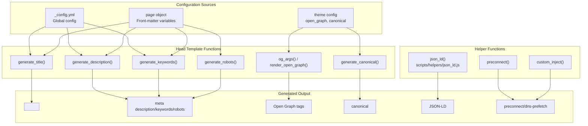
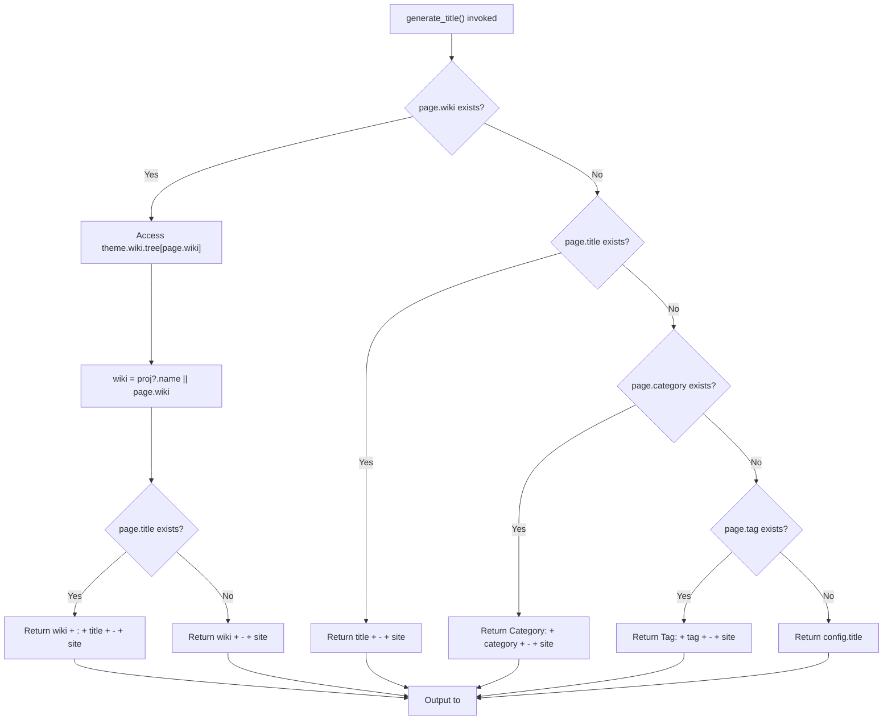
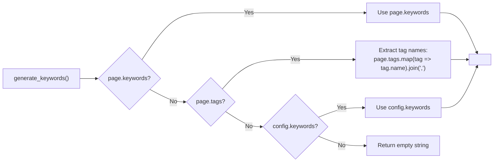
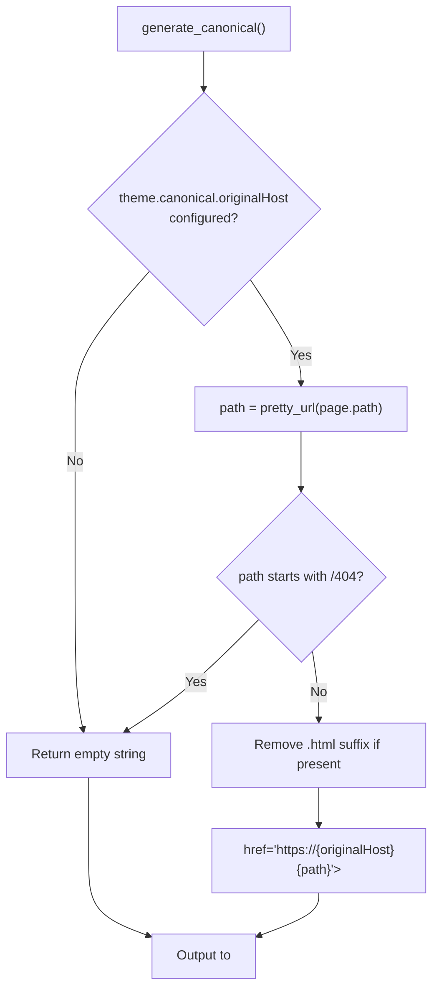
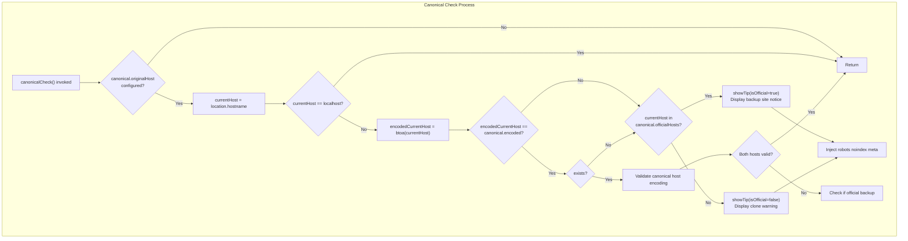
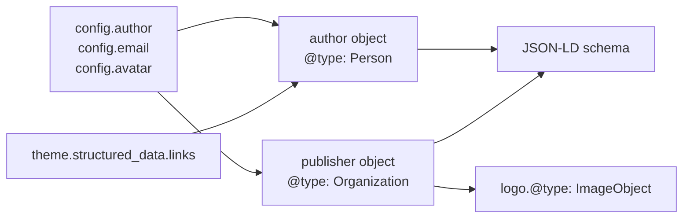
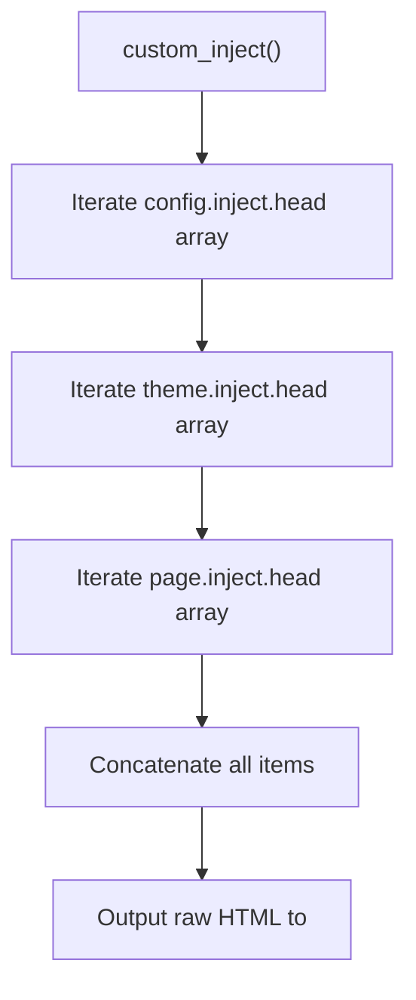
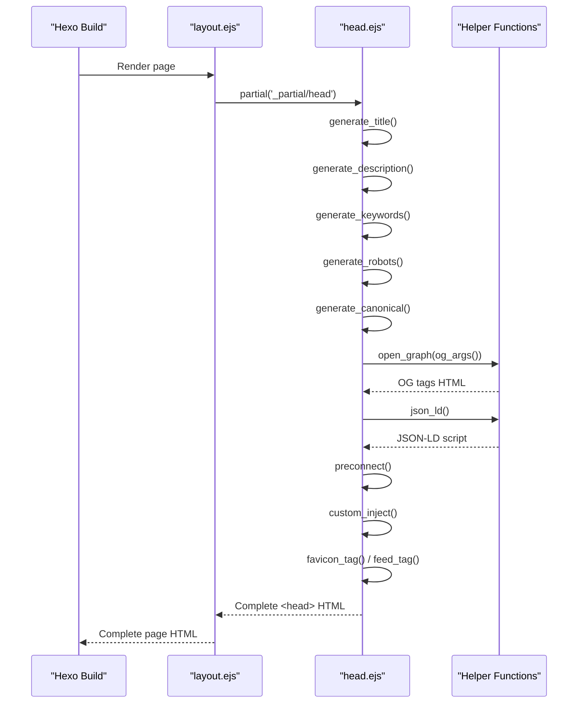

# HTML Head 与 SEO 元数据

<details>
<summary>相关源码文件</summary>

生成此页面时参考的主题源码文件：

- [layout/_partial/head.ejs](../../../layout/_partial/head.ejs)
- [layout/_partial/scripts/defines.ejs](../../../layout/_partial/scripts/defines.ejs)
- [layout/layout.ejs](../../../layout/layout.ejs)
- [scripts/helpers/json_ld.js](../../../scripts/helpers/json_ld.js)
- [source/js/main.js](../../../source/js/main.js)

</details>

本文介绍 Stellar 的 HTML `<head>` 生成与 SEO 元数据系统：meta 标签、Open Graph 协议、JSON-LD 结构化数据、规范链接（canonical URL）处理与克隆站检测。整体页面布局结构见[页面模板与路由](page-templates-routing.md)。

## 系统概览

HTML head 生成系统实现在 [layout/_partial/head.ejs](../../../layout/_partial/head.ejs)，为搜索引擎、社交平台与浏览器生成全部元数据：

- 带上下文感知的动态页面标题
- 来自页面内容或 wiki 项目元数据的 meta 描述
- 来自标签或 front-matter 的关键词
- 控制收录的 robots 指令
- 社交分享的 Open Graph 标签
- 带克隆站检测的规范链接
- 富搜索结果用的 JSON-LD 结构化数据
- 性能优化提示（preconnect、DNS 预取）

**参考源码**：[layout/_partial/head.ejs](../../../layout/_partial/head.ejs)、[layout/layout.ejs](../../../layout/layout.ejs)

## Head 生成架构



**参考源码**：[layout/_partial/head.ejs](../../../layout/_partial/head.ejs)

## 标题生成系统

`generate_title()` 按页面类型生成层级化标题：

| 页面类型 | 标题格式 | 示例 |
|----------|----------|------|
| 有标题的 wiki 页面 | `{wiki} : {title} - {site}` | `Stellar : Configuration - My Site` |
| wiki 首页 | `{wiki} - {site}` | `Stellar - My Site` |
| 标准页面 | `{title} - {site}` | `About - My Site` |
| 分类归档 | `Category : {category} - {site}` | `Category : Tech - My Site` |
| 标签归档 | `Tag : {tag} - {site}` | `Tag : Hexo - My Site` |
| 首页 | `{site}` | `My Site` |

函数使用 i18n 本地化符号（`__('symbol.colon')`），并从 `theme.wiki.tree[page.wiki]` 读取 wiki 项目名。

**实现流程：**



**参考源码**：[layout/_partial/head.ejs](../../../layout/_partial/head.ejs)

## Meta 描述与关键词

### 描述生成

`generate_description()` 按优先级级联：

1. **Open Graph 启用时跳过**：`theme.open_graph.enable` 为 true 时返回空（由 OG 标签处理描述）
2. **页面级描述**：`page.description`（截断至 150 字符）
3. **Wiki 项目描述**：有 `theme.wiki.tree[page.wiki].description` 时使用（项目级兜底，正文为空的远程 README 主页也适用）
4. **页面摘要**：`page.excerpt`、截断的 `page.content`（150 字符）
5. **兜底**：`config.description`

内容经 `strip_html()` 与 `truncate()` 处理，去除 HTML 标签并限制长度。

**参考源码**：[layout/_partial/head.ejs](../../../layout/_partial/head.ejs)

> 说明：站点启用 Open Graph（`open_graph.enable: true`，默认配置）时，实际生效的 `<meta name="description">` 由 `og_args()` 传入 Hexo 内置 `open_graph()` helper 生成，级联语义与上述一致：页面级 `page.description` / `page.open_graph.description` 优先，其次 wiki 项目描述，最后页面摘要与站点默认描述。

### 关键词生成

`generate_keywords()` 从多个来源聚合关键词：



**参考源码**：[layout/_partial/head.ejs](../../../layout/_partial/head.ejs)

## Robots Meta 标签

`generate_robots()` 控制搜索引擎收录行为：

| 条件 | Robots 指令 | 用途 |
|------|-------------|------|
| `IS_BACKUP=true` 环境变量 | `noindex, nofollow` | 防止备用站被收录 |
| 首页（`is_home()`） | 无 | 允许收录 |
| 定义了 `page.robots` | 自定义值 | 页面级控制 |

与规范链接系统配合，避免备份/镜像站的重复内容惩罚。

**参考源码**：[layout/_partial/head.ejs](../../../layout/_partial/head.ejs)

## Open Graph 协议集成

`og_args()` 准备 Hexo 内置 `open_graph()` 辅助函数的参数：

```javascript
{
  twitter_id: theme.open_graph.twitter_id,
  twitter_card: 'summary_large_image',  // 仅 post 且有 cover 时
  image: config.avatar || (config.email ? gravatar(config.email) : null),
  ...page.open_graph  // 页面级覆盖
}
```

`theme.open_graph.enable` 为 true 时生成 OG 标签，并对 `og:title`、`og:site_name`、`twitter:title` 做主题定制替换（经 `generate_og_title()` / `generate_og_site_name()` 转义处理）。

`og_args()` 还会在 `page.wiki` 存在且页面未显式设置 `page.description` 时，把 wiki 项目 YAML 的 `description` 传入 `description`，使 `<meta name="description">` 与 `og:description` 使用项目描述；`page.open_graph.description` 仍可经 front-matter 覆盖。

**参考源码**：[layout/_partial/head.ejs](../../../layout/_partial/head.ejs)

## 规范链接（Canonical URL）系统

### 服务端生成

`generate_canonical()` 生成规范链接标签：



**参考源码**：[layout/_partial/head.ejs](../../../layout/_partial/head.ejs)

### 客户端校验与克隆站检测

`window.canonical` 在 [layout/_partial/scripts/defines.ejs](../../../layout/_partial/scripts/defines.ejs) 中构建：`encoded` 是 `originalHost` 的 base64 编码，`param` 含 `permalink` 与 `checklink`（取自 `theme.data_services.video.js`）。

`init.canonicalCheck()`（[source/js/main.js](../../../source/js/main.js)）实现克隆检测：



校验用 base64 编码的主机名比较防止篡改：`btoa(hostname)` 与预配置的 `canonical.encoded` 比对。克隆站显示警告并注入 `noindex` meta；备用站显示官方提示。

**参考源码**：[source/js/main.js](../../../source/js/main.js)、[layout/_partial/scripts/defines.ejs](../../../layout/_partial/scripts/defines.ejs)

### 克隆检测配置

`_config.yml` 中的 `canonical` 小节：

```yaml
canonical:
  originalHost: 'example.com'   # 主站域名主机
  officialHosts:                # 官方备用主机列表
    - 'backup.example.com'
```

**参考源码**：[_config.yml](../../../_config.yml)

## JSON-LD 结构化数据

`json_ld()` 辅助函数（[scripts/helpers/json_ld.js](../../../scripts/helpers/json_ld.js)）按页面类型生成 Schema.org 结构化数据。

### BlogPosting Schema（文章）

```json
{
  "@context": "https://schema.org",
  "@type": "BlogPosting",
  "author": { "@type": "Person", "name": "..." },
  "dateCreated": "2024-01-01T00:00:00Z",
  "dateModified": "2024-01-02T00:00:00Z",
  "datePublished": "2024-01-01T00:00:00Z",
  "description": "...",
  "headline": "...",
  "mainEntityOfPage": { "@type": "WebPage", "@id": "..." },
  "publisher": { "@type": "Organization", "logo": {...} },
  "keywords": "tag1, tag2, tag3",
  "thumbnailUrl": "...",
  "image": ["cover.jpg", "photo1.jpg"]
}
```

**条件**：`this.is_post()` 为 true

**图片来源优先级**：封面（cover）→ 横幅（banner）→ 相册（photos）

**参考源码**：[scripts/helpers/json_ld.js](../../../scripts/helpers/json_ld.js)

### Website Schema（页面与首页）

```json
{
  "@context": "https://schema.org",
  "@type": "Website",
  "@id": "https://example.com/",
  "author": { "@type": "Person", "name": "..." },
  "name": "Site Title",
  "description": "Site description",
  "url": "https://example.com/",
  "keywords": "..."
}
```

**条件**：`page.layout == 'page'` 或 `this.is_home()`

**描述优先级**：page.description → page.excerpt → wiki 项目 description → 截断内容（200 字符）

**参考源码**：[scripts/helpers/json_ld.js](../../../scripts/helpers/json_ld.js)

### 作者与发布者对象

两种 schema 都包含来自站点配置的作者与发布者信息：



**参考源码**：[scripts/helpers/json_ld.js](../../../scripts/helpers/json_ld.js)

## 性能优化提示

### Preconnect 链接

`preconnect()` 为频繁访问的外部来源生成 `<link rel="preconnect">`：

```html
<link rel="preconnect" href="https://cdn.example.com" crossorigin>
```

**配置**：`_config.yml` 的 `preconnect` 数组。

**参考源码**：[layout/_partial/head.ejs](../../../layout/_partial/head.ejs)

### DNS 预取控制

head 模板包含 DNS 预取控制：

```html
<meta http-equiv='x-dns-prefetch-control' content='on' />
```

与 preconnect 配合优化资源加载性能。

**参考源码**：[layout/_partial/head.ejs](../../../layout/_partial/head.ejs)

## 自定义注入系统

`custom_inject()` 提供三个 head 注入点：



**优先级：**

1. 全局 Hexo 配置（`config.inject.head`）
2. 主题配置（`theme.inject.head`）
3. 页面 front-matter（`page.inject.head`）

无需修改主题模板即可注入自定义 meta、分析脚本或 CSS。

**参考源码**：[layout/_partial/head.ejs](../../../layout/_partial/head.ejs)

## 浏览器兼容 Meta 标签

| Meta 标签 | 用途 |
|-----------|------|
| `<meta charset="utf-8">` | 字符编码声明 |
| `<meta name="renderer" content="webkit">` | 双核浏览器强制 WebKit 渲染 |
| `<meta http-equiv="X-UA-Compatible" content="IE=Edge,chrome=1">` | 强制最新 IE 渲染引擎 |
| `<meta name="HandheldFriendly" content="True">` | 旧设备的移动友好信号 |
| `<meta name="mobile-web-app-capable" content="yes">` | PWA 能力指示 |
| `<meta name="viewport" content="width=device-width, initial-scale=1, maximum-scale=1">` | 响应式视口配置 |

**主题颜色 meta：**

```html
<meta name="theme-color" media="(prefers-color-scheme: dark)" content="#000">
<meta name="theme-color" content="#f9fafb">
```

定义深浅模式的浏览器 UI 颜色。

**参考源码**：[layout/_partial/head.ejs](../../../layout/_partial/head.ejs)

## 页面导航与元数据

主题使用普通整页导航（PJAX 已于 v1.35.0 移除），每次导航整页刷新，head 元数据始终重新生成，无需 PJAX 式的部分更新逻辑。

**参考源码**：[layout/_partial/head.ejs](../../../layout/_partial/head.ejs)

## Head 模板执行流程



**参考源码**：[layout/layout.ejs](../../../layout/layout.ejs)、[layout/_partial/head.ejs](../../../layout/_partial/head.ejs)

## 配置参考

### 主题配置（_config.yml）

```yaml
# Open Graph 设置
open_graph:
  enable: true
  twitter_id: '@username'

# 规范链接与克隆站检测
canonical:
  originalHost: 'example.com'
  officialHosts:
    - 'backup.example.com'

# 结构化数据
structured_data:
  links:
    - 'https://twitter.com/username'
    - 'https://github.com/username'

# 性能提示
preconnect:
  - 'https://cdn.jsdelivr.net'
  - 'https://fonts.googleapis.com'

# 自定义 head 注入
inject:
  head:
    - '<meta name="custom" content="value">'
```

### 页面 Front-Matter

```yaml
---
title: "Page Title"
description: "Custom description for this page"
keywords: "keyword1, keyword2, keyword3"
robots: "noindex, nofollow"  # 自定义 robots 指令
open_graph:
  type: article
  image: /image.jpg
inject:
  head:
    - '<link rel="alternate" href="/page.xml" type="application/rss+xml">'
---
```

**参考源码**：[layout/_partial/head.ejs](../../../layout/_partial/head.ejs)

## 环境变量

| 变量 | 效果 | 用法 |
|------|------|------|
| `IS_BACKUP=true` | 添加 `noindex, nofollow` robots meta | 备用站部署时防止重复收录 |

构建时设置：`IS_BACKUP=true hexo generate`

**参考源码**：[layout/_partial/head.ejs](../../../layout/_partial/head.ejs)
