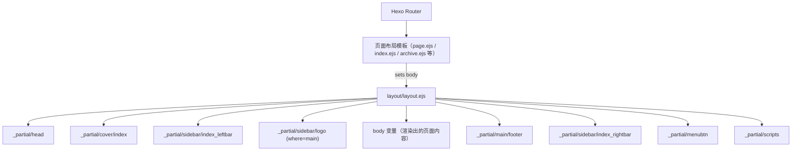
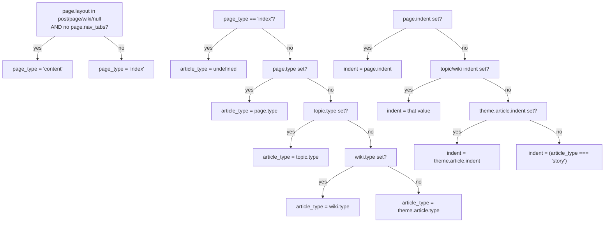
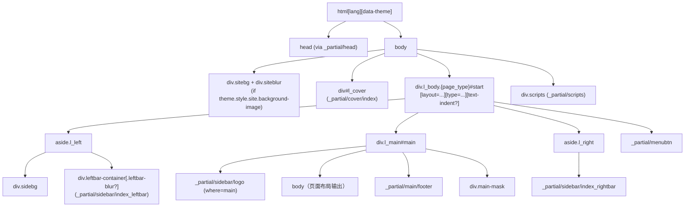

# 布局系统

<details>
<summary>相关源码文件</summary>

生成此页面时参考的主题源码文件：

- [layout/layout.ejs](../../../layout/layout.ejs)
- [layout/_partial/scripts/lazyload.ejs](../../../layout/_partial/scripts/lazyload.ejs)
- [layout/_partial/sidebar/logo.ejs](../../../layout/_partial/sidebar/logo.ejs)
- [layout/_partial/cover/index.ejs](../../../layout/_partial/cover/index.ejs)
- [layout/_partial/sidebar/index_leftbar.ejs](../../../layout/_partial/sidebar/index_leftbar.ejs)
- [layout/_partial/sidebar/index_rightbar.ejs](../../../layout/_partial/sidebar/index_rightbar.ejs)
- [layout/_partial/menubtn.ejs](../../../layout/_partial/menubtn.ejs)
- [layout/_partial/scripts/utils.ejs](../../../layout/_partial/scripts/utils.ejs)
- [scripts/helpers/json_ld.js](../../../scripts/helpers/json_ld.js)

</details>

本页说明 `layout.ejs` 如何作为根模板，如何从 partial 组装页面骨架，以及三栏 `l_body` 网格如何组织左栏、主内容区与右栏。

布局选择逻辑与各页面类型模板见[页面模板与路由](page-templates-routing.md)；侧边栏小部件配置与渲染见[侧边栏系统](sidebar-system.md)；Logo、导航栏与页头渲染见[Logo、导航与页头](logo-navigation-headers.md)；`<head>` 与 SEO 元数据见[HTML Head 与 SEO 元数据](head-seo.md)。

## 模板架构概览

所有渲染出的 HTML 页面都经过 `layout.ejs`。Hexo 的模板继承机制把匹配到的页面布局输出放入 `body` 变量，`layout.ejs` 再把它嵌入 `l_main` 内容区。

**layout.ejs 中的页面组装流程：**



**参考源码**：[layout/layout.ejs](../../../layout/layout.ejs)

## 页面类型布局

`layout.ejs` 包裹所有页面类型。Hexo 匹配到的页面布局模板（如 `page.ejs`、`index.ejs`、`archive.ejs` 等）生成 `body` 内容，注入 `l_main`：

| 布局 | `page.layout` 值 | 主要用途 |
|---|---|---|
| `layout/page.ejs` | `page` 或 `null` | 通用页面、自定义布局 |
| `layout/index.ejs` | （首页） | 文章卡片列表 |
| `layout/archive.ejs`、`tags.ejs`、`categories.ejs` 等 | 归档/标签/分类 | 列表页 |

注意：主题**没有** `post.ejs` / `wiki.ejs` 独立文件；post、wiki、topic、note 等内容页面由 `layout.ejs` 根据 `page.layout` 值内联区分（结合 `_partial` 组件与 `site_tree` 配置）。

**参考源码**：[layout/layout.ejs](../../../layout/layout.ejs)

## layout.ejs 中的计算变量

构建 HTML 前，`layout.ejs` 计算三个控制页面结构与 CSS 类的变量。

### `page_type`

决定页面是列表/索引页还是单内容页。

```
page_type = 'content'
  如果 page.layout 属于 ['post', 'page', 'wiki', null]
    且未设置 page.nav_tabs

page_type = 'index'
  否则
```

该值作为 CSS 类写在 `l_body` 上，如 `<div class="l_body content">` 或 `<div class="l_body index">`。

**参考源码**：[layout/layout.ejs](../../../layout/layout.ejs)

### `article_type`

控制正文排版，驱动 `l_body` 的 `type` HTML 属性。

解析顺序（先命中者优先）：

| 优先级 | 来源 |
|--------|------|
| 1 | `page.type`（front matter） |
| 2 | `theme.topic.tree[page.topic].type` |
| 3 | `theme.wiki.tree[page.wiki].type` |
| 4 | `theme.article.type`（全局默认） |
| — | 列表页为 `undefined` |

最终值写为 `.l_body` 上的 `type="{article_type}"`。最值得关注的值是 `"story"`，启用文学/缩进风格排版。

**参考源码**：[layout/layout.ejs](../../../layout/layout.ejs)

### `indent`

布尔值，为 `.l_body` 添加 `text-indent` 属性，启用故事类文章的 CSS 首行缩进。

解析顺序（先命中者优先）：

| 优先级 | 来源 |
|--------|------|
| 1 | `page.indent`（front matter） |
| 2 | `theme.topic.tree[page.topic].indent` |
| 3 | `theme.wiki.tree[page.wiki].indent` |
| 4 | `theme.article.indent` |
| 5 | `article_type === 'story'`（自动推导） |

**变量解析总结：**



**参考源码**：[layout/layout.ejs](../../../layout/layout.ejs)

## 三栏网格：`l_body`

外层容器 `<div class="l_body">` 是 CSS 三栏网格，其子元素映射到样式表使用的 CSS 选择器。

**layout.ejs 生成的 HTML 骨架：**



**参考源码**：[layout/layout.ejs](../../../layout/layout.ejs)

### 网格列元素

| CSS 选择器 | HTML 元素 | 角色 |
|---|---|---|
| `.l_body` | `<div class="l_body {page_type}" id="start">` | 三栏网格容器；接收计算出的类与属性 |
| `.l_left` | `<aside class="l_left[.leftbar-card?]">` | 左栏；`style.leftbar.ui-style: card` 时追加 `leftbar-card` 类 |
| `.l_main` | `<div class="l_main" id="main">` | 中央内容列 |
| `.l_right` | `<aside class="l_right">` | 右栏 |
| `#l_cover` | `<div id="l_cover">` | 网格上方的全宽封面区 |
| `.leftbar-container` | `.l_left` 内 | 包裹侧边栏小部件；`theme.style.leftbar.blur` 为 true 时加 `.leftbar-blur` 类 |
| `.sidebg` | `.l_left` 首个子元素 | 背景装饰元素 |
| `.main-mask` | `.l_main` 内 | 移动端点击关闭侧边栏的遮罩（`onclick="sidebar.dismiss()"`） |

**参考源码**：[layout/layout.ejs](../../../layout/layout.ejs)

### `l_body` HTML 属性

`l_body` 元素携带供 CSS 规则与 JavaScript 消费的数据属性：

| 属性 | 值 | 用途 |
|---|---|---|
| `class` | `"l_body index"` 或 `"l_body content"` | 控制布局专属 CSS 规则 |
| `id` | `"start"` | 滚动定位目标 |
| `layout` | `page.layout` 的值 | 供 CSS/JS 做布局专属样式 |
| `type` | 解析后的 `article_type` | 触发正文专属 CSS（如 story 模式） |
| `text-indent` | `indent === true` 时存在 | 为故事类内容启用首行缩进 CSS |

**参考源码**：[layout/layout.ejs](../../../layout/layout.ejs)

### 左栏模糊效果

`theme.style.leftbar.blur` 为 `true` 时，`.leftbar-container` 追加 `leftbar-blur` 类，为左栏背景启用磨砂玻璃 CSS 效果。

**参考源码**：[layout/layout.ejs](../../../layout/layout.ejs)

### 左栏风格（ui-style）

`style.leftbar.ui-style` 控制左栏外观：`glass`（默认历史行为，背景图 + 磨砂玻璃效果）不追加额外类；`card` 时 `.l_left` 追加 `leftbar-card` 类，配合 `sidebar.styl` 呈现纯色卡片 + 中间阴影。配置默认值为 `card`。

**参考源码**：[layout/layout.ejs](../../../layout/layout.ejs)、[source/css/_components/sidebar/sidebar.styl](../../../source/css/_components/sidebar/sidebar.styl)

## layout.ejs 引入的 Partials

以下是 `layout.ejs` 直接调用的 partial，各自在后续页面有专属章节：

| Partial 路径 | 渲染位置 | 说明 |
|---|---|---|
| `_partial/head` | `<html>` 内、`<body>` 前 | `<head>` 标签：meta、CSS、SEO——见[HTML Head 与 SEO 元数据](head-seo.md) |
| `_partial/cover/index` | `#l_cover` 内 | 网格上方的封面/横幅组件 |
| `_partial/sidebar/index_leftbar` | `.l_left > .leftbar-container` 内 | 左栏小部件——见[侧边栏系统](sidebar-system.md) |
| `_partial/sidebar/logo` | `.l_main` 第一项，`where='main'` | 移动端显示的 Logo/页头——见[Logo、导航与页头](logo-navigation-headers.md) |
| `_partial/main/footer` | `.l_main` 中 `body` 之后 | 页面页脚 |
| `_partial/sidebar/index_rightbar` | `.l_right` 内 | 右栏小部件——见[侧边栏系统](sidebar-system.md) |
| `_partial/menubtn` | `.l_body` 内、侧栏之后 | 移动端浮动侧边栏开关按钮 |
| `_partial/scripts` | `div.scripts` 内 | JS 引入与内联初始化脚本 |

**参考源码**：[layout/layout.ejs](../../../layout/layout.ejs)

## 深色模式与 `data-theme`

`theme.style.prefers_theme` 不是 `'auto'` 时，`<html>` 元素接收 `data-theme` 属性：

- `prefers_theme === 'auto'`：`<html lang="...">`——由浏览器 `prefers-color-scheme` 媒体查询控制深浅
- 其他值：`<html lang="..." data-theme="{prefers_theme}">`——强制指定主题

**参考源码**：[layout/layout.ejs](../../../layout/layout.ejs)

## 页面导航机制

主题使用普通整页导航（PJAX 已于 v1.35.0 移除，旧的 `page-loading-bar` 元素与 `pjax.js` 一并删除，见 `docs/designs/2026-08-08-pjax-removal.md`）。可选的 `plugins.preload`（flying_pages）在鼠标悬停时预加载站内链接以提升导航体验。

**参考源码**：[layout/layout.ejs](../../../layout/layout.ejs)、[_config.yml](../../../_config.yml)（`plugins.preload` 小节）

## 模板上下文变量

布局系统中的 EJS 模板可访问以下上下文变量：

| 变量 | 类型 | 说明 |
|---|---|---|
| `page` | Object | 当前页面 front matter 与渲染内容 |
| `theme` | Object | 来自 `_config.yml` 的主题配置（`theme.article`、`theme.wiki` 等） |
| `config` | Object | Hexo 站点配置（`config.title`、`config.url` 等） |
| `body` | String | 页面布局模板输出的 HTML 字符串；注入 `.l_main` |
| `is_home()` | Function | 首页返回 true |
| `is_post()` | Function | 文章页返回 true |
| `partial(path, data?)` | Function | 引入 partial 模板，可带数据 |
| `__('key')` | Function | 本地化查询——见[本地化](../08-本地化/localization.md) |
| `url_for(path)` | Function | 生成站点根相对 URL |

**参考源码**：[layout/layout.ejs](../../../layout/layout.ejs)

## 与其他系统的集成

布局系统与以下主题子系统集成：

- **配置系统**（[配置系统](../00-总览与安装配置/configuration.md)）：读取 `site_tree` 与插件设置，决定组件包含
- **侧边栏系统**（[侧边栏系统](sidebar-system.md)）：按页面类型配置渲染左右栏
- **导航与页头**（[Logo、导航与页头](logo-navigation-headers.md)）：引入导航栏与面包屑 partial
- **标签插件**（[标签插件](../04-标签插件/tag-plugins-overview.md)）：处理页面内容中的自定义标签语法
- **前端交互**（[前端交互](../05-前端交互/client-side-overview.md)）：为 JavaScript 初始化提供数据属性与结构
- **样式系统**（[样式系统](../01-样式系统/styling-overview.md)）：应用引用 Stylus 生成样式的 CSS 类

布局系统是组装层，把内容、配置与表现整合起来生成最终 HTML 页面。

**参考源码**：[layout/layout.ejs](../../../layout/layout.ejs)、[_config.yml](../../../_config.yml)（`site_tree` 小节）
