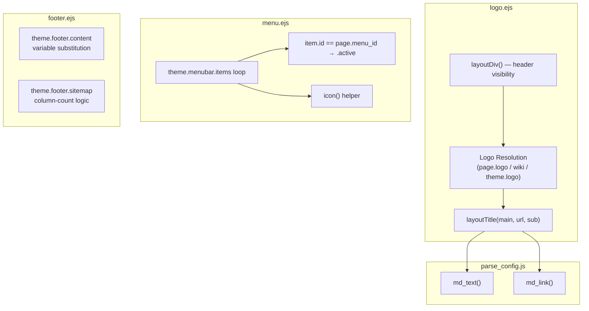
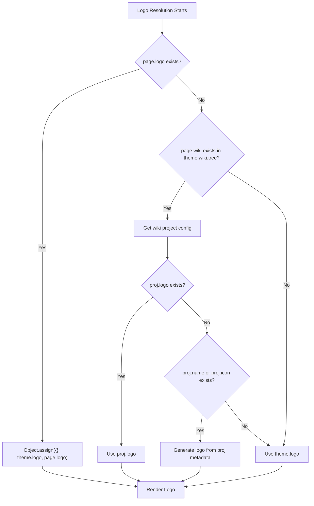
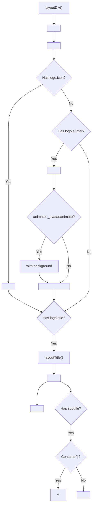
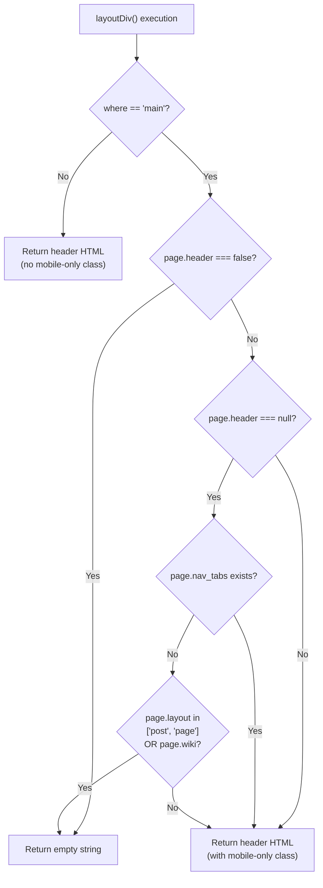
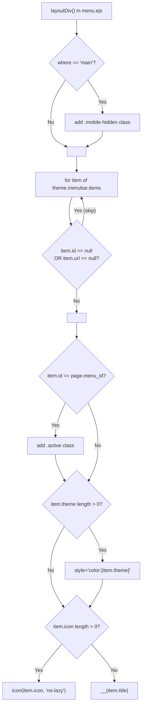
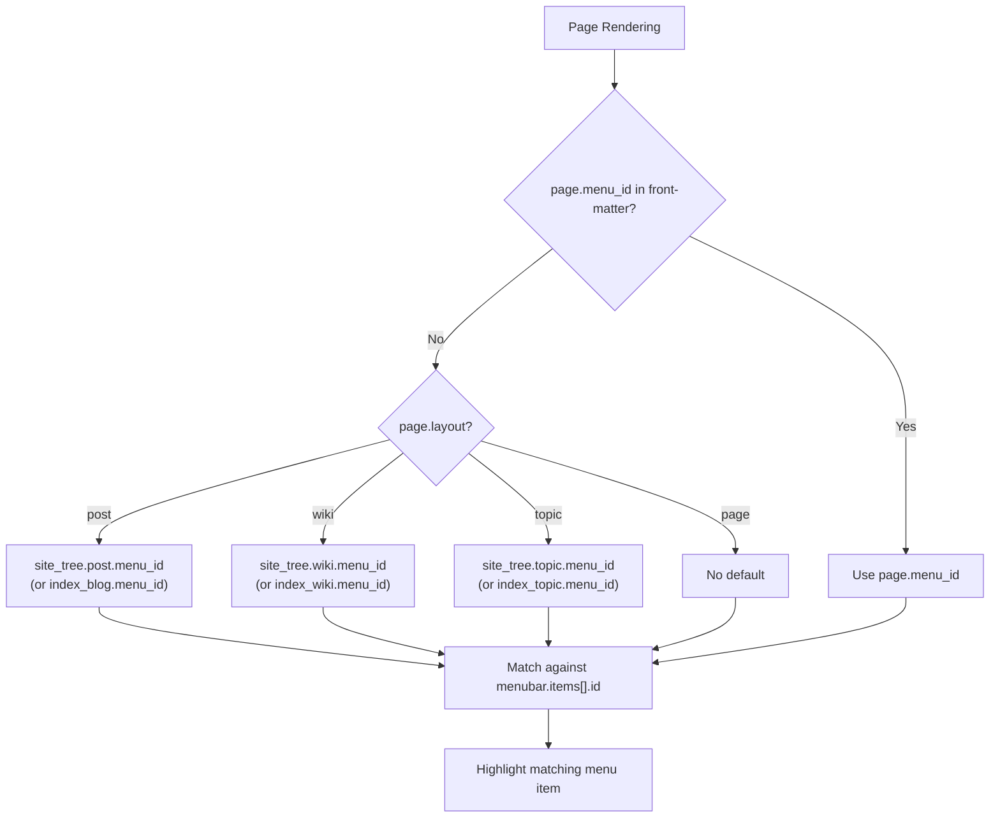
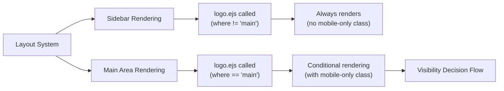
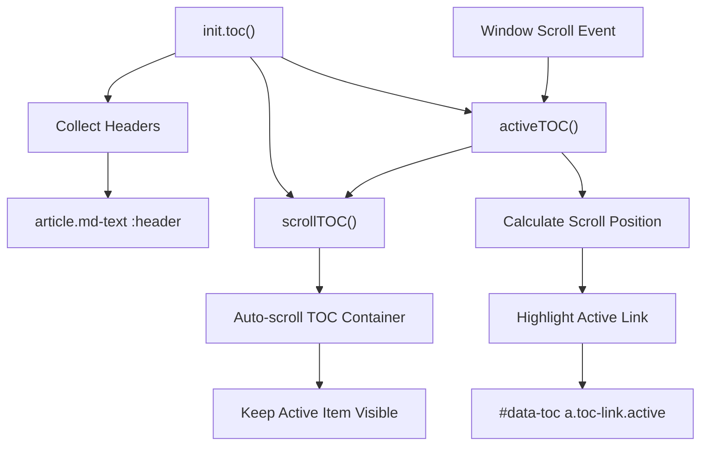
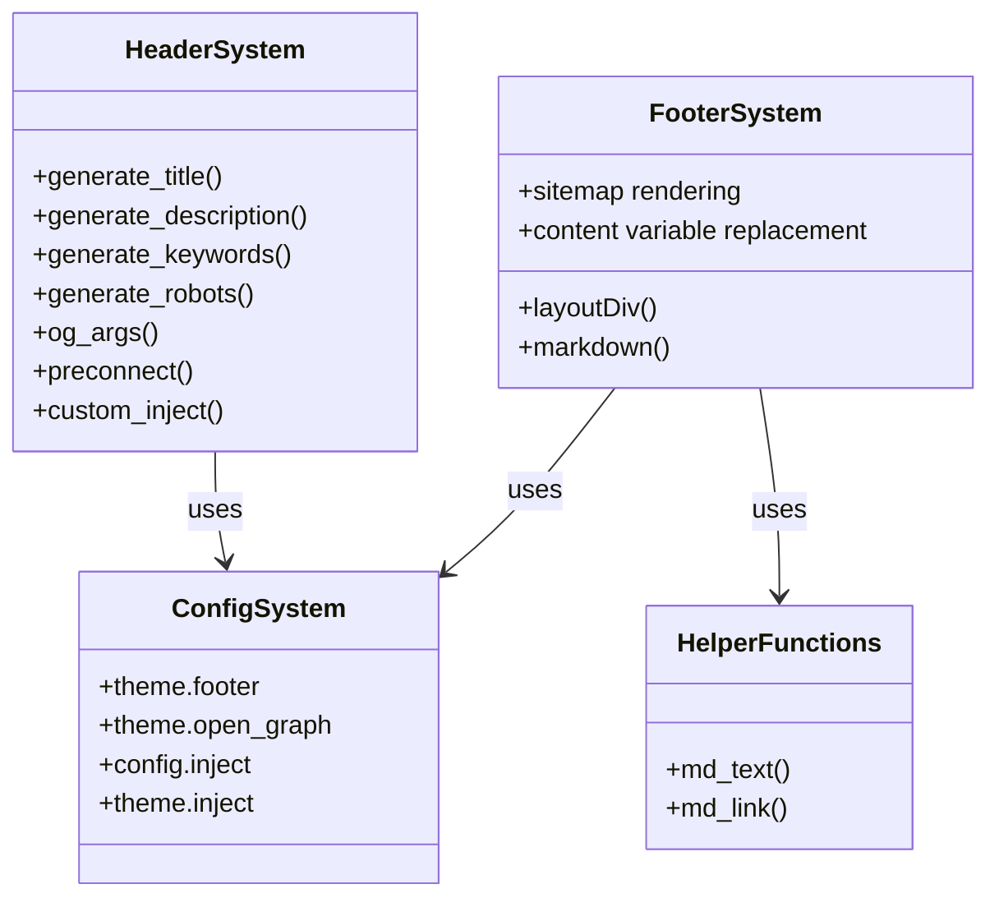

# Logo、导航与页头

<details>
<summary>相关源码文件</summary>

生成此页面时参考的主题源码文件：

- [layout/_partial/sidebar/logo.ejs](../../../layout/_partial/sidebar/logo.ejs)
- [layout/_partial/sidebar/menu.ejs](../../../layout/_partial/sidebar/menu.ejs)
- [layout/_partial/main/footer.ejs](../../../layout/_partial/main/footer.ejs)
- [scripts/helpers/parse_config.js](../../../scripts/helpers/parse_config.js)
- [scripts/helpers/icon.js](../../../scripts/helpers/icon.js)
- [source/css/_components/partial/navbar.styl](../../../source/css/_components/partial/navbar.styl)
- [source/js/main.js](../../../source/js/main.js)

</details>

本文详述 Stellar 的 Logo 解析系统、导航菜单结构与页头条件渲染。这涵盖侧边栏与页面顶部出现的品牌与导航元素，区别于第 3.4 页介绍的 HTML `<head>` 元数据。

## 1. 系统概览

Logo 与导航系统由 `layout/_partial/` 下的四个 EJS partial 组件构成。

**组件与文件映射：**

| 组件 | 文件 | 关键函数 |
|------|------|----------|
| Logo 与页头 | `layout/_partial/sidebar/logo.ejs` | `layoutDiv()`、`layoutTitle()` |
| 导航菜单 | `layout/_partial/sidebar/menu.ejs` | `layoutDiv()` |
| 页面页脚 | `layout/_partial/main/footer.ejs` | `layoutDiv()` |
| 解析辅助 | `scripts/helpers/parse_config.js` | `md_text()`、`md_link()` |

**组件交互图**



**参考源码**：[layout/_partial/sidebar/logo.ejs](../../../layout/_partial/sidebar/logo.ejs)、[layout/_partial/sidebar/menu.ejs](../../../layout/_partial/sidebar/menu.ejs)、[layout/_partial/main/footer.ejs](../../../layout/_partial/main/footer.ejs)、[scripts/helpers/parse_config.js](../../../scripts/helpers/parse_config.js)

## 2. Logo 解析系统

Logo 系统按层级解析决定显示哪个品牌。Logo 配置对象包含 `avatar`、`title`、`subtitle` 与可选 `icon` 字段。

### 2.1 Logo 解析层级

**Logo 解析流程**



**解析优先级表：**

| 优先级 | 来源 | 配置路径 | 触发条件 |
|--------|------|----------|----------|
| 1（最高） | 页面覆盖 | front-matter 的 `page.logo` | 定义了 `page.logo` |
| 2 | wiki 项目 | `theme.wiki.tree[page.wiki].logo` | 页面有 `wiki` 属性且项目配置存在 |
| 3（最低） | 全局主题 | `theme.logo` | 默认兜底 |

**Wiki 项目 Logo 自动生成：**

wiki 项目没有显式 `logo` 配置但有 `name` 或 `icon` 时，系统自动生成 Logo 对象：

```yaml
# 生成的 logo 结构
logo:
  icon: proj.icon || theme.default.project
  title: '[${proj.name || proj.title}](${proj.homepage.path})'
  subtitle: proj.subtitle
```

**参考源码**：[layout/_partial/sidebar/logo.ejs](../../../layout/_partial/sidebar/logo.ejs)

### 2.2 Logo 配置结构

**全局 Logo 配置**（`_config.yml`）：

| 字段 | 类型 | 说明 | 示例 |
|------|------|------|------|
| `avatar` | String | 头像图片 URL，可带链接语法 | `'[{config.avatar}](/about/)'` |
| `title` | String | 主标题，可带链接语法 | `'[{config.title}](/)'` |
| `subtitle` | String | 副标题，支持 `|` 悬停效果 | `'{config.subtitle}'` 或 `'Text1 \| Text2'` |

**变量替换：**

- `{config.avatar}`：替换为 Hexo 配置中的站点头像
- `{config.title}`：替换为 Hexo 配置中的站点标题
- `{config.subtitle}`：替换为 Hexo 配置中的站点副标题

**Markdown 链接语法：**

标题与头像字段支持 `[text](url)` 语法：`md_text()` 提取文本部分，`md_link()` 提取 URL 部分。

**参考源码**：[_config.yml](../../../_config.yml)

### 2.3 页头渲染结构

`layoutDiv()` 生成页头的 HTML 结构：

**页头组件结构**



**组件细节：**

1. **图标显示**：用 `logo.icon`，渲染为 ``
2. **头像显示**：用 `logo.avatar`，可选带动画背景
3. **标题区**：由 `layoutTitle(main, url, sub)` 辅助函数生成
4. **副标题悬停效果**：按 `|` 拆分，产生 normal/hover 两种状态

**参考源码**：[layout/_partial/sidebar/logo.ejs](../../../layout/_partial/sidebar/logo.ejs)

### 2.4 页头可见性控制

**页头可见性决策流程**



**可见性规则：**

| 条件 | 结果 | 适用 |
|------|------|------|
| `page.header === false` | 始终隐藏 | 显式设为 false 的页面 |
| `page.header` 为真值 | 始终显示 | 显式设为 true/对象的页面 |
| `where !== 'main'` | 始终显示 | 侧边栏渲染上下文 |
| 存在 `page.nav_tabs` | 主区显示（mobile-only） | 带标签的列表页 |
| `page.layout` 属于 `['post', 'page']` 或有 `page.wiki` | 主区隐藏 | 无 nav_tabs 的内容页 |
| 默认（列表页） | 主区显示（mobile-only） | 索引/归档页 |

**移动端显示：**

主内容区渲染（`where == 'main'`）时页头带 `mobile-only` 类，仅移动端可见；侧边栏版本（单独渲染）在桌面显示。

**参考源码**：[layout/_partial/sidebar/logo.ejs](../../../layout/_partial/sidebar/logo.ejs)

### 2.5 动态头像

**配置：**

```yaml
style:
  gradient:
    avatar: 'conic-gradient(from 0deg, #04f3ff, #08ffc6, #ddf730, #ffbd19, #ff1fe0, #c418ff, #3b5bff, #04f3ff)' # 头像旋转光环的渐变色（彩虹，首尾同色保证旋转无缝）
  animated_avatar:
    animate: auto  # auto, always, or false
```

**渲染逻辑：**

`theme.style.animated_avatar.animate` 启用且存在 `logo.avatar` 时，系统渲染：

1. 背景层 `<div class="bg">`（初始 `opacity: 0`，背景为 `style.gradient.avatar` 定义的 CSS 锥形渐变，不依赖外部图片）
2. 头像图片 ``
3. CSS 动画控制悬停/交互时的背景可见性

`animate` 取值控制动画时机：`auto` 用户交互时动画、`always` 持续动画、假值不动画。光环通过 `@keyframes spin` 以 4s 匀速旋转，渐变色首尾相同保证旋转无缝。

**参考源码**：[layout/_partial/sidebar/logo.ejs](../../../layout/_partial/sidebar/logo.ejs)、[source/css/_components/sidebar/logo.styl](../../../source/css/_components/sidebar/logo.styl)

### 2.6 Logo 辅助函数

**`layoutTitle(main, url, sub)`：**

| 参数 | 类型 | 说明 |
|------|------|------|
| `main` | String | 主标题文本（已由 `md_text()` 处理） |
| `url` | String | 链接 URL（已由 `md_link()` 处理） |
| `sub` | String | 可选副标题文本 |

**副标题处理：**

两种显示模式：

1. **单一副标题**：无 `|` 时渲染为单个 `<div class="sub cap">`
2. **悬停效果**：含 `|` 时拆分——
   - 常态：第一段 `class="sub normal cap"`
   - 悬停：其余段 `class="sub hover cap" style="opacity:0"`

示例：`'Main Text | Hover Text'` 创建两个 div，鼠标悬停时显示悬停文本。

**参考源码**：[layout/_partial/sidebar/logo.ejs](../../../layout/_partial/sidebar/logo.ejs)

## 3. 导航菜单栏系统

菜单栏是侧边栏中的主要导航界面，实现在 `layout/_partial/sidebar/menu.ejs`。它遍历 `theme.menubar.items`，把每一项渲染为 `<nav>` 锚元素。

### 3.1 菜单栏渲染

**menu.ejs `layoutDiv()` 渲染逻辑**



**菜单项字段：**

| 字段 | 类型 | 必填 | 说明 |
|------|------|------|------|
| `id` | String | 是 | 与 `page.menu_id` 匹配以设置 `.active` 类 |
| `url` | String | 是 | 目标 URL，经 `pretty_url()` 处理 |
| `title` | String | 是 | 显示文本；无图标时经 `__()` 本地化 |
| `icon` | String | 否 | `icons.yml` 中的图标键，经 `icon()` 渲染 |
| `theme` | String | 否 | 内联 CSS 颜色；与 `fill="currentColor"` 的 SVG 图标配合 |

**上下文行为：**

`where == 'main'`（主内容区）时 `<nav>` 带 `mobile-hidden` 类，移动端隐藏；侧边栏上下文渲染时不带此类，桌面始终可见。

**参考源码**：[layout/_partial/sidebar/menu.ejs](../../../layout/_partial/sidebar/menu.ejs)、[scripts/helpers/icon.js](../../../scripts/helpers/icon.js)

### 3.2 菜单栏配置

`_config.yml` 的 `menubar` 小节配置菜单栏：

**配置字段：**

| 字段 | 类型 | 说明 |
|------|------|------|
| `columns` | Number | 每行菜单项数量（如 `4`） |
| `items` | Array | 菜单项对象数组（字段如上） |

**示例配置：**

```yaml
menubar:
  columns: 4
  items:
    - id: post
      theme: '#1BCDFC'
      icon: solar:documents-bold-duotone
      title: 博客
      url: /
    - id: wiki
      theme: '#3DC550'
      icon: solar:notebook-bookmark-bold-duotone
      title: 文档
      url: /wiki/
```

**参考源码**：[_config.yml](../../../_config.yml)

### 3.3 菜单高亮系统

激活菜单项由 `menu_id` 配置决定：

**Menu ID 解析**



**解析优先级：**

1. **页面 front-matter**：`menu_id` 字段（最高）
2. **布局默认**：`site_tree` 中对应布局的默认 `menu_id`
3. **无匹配**：不高亮任何菜单项

**各布局默认 menu_id：**

| 布局类型 | 配置路径 | 默认值 |
|----------|----------|--------|
| 文章 | `site_tree.post.menu_id` 或 `site_tree.index_blog.menu_id` | `'post'` |
| Wiki | `site_tree.wiki.menu_id` 或 `site_tree.index_wiki.menu_id` | `'wiki'` |
| 专栏 | `site_tree.topic.menu_id` 或 `site_tree.index_topic.menu_id` | `'post'` |
| 页面 | `site_tree.page.menu_id` | 无默认 |

**参考源码**：[_config.yml](../../../_config.yml)

### 3.4 导航标签（nav_tabs）

`nav_tabs` 在站点各区块间提供横向标签导航，配置于不同页面类型的 `site_tree`：

**配置位置：**

```yaml
site_tree:
  index_blog:
    nav_tabs:
      '近期发布': /
      '分类': /blog/categories/
      '标签': /blog/tags/
  
  index_wiki:
    nav_tabs:
      'Documentation': /wiki/stellar/
      'More': https://github.com/xaoxuu
```

**标签对页头可见性的影响：**

- 有 `nav_tabs` 的页面视为「列表页」
- 列表页保持页头可见（主内容区为 mobile-only 模式）
- 保证导航标签始终可访问

**导航标签外观：** navbar top 的标签通过 `bar-item()` 定义基础 UI（`padding: .25rem .75rem`、`line-height: 2`、`font-size: $fs-14`、圆角 `$border-bar`、`corner-shape: $corner-shape`），圆角直接使用 `$border-bar`（当前 12px），父容器 `.navbar-blur` / `.navbar-container` 圆角为 `$border-bar-container = calc($border-bar + $bar-item-gap)`（当前 14px），内外保持同心，不再固定为 32px 胶囊；标签间与距边间距由 `.navbar nav` 的 `gap` / `padding` 统一为 `$bar-item-gap`（当前 2px）；bar 容器（`bar-glass()`）与内部元素均显式应用连续曲率圆角。标签激活样式由 `bar-item-active()` 提供（`var(--bg-a60)` 背景 + 多层阴影 + `saturate(300%)`），侧边栏打开时 `.float-panel` 中对应的按钮（`leftbar-toggle` / `rightbar-toggle`）复用同一套 `bar-item()` + `bar-item-active()`。

**置顶内容轮播位：** 所有渲染 navbar top 的列表页在导航栏上方自动预留置顶轮播位（`layout/_partial/main/pin_slider.ejs`，无需开关配置，有置顶内容即渲染，自动轮播间隔固定 5000ms）；无置顶内容时不渲染。博客列表放置顶文章（`pin`/`sticky`），wiki 列表放置顶 wiki 项目，专栏列表放置顶专栏（数据文件 `pin`）。

**参考源码**：[_config.yml](../../../_config.yml)、[layout/_partial/sidebar/logo.ejs](../../../layout/_partial/sidebar/logo.ejs)

## 4. 不同上下文中的页头显示

页头渲染行为随显示位置不同：

### 4.1 侧边栏与主内容区渲染

**渲染上下文**



**上下文差异：**

| 上下文 | `where` 变量 | CSS 类 | 可见性逻辑 |
|---------|-------------|--------|------------|
| 侧边栏 | `!= 'main'` | 无 | 始终渲染 |
| 主内容区 | `== 'main'` | `mobile-only` | 按页面类型条件渲染 |

侧边栏 Logo 始终显示（桌面导航），主内容区 Logo 仅移动端显示且仅限合适的页面类型。

**参考源码**：[layout/_partial/sidebar/logo.ejs](../../../layout/_partial/sidebar/logo.ejs)

### 4.2 Wiki 项目页头

wiki 页面有专属页头行为：

**Wiki 页头优先级：**

1. 设置 `page.logo` 时用页面专属 Logo
2. `theme.wiki.tree[page.wiki]` 存在时：
   - `proj.logo` 存在则用项目 Logo
   - `proj.name` 或 `proj.icon` 存在则从元数据生成 Logo
   - 链接指向项目首页（`proj.homepage.path`）
3. 否则回退 `theme.logo`

**自动生成的 Wiki 标题链接：**

从项目元数据自动生成 wiki Logo 时，标题自动链接到项目首页。链接处理保证：

- 标题未含 Markdown 链接语法 `](` 时，用首页链接包裹项目名
- 示例：`Project Name` 变为 `[Project Name](/wiki/project/)`

**参考源码**：[layout/_partial/sidebar/logo.ejs](../../../layout/_partial/sidebar/logo.ejs)

## 5. 配置参考

### 5.1 全局 Logo 配置

```yaml
logo:
  avatar: '[{config.avatar}](/about/)'
  title: '[{config.title}](/)' 
  subtitle: '{config.subtitle}'
```

**支持模板变量：**

| 变量 | 替换为 | 来源 |
|------|--------|------|
| `{config.avatar}` | 站点头像 URL | Hexo `_config.yml` 的 avatar 字段 |
| `{config.title}` | 站点标题 | Hexo `_config.yml` 的 title 字段 |
| `{config.subtitle}` | 站点副标题 | Hexo `_config.yml` 的 subtitle 字段 |

**高级 Logo 选项：**

```yaml
logo:
  # 用图标替代头像
  icon: /images/logo.svg
  
  # 自定义 HTML 标题
  title: '[](/)'
  
  # 带悬停效果的副标题
  subtitle: 'Default Text | Hover Text'
```

**参考源码**：[_config.yml](../../../_config.yml)

### 5.2 页面级 Logo 覆盖

```yaml
---
title: Custom Page
logo:
  icon: /images/custom-icon.svg
  title: '[Custom Title](/custom/)'
  subtitle: 'Custom Subtitle'
---
```

页面 Logo 用 `Object.assign()` 与主题 Logo 合并，支持部分覆盖。

**参考源码**：[layout/_partial/sidebar/logo.ejs](../../../layout/_partial/sidebar/logo.ejs)

### 5.3 Wiki 项目配置

```yaml
# source/_data/wiki/project-name.yml
name: Project Name
icon: /images/project-icon.svg
title: Project Documentation
subtitle: Complete guide

# 可选显式 logo
logo:
  title: '[Project Name](/wiki/project/)'
  subtitle: 'Documentation | Guide'
  icon: /images/logo.svg

homepage:
  path: /wiki/project/
```

**自动生成规则：**

未指定 `logo` 但存在 `name` 或 `icon` 时：

- `logo.icon` = `proj.icon` 或 `theme.default.project`
- `logo.title` = `[{proj.name || proj.title}]({proj.homepage.path})`
- `logo.subtitle` = `proj.subtitle`

**参考源码**：[layout/_partial/sidebar/logo.ejs](../../../layout/_partial/sidebar/logo.ejs)

### 5.4 页头可见性配置

```yaml
---
title: My Page

# 显式隐藏页头
header: false

# 显式显示页头
header: true

# 使用默认逻辑（省略 header 字段）
---
```

**可见性规则总结：**

| 页面类型 | 默认页头 | 覆盖选项 |
|----------|----------|----------|
| 列表页（有 nav_tabs） | 可见（mobile-only） | `header: false` 隐藏 |
| 内容页（post/page/wiki） | 主区隐藏 | `header: true` 显示 |
| 所有页面的侧边栏 | 始终可见 | 无法隐藏 |

**参考源码**：[layout/_partial/sidebar/logo.ejs](../../../layout/_partial/sidebar/logo.ejs)

### 5.5 菜单栏配置

```yaml
menubar:
  columns: 4  # 每行项目数
  items:
    - id: post          # 菜单项标识
      theme: '#1BCDFC'  # 高亮主题色
      icon: solar:documents-bold-duotone  # icons.yml 中的图标
      title: 博客       # 显示文本
      url: /            # 目标 URL
    
    - id: wiki
      theme: '#3DC550'
      icon: solar:notebook-bookmark-bold-duotone
      title: 文档
      url: /wiki/
```

**设置激活菜单项：**

```yaml
---
menu_id: wiki  # 高亮 wiki 菜单项
---
```

或用 `site_tree` 的布局默认值。

**参考源码**：[_config.yml](../../../_config.yml)

### 5.6 导航标签配置

```yaml
site_tree:
  index_blog:
    nav_tabs:
      '近期发布': /
      '分类': /blog/categories/
      '标签': /blog/tags/
      '归档': /blog/archives/
  
  index_wiki:
    nav_tabs:
      'Projects': /wiki/
      'More': https://github.com/username
```

标签出现在继承此配置的页面上，并影响页头可见性（保持页头可见）。

**参考源码**：[_config.yml](../../../_config.yml)

## 6. 客户端行为

导航组件包含增强交互的客户端逻辑（原生 JavaScript，无 jQuery 依赖）。

### 6.1 目录导航

TOC 提供页内导航并与滚动系统集成：



**TOC 系统函数：**

- `init.toc()`：初始化 TOC 跟踪
- `activeTOC()`：按滚动位置更新激活状态
- `scrollTOC()`：平滑滚动 TOC 容器，保持激活项可见
- 使用 32px 滚动偏移作为激活阈值

**参考源码**：[source/js/main.js](../../../source/js/main.js)

### 6.2 侧边栏导航

点击 TOC 链接时：

1. 导航到目标小节
2. 移动端收起侧边栏（`sidebar.dismiss()`）
3. 更新激活状态

**参考源码**：[source/js/main.js](../../../source/js/main.js)

### 6.3 标签页导航

标签系统提供无需刷新页面的客户端切换：

**初始化：**

- `init.registerTabsTag()` 注册标签点击处理器
- 阻止默认链接行为
- 切换标签与内容的 `active` 类
- 派发自定义 `tabs:click` 事件供插件集成

**事件系统：**

```javascript
tActive.dispatchEvent(new Event('tabs:click', {
  bubbles: true
}));
```

**参考源码**：[source/js/main.js](../../../source/js/main.js)

## 7. 技术实现



页头与页脚系统以模板为主，辅助函数提供内容格式化与提取工具。两者都重度依赖主题与站点配置决定内容与行为。
