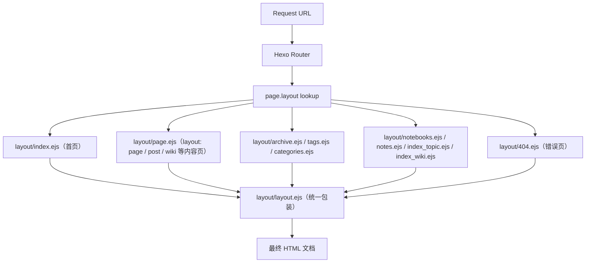
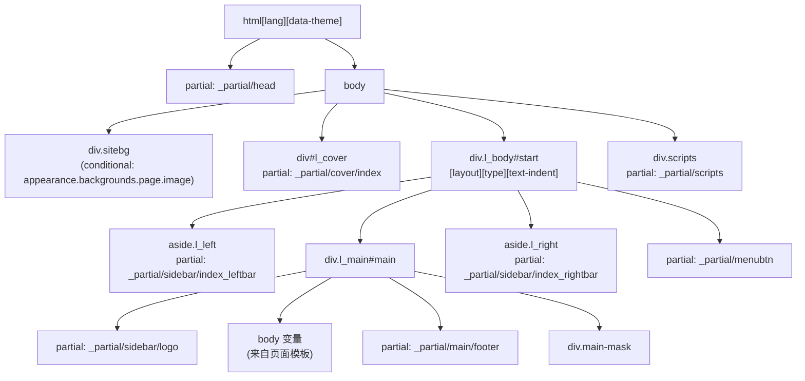
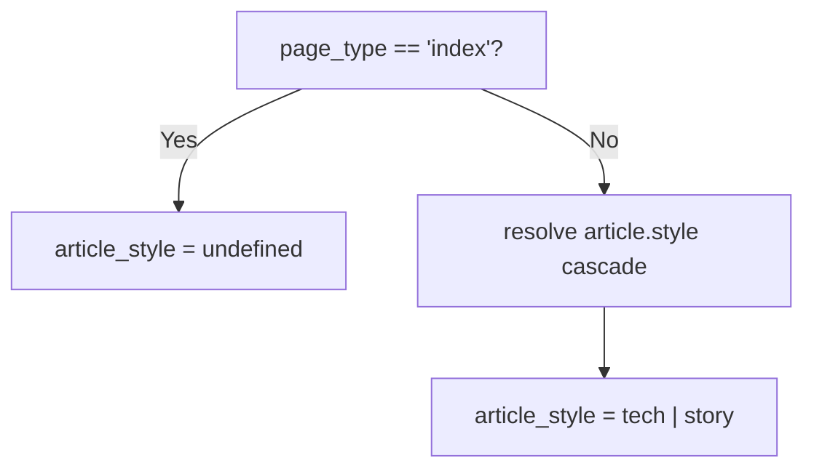
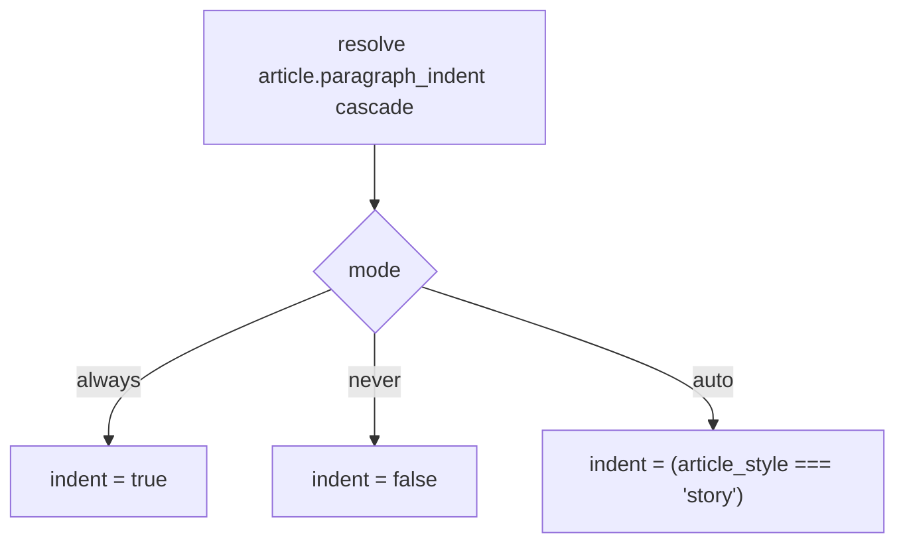
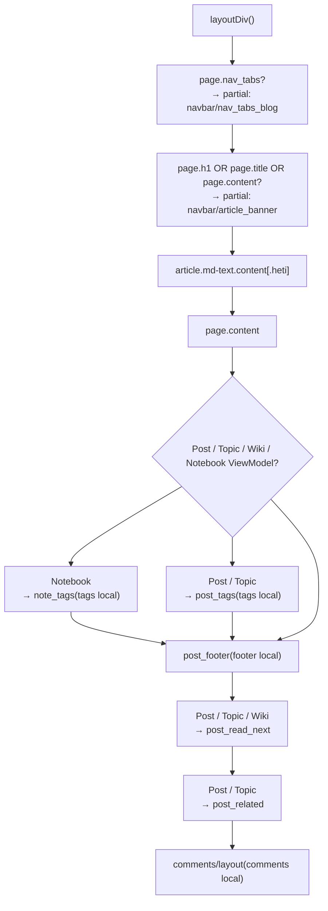

# 页面模板与路由

> [!IMPORTANT]
> v2 已重构页面 Front Matter、导航和侧边栏字段；本页涉及字段名时，以[内容配置 Schema v2](../03-内容系统/content-schema-v2.md)为准。

<details>
<summary>相关源码文件</summary>

生成此页面时参考的主题源码文件：

- [layout/layout.ejs](../../../layout/layout.ejs)
- [layout/page.ejs](../../../layout/page.ejs)
- [layout/index.ejs](../../../layout/index.ejs)
- [layout/archive.ejs](../../../layout/archive.ejs)
- [source/js/runtime/extensions/feature.mjs](../../../source/js/runtime/extensions/feature.mjs)
- [scripts/helpers/json_ld.js](../../../scripts/helpers/json_ld.js)

</details>

本页说明 Hexo 如何把请求映射到 Stellar 的 EJS 模板、主 `layout.ejs` 包装如何组装每个页面，以及 `page_type`、`article_type`、`indent` 变量如何控制不同内容类型的渲染行为。

侧边栏布局系统见[侧边栏系统](sidebar-system.md)；`<head>` SEO 元数据见[HTML Head 与 SEO 元数据](head-seo.md)；wiki 内容流水线见[文档系统](../03-内容系统/wiki-docs.md)。

---

## Hexo 如何把请求路由到模板

Hexo 根据页面 front matter 的 `layout` 字段从 `layout/` 目录选择 EJS 模板。选中模板的渲染输出作为 `body` 变量传给 `layout.ejs`，使 `layout.ejs` 成为所有页面类型的统一包装。

**模板路由：从 URL 到渲染 HTML**



说明：主题**没有** `post.ejs` / `wiki.ejs` 独立文件；post、wiki、topic、note 等内容页面统一由 `layout.ejs` 组装、`page.ejs` 生成正文（按 `page.layout` 区分渲染逻辑）。

**参考源码**：[layout/layout.ejs](../../../layout/layout.ejs)、[layout/page.ejs](../../../layout/page.ejs)、[scripts/helpers/json_ld.js](../../../scripts/helpers/json_ld.js)

---

## 主模板 `layout.ejs`

`layout.ejs` 对每个页面运行，负责：

1. 计算 `page_type`、`article_type`、`indent` 控制变量
2. 构建 `<html>`、`<head>`、`<body>` 结构
3. 组装三栏网格（`l_left`、`l_main`、`l_right`）
4. 注入 `body` 变量（具体页面模板的输出）

**`layout.ejs` DOM 结构**



**参考源码**：[layout/layout.ejs](../../../layout/layout.ejs)

关键一行：

```
div.l_body.${page_type}  layout="${page.layout}"  type="${article_type}"  [text-indent]
```

三个计算变量都作为该元素的 DOM 属性/类出现，CSS 与 JavaScript 可以精确针对特定页面配置。

---

## 控制变量：`page_type`、`article_type`、`indent`

三个变量在 `layout.ejs` 顶部计算，控制整页渲染。

### `page_type`

决定页面是内容页（单篇文章）还是索引页（文章列表）。

| 条件 | `page_type` 值 |
|---|---|
| `page.layout` 属于 `post`、`page`、`wiki`、`null` 且无 `page.nav_tabs` | `'content'` |
| 其他情况（首页、归档、标签、分类，或存在 `nav_tabs`） | `'index'` |

`page_type` 作为 CSS 类加到 `div.l_body`，驱动单内容视图与列表视图的布局差异。

**参考源码**：[layout/layout.ejs](../../../layout/layout.ejs)

### `article_style`

控制文章呈现风格，按优先级链解析：



常见取值 `'tech'`（技术文章）与 `'story'`（文学/散文文章）。解析结果写入 `div.l_body` 的 `type` 属性。

**参考源码**：[layout/layout.ejs](../../../layout/layout.ejs)

### `indent`

控制是否应用文本缩进，公开配置为 `article.paragraph_indent: auto|always|never`：



`indent` 为 `true` 时给 `div.l_body` 添加 `text-indent` 属性；为 `false` 时不添加。

**参考源码**：[layout/layout.ejs](../../../layout/layout.ejs)

---

## 内容模板 `page.ejs`

`page.ejs` 是 `page`、`post`、`wiki` 等内容布局的正文模板（输出为注入 `layout.ejs` 的 `body` 变量）。它定义 `layoutDiv()` 函数组装文章级组件。

**`layoutDiv()` 组件组装逻辑**



**参考源码**：[layout/page.ejs](../../../layout/page.ejs)

### 组件渲染矩阵

| 组件 | `layout === 'post'` | `collection_id(page, 'wiki')` 可解析 | 匹配 `notebook` | `layout === 'page'`（普通） |
|---|---|---|---|---|
| `nav_tabs_blog` | 有 `page.nav_tabs` 时 | 有 `page.nav_tabs` 时 | 有 `page.nav_tabs` 时 | 有 `page.nav_tabs` 时 |
| `article_banner` | 有标题/内容时 | 有标题/内容时 | 有标题/内容时 | 有标题/内容时 |
| `article_tags` | `render.article.tags` 非空时 | ✗ | `render.article.tags` 非空时 | ✗ |
| `article_footer` | `render.article.footer` | `render.article.footer` | `render.article.footer` | ✗ |
| `read_next` | ✓ | ✓ | ✗ | ✗ |
| `related_posts` | Post/Topic 投影决定 | ✗ | ✗ | ✗ |
| `comments/layout` | ✓ | ✓ | ✓ | ✓ |

**参考源码**：[layout/page.ejs](../../../layout/page.ejs)

### 笔记本集成

页面的 `collection.profile: notebook` 必须带有合法、深度冻结的 `page.viewModel.render`。`page.ejs` 只消费 `render.article` 与 `item`，将显式的 Banner、正文排版、标签、Footer 和评论传给对应 partial；导航、侧栏、Brand 与 SEO 由根 Shell 消费 `render.document/layout/seo`。Notebook Collection、Profile 与主题默认值的级联已经在模型构建期完成，模板不读取 `stellar_data('notebooks').tree`，也不修改页面对象。

**参考源码**：[layout/page.ejs](../../../layout/page.ejs)

### Layout Profile 路径与菜单默认值

v2 配置在 `layout.profiles` 中为各页面 Profile 声明 `path` 和 `navigation.active_menu`。YAML 路径在 Schema 中规范化为根相对路径，目录以 `/` 结尾。Topic、Wiki、Notebook、Author 与 Error Profile 的路径由主题生成器投影为 Hexo route path；`blog_index.path` 只进入 Post `CollectionModel.route.baseDir`，近期文章首页仍由 Hexo 自有 `index_generator.path` 生成，主题配置不会反写该字段。配置运行时使用 camelCase，进入现有页面 ViewModel 或渲染上下文时仍投影为内部 `navigation.menu`：

| 条件 | 冻结配置来源 |
|---|---|
| 首页 | `layout.profiles.home.navigation.activeMenu` |
| 分类 / 标签 / 归档 | `layout.profiles.blogIndex.navigation.activeMenu` |
| Wiki 内容页 | `layout.profiles.wiki.navigation.activeMenu` |
| Topic 内容页 | `layout.profiles.topic.navigation.activeMenu` |
| 普通 Post | `layout.profiles.post.navigation.activeMenu` |
| Notebook Note | `layout.profiles.note.navigation.activeMenu` |
| Wiki / Topic / Notebook 索引 | 对应 `wikiIndex` / `topicIndex` / `notebookIndex` Profile |
| 404 与普通页 | `error` / `page` Profile |

**参考源码**：[layout/page.ejs](../../../layout/page.ejs)

### Heti 插件集成

`extensions.features.heti.enabled` 为 `true` 时，`articleClass()` 给 `<article>` 元素添加 `heti` CSS 类，启用赫蹏中文排版能力。

---

## Heti 与 Reveal 的文章类

`articleClass()` 生成 `<article>` 元素的 `class` 属性：

- 基础：`md-text content`
- `scrollreveal(...)`——Reveal 启用时注入滚动显现触发类
- `heti`——冻结运行时 `extensions.features.heti.enabled` 为 true 时追加

**参考源码**：[layout/page.ejs](../../../layout/page.ejs)

---

## 页面导航机制

主题使用普通整页导航（PJAX 已于 v1.35.0 移除，`source/js/plugins/pjax.js` 与 `layout/_plugins/pjax.ejs` 均已删除）。可选的 `extensions.features.link_prefetch`（flying_pages）在鼠标悬停时预加载站内链接，提升导航体验。

**参考源码**：[source/js/main.js](../../../source/js/main.js)、[_config.yml](../../../_config.yml)（`extensions.features.link_prefetch`）

---

## `page.layout` 值参考

代码库中识别的 `page.layout` 值：

| `page.layout` | 模板文件 | `page_type` 结果 | 说明 |
|---|---|---|---|
| `post` | 无独立文件（经 `page.ejs` 正文） | `content` | 博客文章 |
| `page` | `layout/page.ejs` | `content`（有 `nav_tabs` 时为 `index`） | 通用页面、wiki 页面 |
| `wiki` | 无独立文件（经 `page.ejs` 正文） | `content` | wiki 内容页 |
| `null` / 缺失 | `layout/page.ejs` | `content` | 兜底 |
| `index` | `layout/index.ejs` | `index` | 首页 |
| `archive` | `layout/archive.ejs` | `index` | 归档列表 |
| `tag` / `category` | 对应模板 | `index` | 标签/分类页 |
| `notebooks` / `notes` / `index_topic` / `index_wiki` | 对应模板 | `index` | 笔记本/专栏/wiki 列表页 |

**参考源码**：[layout/layout.ejs](../../../layout/layout.ejs)、[scripts/helpers/json_ld.js](../../../scripts/helpers/json_ld.js)

渲染 navbar top 的列表页（首页/归档/标签/分类/专栏/wiki 列表及带 `nav_tabs` 的页面）在导航栏上方自动获得置顶内容轮播位（无需开关配置，有置顶内容即渲染，自动轮播间隔固定 5000ms；无置顶内容时不渲染），见[置顶内容轮播](../00-总览与安装配置/configuration.md#置顶内容轮播)。

---

## JSON-LD 布局检测

`json_ld` 辅助函数用 `page.layout` 选择结构化数据 schema：

| 页面类型 | JSON-LD `@type` |
|---|---|
| `this.is_post()` | `BlogPosting` |
| `page.layout == 'page'` 或 `this.is_home()` | `Website` |
| 其他 | `Website`（通用兜底） |

这与 EJS 路由相互独立——它在 `<head>` partial 内运行，不影响模板选择。

**参考源码**：[scripts/helpers/json_ld.js](../../../scripts/helpers/json_ld.js)
