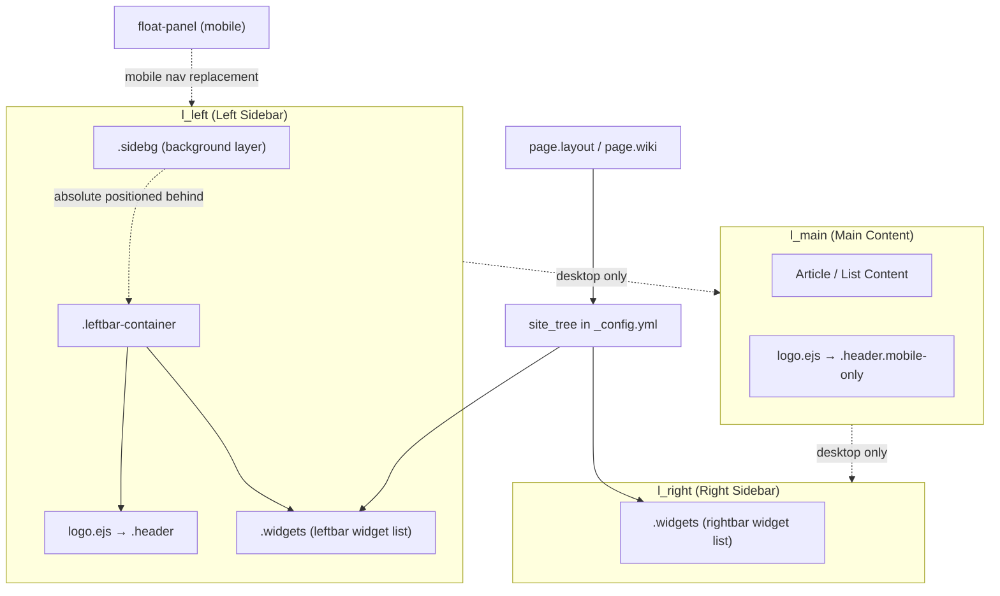
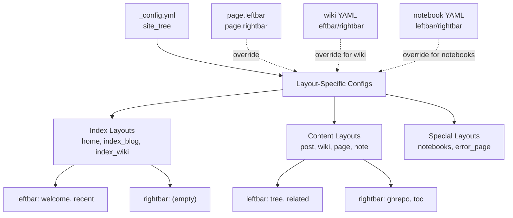
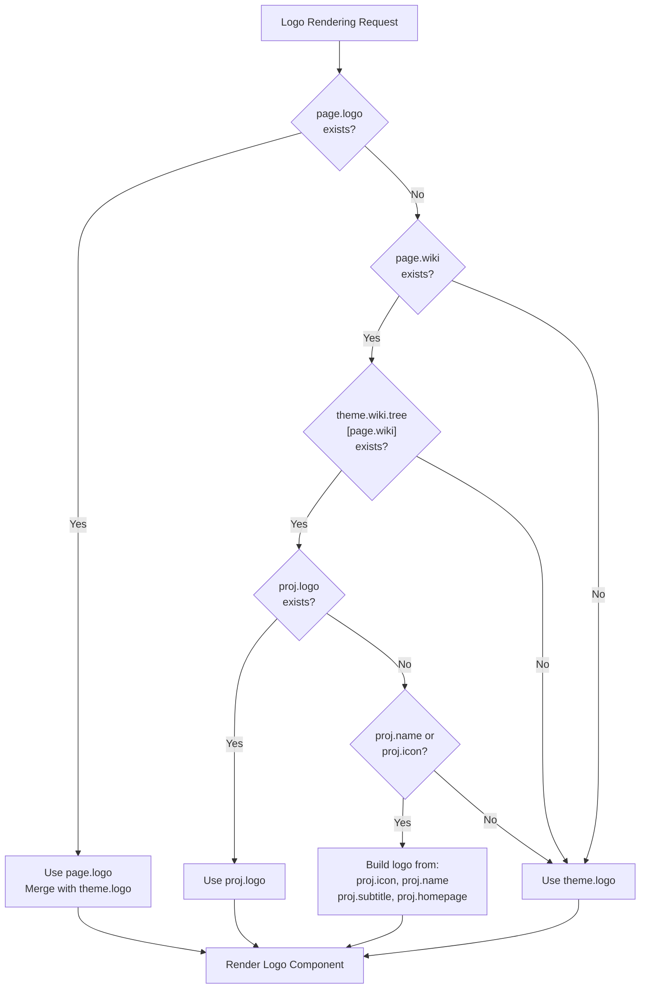
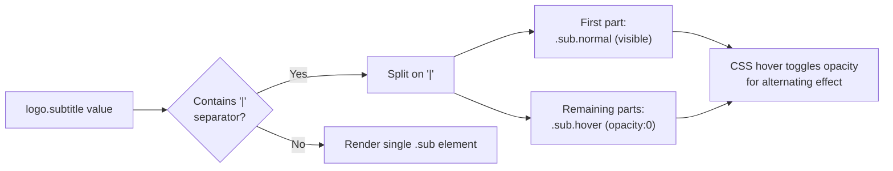
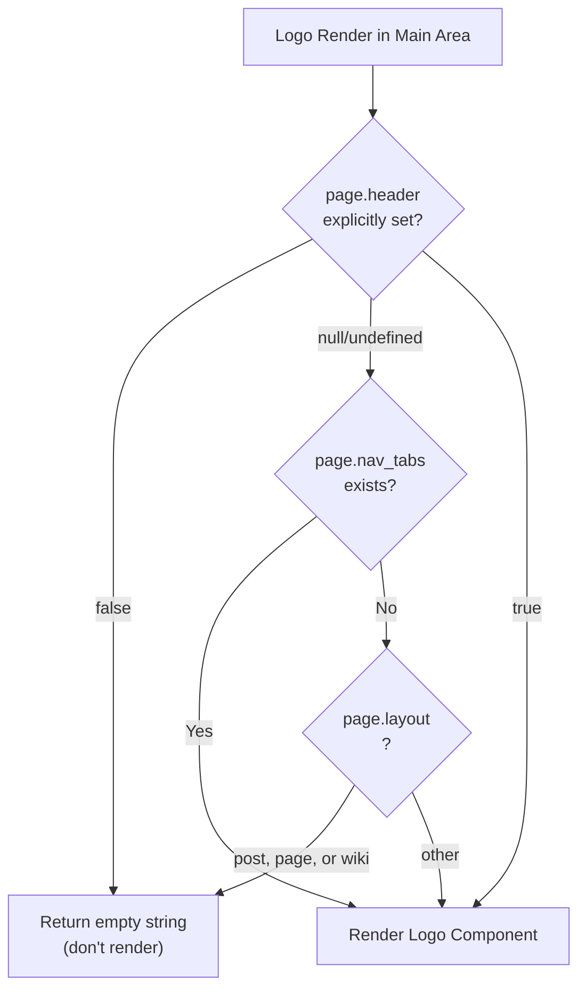
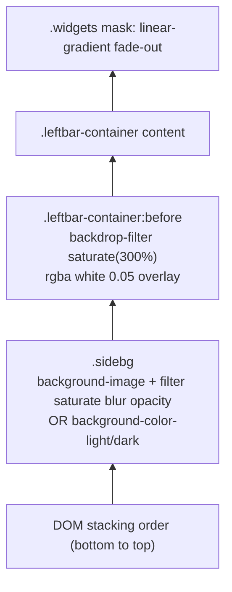
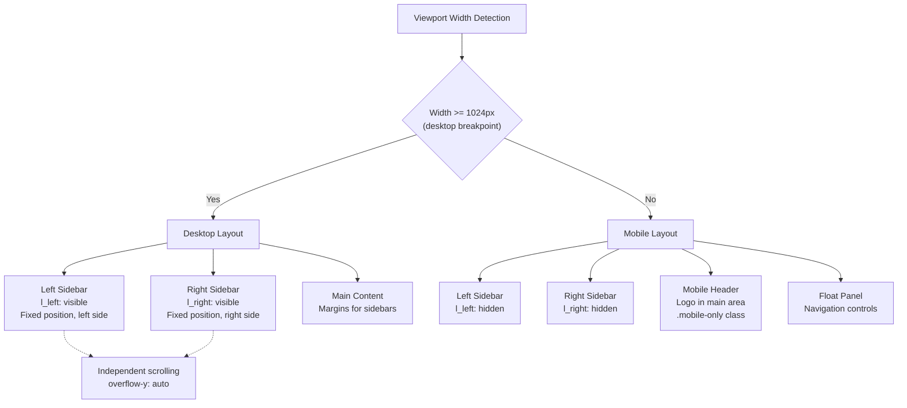

# 侧边栏系统

<details>
<summary>相关源码文件</summary>

生成此页面时参考的主题源码文件：

- [layout/_partial/sidebar/index_leftbar.ejs](../../../layout/_partial/sidebar/index_leftbar.ejs)
- [layout/_partial/sidebar/index_rightbar.ejs](../../../layout/_partial/sidebar/index_rightbar.ejs)
- [layout/_partial/sidebar/logo.ejs](../../../layout/_partial/sidebar/logo.ejs)
- [layout/_partial/widgets/](../../../layout/_partial/widgets/)
- [_data/widgets.yml](../../../_data/widgets.yml)
- [source/css/_components/sidebar/sidebar.styl](../../../source/css/_components/sidebar/sidebar.styl)
- [source/css/_components/sidebar/search.styl](../../../source/css/_components/sidebar/search.styl)
- [scripts/events/lib/doc_tree.js](../../../scripts/events/lib/doc_tree.js)

</details>

## 目的与范围

侧边栏系统负责渲染 Stellar 主题的左右侧边栏区域。本文覆盖侧边栏容器结构、小部件加载机制、Logo 组件解析层级、背景分层系统与响应式行为。具体小部件（搜索、最近文章、TOC 等）见对应组件文档；页面布局编排与模板路由见[页面模板与路由](page-templates-routing.md)。

---

## 架构概览

侧边栏系统由两个主容器组成（`.l_left` 与 `.l_right`），位于主内容区两侧。每个侧边栏根据配置加载多个小部件，左栏还通过 `logo.ejs` 包含 Logo/页头组件。

**侧边栏组件结构**



**架构总结**：`.l_left` 包裹 `.sidebg`（装饰背景层）与 `.leftbar-container`（Logo + 堆叠小部件）；`.l_right` 放置 TOC 等上下文小部件。两个侧边栏在移动端折叠，Logo 改为在 `.l_main` 中以 `.header.mobile-only` 渲染。

**参考源码**：[source/css/_components/sidebar/sidebar.styl](../../../source/css/_components/sidebar/sidebar.styl)、[layout/_partial/sidebar/logo.ejs](../../../layout/_partial/sidebar/logo.ejs)

---

## 侧边栏配置系统

### 配置层级

侧边栏通过 `_config.yml` 的 `site_tree` 小节配置，每种页面布局有不同设置。主题支持级联配置：页面级设置可覆盖布局默认值。



**配置解析顺序**：先查页面 front-matter 覆盖，再查 wiki/notebook YAML，然后回退到 `site_tree` 布局默认值，最后到主题默认。

**参考源码**：[_config.yml](../../../_config.yml)（`site_tree` 小节）

### 各布局类型的默认配置

| 布局类型 | 默认左栏 | 默认右栏 | 用途 |
|----------|----------|----------|------|
| `home` | `welcome, recent` | （空） | 首页列表 |
| `index_blog` | `welcome, recent` | （空） | 博客列表 |
| `index_wiki` | `related, recent` | （空） | wiki 项目列表 |
| `post` | `related, recent` | `ghrepo, toc` | 博客文章 |
| `wiki` | `tree, related, recent` | `ghrepo, toc` | wiki 页面 |
| `notes` | `tagtree, recent` | （空） | 笔记本列表 |
| `note` | `tagtree, recent` | `toc` | 单条笔记 |
| `page` | `recent` | `toc` | 通用页面 |

**小部件可用性**：每个小部件标识（`tree`、`toc`、`recent` 等）对应 `_data/widgets.yml` 中定义的小部件，其 `layout` 字段指向 `layout/_partial/widgets/` 下的模板。注意：`welcome` 已不在 `_data/widgets.yml` 定义（配置中的 `welcome` 引用实际不再渲染，可通过覆盖清空）。

**参考源码**：[_config.yml](../../../_config.yml)、[_data/widgets.yml](../../../_data/widgets.yml)

---

## 左栏：Logo 组件

### Logo 解析层级

左栏顶部的 Logo 组件遵循三级解析层级，随页面上下文适配：wiki 项目可以展示自己的品牌，同时保留主题级默认。



**解析逻辑**：先查页面级 Logo 覆盖，再查页面所属 wiki 项目是否有自己的品牌，最后回退到主题全局 Logo 配置。三级体系在保持品牌一致的同时提供最大灵活性。

**参考源码**：[layout/_partial/sidebar/logo.ejs](../../../layout/_partial/sidebar/logo.ejs)

### Logo 组件结构

Logo 组件最多包含三个元素：图标/头像、主标题、副标题。渲染逻辑根据配置了哪些元素自适应。

| 元素 | 配置键 | 说明 | 默认来源 |
|------|--------|------|----------|
| 头像 | `logo.avatar` | 用户/站点头像图片 | Hexo 的 `config.avatar` |
| 图标 | `logo.icon` | 项目/wiki 图标 | 无（仅 wiki 项目） |
| 标题 | `logo.title` | 带链接的主标题文本 | Hexo 的 `config.title` |
| 副标题 | `logo.subtitle` | 副标题文本（支持 `|` 分隔的悬停切换效果） | Hexo 的 `config.subtitle` |

**动态头像**：`style.animated_avatar.animate` 启用时，头像包含一个悬停淡入的 CSS 锥形渐变光环（`style.gradient.avatar`，默认彩虹色），以 4s 匀速旋转产生装饰动画。

**参考源码**：[_config.yml](../../../_config.yml)、[layout/_partial/sidebar/logo.ejs](../../../layout/_partial/sidebar/logo.ejs)

### 标题与副标题渲染

标题支持 Markdown 风格链接语法 `[text](url)` 与特殊副标题格式：



**副标题悬停效果**：副标题含 `|`（如 `'Text 1 | Text 2'`）时，主题创建两个副标题 div：默认可见的 `.sub.normal` 与隐藏的 `.sub.hover`（`opacity:0`）。CSS 悬停切换两者透明度，实现文字切换动画。

**参考源码**：[layout/_partial/sidebar/logo.ejs](../../../layout/_partial/sidebar/logo.ejs)

### 条件显示逻辑

Logo 组件在主内容区（移动端页头）的可见性规则与左栏中不同：



**移动端页头逻辑**：在主内容区渲染时，内容页（post/page/wiki）默认隐藏 Logo，除非有 `nav_tabs`（表明是列表页）或 front-matter 显式设置 `header: true`。避免内容页出现重复页头。

**参考源码**：[layout/_partial/sidebar/logo.ejs](../../../layout/_partial/sidebar/logo.ejs)

---

## 左栏：小部件系统

左栏按 `leftbar` 配置数组的顺序加载小部件。每个小部件是 `layout/_partial/widgets/` 下的独立 partial 模板（由 `_data/widgets.yml` 的 `layout` 字段指定）。

### 常用小部件

| 小部件 ID | 布局模板 | 用途 | 典型场景 |
|-----------|----------|------|----------|
| `recent` | `_partial/widgets/recent.ejs` | 最近文章/页面列表 | 大多数布局 |
| `related` | `_partial/widgets/related.ejs` | 相关内容推荐 | 内容页 |
| `tree` | `_partial/widgets/tree.ejs` | wiki 文档树导航 | wiki 页面 |
| `tagtree` | `_partial/widgets/tagtree.ejs` | 基于标签的导航树 | 笔记本页面 |
| `ghrepo` | `_partial/widgets/ghrepo.ejs` | GitHub 仓库卡片 | wiki/项目页 |
| `ghuser` | `_partial/widgets/ghuser.ejs` | GitHub 用户卡片 | 作者页 |
| `author` | `_partial/widgets/author.ejs` | 作者信息 | 作者页 |
| `tagcloud` | `_partial/widgets/tagcloud.ejs` | 标签云 | 各种布局 |
| `timeline` | `_partial/widgets/timeline.ejs` | 时间线 | 作者页、错误页 |
| `latest_comment` | `_partial/widgets/latest_comment.ejs` | 最新评论 | 各种布局 |

完整列表以 `_data/widgets.yml` 为准。

**小部件加载**：遍历 `leftbar` 数组并引入对应 partial。模板不存在或返回空内容时静默跳过，不报错。

`.leftbar-container` 内的 `.widgets` 容器通过 `mask: linear-gradient(white, 90%, transparent)` 底部淡出，并用 `border-radius: $border-bar` 裁剪溢出。

### 搜索小部件

搜索小部件样式位于 `source/css/_components/sidebar/search.styl`。关键结构元素：

| CSS 类 | 角色 |
|--------|------|
| `.search-wrapper` | 外层包装，`padding-bottom: 32px` |
| `.search-form` | `position: sticky; top: 0`——滚动结果时保持可见 |
| `.search-input` | 全宽文本输入框，使用 `$ff-body` 字体 |
| `.search-button` | 图标按钮；SVG `path[p-id="1562"]` 在命中（`$c-green`）或无结果（`$c-red`）时变色 |
| `#search-result` | 可滚动结果列表，`max-height: 60vh`，隐藏滚动条 |
| `.search-result-list` | 结果 `<li>` 列表 |
| `.search-keyword` | 匹配词以 `$c-red` 高亮并带虚线下划线 |

状态通过 `.search-wrapper` 上的 `searching` 与 `noresult` 属性管理：

- `[searching='true']`：激活绿色图标
- `.noresult[searching='true']`：激活红色图标并显示 `.search-no-result`

客户端搜索逻辑见[搜索功能](../07-外部集成/search.md)。

**参考源码**：[source/css/_components/sidebar/search.styl](../../../source/css/_components/sidebar/search.styl)

---

## 右栏：小部件系统

右栏（`.l_right`）放置上下文小部件，使用 `margin: var(--gap-page) 0` 与 `border-radius: $border-card-l` 保持视觉一致。

### 常用右栏小部件

| 小部件 ID | 布局模板 | 用途 | 典型场景 |
|-----------|----------|------|----------|
| `toc` | `_partial/widgets/toc.ejs` | 带滚动跟踪的目录 | 有标题的内容页 |
| `ghrepo` | `_partial/widgets/ghrepo.ejs` | GitHub 仓库卡片 | wiki/项目页 |
| `ghuser` | `_partial/widgets/ghuser.ejs` | GitHub 用户卡片 | 作者页 |
| `timeline` | `_partial/widgets/timeline.ejs` | 时间线小部件 | 各种布局 |

**上下文加载**：右栏小部件常查询页面属性（TOC 用 `page.headings`、GitHub 卡片用 `page.repo`），按可用数据条件渲染。TOC 细节见[目录系统](../05-前端交互/toc-system.md)。

2K+ 屏幕（`min-width: $device-2k`）上 `.l_right` 用 `margin-left: var(--gap-page); margin-right: auto` 居中整体布局。

**参考源码**：[source/css/_components/sidebar/sidebar.styl](../../../source/css/_components/sidebar/sidebar.styl)

---

## 背景系统与样式

### 多层背景架构

左栏使用三层背景系统（`sidebar.styl`）：

1. **`.sidebg`**——绝对定位在 `.leftbar-container` 之后。渲染背景图（带模糊与透明度滤镜）或纯色（`$leftbar-background-color-light` / `$leftbar-background-color-dark`）。
2. **`.leftbar-container:before`**——伪元素应用 `backdrop-filter: saturate(300%)` 与半透明白色叠加（`rgba(white, 0.05)`），在图片上方形成磨砂玻璃效果。移动端隐藏。
3. **`.leftbar-container .widgets`**——小部件列表本身用 `mask: linear-gradient(white, 90%, transparent)` 底部淡出。

**`.l_left` 背景层堆叠**



### 背景配置项

这些从 `_config.yml` 经 `hexo-config()` 读取的 Stylus 变量控制 `.sidebg` 渲染：

| Stylus 变量 / 配置键 | CSS 效果 | 位置 |
|----------------------|----------|------|
| `$leftbar-background-image` / `style.leftbar.background-image` | `.sidebg` 上的 `background-image` | sidebar.styl |
| `style.leftbar.background-opacity` | `.sidebg` 上的 `--background-opacity` CSS 变量 | sidebar.styl |
| `style.leftbar.blur-px` | `--blur-px` CSS 变量 → `.sidebg` 的 `filter: blur(...)` | sidebar.styl |
| `$leftbar-background-color-light` | `.sidebg` 的 `background-color`（浅色模式） | sidebar.styl |
| `$leftbar-background-color-dark` | `.sidebg` 的 `background-color`（深色模式经 `prefers-color-scheme`） | sidebar.styl |
| `style.leftbar.ui-style` | `glass` / `card` 风格开关；`card` 时 `.l_left` 追加 `leftbar-card` 类 | layout.ejs / sidebar.styl |

设置 `$leftbar-background-image` 时，`.sidebg` 还扩展内缩进（`--inset: 32px`），让模糊略微溢出容器边缘，再由父元素 `border-radius` 裁剪。

移动端（`max-width: $device-mobile-max`）`.l_left` 直接使用 `background: var(--bg-a100)`，`.sidebg` 饱和度降到 `300%`。

### 纯色卡片风格（ui-style: card）

`style.leftbar.ui-style` 控制左栏外观：`glass` 为历史默认行为，保留上面的三层背景系统；`card` 时 `layout.ejs` 为 `.l_left` 追加 `leftbar-card` 类，容器改为 `background: var(--card)`（浅色纯白 / 深色主题深灰黑）与 `box-shadow: $boxshadow-float`（`0 4px 8px 0 rgba(0,0,0,0.05)`），并隐藏 `.sidebg` 与 `.leftbar-container:before/:after`。因类选择器特异性更高，桌面与移动端均生效。该配置项默认值为 `card`。

交互样式按风格隔离：`sidebar-light()` 混入与搜索条底部条读取容器级 CSS 变量 `--leftbar-item-bg` / `--leftbar-item-shadow` / `--leftbar-search-line`（默认回退玻璃质感背景与 `--bg-a100`/`--bg-a20` 底部条）。`card` 时 `.l_left.leftbar-card` 将其覆盖为 `var(--block-border)` / `none` / `var(--text-meta)`：列表项（菜单、最近更新、页面树、链接列表、相关文章等）hover/active 背景为 `var(--block-border)`、无顶部光照；搜索条底部条默认为 `var(--text-meta)`，输入/悬停高亮仍为彩虹渐变。`glass` 与右栏未设置变量，保持原效果。wiki 内容页左上角「所有项目」返回胶囊（`.wiki-home`，`source/css/_components/sidebar/logo.styl`）默认态同样复用 `sidebar-light()`，与目录树激活项背景一致；hover 仅文字颜色变化。

组件填充同样按风格隔离：`card` 时 `.l_left.leftbar-card` 覆盖 `--bg-a20/a50/a60/a75` 为 `var(--block)`、`--bg-a100` 为 `var(--block-border)`，使原本白色半透明的组件背景（markdown 正文、标签云、相关文章、时间线、搜索结果等）与右栏观感一致。

左栏独立 linklist 小部件的多列布局（`columns > 1`，模板为其追加 `multi` 类）下，每个链接显示背景色：`glass` 为 `--bg-a20`，`card` 经上述覆盖自动得到 `var(--block)`；单列列表与单链接不显示背景，hover/active 仍走 `sidebar-light()` 高亮（`components.styl`）。

### CSS 变量集成

侧边栏背景系统与主题 CSS 变量系统集成，`.sidebg` 与 `.leftbar-container` 使用的关键变量：

- `--bg-a100`、`--bg-a20`：不同透明度下的主题背景
- `$border-card-l`：侧边栏面板共享圆角
- `$leftbar-bottom-margin-mobile` / `$rightbar-bottom-margin-mobile`：仅移动端浮动面板 `max-height` 计算中的底部边距（64px）
- `--gap-margin`、`--gap-max`：间距令牌

变量定义见[设计令牌与 CSS 变量](../01-样式系统/design-tokens.md)与[颜色与深色模式](../01-样式系统/colors-dark-mode.md)。

**参考源码**：[source/css/_components/sidebar/sidebar.styl](../../../source/css/_components/sidebar/sidebar.styl)

---

## 响应式行为

### 桌面与移动端布局

侧边栏系统在桌面与移动端视口间显著适配（CSS 媒体查询 + 条件渲染）。



**移动端策略**：移动端两个侧边栏都用 display 属性隐藏。Logo 组件改为在主内容区以 `.mobile-only` 类渲染，充当移动端页头。浮动面板提供原本在左栏中的导航入口。

**参考源码**：[layout/_partial/sidebar/logo.ejs](../../../layout/_partial/sidebar/logo.ejs)

### 侧边栏宽度与间距

| 断点 | 左栏（`.l_left`） | 右栏（`.l_right`） | 说明 |
|------|--------------------|--------------------|------|
| 桌面（≥`$device-2k`） | `margin-left: auto; margin-right: calc(2 * var(--gap-page))` | `margin-left: var(--gap-page); margin-right: auto` | 2K 居中 |
| 桌面（≥`$device-laptop`） | `margin: var(--gap-page)` | `margin: var(--gap-page) 0` | 宽松档：`--gap-page` 32px，四周 32px |
| 平板/紧凑（≤`$device-laptop`） | `margin: var(--gap-page)` | 平板为固定抽屉（`margin: 0`） | 紧凑档：`--gap-page` 16px，四周 16px |
| 移动（≤`$device-mobile-max`） | `overflow: hidden; background: var(--bg-a100)` | 隐藏 | 折叠为移动端页头，浮动面板 `top: 8pt` |

右栏在共用基础宽度上额外加宽：`.l_right` 宽度 = `--width-sidebar` + `--rightbar-width-extra`（默认 `calc(var(--gap-base) * 2)` = 32px，桌面 320px / 内容 288px），左栏保持 `--width-sidebar`（288px）。

**高度约束**：PC（>667px）`.l_left` 与 `.leftbar-container` 限制在 `calc(100vh - var(--gap-page) * 2)`，顶部与底部间距均为 `var(--gap-page)`（紧凑档 16px / 宽松档 32px）；移动端（≤667px）左右浮动面板顶部为 `8pt`，底部为 `$leftbar-bottom-margin-mobile` / `$rightbar-bottom-margin-mobile`（均为 64px）。

**参考源码**：[source/css/_components/sidebar/sidebar.styl](../../../source/css/_components/sidebar/sidebar.styl)

---

## 与页面布局的集成

### 布局专属侧边栏行为

**博客文章（`post`）**：

- 左栏：`related, recent`——相关文章与最近文章
- 右栏：`ghrepo, toc`——仓库信息与目录

**Wiki 页面（`wiki`）**：

- 左栏：`tree, related, recent`——项目内文档树导航
- 右栏：`ghrepo, toc`——仓库链接与页面结构

**笔记本（`notes` 与 `note`）**：

- 左栏：`tagtree, recent`——笔记本内基于标签的组织
- 右栏：`toc`（单条笔记）——页面结构导航

**索引页（`home`、`index_blog`、`index_wiki`）**：

- 左栏：`welcome, recent` 或 `related, recent`——介绍性内容
- 右栏：通常为空——聚焦主内容列表

**参考源码**：[_config.yml](../../../_config.yml)

### Front-Matter 覆盖系统

页面可通过 front-matter 覆盖侧边栏配置：

```yaml
---
title: Custom Page
leftbar: custom, widgets
rightbar: special, toc
---
```

该覆盖系统同样适用于 wiki YAML（项目级定制）与笔记本 YAML（笔记本专属设置）。

**覆盖优先级**：页面 front-matter > Wiki/Notebook YAML > 布局默认 > 主题默认

**参考源码**：[_config.yml](../../../_config.yml)

---

## 总结

侧边栏系统提供灵活、多层的导航与上下文信息展示架构：

1. **双栏架构**：独立的左栏（导航/小部件）与右栏（上下文信息），各自独立配置
2. **Logo 解析层级**：支持页面、wiki 项目、主题级的三级品牌兜底
3. **小部件组合**：模块化小部件系统，每种布局类型可自由定制
4. **精细样式**：多层背景系统，支持玻璃拟态与深色模式
5. **响应式设计**：移动优先，隐藏侧边栏并提供替代导航
6. **配置级联**：页面级覆盖的层级配置系统

侧边栏系统与主题配置架构（[配置系统](../00-总览与安装配置/configuration.md)）、响应式设计（[响应式设计](../01-样式系统/responsive-design.md)）与页面布局编排（[页面模板与路由](page-templates-routing.md)）深度集成。
