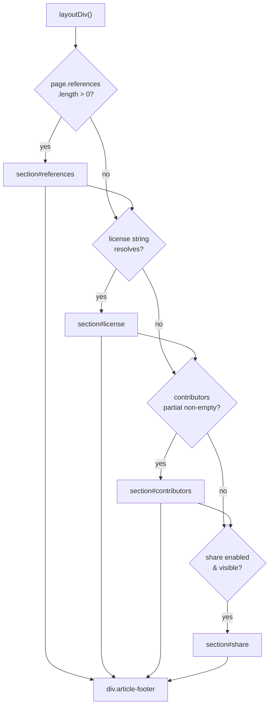
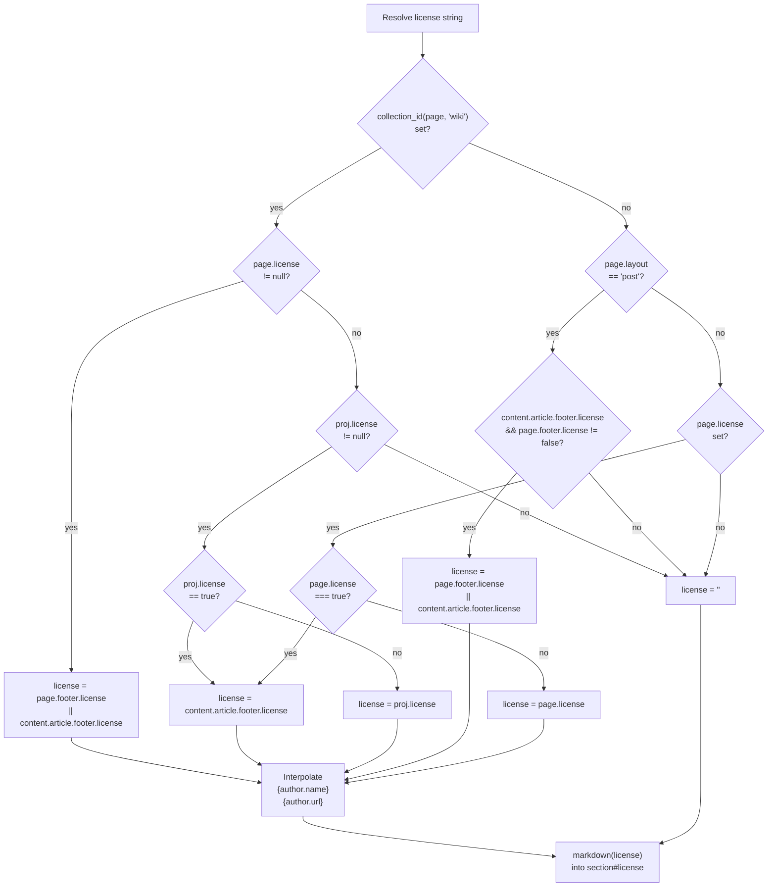
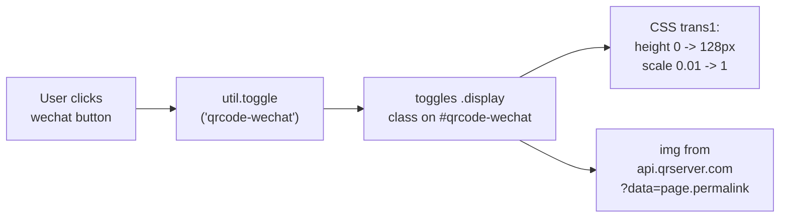
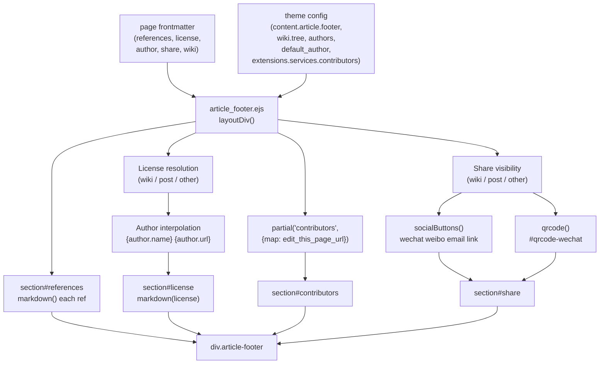

# 文章页脚与元数据

> [!IMPORTANT]
> v2 页面与集合统一使用 `footer`、`article` 与 `collection`；本页涉及字段名时，以[内容配置 Schema v2](content-schema-v2.md)为准。

<details>
<summary>相关源码文件</summary>

生成此页面时参考的主题源码文件：

- [layout/_partial/main/article/article_footer.ejs](../../../layout/_partial/main/article/article_footer.ejs)
- [layout/_partial/main/article/post_footer.ejs](../../../layout/_partial/main/article/post_footer.ejs)
- [layout/_partial/main/article/post_tags.ejs](../../../layout/_partial/main/article/post_tags.ejs)
- [layout/_partial/main/article/contributors.ejs](../../../layout/_partial/main/article/contributors.ejs)
- [source/css/_components/partial/article-footer.styl](../../../source/css/_components/partial/article-footer.styl)
- [scripts/helpers/related_posts.js](../../../scripts/helpers/related_posts.js)

</details>

本页介绍文章正文下方的标签行与页脚组件——文章、wiki 页面与自定义页面内容下方渲染的块。普通 Post 由 `post_tags.ejs`、`post_footer.ejs` 消费已解析的 `PageViewModel.render.article`；Wiki、Topic、Notebook 与其它页面继续由迁移期 `article_tags.ejs`、`article_footer.ejs` 读取旧模型。两条分支保持相同 DOM、class 与可见行为。文章之间的导航元素见[相关内容与导航](related-content.md)。

---

## 组件概览

普通 Post 页脚由 [post_footer.ejs](../../../layout/_partial/main/article/post_footer.ejs) 接收显式 `footer` local，迁移期页面由 [article_footer.ejs](../../../layout/_partial/main/article/article_footer.ejs) 的 `layoutDiv()` 渲染。两者条件组装相同的最多四个区块；许可、分享、贡献者与引用的配置级联只在普通 Post ViewModel 构建时执行一次：

| 区块 ID | 显示条件 | 本地化键 |
|---------|----------|----------|
| `#references` | 已解析的 `references` 投影数组非空 | `meta.references` |
| `#license` | 许可字符串解析为非空（多级逻辑） | `meta.license` |
| `#contributors` | `contributors` partial 渲染非空输出 | （partial 内部） |
| `#share` | 分享启用且平台列表非空 | `meta.share` |

外层容器是 `<div class="article-footer">`，仅当至少一个区块存在时输出；空的 `article-footer` 经 `&:empty { display: none }` 隐藏。

**组件组装图：**



**参考源码**：[layout/_partial/main/article/article_footer.ejs](../../../layout/_partial/main/article/article_footer.ejs)

---

## 文章标签行

普通 Post 的 `render.article.tags` 已在构建边界合并 Hexo 标签名称和路径；数组非空时，正文结束后、`article-footer` 之前渲染一行本文标签：

- 模板 [post_tags.ejs](../../../layout/_partial/main/article/post_tags.ejs) 只接收显式 `tags` local；每个标签仍渲染为 `<a class="tag" href="${pretty_url(tag.path)}">`，链接内先输出 `default:hashtag` 图标再输出标签名。迁移期 `article_tags.ejs` 保持旧入口。
- 样式 [source/css/_components/partial/article-tags.styl](../../../source/css/_components/partial/article-tags.styl)：复用 [source/css/_defines/func.styl](../../../source/css/_defines/func.styl) 的 `tag-chip()` mixin——胶囊圆角（`border-radius: 999px`）、`var(--block)` 底色、`$fs-13`，前缀为内联 hashtag 图标（`.tag svg`：`1em`、`opacity: .4`）；hover 时文字变 `var(--text)`、背景变 `var(--block-border)`、图标变主题色且不透明；容器 `justify-content: center` 居中，`margin: 2rem -0.5rem 0` 抵消标签外边距并保留与正文的 2rem 间距。与标签页（`/blog/tags/`）标签胶囊为同一套样式。
- 博客文章标签行由 `content.article.show_tags` 控制，wiki 页不渲染标签行；笔记页由 [layout/_partial/main/notebook/note_tags.ejs](../../../layout/_partial/main/notebook/note_tags.ejs) 在正文末尾渲染笔记标签（标签名经笔记本标签树解析，点击进入笔记本标签过滤页），复用同一 `article-tags` 容器与 `tag-chip()` 胶囊样式。

**参考源码**：[layout/_partial/main/article/article_tags.ejs](../../../layout/_partial/main/article/article_tags.ejs)、[layout/page.ejs](../../../layout/page.ejs)、[source/css/_components/partial/article-tags.styl](../../../source/css/_components/partial/article-tags.styl)、[source/css/_defines/func.styl](../../../source/css/_defines/func.styl)

---

## 引用区块

`page.references` 为非空数组时渲染。每个条目经 Hexo 的 `markdown()` 辅助函数处理，包装在 `<ul>` 内的 `<li class="post-title">` 元素中。

```
page.references: [
  "[Author, Title](url)",
  "Plain text reference"
]
```

`.post-title` 列表项样式设置 `line-height: 1.2` 与 `word-break: break-all`，适合 URL 显示。

**参考源码**：[layout/_partial/main/article/article_footer.ejs](../../../layout/_partial/main/article/article_footer.ejs)、[source/css/_components/partial/article-footer.styl](../../../source/css/_components/partial/article-footer.styl)

---

## 许可解析

许可文本按页面布局与是否属于 wiki 项目经三级兜底解析。解析出的字符串可能包含 `{author.name}` 与 `{author.url}` 占位符，从 `stellar_data('authors')` 插值。

### 解析逻辑



### 按页面类型的解析

| 页面类型 | 关闭机制 | 开启机制 | 默认来源 |
|----------|----------|----------|----------|
| `post` | `page.footer.license: false` | `page.footer.license: <string>` | `content.article.footer.license` |
| wiki 页面 | 页面省略 `license` | `page.license: <string>` | `proj.license` 或主题默认 |
| 其他布局 | （默认不显示） | `page.footer.license: true` 或 `<string>` | `content.article.footer.license` |

- `proj` 指 `stellar_data('wiki').tree[collection_id(page, 'wiki')]`——项目级 wiki 配置对象，构建方式见[文档系统](wiki-docs.md)
- Collection `footer.license: true` 表示使用全局 `content.article.footer.license`
- `proj.license: false` 表示无论页面级设置如何都不显示许可

### 作者插值

对解析出的许可字符串做替换：

- `page.author` 匹配 `stellar_data('authors')` 中的键时使用该作者对象
- 否则使用 `stellar_data('defaultAuthor')`
- `{author.name}` → `author.name`
- `{author.url}` → `author.url`

`_config.yml` 中的示例许可模板：

```yaml
content:
  article:
    footer:
      license: 'This work by [{author.name}]({author.url}) is licensed under CC BY-NC-SA 4.0.'
```

**参考源码**：[layout/_partial/main/article/article_footer.ejs](../../../layout/_partial/main/article/article_footer.ejs)

---

## 贡献者区块

贡献者区块通过调用 `partial('contributors', {map: stellar_config('extensions.services.contributors.editPage')})` 生成。partial 渲染为空时整个区块省略。

关键样式：

| 元素 | 样式 |
|------|------|
| `.header` | Flexbox 行，右侧 `a.edit` 按钮 |
| `a.edit`（编辑本页按钮） | 铅笔图标 SVG + 标签，悬停变主题色 |
| `.users-wrap .grid-box` | CSS grid，`minmax(72px, 1fr)` 列 |
| `.user-card .card-link` | 32×32px 头像图片 |

`edit_page` URL 映射（来自 `extensions.services.contributors`）决定贡献者头部是否显示「编辑本页」链接。配置结构见[数据服务与组件](../06-数据服务与组件/data-widgets-overview.md)。

**参考源码**：[layout/_partial/main/article/article_footer.ejs](../../../layout/_partial/main/article/article_footer.ejs)、[source/css/_components/partial/article-footer.styl](../../../source/css/_components/partial/article-footer.styl)

---

## 社交分享

### 可见性规则

分享按钮可见性与许可一致，采用三级逻辑：

| 页面类型 | 是否显示分享 |
|----------|--------------|
| wiki 页面 | `page.share == true` 或 `proj.share == true` |
| `post` | `page.share != false`（默认显示） |
| 其他布局 | `page.share == true` |

另外，`content.article.footer.share` 必须是非空数组才会渲染按钮。

### 支持的平台

`content.article.footer.share` 数组支持的值：

| 平台 | 行为 |
|------|------|
| `wechat` | 调用 `util.toggle("qrcode-wechat")` 显示/隐藏二维码面板 |
| `weibo` | 打开 `service.weibo.com/share/share.php`，带 URL、标题、图片、摘要 |
| `email` | 打开 `mailto:?subject=...&body=...` 链接 |
| `link` | 调用 `util.copy("copy-link", ...)` 复制永久链接到剪贴板 |

分享按钮中的图标由主题图标配置以外部 SVG `` 输出；样式将图片限制为 20×20px，并设为块级元素，使其与分享栏 20px 网格列对齐。

`util.toggle` 与 `util.copy` 是客户端辅助函数，见[标签页组件与工具函数](../05-前端交互/tabs-utils.md)。

### 微博分享参数

| 参数 | 来源 |
|------|------|
| `url` | `page.permalink` |
| `title` | `page.title + ' - ' + config.title` |
| `pics` | `page.cover`（文章）或 `page.icon`（wiki 页面） |
| `summary` | `page.description` 或截断的 `page.excerpt` / `page.content` |

所有分享参数（URL、标题、图片、摘要）均经 `encodeURIComponent` 编码后拼入 `href`；`copy-link` 输入框的 `value` 与复制提示文案经 HTML 转义输出，标题/摘要含引号、`&`、`<` 等字符时不会破坏 HTML 结构。

### 微信二维码

分享列表含 `wechat` 时，额外渲染 `<div class="qrcode" id="qrcode-wechat">`：

```html

```

二维码面板经 CSS 过渡动画。初始 `opacity: 0; height: 0; transform: scale(0.01)`；`util.toggle("qrcode-wechat")` 添加 `display` 类后面板动画到 `height: 128px; transform: scale(1)`。



**参考源码**：[layout/_partial/main/article/article_footer.ejs](../../../layout/_partial/main/article/article_footer.ejs)、[source/css/_components/partial/article-footer.styl](../../../source/css/_components/partial/article-footer.styl)

---

## CSS 架构

整个文章页脚在 `article-footer.styl` 中设置样式。

| 选择器 | 用途 |
|--------|------|
| `.article-footer` | 外层容器：`var(--block)` 背景、边框、`border-radius: $border-card-l` |
| `.article-footer .header` | 区块标签：`font-weight: 500`、`font-size: $fsh5` |
| `.article-footer .body` | 内容区：`--fs-content: $fs-content-2`、隐藏的复制链接输入框 |
| `.article-footer section+section` | 相邻区块间的顶部边框分隔 |
| `.article-footer #contributors` | 贡献者网格布局与编辑按钮样式 |
| `.article-footer .social-wrap` | 20px 社交图标按钮的 CSS grid |
| `.article-footer .qrcode` | 二维码面板：初始 `height: 0`，切换时过渡 |
| `.article-footer .qrcode.display` | 二维码面板可见状态：`height: 128px` |

`.body` 内的 `.link` 元素（包裹分享链接按钮的 `#copy-link` 输入框）默认 `height: 0; opacity: 0`，视觉不可见但值仍可被 `util.copy` 访问。

**参考源码**：[source/css/_components/partial/article-footer.styl](../../../source/css/_components/partial/article-footer.styl)

---

## 数据流总结



**参考源码**：[layout/_partial/main/article/article_footer.ejs](../../../layout/_partial/main/article/article_footer.ejs)、[source/css/_components/partial/article-footer.styl](../../../source/css/_components/partial/article-footer.styl)
