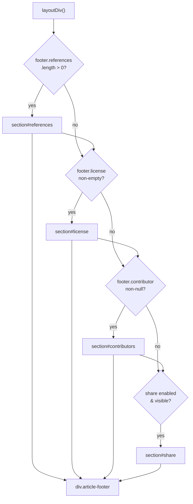
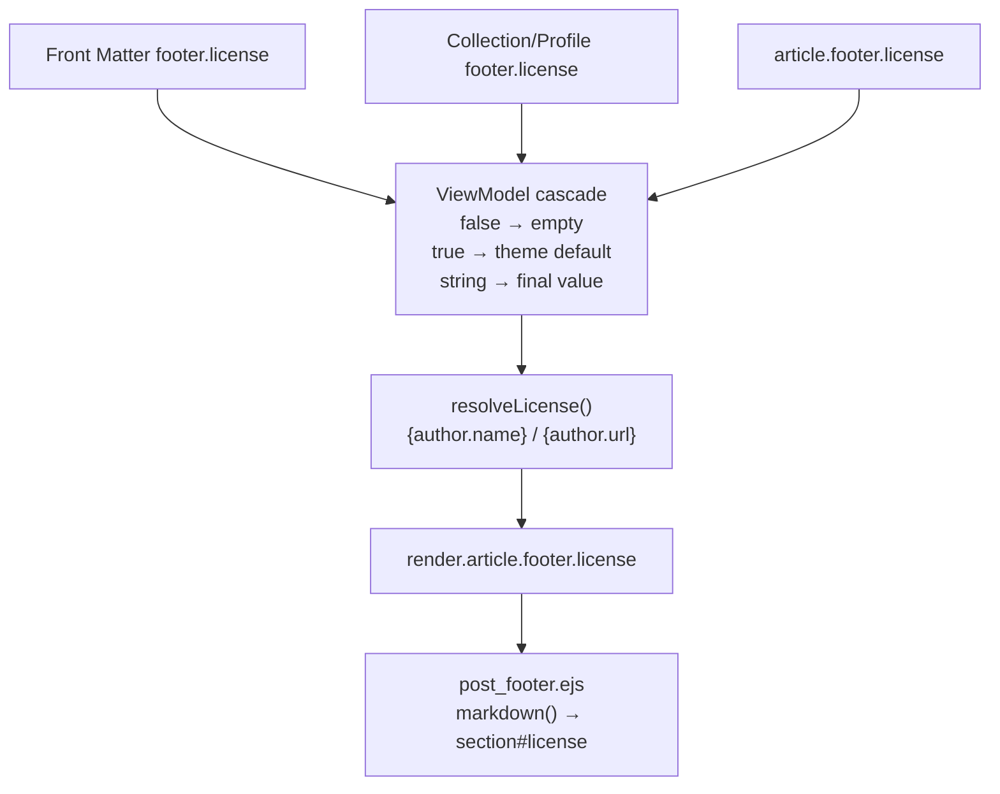

# 文章页脚与元数据

> [!IMPORTANT]
> v2 页面与集合统一使用 `footer`、`article` 与 `collection`；本页涉及字段名时，以[内容配置 Schema v2](content-schema-v2.md)为准。

<details>
<summary>相关源码文件</summary>

生成此页面时参考的主题源码文件：

- [layout/_partial/main/article/post_footer.ejs](../../../layout/_partial/main/article/post_footer.ejs)
- [layout/_partial/main/article/post_tags.ejs](../../../layout/_partial/main/article/post_tags.ejs)
- [layout/_partial/main/article/contributors.ejs](../../../layout/_partial/main/article/contributors.ejs)
- [source/css/_components/partial/article-footer.styl](../../../source/css/_components/partial/article-footer.styl)
- [scripts/filters/lib/page-view-model.js](../../../scripts/filters/lib/page-view-model.js)

</details>

本页介绍严格内容页面正文下方的标签行与页脚组件。普通 Post、Topic、Wiki 与 Notebook 都由 `post_footer.ejs` 消费已解析的 `PageViewModel.render.article.footer`；Post 与 Topic 由 `post_tags.ejs` 消费标签投影，Notebook 的 `note_tags.ejs` 消费 `render.article.tags`。普通独立页面不经过文章页脚链。文章之间的导航元素见[相关内容与导航](related-content.md)。

---

## 组件概览

普通 Post、Topic、Wiki 与 Notebook 页脚由 [post_footer.ejs](../../../layout/_partial/main/article/post_footer.ejs) 接收显式 `footer` local。许可、分享、贡献者与引用级联都只在各自 ViewModel 构建时执行一次：

| 区块 ID | 显示条件 | 本地化键 |
|---------|----------|----------|
| `#references` | 已解析的 `references` 投影数组非空 | `meta.references` |
| `#license` | 已解析的 `footer.license` 非空 | `meta.license` |
| `#contributors` | `footer.contributor` 非 null | `meta.contributors` |
| `#share` | 分享启用且平台列表非空 | `meta.share` |

外层容器是 `<div class="article-footer">`，仅当至少一个区块存在时输出；空的 `article-footer` 经 `&:empty { display: none }` 隐藏。

**组件组装图：**



**参考源码**：[layout/_partial/main/article/post_footer.ejs](../../../layout/_partial/main/article/post_footer.ejs)

---

## 文章标签行

普通 Post 与 Topic 的 `render.article.tags` 已在构建边界合并 Hexo 标签名称和路径；数组非空时，正文结束后、`article-footer` 之前渲染一行本文标签：

- 模板 [post_tags.ejs](../../../layout/_partial/main/article/post_tags.ejs) 只接收显式 `tags` local；每个标签渲染为 `<a class="tag" href="${pretty_url(tag.path)}">`，链接内先输出 `default:hashtag` 图标再输出标签名。
- 样式 [source/css/_components/partial/article-tags.styl](../../../source/css/_components/partial/article-tags.styl)：复用 [source/css/_defines/func.styl](../../../source/css/_defines/func.styl) 的 `tag-chip()` mixin——胶囊圆角（`border-radius: 999px`）、`var(--block)` 底色、`$fs-13`，前缀为内联 hashtag 图标（`.tag svg`：`1em`、`opacity: .4`）；hover 时文字变 `var(--text)`、背景变 `var(--block-border)`、图标变主题色且不透明；容器 `justify-content: center` 居中，`margin: 2rem -0.5rem 0` 抵消标签外边距并保留与正文的 2rem 间距。与标签页（`/blog/tags/`）标签胶囊为同一套样式。
- Post、Topic 和 Notebook 的标签行都由已解析的 `footer.show_tags` 控制：全局 `article.footer.show_tags` 进入 Collection → Page 级联，Page 可用 `footer.show_tags` 覆盖；Wiki 页不渲染标签行。笔记页由 [layout/_partial/main/notebook/note_tags.ejs](../../../layout/_partial/main/notebook/note_tags.ejs) 消费 `render.article.tags`，标签名与链接已在模型层按笔记本标签树解析，并复用同一 `article-tags` 容器与 `tag-chip()` 胶囊样式。

**参考源码**：[layout/_partial/main/article/post_tags.ejs](../../../layout/_partial/main/article/post_tags.ejs)、[layout/page.ejs](../../../layout/page.ejs)、[source/css/_components/partial/article-tags.styl](../../../source/css/_components/partial/article-tags.styl)、[source/css/_defines/func.styl](../../../source/css/_defines/func.styl)

---

## 引用区块

Post/Topic/Wiki/Notebook 的 `render.article.footer.references` 为非空数组时渲染。每个条目经 Hexo 的 `markdown()` 辅助函数处理，包装在 `<ul>` 内的 `<li class="post-title">` 元素中。

```
render.article.footer.references: [
  "[Author, Title](url)",
  "Plain text reference"
]
```

`.post-title` 列表项样式设置 `line-height: 1.2` 与 `word-break: break-all`，适合 URL 显示。

**参考源码**：[layout/_partial/main/article/post_footer.ejs](../../../layout/_partial/main/article/post_footer.ejs)、[source/css/_components/partial/article-footer.styl](../../../source/css/_components/partial/article-footer.styl)

---

## 许可解析

Post/Topic/Wiki/Notebook 的许可文本在 ViewModel 构建期按页面、Collection/Profile 与主题默认级联；模板只接收最终字符串。解析出的字符串可能包含 `{author.name}` 与 `{author.url}` 占位符，由模型使用已登记作者数据插值。

### 解析逻辑



### 按页面类型的解析

| 页面类型 | 关闭机制 | 开启机制 | 默认来源 |
|----------|----------|----------|----------|
| `post` | `page.footer.license: false` | `page.footer.license: true` 或 `<string>` | `article.footer.license` |
| Wiki / Topic / Notebook | `footer.license: false` | Collection 或 Page `footer.license: true` 或 `<string>` | Collection → `article.footer.license` |

- `footer.license: true` 表示使用全局 `article.footer.license`
- Collection 默认继承全局许可协议；页面级 `footer.license` 覆盖 Collection，`false` 生成空许可字符串

### 作者插值

对解析出的许可字符串做替换：

- `item.presentation.article.author` 匹配运行时作者表中的键时使用该作者对象
- 否则使用运行时 `defaultAuthor`
- `{author.name}` → `author.name`
- `{author.url}` → `author.url`

`_config.yml` 中的示例许可模板：

```yaml
article:
  footer:
    license: 'This work by [{author.name}]({author.url}) is licensed under CC BY-NC-SA 4.0.'
```

**参考源码**：[scripts/lib/models/index.js](../../../scripts/lib/models/index.js)、[layout/_partial/main/article/post_footer.ejs](../../../layout/_partial/main/article/post_footer.ejs)

---

## 贡献者区块

Post/Topic/Wiki/Notebook 的模型先解析 `services.contributors` 选中的 provider，再根据 `services.contributors.github.repositories` 与 `item.source.file` 按最长 `sourcePrefix` 匹配，生成 `render.article.footer.contributor`；无法匹配时整个区块省略。

关键样式：

| 元素 | 样式 |
|------|------|
| `.header` | Flexbox 行，右侧 `a.edit` 按钮 |
| `a.edit`（编辑本页按钮） | 铅笔图标 SVG + 标签，悬停变主题色 |
| `.users-wrap .grid-box` | CSS grid，`minmax(72px, 1fr)` 列 |
| `.user-card .card-link` | 32×32px 头像图片 |

`repositories` 映射决定贡献者头部是否显示「编辑本页」链接。配置结构见[数据服务与组件](../06-数据服务与组件/data-widgets-overview.md)。

**参考源码**：[scripts/lib/models/index.js](../../../scripts/lib/models/index.js)、[layout/_partial/main/article/post_footer.ejs](../../../layout/_partial/main/article/post_footer.ejs)、[source/css/_components/partial/article-footer.styl](../../../source/css/_components/partial/article-footer.styl)

---

## 社交分享

当前开发版（rc.4 之后）的完整服务清单来自 `scripts/lib/share-services.js`：

| 服务 | 行为 |
| :--- | :--- |
| `qrcode` | 切换通用二维码面板，二维码内容为当前永久链接 |
| `weibo` | 分享 URL、标题、图片与摘要到微博 |
| `x` | 分享标题与 URL 到 X |
| `telegram` | 分享标题与 URL 到 Telegram |
| `whatsapp` | 分享标题与 URL 到 WhatsApp |
| `email` | 打开含标题与永久链接的 mailto 链接 |

普通 Post 和 Topic 继承 article.footer.share；Wiki、Notebook 默认关闭。Collection 或 Page 的 footer.share 为 true 时恢复全局列表，数组显式选择，false 或 [] 隐藏；有效服务为空不渲染。分享参数经 URL 编码，属性经 HTML 转义。

共享 partial `layout/_partial/main/article/share.ejs` 输出独立 article-share 区域；qrcode 使用 share-qrcode 面板与 api.qrserver.com 生成图片，通过 util.toggle 切换。分享图标由主题 share: 图标命名空间提供。

## CSS 与消费入口

许可、参考资料和贡献者区域由 `source/css/_components/partial/article-footer.styl` 管理；分享区域由 `source/css/_components/partial/article-share.styl` 管理。Post、Wiki、Notebook 的内容模板复用共享 share partial，服务动作统一由 share-services 注册表生成。
