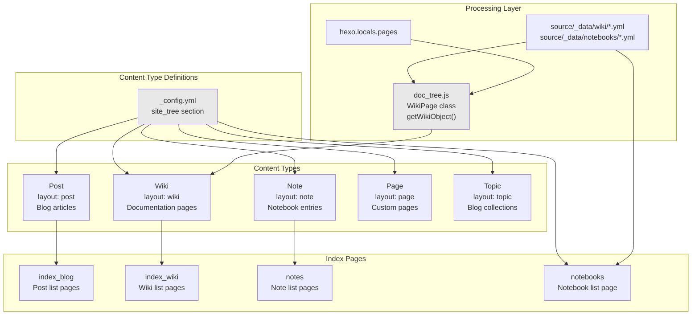
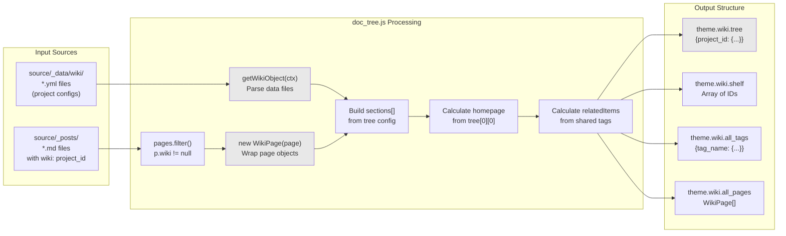
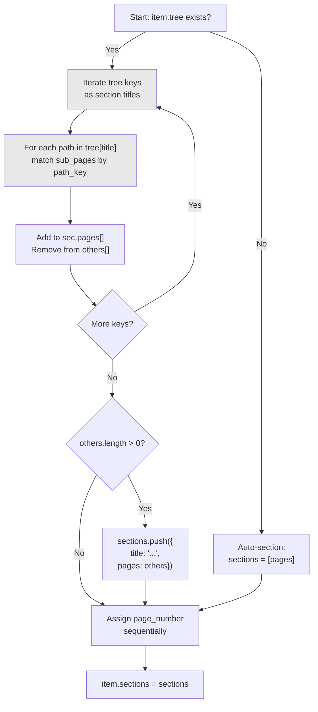
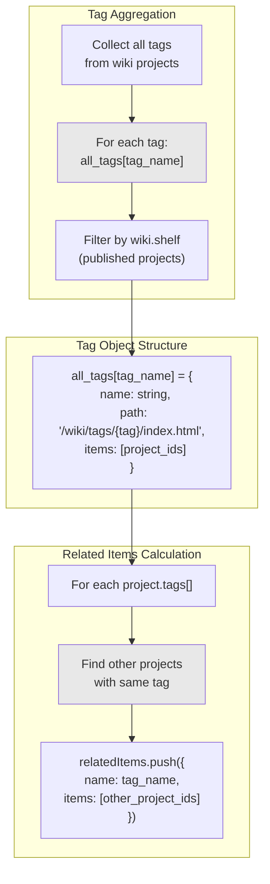

# 内容组织

<details>
<summary>相关源码文件</summary>

生成此页面时参考的主题源码文件：

- [layout/_partial/main/post_list/post_card.ejs](../../../layout/_partial/main/post_list/post_card.ejs)
- [layout/index.ejs](../../../layout/index.ejs)
- [scripts/events/lib/doc_tree.js](../../../scripts/events/lib/doc_tree.js)
- [_config.yml](../../../_config.yml)

</details>

本文介绍 Stellar 如何组织与处理不同内容类型：文章（post）、wiki 页面、笔记本与自定义页面。涵盖 `site_tree` 配置定义的内容类型层级、构建期处理 wiki 文档结构的 `doc_tree.js`，以及 `theme.wiki.tree` 与 `theme.notebooks.tree` 对象的构建方式。

渲染这些内容类型见[页面模板与路由](../02-布局系统/page-templates-routing.md)；列表中的内容项展示见[文章列表与卡片组件](post-lists-cards.md)与[文档系统](wiki-docs.md)。

## 内容类型系统概览

Stellar 支持四种主要内容类型，各有独立布局特征与配置项。内容类型由页面 front-matter 的 `layout` 字段决定。



**参考源码**：[_config.yml](../../../_config.yml)、[scripts/events/lib/doc_tree.js](../../../scripts/events/lib/doc_tree.js)

### 内容类型配置矩阵

每种内容类型在 `_config.yml` 的 `site_tree` 小节中配置：

| 内容类型 | 配置键 | 基础目录 | 菜单 ID | 左栏小部件 | 右栏小部件 |
|----------|--------|----------|---------|------------|------------|
| **文章** | `post` | N/A | `post` | `related, recent` | `ghrepo, toc` |
| **文章索引** | `index_blog` | `blog` | `post` | `welcome, recent` | （空） |
| **专栏** | `topic` | N/A | `post` | （继承 post） | （继承 post） |
| **专栏索引** | `index_topic` | `topic` | `post` | （继承 index_blog） | （继承 index_blog） |
| **Wiki 页面** | `wiki` | N/A | `wiki` | `tree, related, recent` | `ghrepo, toc` |
| **Wiki 索引** | `index_wiki` | `wiki` | `wiki` | `related, recent` | （空） |
| **笔记本** | `notebooks` | `notebooks` | `notebooks` | `recent` | `null` |
| **笔记列表** | `notes` | N/A | `notebooks` | `tagtree, recent` | `null` |
| **笔记页面** | `note` | N/A | `notebooks` | `tagtree, recent` | `toc` |
| **页面** | `page` | N/A | （无） | `recent` | `toc` |

**参考源码**：[_config.yml](../../../_config.yml)

## Wiki 系统架构

wiki 系统是 Stellar 最复杂的内容组织功能，用构建期处理器把 YAML 配置文件与 Markdown 页面转换为层级化文档结构。

### Wiki 数据流与处理流水线



**参考源码**：[scripts/events/lib/doc_tree.js](../../../scripts/events/lib/doc_tree.js)

### WikiPage 类结构

`WikiPage` 类包装 Hexo 页面对象，为 wiki 页面提供规范化接口：

```javascript
class WikiPage {
  constructor(page) { 
    this.id = page._id
    this.wiki = page.wiki            // front-matter 中的项目 ID
    this.title = page.title
    this.path = page.path            // 带 .html 的完整路径
    this.path_key = page.path.replace('.html', '')
    this.layout = page.layout
    this.updated = page.updated
  }
}
```

处理过程中还会添加：

- `page_number`：项目内的顺序号
- `is_homepage`：项目首页标记

**参考源码**：[scripts/events/lib/doc_tree.js](../../../scripts/events/lib/doc_tree.js)

### Wiki 项目配置结构

每个 wiki 项目配置在用户站点的 `source/_data/wiki/<project_id>.yml`：

```yaml
# 项目标识
title: Project Display Name
name: short-name

# 组织
base_dir: wiki/project/  # URL 路径前缀
sort: 100                # 越大越靠前

# 标签
tags: [tag1, tag2]

# 文档结构
tree:
  "Section Title":
    - page-path-1
    - page-path-2
  "Another Section":
    - page-path-3

# 首页（可选）
homepage: path/to/homepage  # 默认取 tree[0][0]
```

注意：wiki 项目数据在**用户站点**的 `source/_data/wiki/`，不属于主题仓库。

**参考源码**：[scripts/events/lib/doc_tree.js](../../../scripts/events/lib/doc_tree.js)

### 小节构建算法

`doc_tree.js` 为每个 wiki 项目构建 `sections` 数组：



**参考源码**：[scripts/events/lib/doc_tree.js](../../../scripts/events/lib/doc_tree.js)

### 首页检测逻辑

未显式配置 `homepage` 时，系统自动选择第一个可访问页面：

1. **首选**：取 `tree[first_section][0]`
2. **兜底**：未定义 tree 时用 `sub_pages[0]`
3. **转换**：homepage 为字符串时包装为 `{path: homepage}`
4. **标记**：设置 `homepage.is_homepage = true`

**参考源码**：[scripts/events/lib/doc_tree.js](../../../scripts/events/lib/doc_tree.js)

### 标签系统与相关项目

wiki 系统维护全局标签索引并计算相关项目：



**参考源码**：[scripts/events/lib/doc_tree.js](../../../scripts/events/lib/doc_tree.js)

## 笔记本系统

笔记本系统比 wiki 更简单：笔记本是按标签组织的笔记集合，而非层级树结构。

### 笔记本配置

笔记本配置在用户站点的 `source/_data/notebooks/<notebook_id>.yml`：

| 字段 | 说明 | 覆盖位置 | 默认 |
|------|------|----------|------|
| `base_dir` | URL 路径前缀 | 笔记本 YAML | `notebooks/` |
| `menu_id` | 导航高亮 | 笔记本 YAML / 笔记 front-matter | `notebooks` |
| `per_page` | 分页限制 | 笔记本 YAML | `null`（Hexo 默认） |
| `order_by` | 排序字段 | 笔记本 YAML | `-updated` |
| `license` | 许可文本 | 笔记本 YAML / 笔记 front-matter | `false` |
| `share` | 显示分享按钮 | 笔记本 YAML / 笔记 front-matter | `false` |
| `leftbar` | 左栏小部件 | 笔记本 YAML / 笔记 front-matter | `tagtree, recent` |
| `rightbar` | 右栏小部件 | 笔记本 YAML / 笔记 front-matter | `toc` |

**参考源码**：[_config.yml](../../../_config.yml)

### 笔记本与 Wiki 对比

| 特性 | Wiki | 笔记本 |
|------|------|--------|
| **结构** | 带小节的层级树 | 带标签的扁平列表 |
| **配置** | `tree` 对象（节标题） | 基于标签的过滤 |
| **首页** | 从 tree 自动检测 | 不适用 |
| **导航** | 侧边栏 tree 小部件 | tagtree 小部件 |
| **相关内容** | 基于共享标签 | 基于共享标签 |
| **用途** | 文档、指南 | 笔记、博客式内容 |

**参考源码**：[_config.yml](../../../_config.yml)、[scripts/events/lib/doc_tree.js](../../../scripts/events/lib/doc_tree.js)

## 文章与页面内容类型

### 博客文章

文章使用 `post` 布局，通常存放在 `source/_posts/`：

- **默认 menu_id**：`post`（可被 front-matter 覆盖）
- **索引页**：生成于 `{site_tree.index_blog.base_dir}/`（默认 `/blog/`）
- **侧边栏配置**：左 `related, recent` / 右 `ghrepo, toc`
- **自动特性**：
  - 封面图解析（`auto_banner: true` 时含 Unsplash 自动生成）
  - 摘要生成（未指定时取前 128 字符）
  - 许可页脚（默认 CC BY-NC-SA 4.0）
  - 相关文章计算（需 `hexo-related-popular-posts` 插件）
  - AI 成分标签：front-matter `ai_label` 字段（`manual` / `polished` / `generated` / `reviewed`）标记文章 AI 成分，文案由多语言系统提供（`languages/*.yml` 的 `meta.ai_label.*`，缺失时不渲染），颜色与可选图标由 `article.ai_label` 配置（彩色文字、无底色）；未设置时取 `default`（为空则不显示）；文章页显示在顶部面包屑行最右（阅读时长右侧），banner 含图片时文字用默认颜色，文章列表卡片不显示

**参考源码**：[_config.yml](../../../_config.yml)

### 专栏

专栏是文章的集合，使用 `topic` 布局，继承 `post` 类型的大部分配置，可在 `{site_tree.index_topic.base_dir}/`（默认 `/topic/`）建立独立索引。

专栏列表页与其他博客列表页一致，在 navbar 上方展示置顶文章轮播（无需开关配置，有置顶文章即渲染）。

**参考源码**：[_config.yml](../../../_config.yml)

### 自定义页面

页面使用 `page` 布局，用于 About、Contact 等独立内容：

- **无默认 menu_id**（需在 front-matter 指定）
- **侧边栏配置**：左 `recent` / 右 `toc`
- **无自动索引页**——每个页面独立

**参考源码**：[_config.yml](../../../_config.yml)

## 内容组织数据结构

### theme.wiki 对象结构

`doc_tree.js` 处理后，模板中通过 `theme.wiki` 访问 wiki 数据：

```javascript
{
  tree: {
    "project-id": {
      id: "project-id",
      title: "Display Title",
      name: "Short Name",
      base_dir: "wiki/project/",
      sort: 100,
      pin: 1,          // 置顶轮播排序值（可选，设置即置顶，数值降序，true 视作 1）
      tags: ["tag1", "tag2"],
      homepage: WikiPage,  // 首页或配置的 homepage
      sections: [
        {
          title: "Section Name",
          pages: [WikiPage, WikiPage, ...]
        },
        ...
      ],
      pages: [WikiPage, ...],  // 该项目全部页面
      relatedItems: [
        {
          name: "tag1",
          items: ["other-project-id", ...]
        },
        ...
      ]
    },
    ...
  },
  shelf: ["project-id", ...],  // 已发布项目 ID
  all_tags: {
    "tag-name": {
      name: "tag-name",
      path: "/wiki/tags/tag-name/index.html",
      items: ["project-id", ...]
    },
    ...
  },
  all_pages: [WikiPage, ...]  // 所有项目的全部 wiki 页面
}
```

**参考源码**：[scripts/events/lib/doc_tree.js](../../../scripts/events/lib/doc_tree.js)

### 模板访问模式

EJS 模板中访问 wiki 数据的常见方式：

```javascript
// 获取指定项目
const project = theme.wiki.tree['project-id']

// 遍历所有项目
for (let id in theme.wiki.tree) {
  const project = theme.wiki.tree[id]
}

// 检查项目是否已发布
if (theme.wiki.shelf.includes(project_id)) { ... }

// 获取带指定标签的所有页面
const tag_info = theme.wiki.all_tags['documentation']
const project_ids = tag_info.items
```

**参考源码**：[scripts/events/lib/doc_tree.js](../../../scripts/events/lib/doc_tree.js)

## 内容类型解析流程

Hexo 为内容文件决定布局的流程：

```mermaid
graph TD
    START["Content file loaded"]
    FM["Read front-matter"]
    
    FM --> LAYOUT_SET{"layout field<br/>specified?"}
    LAYOUT_SET -->|Yes| USE_FM["Use front-matter layout"]
    LAYOUT_SET -->|No| CHECK_PATH{"Path matches<br/>content type?"}
    
    CHECK_PATH -->|"_posts/" or "posts/"| DEFAULT_POST["layout = 'post'"]
    CHECK_PATH -->|"Other path"| DEFAULT_PAGE["layout = 'page'"]
    
    USE_FM --> DETERMINE_MENU_ID["Determine menu_id"]
    DEFAULT_POST --> DETERMINE_MENU_ID
    DEFAULT_PAGE --> DETERMINE_MENU_ID
    
    DETERMINE_MENU_ID --> MENU_ID_SET{"menu_id in<br/>front-matter?"}
    MENU_ID_SET -->|Yes| USE_FM_MENU["Use front-matter menu_id"]
    MENU_ID_SET -->|No| LOOKUP_DEFAULT["Lookup site_tree[layout].menu_id"]
    
    USE_FM_MENU --> APPLY_CONFIG["Apply site_tree config<br/>for layout and menu_id"]
    LOOKUP_DEFAULT --> APPLY_CONFIG
    
    APPLY_CONFIG --> RENDER["Render with layout template"]
    
    style DETERMINE_MENU_ID fill:#e8e8e8
    style APPLY_CONFIG fill:#e8e8e8
```

**参考源码**：[_config.yml](../../../_config.yml)
