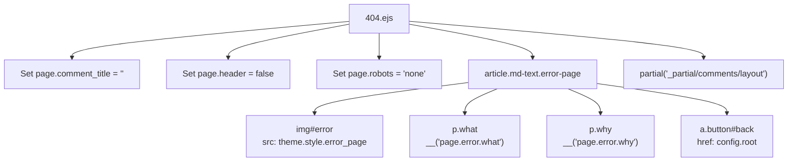
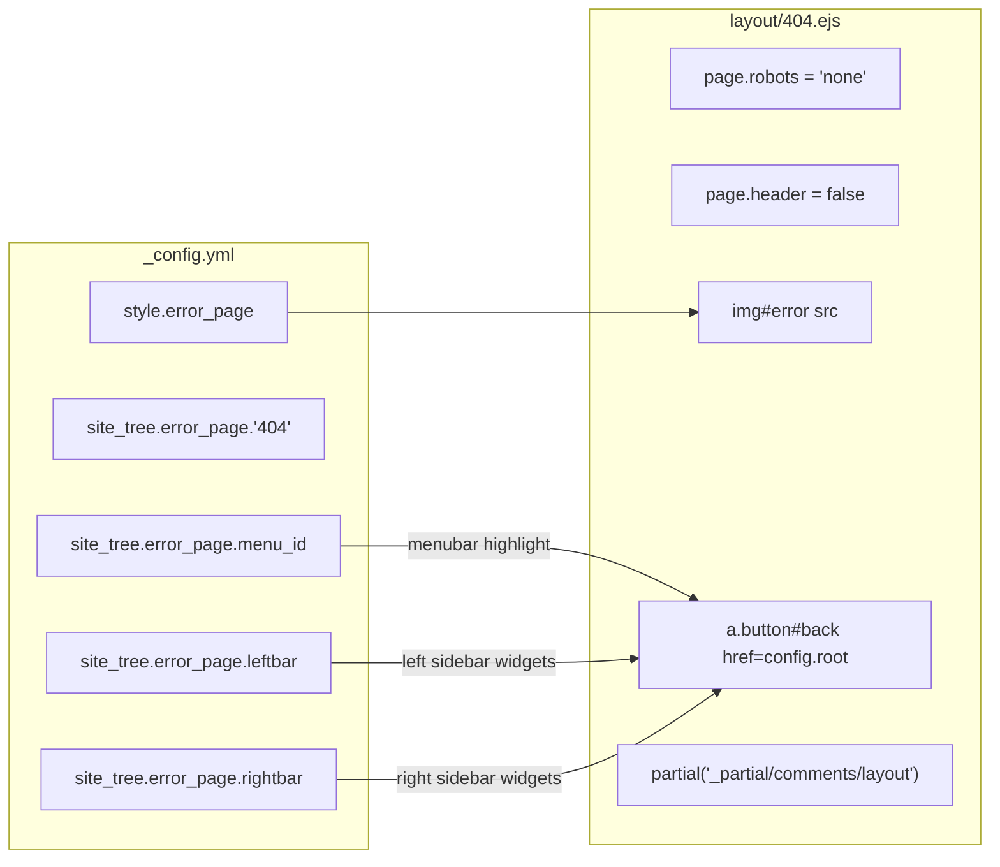
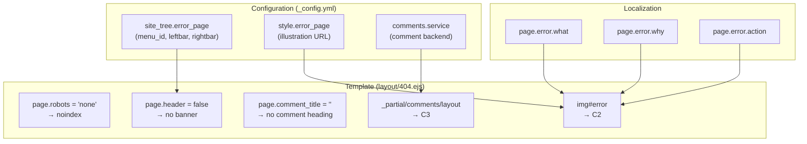

# 错误页

<details>
<summary>相关源码文件</summary>

生成此页面时参考的主题源码文件：

- [layout/404.ejs](../../../layout/404.ejs)
- [layout/_partial/main/article/article_footer.ejs](../../../layout/_partial/main/article/article_footer.ejs)
- [scripts/helpers/related_posts.js](../../../scripts/helpers/related_posts.js)

</details>

本页介绍 404 错误页模板（`layout/404.ejs`）、其在 `_config.yml` 中的配置项，以及页面如何控制 SEO 元数据、评论与侧边栏布局。通用页面布局与侧边栏配置见[布局系统](../02-布局系统/layout-overview.md)；可选出现在错误页上的评论系统见[评论系统](../07-外部集成/comment-systems.md)。

---

## 模板概览

错误页模板位于 [layout/404.ejs](../../../layout/404.ejs)，是独立 EJS 文件，渲染简单的错误信息：插图、简要说明与返回首页链接。

**模板：`layout/404.ejs`**

```
layout/404.ejs
  → 设置 page.comment_title、page.header、page.robots
  → 从 theme.style.error_page 渲染 img#error
  → 经 __('page.error.*') 渲染本地化字符串
  → 渲染指向 config.root 的返回按钮
  → 引入 _partial/comments/layout
```

### 模板渲染流程



**参考源码**：[layout/404.ejs](../../../layout/404.ejs)

---

## 页面行为设置

`404.ejs` 在渲染任何 HTML 前以编程方式设置三个属性：

| 属性 | 值 | 效果 |
|---|---|---|
| `page.comment_title` | `''`（空字符串） | 隐藏评论区块标题 |
| `page.header` | `false` | 隐藏页面页头/横幅区 |
| `page.robots` | `'none'` | 注入 `<meta name="robots" content="none">`——禁止收录 |

`robots` 值 `'none'` 指示 Googlebot 与其他爬虫既不收录页面也不跟踪链接，适合永不应出现在搜索结果中的 404 页面。

**参考源码**：[layout/404.ejs](../../../layout/404.ejs)

---

## 配置

### `site_tree.error_page`

404 页面的侧边栏布局、菜单高亮与路径由 `_config.yml` 的 `site_tree.error_page` 块控制：

```yaml
error_page:
  menu_id: post
  '404': '/404.html'
  leftbar: recent
  rightbar: 
```

| 键 | 值 | 说明 |
|---|---|---|
| `menu_id` | `post` | 错误页激活时高亮侧边栏导航中的 "post" 菜单项 |
| `'404'` | `/404.html` | 生成的 404 页面路径 |
| `leftbar` | `recent` | 错误页左栏小部件 |
| `rightbar` | （空） | 错误页右栏小部件 |

侧边栏小部件名（`recent` 等）从 `_data/widgets.yml` 解析。配置细节见[侧边栏系统](../02-布局系统/sidebar-system.md)。

### `style.error_page`

`img#error` 中显示的插图图片在 `style.error_page` 下配置：

```yaml
style:
  error_page: https://gcore.jsdelivr.net/gh/cdn-x/placeholder@1.0.12/404/1c830bfcd517d.svg
```

模板中以 `theme.style.error_page` 引用，可替换为任意自定义 SVG 或图片 URL。

**参考源码**：[_config.yml](../../../_config.yml)、[layout/404.ejs](../../../layout/404.ejs)

---

## 配置参考图



**参考源码**：[layout/404.ejs](../../../layout/404.ejs)、[_config.yml](../../../_config.yml)

---

## 本地化字符串

错误页使用语言文件中的三个本地化键（见[本地化](../08-本地化/localization.md)）：

| 键 | 模板中的用途 |
|---|---|
| `page.error.what` | 加粗标题：发生了什么 |
| `page.error.why` | 正文：为什么会这样 |
| `page.error.action` | 「返回首页」按钮的标签 |

经 `__()` 辅助函数访问。

**参考源码**：[layout/404.ejs](../../../layout/404.ejs)

---

## 错误页上的评论

模板无条件引入评论布局 partial：

```ejs
<%- partial('_partial/comments/layout') %>
```

设置 `page.comment_title = ''` 会隐藏评论小部件上方通常渲染的标题。评论系统本身（服务、懒加载等）由全局 `comments` 配置控制，详见[评论系统](../07-外部集成/comment-systems.md)。

评论是否实际渲染取决于：

- `_config.yml` 中启用的 `comments.service`
- 用户是否配置了有效的评论后端

**参考源码**：[layout/404.ejs](../../../layout/404.ejs)、[_config.yml](../../../_config.yml)

---

## 错误页触点总结



**参考源码**：[layout/404.ejs](../../../layout/404.ejs)、[_config.yml](../../../_config.yml)
