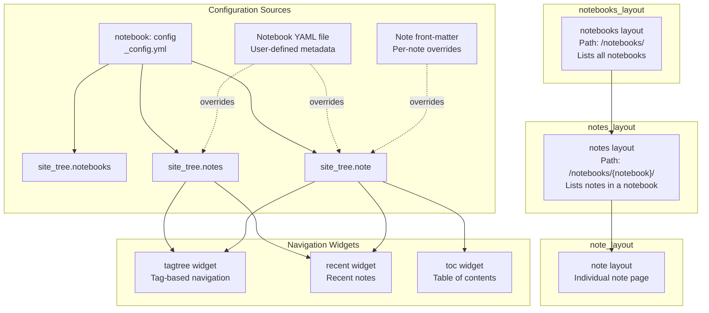
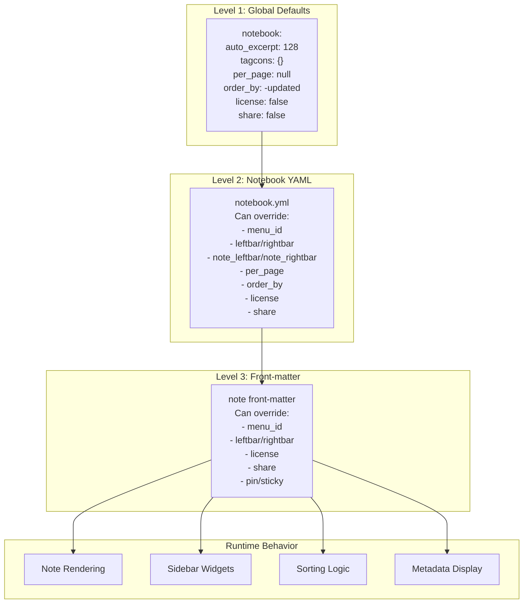
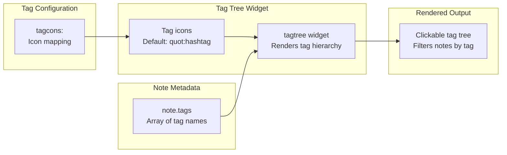
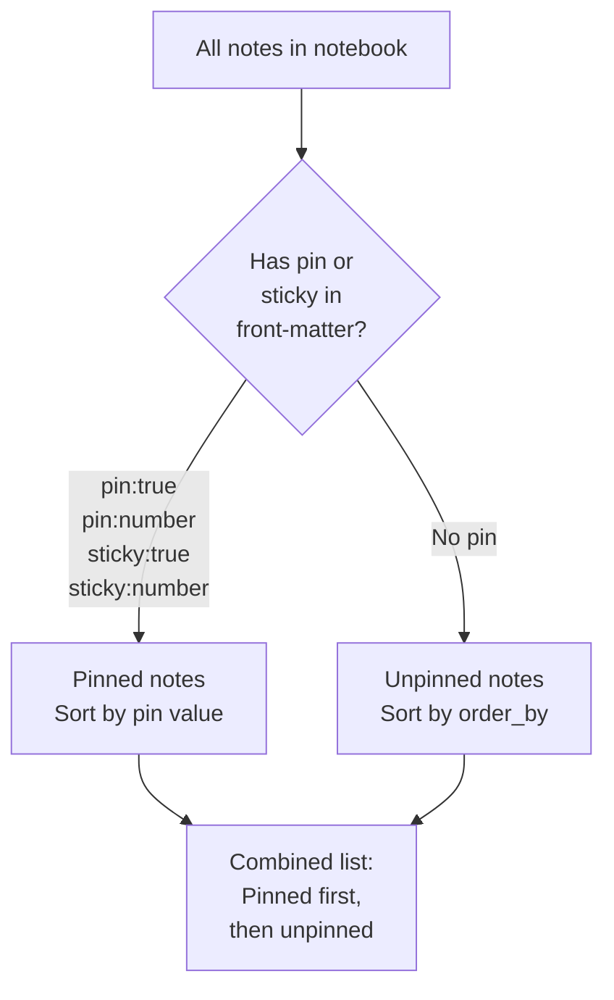
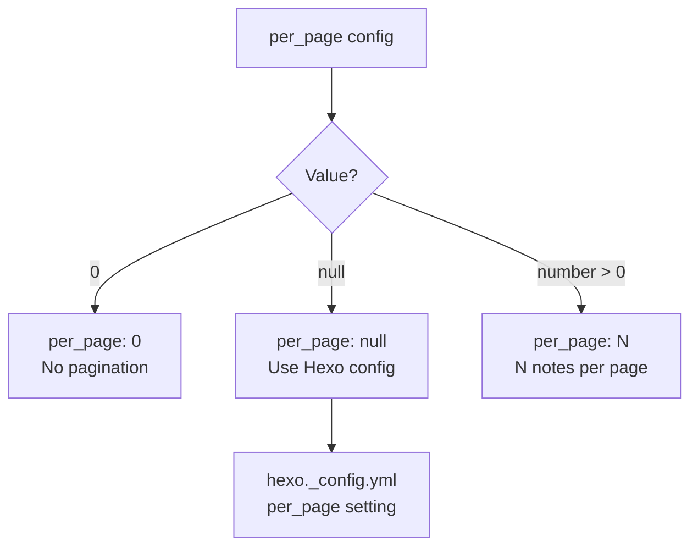
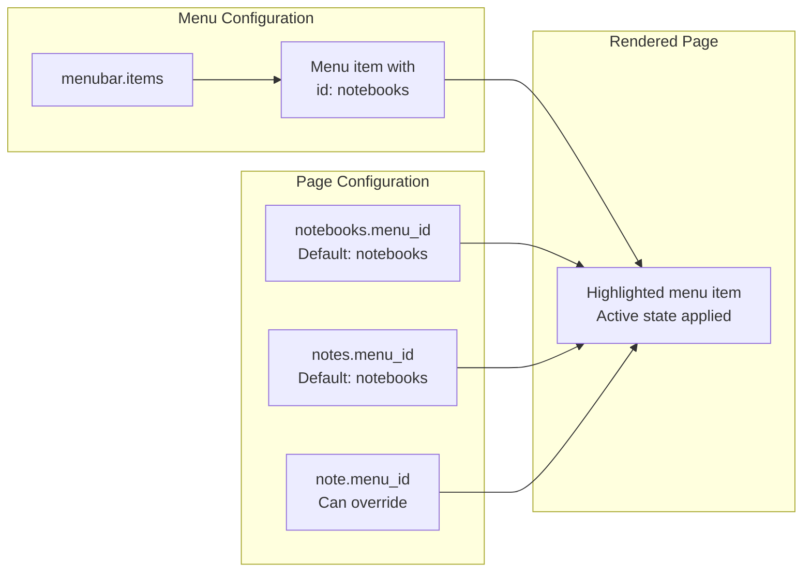
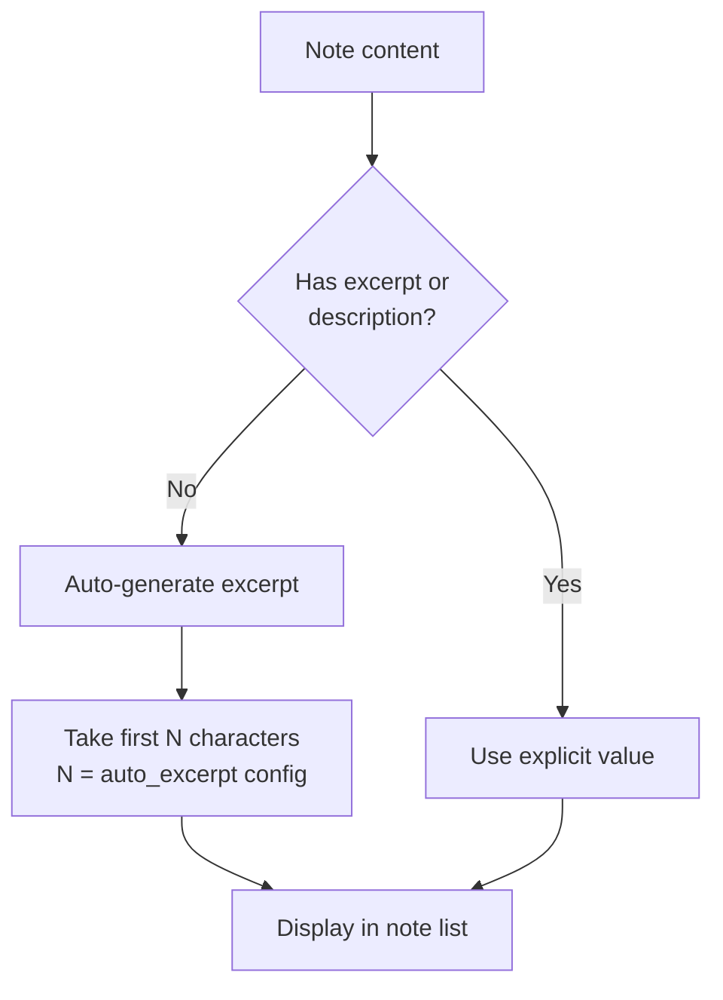

# 笔记本系统

<details>
<summary>相关源码文件</summary>

生成此页面时参考的主题源码文件：

- [.github/workflows/npm-publish.yml](../../../.github/workflows/npm-publish.yml)
- [.npmignore](../../../.npmignore)
- [LICENSE](../../../LICENSE)
- [README.md](../../../README.md)
- [_config.yml](../../../_config.yml)
- [package.json](../../../package.json)

</details>

## 目的与范围

笔记本系统为 Stellar 中的笔记与知识管理提供轻量、基于标签的组织结构。它实现三层架构：笔记本索引、笔记本内笔记列表、单条笔记页面。与[文档系统](wiki-docs.md)（使用层级小节树）不同，笔记本系统用扁平标签导航，组织更灵活。

---

## 三层架构

笔记本系统由三种页面类型构成层级导航结构：



**参考源码**：[_config.yml](../../../_config.yml)

---

## 页面类型配置

### 笔记本列表页

`notebooks` 布局以索引页形式显示全部笔记本，是笔记本系统的顶层入口。

| 配置键 | 默认值 | 说明 |
|--------|--------|------|
| `base_dir` | `notebooks` | 笔记本列表的 URL 路径；也是未设置自定义 `base_dir` 的笔记本的默认路径前缀 |
| `menu_id` | `notebooks` | 导航栏中高亮的菜单项 |
| `leftbar` | `recent` | 左栏显示跨全部笔记本的最近笔记 |
| `rightbar` | `null` | 默认空右栏 |

**参考源码**：[_config.yml](../../../_config.yml)

### 笔记列表页

`notes` 布局显示指定笔记本内的全部笔记，支持可选分页与标签过滤。

| 配置键 | 默认值 | 覆盖位置 | 说明 |
|--------|--------|----------|------|
| `menu_id` | `notebooks` | 笔记本 YAML：`menu_id`<br/>笔记 front-matter：`menu_id` | 高亮的菜单项 |
| `leftbar` | `tagtree, recent` | 笔记本 YAML：`leftbar` | 显示当前笔记本的标签树与最近笔记 |
| `rightbar` | `null` | 笔记本 YAML：`rightbar` | 右栏小部件 |

**参考源码**：[_config.yml](../../../_config.yml)

### 单条笔记页

`note` 布局渲染单条笔记，含完整内容与元数据。

| 配置键 | 默认值 | 覆盖位置 | 说明 |
|--------|--------|----------|------|
| `leftbar` | `tagtree, recent` | 笔记本 YAML：`note_leftbar`<br/>笔记 front-matter：`leftbar` | 显示标签树与最近笔记 |
| `rightbar` | `toc` | 笔记本 YAML：`note_rightbar`<br/>笔记 front-matter：`rightbar` | 默认显示目录 |

带 `tags` 的笔记在正文末尾渲染一行所属标签，点击跳转到笔记本标签过滤页；该行复用文章标签行的 `article-tags` 容器与胶囊样式，详见[文章页脚与元数据](article-footer-metadata.md)。

**参考源码**：[_config.yml](../../../_config.yml)、[layout/_partial/main/notebook/note_tags.ejs](../../../layout/_partial/main/notebook/note_tags.ejs)

---

## 配置层级与覆盖系统

笔记本系统实现三级配置级联，可精确控制行为与外观：



**配置参数：**

| 参数 | 类型 | 全局默认 | 覆盖范围 | 说明 |
|------|------|----------|----------|------|
| `auto_excerpt` | `number` | `128` | 无 | 未指定 `excerpt` 与 `description` 时自动摘要的长度 |
| `tagcons` | `object` | `{ '': 'quot:hashtag' }` | 无 | 标签图标映射（显示在标签树中） |
| `per_page` | `number\|null` | `null` | 笔记本 YAML | 每页笔记数（0 = 不分页，null = 用 Hexo 配置） |
| `order_by` | `string` | `-updated` | 笔记本 YAML | 笔记排序（默认按更新时间降序） |
| `license` | `boolean\|string` | `false` | 笔记本 YAML、front-matter | 许可显示（false = 隐藏，true = 用主题许可，string = 自定义文本） |
| `share` | `boolean\|array` | `false` | 笔记本 YAML、front-matter | 分享按钮显示 |

**参考源码**：[_config.yml](../../../_config.yml)

---

## 标签树导航系统

笔记本系统用基于标签的导航替代层级小节。`tagtree` 小部件是主要导航机制：



标签可通过 `tagcons` 配置自定义图标：

```yaml
notebook:
  tagcons:
    'javascript': 'mdi:language-javascript'
    'python': 'mdi:language-python'
    '': 'quot:hashtag'  # 未匹配标签的默认图标
```

**参考源码**：[_config.yml](../../../_config.yml)

---

## 排序与置顶系统

笔记支持带优先级置顶的灵活排序：



**置顶笔记：**

在笔记 front-matter 中设置 `pin` 或 `sticky`：

```yaml
---
pin: true      # 置顶
pin: 10        # 带优先级 10 置顶（越大越靠前）
sticky: true   # 同 pin:true
sticky: 5      # 同 pin:5
---
```

**排序：**

`order_by` 决定未置顶笔记的排序。默认 `-updated`（最近更新优先）。

**参考源码**：[_config.yml](../../../_config.yml)

---

## 分页配置

分页行为在笔记本级控制：



**配置示例：**

```yaml
# 全局默认（应用于所有笔记本）
notebook:
  per_page: null  # 使用 Hexo 的分页配置
```

```yaml
# notebook.yml 中笔记本级覆盖
per_page: 20  # 每页 20 条笔记
```

```yaml
# 禁用某笔记本的分页
per_page: 0  # 全部笔记放在一页
```

**参考源码**：[_config.yml](../../../_config.yml)

---

## 元数据显示配置

笔记可显示许可信息与分享按钮，由三级层级控制：

| 特性 | 默认 | 覆盖位置 | 值 |
|------|------|----------|-----|
| `license` | `false` | 笔记本 YAML：`license`<br/>front-matter：`license` | `false` = 隐藏<br/>`true` = 用主题许可<br/>`"custom text"` = 自定义许可 |
| `share` | `false` | 笔记本 YAML：`share`<br/>front-matter：`share` | `false` = 隐藏<br/>`true` = 显示<br/>`[array]` = 指定服务 |

**示例配置：**

```yaml
# 全局默认：无许可与分享按钮
notebook:
  license: false
  share: false
```

```yaml
# 笔记本 YAML：对该笔记本内所有笔记启用
license: true
share: ['wechat', 'weibo', 'link']
```

```yaml
# Front-matter：单条笔记覆盖
---
license: "Custom license text for this note"
share: true
---
```

**参考源码**：[_config.yml](../../../_config.yml)

---

## 侧边栏小部件系统

笔记本系统使用标准小部件系统，常用三种小部件：

| 小部件 | 用途 | 典型位置 | 范围 |
|--------|------|----------|------|
| `tagtree` | 基于标签的导航 | 左栏 | 仅当前笔记本 |
| `recent` | 最近笔记列表 | 左栏 | 全部笔记本（notebooks 页）或当前笔记本（notes/note 页） |
| `toc` | 目录 | 右栏 | 仅当前笔记页 |

**小部件配置模式：**

```yaml
site_tree:
  notebooks:
    leftbar: recent  # 跨全部笔记本的最近笔记
  notes:
    leftbar: tagtree, recent  # 当前笔记本的标签树 + 最近笔记
  note:
    leftbar: tagtree, recent  # 同 notes 页
    rightbar: toc  # 当前笔记的目录
```

**参考源码**：[_config.yml](../../../_config.yml)

---

## 菜单集成

三种笔记本页面类型都可以高亮导航栏中的菜单项：



**覆盖层级：**

1. 全局默认：`site_tree.notebooks.menu_id`、`site_tree.notes.menu_id`
2. 笔记本 YAML：`menu_id`（影响 notes 与 note 页）
3. 笔记 front-matter：`menu_id`（仅影响该笔记）

**参考源码**：[_config.yml](../../../_config.yml)

---

## 自动摘要生成

笔记缺少显式 `excerpt` 或 `description` 字段时，系统自动生成摘要：



`auto_excerpt` 配置（默认 `128`）决定从笔记内容提取多少字符。

**参考源码**：[_config.yml](../../../_config.yml)

---

## 文件系统组织

笔记本系统期望以下目录结构：

```
source/
├── _data/
│   └── notebooks/
│       ├── notebook1.yml    # 笔记本元数据
│       └── notebook2.yml
└── notebooks/               # base_dir（可配置）
    ├── notebook1/
    │   ├── note1.md
    │   └── note2.md
    └── notebook2/
        └── note3.md
```

`_data/notebooks/` 中每个笔记本 YAML 定义笔记本元数据并可覆盖全局配置：

```yaml
# _data/notebooks/mynotebook.yml
title: My Notebook
menu_id: notebooks
leftbar: tagtree, recent
per_page: 15
order_by: -updated
license: true
share: ['link']
```

注意：笔记本数据在**用户站点**的 `source/_data/notebooks/`，不属于主题仓库。

**参考源码**：[_config.yml](../../../_config.yml)
