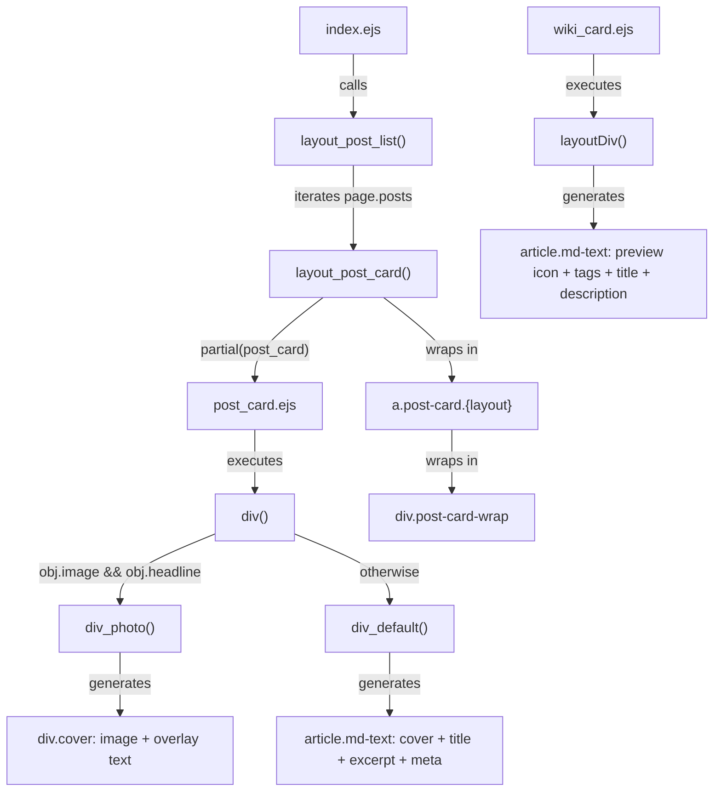
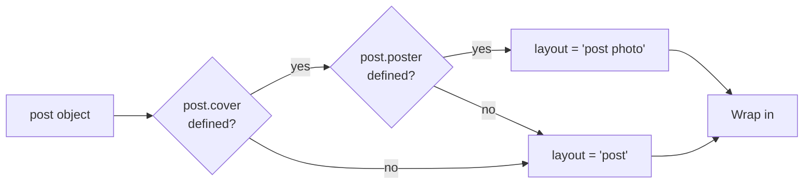
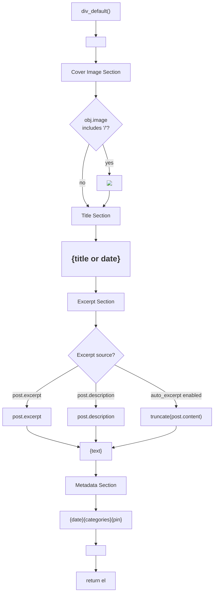
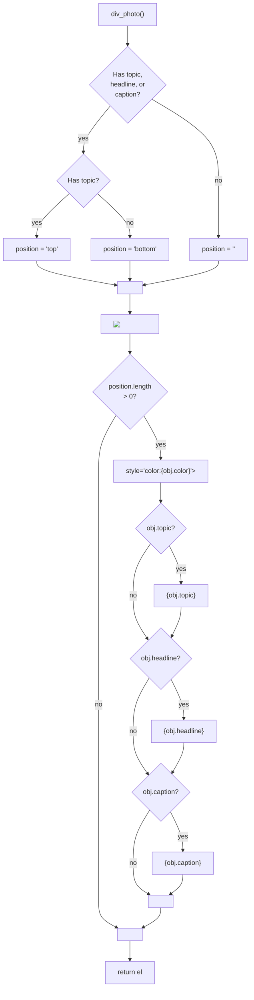
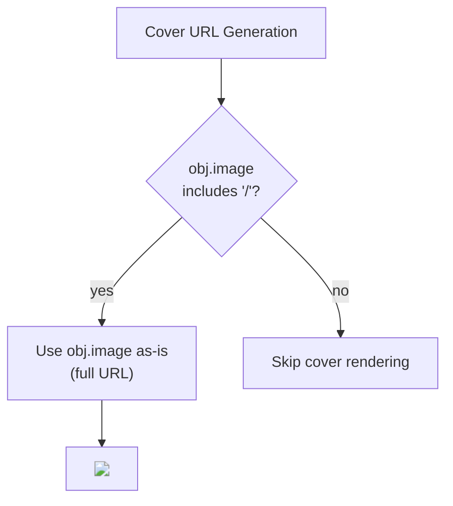
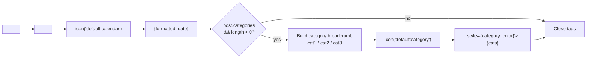
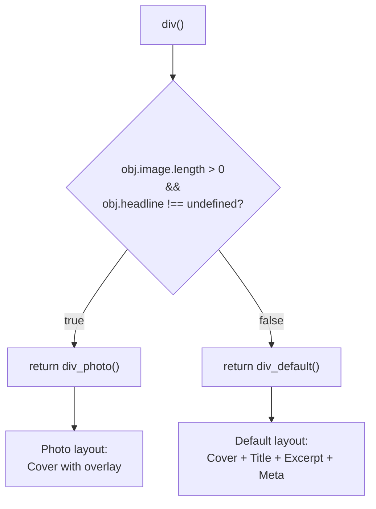
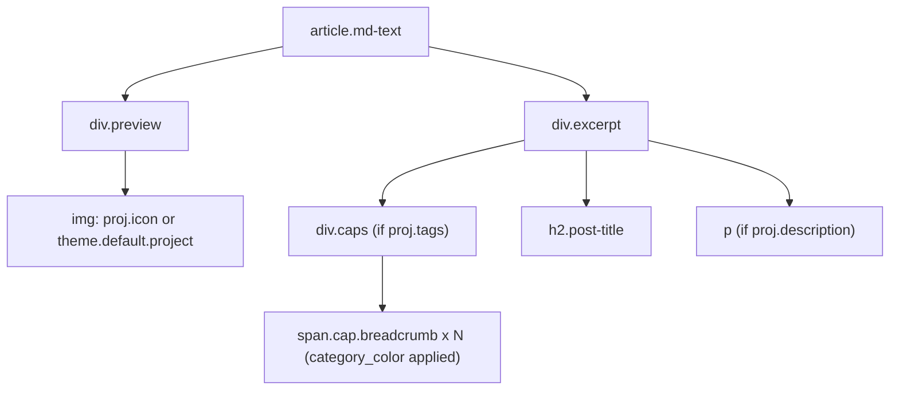

# 文章列表与卡片组件

<details>
<summary>相关源码文件</summary>

生成此页面时参考的主题源码文件：

- [layout/_partial/main/post_list/post_card.ejs](../../../layout/_partial/main/post_list/post_card.ejs)
- [layout/_partial/main/post_list/wiki_card.ejs](../../../layout/_partial/main/post_list/wiki_card.ejs)
- [layout/index.ejs](../../../layout/index.ejs)
- [source/css/_components/list.styl](../../../source/css/_components/list.styl)

</details>

## 目的与范围

本文详述 Stellar 的文章列表渲染系统与文章卡片组件架构：`post_card.ejs` 的渲染逻辑、封面图生成策略（含 Unsplash 集成）、默认布局与 photo 布局的区别、元数据显示模式。该系统负责在索引页、归档页与分类/标签页展示博客文章集合。

单篇文章页渲染见[页面模板与路由](../02-布局系统/page-templates-routing.md)；wiki 专属列表渲染见[文档系统](wiki-docs.md)。

---

## 架构概览

文章列表系统采用两层架构：容器层（`index.ejs`）遍历文章并调用卡片渲染器（`post_card.ejs`）渲染每篇文章；独立的 `wiki_card.ejs` partial 用不同数据结构与布局渲染 wiki 项目卡片。

**文件与函数映射：**

| 文件 | 关键函数 | 用途 |
|------|----------|------|
| `layout/index.ejs` | `layout_post_list()`、`layout_post_card()` | 遍历 `page.posts`，包装卡片 |
| `layout/_partial/main/post_list/post_card.ejs` | `div()`、`div_default()`、`div_photo()` | 渲染单篇文章卡片 |
| `layout/_partial/main/post_list/wiki_card.ejs` | `layoutDiv()` | 渲染 wiki 项目卡片 |
| `layout/_partial/main/navbar/nav_tabs_blog` | — | 文章列表上方的导航标签 |
| `layout/_partial/main/post_list/paginator` | — | 文章列表下方的分页 |

**文章卡片渲染流水线：**



**参考源码**：[layout/index.ejs](../../../layout/index.ejs)、[layout/_partial/main/post_list/post_card.ejs](../../../layout/_partial/main/post_list/post_card.ejs)、[layout/_partial/main/post_list/wiki_card.ejs](../../../layout/_partial/main/post_list/wiki_card.ejs)

---

## 文章列表容器

`index.ejs` 中的 `layout_post_list()` 是文章集合渲染的编排器。

### 函数签名与流程

| 组件 | 说明 |
|------|------|
| **输入** | `partial`——渲染单篇文章卡片的回调函数 |
| **数据源** | `page.posts`——Hexo 文章集合 |
| **过滤条件** | `post.indexing != false`——排除显式禁用收录的文章 |
| **输出** | 包装在 `<div class="post-list post">` 中的 HTML |

```mermaid
flowchart TD
    Start["layout_post_list(partial)"]
    OpenDiv["el += '<div class=\"post-list post\">'"]
    Iterate["page.posts.each(post)"]
    CheckIndex{"post.indexing<br/>!= false?"}
    CallWrapper["layout_post_card('post', post, partial(post))"]
    AppendCard["el += card_html"]
    CloseDiv["el += '</div>'"]
    Return["return el"]
    
    Start --> OpenDiv
    OpenDiv --> Iterate
    Iterate --> CheckIndex
    CheckIndex -->|"true"| CallWrapper
    CheckIndex -->|"false"| Iterate
    CallWrapper --> AppendCard
    AppendCard --> Iterate
    Iterate -->|"done"| CloseDiv
    CloseDiv --> Return
```

**参考源码**：[layout/index.ejs](../../../layout/index.ejs)

### 布局类型判定

`layout_post_card()` 包装函数决定是否应用 `photo` 类修饰符：



**参考源码**：[layout/index.ejs](../../../layout/index.ejs)

---

## 文章卡片渲染

`post_card.ejs` partial 负责生成单篇文章卡片的 HTML，通过内部函数暴露两种渲染模式。

### 数据结构初始化

渲染先由文章 front-matter 构造 `obj` 对象：

| 属性 | 来源 | 用途 |
|------|------|------|
| `obj.image` | `post.cover` | 封面图 URL 或 Unsplash 搜索词 |
| `obj.headline` | `poster.headline` | photo 布局的大号展示文本 |
| `obj.topic` | `poster.topic` | 大标题上方的小主题文本 |
| `obj.caption` | `poster.caption` | 大标题下方的描述文本 |
| `obj.color` | `poster.color` | 覆盖文本的颜色覆盖 |

**参考源码**：[layout/_partial/main/post_list/post_card.ejs](../../../layout/_partial/main/post_list/post_card.ejs)

---

## 默认布局渲染

`div_default()` 生成标准博客文章卡片，内容垂直排布。



### 组件分解

**封面图**

- 仅 `obj.image` 为完整 URL（包含 `/`）时渲染
- 包装在 `<div class="post-cover">` 中

**标题**

- 有 `post.title` 时使用，否则回退到格式化后的 `post.date`
- 包装在 `<h2 class="post-title">` 中

**摘要**

- 优先级：`post.excerpt` → `post.description` → 由 `post.content` 自动生成
- 自动摘要长度由 `theme.article.auto_excerpt` 控制
- 排版插件启用时应用 `heti` 类
- 用 `strip_html()` 辅助函数去 HTML

**元数据**

- 始终包含带日历图标的日期
- `post.categories` 存在时包含带分类图标的面包屑
- 置顶文章在列表页 navbar 上方的置顶轮播中展示（无需开关，有置顶内容即渲染）；卡片不再显示置顶图标（`post.sticky` 图钉由轮播替代）

**参考源码**：[layout/_partial/main/post_list/post_card.ejs](../../../layout/_partial/main/post_list/post_card.ejs)

---

## Photo 布局渲染

`div_photo()` 生成杂志风格卡片，文字叠加在封面图上。



### 定位逻辑

| 条件 | 位置值 | 视觉效果 |
|------|--------|----------|
| 存在 `obj.topic` | `top` | 叠加文本位于图片顶部 |
| 存在 `obj.headline` 或 `obj.caption`（无 topic） | `bottom` | 叠加文本位于图片底部 |
| 无叠加文本 | `""`（空） | 不渲染叠加 div |

### 渐变模糊层与黑色蒙版

photo 布局的 `.cover` 上叠加两层效果（均在 `.cover-info` 之下）：同图模糊层（`:before`，同图 `blur(1em)` + 沿文字边缘的渐变 mask）与黑色渐变蒙版（`:after`，文字所在边缘不透明度约 0.5 → 封面垂直中线 0，`pointer-events: none`，不随 hover 缩放）。hover 时封面图与模糊层同步放大至 `scale(1.05)`（1.5s 缓动），亮度降至 75%、饱和度升至 120%（0.2s 过渡）。

**参考源码**：[source/css/_components/list.styl](../../../source/css/_components/list.styl)

**参考源码**：[layout/_partial/main/post_list/post_card.ejs](../../../layout/_partial/main/post_list/post_card.ejs)

---

## 封面图渲染策略

封面仅在显式指定完整 URL（`post.cover` 包含 `/`）时渲染；`source.unsplash.com` 自动封面接口已失效，不再提供关键词、标签或随机图兜底。



**参考源码**：[layout/_partial/main/post_list/post_card.ejs](../../../layout/_partial/main/post_list/post_card.ejs)

---

## 元数据显示组件

元数据区显示文章的时间与组织信息。



### 组件细节

**日期显示**

- 用 `date_xml()` 辅助函数生成 ISO 8601 datetime 属性
- 按 Hexo 配置的 `config.date_format` 格式化
- 前面带日历图标

**分类面包屑**

- 仅 `post.categories` 存在且有长度时显示
- 分类用 ` / ` 连接
- 最后一个分类经 `category_color()` 决定面包屑颜色
- 前面带分类图标

**置顶标记**

- 置顶文章在列表页 navbar 上方的置顶轮播中展示（无需开关配置，有置顶内容即渲染，见[置顶内容轮播](../00-总览与安装配置/configuration.md#置顶内容轮播)）
- 文章卡片不再显示置顶图标（`post.sticky` 图钉由轮播替代）

**卡片标签**

- 由 `article.card_tags` 配置控制（默认关闭），最多显示 5 个
- 标签为纯文字（`cap` 小字样式，无胶囊底色），前缀为内联 `default:hashtag` 图标（`.card-tags svg`：1em、`margin-right: .25em`、`opacity: .4`），与标签页图标一致

**参考源码**：[layout/_partial/main/post_list/post_card.ejs](../../../layout/_partial/main/post_list/post_card.ejs)

---

## 布局决策逻辑

`post_card.ejs` 根部的 `div()` 函数决定使用哪种渲染模式。



### 判定条件

仅当同时满足以下条件时使用 **photo 布局**：

1. `obj.image` 已定义且长度非零
2. `obj.headline` 已定义（非 undefined）

否则回退到 **默认布局**。也就是说文章可以有封面图但仍用默认布局（front-matter 未指定 `poster.headline` 时）。

**参考源码**：[layout/_partial/main/post_list/post_card.ejs](../../../layout/_partial/main/post_list/post_card.ejs)

---

## Wiki 卡片变体

`wiki_card.ejs` partial 渲染 wiki 项目条目卡片，使用 `proj` 数据对象而非 `post` 对象，产生图标与文本并排的横向布局。

### 数据对象 `proj`

| 属性 | 兜底 | 用途 |
|------|------|------|
| `proj.icon` | `theme.default.project` | 预览图标 URL |
| `proj.tags` | — | 面包屑显示的标签字符串数组 |
| `proj.title` | `proj.name` | 卡片标题文本 |
| `proj.description` | — | 可选正文文本 |

### 渲染结构

**Wiki 卡片 HTML 结构：**



**参考源码**：[layout/_partial/main/post_list/wiki_card.ejs](../../../layout/_partial/main/post_list/wiki_card.ejs)

### Wiki 卡片 CSS 布局

Wiki 卡片用 `list.styl` 中的 flex 布局，图标与文本并排：

| 选择器 | 属性 | 效果 |
|--------|------|------|
| `.post-card.wiki article` | `display: flex; flex-wrap: wrap` | 图标 + 文本横向布局 |
| `.post-card.wiki article .preview` | `width: 96px; max-height: 96px` | 固定尺寸图标区 |
| `.post-card.wiki article .excerpt` | `min-width: 280px; flex: 1` | 弹性文本区 |
| `.post-card.wiki article .cap` | `background: var(--theme-block)` | 标签块背景 |

**参考源码**：[source/css/_components/list.styl](../../../source/css/_components/list.styl)

---

## 集成点

### ScrollReveal 动画

文章卡片通过 `scrollreveal()` 辅助函数支持基于滚动的显现动画：

```
<div class="post-card-wrap{scrollreveal(' ')}">
```

辅助函数注入 ScrollReveal 插件集成所需的数据属性。

**参考源码**：[layout/index.ejs](../../../layout/index.ejs)

### 分页

文章列表渲染与分页控件配套，分页在列表之后由 `paginator` partial 渲染。

**参考源码**：[layout/index.ejs](../../../layout/index.ejs)

### nav_tabs_blog 导航

博客文章列表前由 `nav_tabs_blog` partial 渲染筛选/导航 UI。`index.ejs` 在未指定菜单 ID 时默认设置 `page.menu_id = 'post'`，用于高亮激活标签。

**参考源码**：[layout/index.ejs](../../../layout/index.ejs)

### Wiki 收录标志

`index.ejs` 用于 wiki 索引页（设置 `page.wiki`）时，自动设置 `robots` meta 为 `noindex,follow`，防止搜索引擎收录生成的 wiki 列表页。

**参考源码**：[layout/index.ejs](../../../layout/index.ejs)

---

## Front Matter 配置

### 默认布局配置

```yaml
---
title: My Post Title
date: 2024-01-01
cover: /images/cover.jpg  # 或 "nature,landscape"（Unsplash 搜索）
categories:
  - Category A
  - Category B
tags:
  - tag1
  - tag2
sticky: true  # 可选：置顶
indexing: true  # 可选：是否进入列表（默认 true）
excerpt: Custom excerpt text  # 可选
description: SEO description  # 可选兜底
---
```

### Photo 布局配置

```yaml
---
title: My Photo Post
date: 2024-01-01
cover: /images/hero.jpg
poster:
  headline: Big Headline Text
  topic: Small Topic  # 可选：叠加文本定位到顶部
  caption: Caption text  # 可选
  color: "#ffffff"  # 可选：文本颜色覆盖
---
```

**参考源码**：[layout/_partial/main/post_list/post_card.ejs](../../../layout/_partial/main/post_list/post_card.ejs)、[layout/index.ejs](../../../layout/index.ejs)

---

## CSS 类参考

| 类 | 应用于 | 用途 |
|----|--------|------|
| `post-card-wrap` | 包装 div | 动画与间距容器 |
| `post-card` | 链接元素 | 主卡片样式 |
| `post-card.post` | 链接元素 | 标准文章卡片变体 |
| `post-card.photo` | 链接元素 | photo 布局变体 |
| `post-list.post` | 容器 div | 文章列表网格/flex 容器 |
| `post-cover` | div | 封面图包装 |
| `post-title` | H2 | 文章标题样式 |
| `excerpt` | div | 摘要文本容器 |
| `excerpt.heti` | div | 启用排版增强 |
| `meta.cap` | div | 元数据容器 |
| `breadcrumb` | span | 分类面包屑样式 |
| `pin` | span | 置顶文章指示 |
| `cover` | div（photo 布局） | 封面图容器 |
| `cover-info` | div（photo 布局） | 叠加文本容器 |
| `text.topic` | div（photo 布局） | 主题文本样式 |
| `text.headline` | div（photo 布局） | 大标题文本样式 |
| `text.caption` | div（photo 布局） | 描述文本样式 |

**参考源码**：[layout/_partial/main/post_list/post_card.ejs](../../../layout/_partial/main/post_list/post_card.ejs)、[layout/index.ejs](../../../layout/index.ejs)
