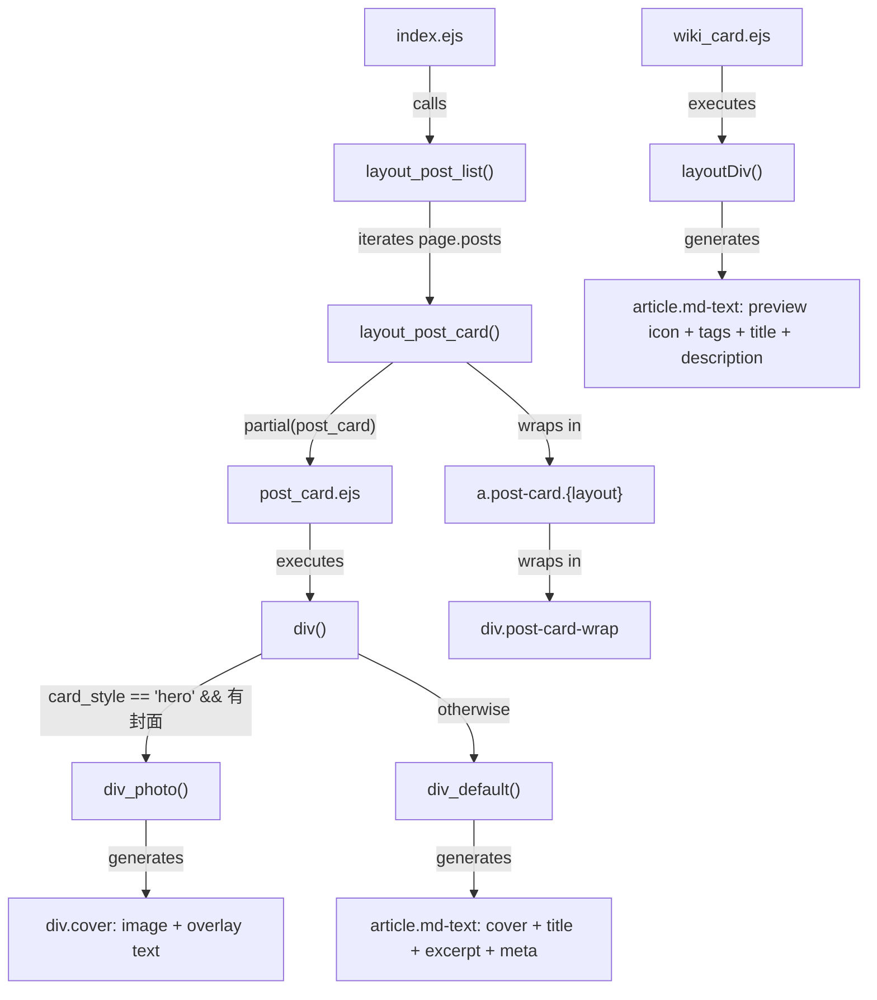
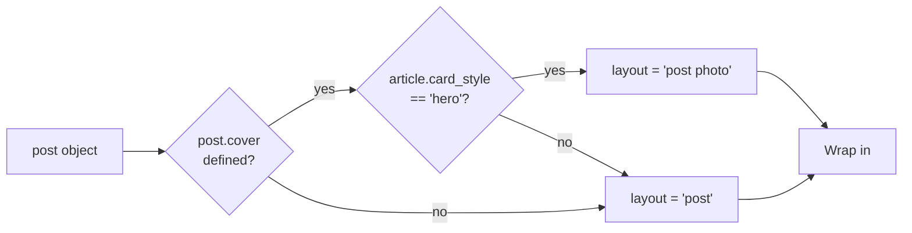
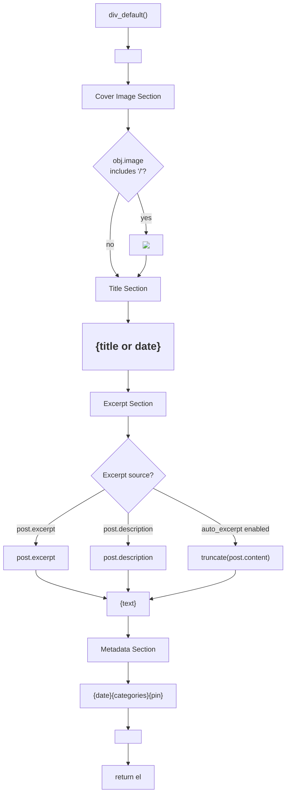
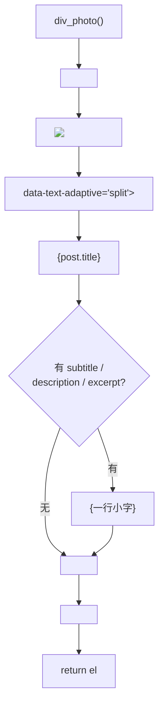
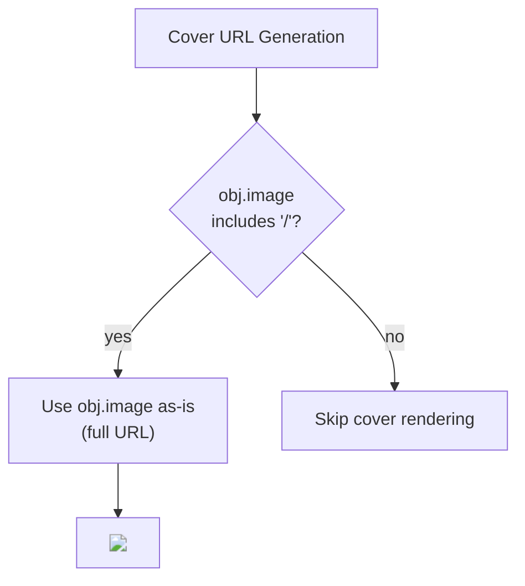
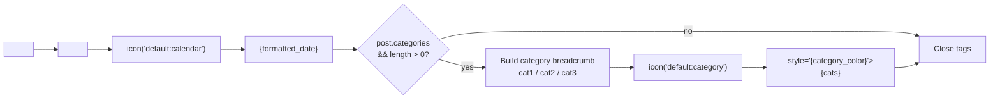
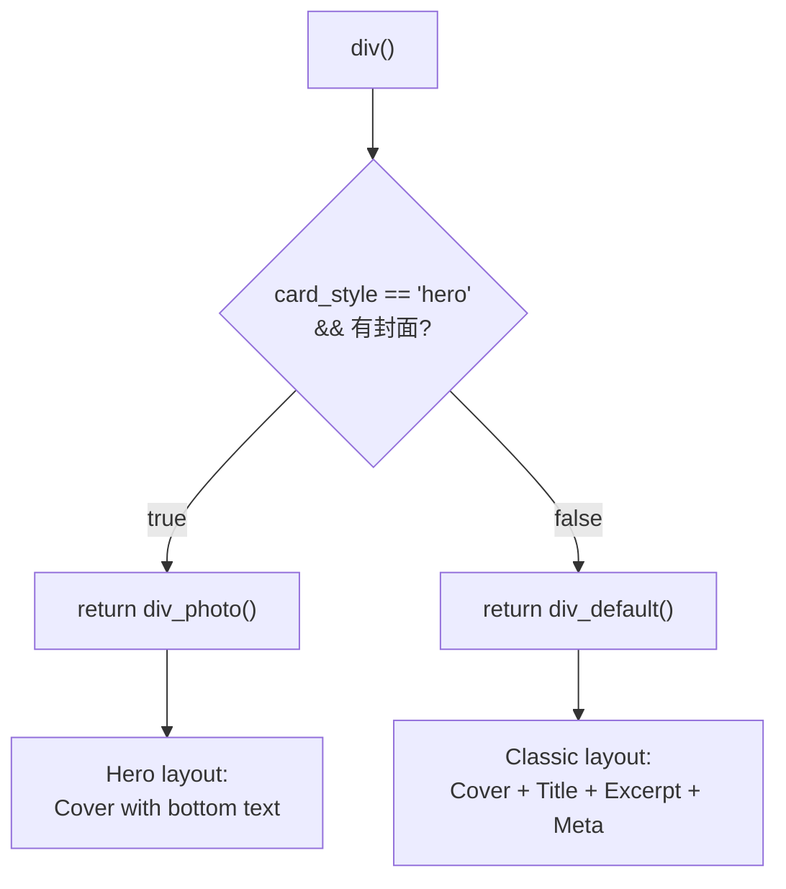
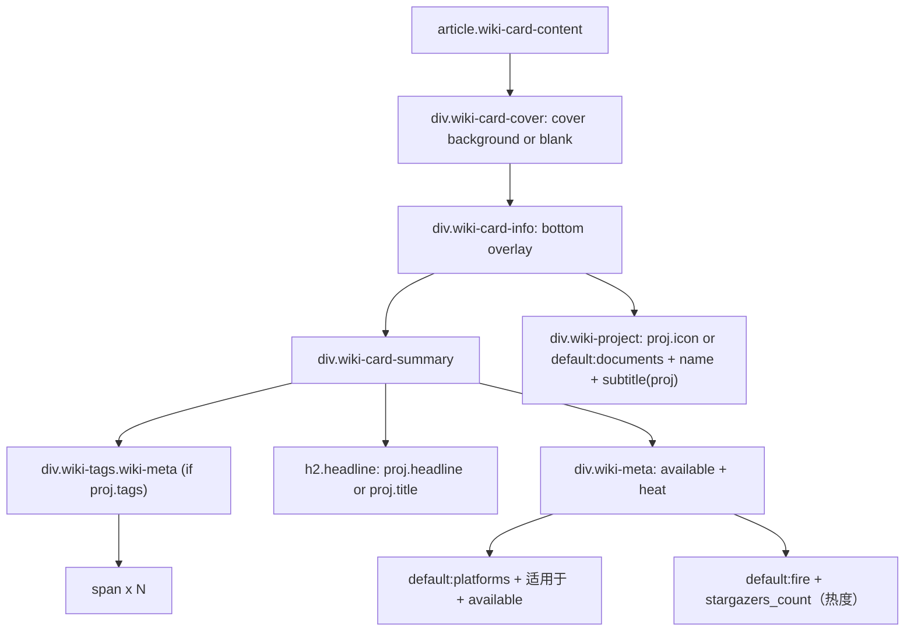
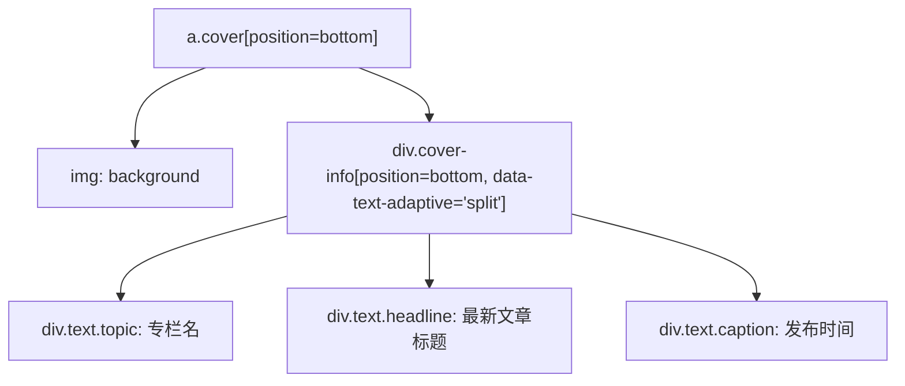

# 文章列表与卡片组件

<details>
<summary>相关源码文件</summary>

生成此页面时参考的主题源码文件：

- [layout/_partial/main/post_list/post_card.ejs](../../../layout/_partial/main/post_list/post_card.ejs)
- [layout/_partial/main/post_list/wiki_card.ejs](../../../layout/_partial/main/post_list/wiki_card.ejs)
- [layout/index.ejs](../../../layout/index.ejs)
- [source/css/_components/list.styl](../../../source/css/_components/list.styl)

</details>

## 目的与范围

本文详述 Stellar 的文章列表渲染系统与文章卡片组件架构：`post_card.ejs` 的渲染逻辑、封面图生成策略（显式 `cover` 完整 URL 时渲染）、classic 卡片与 hero 卡片的区别、元数据显示模式。该系统负责在索引页、归档页与分类/标签页展示博客文章集合。

单篇文章页渲染见[页面模板与路由](../02-布局系统/page-templates-routing.md)；wiki 专属列表渲染见[文档系统](wiki-docs.md)。

---

## 架构概览

文章列表系统采用两层架构：容器层（`index.ejs`）遍历文章并调用卡片渲染器（`post_card.ejs`）渲染每篇文章；独立的 `wiki_card.ejs` partial 用不同数据结构与布局渲染 wiki 项目卡片。

**文件与函数映射：**

| 文件 | 关键函数 | 用途 |
|------|----------|------|
| `layout/index.ejs` | `layout_post_list()`、`layout_post_card()` | 遍历 `page.posts`，包装卡片 |
| `layout/_partial/main/post_list/post_card.ejs` | `div()`、`div_default()`、`div_photo()` | 渲染单篇文章卡片 |
| `layout/_partial/main/post_list/wiki_card.ejs` | `layoutDiv()` | 渲染 wiki 项目卡片 |
| `layout/_partial/main/post_list/topic_card.ejs`、`latest_post_card.ejs` | `layoutDiv()` | 渲染专栏容器（最新文章卡片 + 其他文章列表） |
| `layout/_partial/main/navbar/nav_tabs_blog` | — | 文章列表上方的导航标签 |
| `layout/_partial/main/post_list/paginator` | — | 文章列表下方的分页 |

**文章卡片渲染流水线：**



**参考源码**：[layout/index.ejs](../../../layout/index.ejs)、[layout/_partial/main/post_list/post_card.ejs](../../../layout/_partial/main/post_list/post_card.ejs)、[layout/_partial/main/post_list/wiki_card.ejs](../../../layout/_partial/main/post_list/wiki_card.ejs)

---

## 文章列表容器

`index.ejs` 中的 `layout_post_list()` 是文章集合渲染的编排器。

### 函数签名与流程

| 组件 | 说明 |
|------|------|
| **输入** | `partial`——渲染单篇文章卡片的回调函数 |
| **数据源** | `page.posts`——Hexo 文章集合 |
| **过滤条件** | `post.indexing != false`——排除显式禁用收录的文章 |
| **输出** | 包装在 `<div class="post-list post">` 中的 HTML |

```mermaid
flowchart TD
    Start["layout_post_list(partial)"]
    OpenDiv["el += '<div class=\"post-list post\">'"]
    Iterate["page.posts.each(post)"]
    CheckIndex{"post.indexing<br/>!= false?"}
    CallWrapper["layout_post_card('post', post, partial(post))"]
    AppendCard["el += card_html"]
    CloseDiv["el += '</div>'"]
    Return["return el"]
    
    Start --> OpenDiv
    OpenDiv --> Iterate
    Iterate --> CheckIndex
    CheckIndex -->|"true"| CallWrapper
    CheckIndex -->|"false"| Iterate
    CallWrapper --> AppendCard
    AppendCard --> Iterate
    Iterate -->|"done"| CloseDiv
    CloseDiv --> Return
```

**参考源码**：[layout/index.ejs](../../../layout/index.ejs)

### 布局类型判定

`layout_post_card()` 包装函数决定是否应用 `photo` 类修饰符：



**参考源码**：[layout/index.ejs](../../../layout/index.ejs)

---

## 文章卡片渲染

`post_card.ejs` partial 负责生成单篇文章卡片的 HTML，通过内部函数暴露两种渲染模式。

### 数据结构初始化

渲染先由文章 front-matter 构造 `obj` 对象：

| 属性 | 来源 | 用途 |
|------|------|------|
| `obj.image` | `post.cover` | 封面图 URL |
| headline | `post.title` | hero 卡片的大号展示文本（无标题回退日期） |
| caption | `post.subtitle`（` | ` 前缀优先）→ `post.description` → excerpt 前 50 字 | hero 卡片与置顶轮播共用的单行小字（`subtitle()` helper，空则不渲染） |

**参考源码**：[layout/_partial/main/post_list/post_card.ejs](../../../layout/_partial/main/post_list/post_card.ejs)

---

## 默认布局渲染

`div_default()` 生成标准博客文章卡片，内容垂直排布。



### 组件分解

**封面图**

- 仅 `obj.image` 为完整 URL（包含 `/`）时渲染
- 包装在 `<div class="post-cover">` 中

**标题**

- 有 `post.title` 时使用，否则回退到格式化后的 `post.date`
- 包装在 `<h2 class="post-title">` 中

**摘要**

- 优先级：`post.excerpt` → `post.description` → 由 `post.content` 自动生成
- 自动摘要长度由 `theme.article.auto_excerpt` 控制
- 排版插件启用时应用 `heti` 类
- 用 `strip_html()` 辅助函数去 HTML

**元数据**

- 始终包含带日历图标的日期
- `post.categories` 存在时包含带分类图标的面包屑
- 置顶文章在列表页 navbar 上方的置顶轮播中展示（无需开关，有置顶内容即渲染）；卡片不再显示置顶图标（`post.sticky` 图钉由轮播替代）

**参考源码**：[layout/_partial/main/post_list/post_card.ejs](../../../layout/_partial/main/post_list/post_card.ejs)

---

## Hero 卡片渲染（全图文字封面）

`div_photo()` 生成全图文字封面卡片（hero），文字叠加在封面图底部；`.cover-info` 带 `data-text-adaptive="split"`，大字（headline）用黑白对比、小字（caption）用背景图平均色自适应（见下文「渐变模糊层与黑色蒙版」）。



### 定位逻辑

hero 卡片文字区固定 `bottom`：标题（headline）与单行小字（caption）始终叠加在封面底部；不再支持 top 布局，也不再渲染主题小字（原 `poster.topic` 已移除）。小字取值统一由 `subtitle()` helper（`scripts/lib/subtitle.js`）提供：显式 `post.subtitle` 含 ` | ` 且左侧非空时只取左侧；其他 `subtitle` 原样保留，之后依次回退 `post.description`、`excerpt || content` 去 HTML、压缩空白后截断 50 字（省略号由 CSS 单行处理），都没有则不渲染；置顶轮播复用同一取值。

### 渐变模糊层与黑色蒙版

该叠加观感由通用 mixin `cover-overlay($url-var, $sides, $layer)`（`source/css/_common/cover-overlay.styl`）统一提供：置顶轮播的 post/wiki 幻灯片与页顶 banner 复用同一套实现（`` 标签不使用该覆盖层，为纯背景图，见[链接、网格与横幅标签](../04-标签插件/link-grid-banner-tags.md)），方向按文字位置取 `top` / `bottom` / `both`。hero 卡片（`.post-card.photo`）的 `.cover` 固定使用 `bottom`，上叠加两层效果（均在 `.cover-info` 之下）：同图模糊层（`:before`，同图 `blur(1em)` + 沿文字边缘的渐变 mask）与黑色渐变蒙版（`:after`，文字所在边缘不透明度约 0.25 → 封面垂直中线 0，`pointer-events: none`，不随 hover 缩放）。hover 时封面图与模糊层同步放大至 `scale(1.05)`（1.5s 缓动），亮度降至 75%、饱和度升至 120%（0.2s 过渡）。Safari 26.4/26.5 对带 `filter: blur()` 的合成层不执行父级 `overflow:hidden` + `border-radius` 圆角裁剪（WebKit 312584/319993），模糊层静止时（无 transform）会在文字所在边缘漏方角，故模糊层常驻 `transform: translateZ(0)`（恒等变换，hover 放大时 Safari 正常裁剪）、卡片 `.post-card` 另加与圆角同源的 `clip-path: inset(0 round $border-card-l)` 直接裁剪，规避静止时底部两角漏方角。

文字颜色自适应（`data-text-adaptive` 插件）：`.cover-info` 与置顶轮播的文字容器（`.pin-slide-text` / `.pin-slide-info`）渲染时带 `data-text-adaptive="split"`，页面按需懒加载 `source/js/color.js`（`window.stellar.color`）与 `source/js/plugins/adaptive-text.js`；插件读取 `--cover-url` / `--pin-cover-url` 背景图，canvas 等比缩至最长边 ≤64px 后取平均色与平均透明度，透明图按元素/祖先/`body` 的实际背景色做 alpha 合成（避免透明像素把平均色拉黑），同时写入两个内联变量：`--text-banner` 为低饱和 theme 结果（`saturationScale: 0.05`，接近黑白、保留一点主色倾向，标题大字用），`--text-banner-theme` 为完整 theme 结果（背景偏暗时平均色 lighten 到明度 0.85、偏亮时 darken 到明度 0.3，低饱和彩色平均色先增强饱和度再取色，caption/chip/excerpt 小字用）。`.headline` / `.title` 继承容器 `--text-banner` 色，`.caption` / `.chip` / `.excerpt` 显式取 `var(--text-banner-theme, inherit)`（插件未运行时回退继承）。平均色计算失败（CORS/解码异常）时保持 CSS 默认白字。见[前端交互概览](../05-前端交互/client-side-overview.md#文字自适应颜色插件)。

**参考源码**：[source/css/_common/cover-overlay.styl](../../../source/css/_common/cover-overlay.styl)

**参考源码**：[source/css/_components/list.styl](../../../source/css/_components/list.styl)

**参考源码**：[layout/_partial/main/post_list/post_card.ejs](../../../layout/_partial/main/post_list/post_card.ejs)

---

## 封面图渲染策略

封面仅在显式指定完整 URL（`post.cover` 包含 `/`）时渲染；`source.unsplash.com` 自动封面接口已失效，不再提供关键词、标签或随机图兜底。



**参考源码**：[layout/_partial/main/post_list/post_card.ejs](../../../layout/_partial/main/post_list/post_card.ejs)

---

## 元数据显示组件

元数据区显示文章的时间与组织信息。



### 组件细节

**日期显示**

- 用 `date_xml()` 辅助函数生成 ISO 8601 datetime 属性
- 按 Hexo 配置的 `config.date_format` 格式化
- 前面带日历图标

**分类面包屑**

- 仅 `post.categories` 存在且有长度时显示
- 分类用 ` / ` 连接
- 最后一个分类经 `category_color()` 决定面包屑颜色
- 前面带分类图标

**置顶标记**

- 置顶文章在列表页 navbar 上方的置顶轮播中展示（无需开关配置，有置顶内容即渲染，见[置顶内容轮播](../00-总览与安装配置/configuration.md#置顶内容轮播)）
- 文章卡片不再显示置顶图标（`post.sticky` 图钉由轮播替代）

**卡片标签**

- 由 `article.card_tags` 配置控制（默认关闭），最多显示 5 个
- 标签为纯文字（`cap` 小字样式，无胶囊底色），前缀为内联 `default:hashtag` 图标（`.card-tags svg`：1em、`margin-right: .25em`、`opacity: .4`），与标签页图标一致

**参考源码**：[layout/_partial/main/post_list/post_card.ejs](../../../layout/_partial/main/post_list/post_card.ejs)

---

## 布局决策逻辑

`post_card.ejs` 根部的 `div()` 函数决定使用哪种渲染模式。



### 判定条件

仅当同时满足以下条件时使用 **hero 卡片**：

1. `article.card_style` 为 `hero`（默认）
2. `obj.image` 已定义且长度非零（文章有封面）

否则回退到 **classic 卡片**。也就是说文章可以有封面图但仍用普通卡片（`article.card_style` 为 `classic` 或文章没有封面时）。

**参考源码**：[layout/_partial/main/post_list/post_card.ejs](../../../layout/_partial/main/post_list/post_card.ejs)

---

## Wiki 卡片变体

`wiki_card.ejs` partial 渲染 wiki 项目条目卡片，使用 `proj` 数据对象而非 `post` 对象。模板使用独立的 `wiki-card` / `wiki-card-cover` / `wiki-card-info` 类，不复用文章 hero 的 `.cover` 或 `cover-overlay()`；底部内容区采用 Wiki 专属 Today 风格的同图渐变模糊层与封面主题色蒙版。

### 数据对象 `proj`

| 属性 | 兜底 | 用途 |
|------|------|------|
| `proj.cover` | — | 卡片背景图；未配置时保留纯色空背景 |
| `proj.icon` | `theme.default.project` | 底栏项目图标 |
| `proj.tags` | — | 顶部标签字符串数组 |
| `proj.headline` | `proj.title` → `proj.name` | 可选营销标题 |
| `proj.title` | `proj.name` | 既有项目标题与营销标题回退 |
| `proj.available` | — | 可选适用范围字符串（标签由 `meta.available` 本地化输出） |
| `proj.repo` | — | GitHub star 动态数据源 |
| `proj.name` | `proj.title` | 底栏项目标题 |
| `subtitle(proj)` | `subtitle`（` | ` 前缀优先）→ `description` → excerpt/content | 底栏项目副标题 |

### 渲染结构

**Wiki 卡片 HTML 结构：**



**参考源码**：[layout/_partial/main/post_list/wiki_card.ejs](../../../layout/_partial/main/post_list/wiki_card.ejs)

### Wiki 卡片 CSS 布局

Wiki 卡片用 `list.styl` 中的封面布局，内容固定在卡片底部：

| 选择器 | 属性 | 效果 |
|--------|------|------|
| `.wiki-card-cover` | 独立伪层 + `aspect-ratio: 3 / 4` | 竖版封面、下半部同图模糊层、封面主题色渐变蒙版与 hover 封面缩放；不复用文章 Hero 覆盖层 |
| `.wiki-card.cover-loaded .wiki-card-cover:before/:after` | 原图加载且平均主题色已确定后 `opacity: 1` | 初始隐藏模糊层与主题色蒙版；`adaptive-text` 计算成功或失败回退后通知 Wiki 页，避免先出现默认主题色再跳变 |
| `.wiki-card.no-cover` | `--wiki-border-color: var(--block-border)` | 无封面或封面加载失败时 hover 使用通用边框颜色 |
| `.wiki-card-cover.cover-error` | 隐藏图片并切换 `.no-cover` | 加载失败降级为纯色空封面与深色文字 |
| `.wiki-card-info` | `left/right/bottom: 0` + `justify-content: flex-end` | 信息层按内容高度贴住封面底部；自身不设内边距 |
| `.wiki-card:hover:after` | 2px `--wiki-border-color` + `corner-shape` 边框 | hover 显示比底部蒙版提高 20 个明度点、跟随全局连续曲率的圆角边框，不改变盒模型 |
| `.post-list.wiki` | `grid` + `repeat(auto-fit, minmax(240px, 1fr))` | 响应式多列排列；列通过 `1fr` 均分并铺满容器，窄屏用单列避免最小列宽溢出 |
| `.post-list.wiki .post-card-wrap` | `width: 100%` | Wiki 卡片随 Grid 列宽伸缩并填满容器 |
| `.wiki-card-info` | `position: absolute; left/right/bottom: 0` | 底部内容区 |
| `.wiki-card-info .wiki-meta` | `gap: .5rem 1rem` + 统一主题文字色 | 标签、适用范围与热度的文字不再区分样式；标签不复用 `cap` / `breadcrumb` 旧类或分类色，适用范围无背景或边框并前置内置 `default:platforms` 多设备图标 |
| `.wiki-card-info .headline` | `1.25rem` / `700` | 突出营销标题，移动端保持同一字号 |
| `.wiki-card-summary` / `.wiki-card-info .wiki-project` | 分别设内边距 | 上方文案与全宽项目底栏独立控制；项目区为 `rgba(black, .1)` 的轻微遮罩，无顶部边框 |
| `.wiki-card .wiki-stars` | 成功后 `.loaded` 显示 | GitHub `stargazers_count` 加载前和失败时隐藏；展示语义为热度的内置 Solar `default:fire` 图标 |
| `.wiki-card-info .project-icon` | `border-radius: 30%` + `var(--block)` | 项目图标使用统一的柔和圆角矩形底色；未配置 `icon` 时使用内置 Solar `default:documents`，颜色为 `var(--text-p2)` |

**参考源码**：[source/css/_components/wiki-card.styl](../../../source/css/_components/wiki-card.styl)

---

## Topic 卡片变体

`index_topic.ejs` 读取 `theme.topic.publish_list` 作为上架专栏集合，并按各专栏最新文章 `homepage.date` 降序排列后，经 `topic_card.ejs` 渲染每个专栏容器；无文章的专栏排在末尾，同日期保持配置中的相对顺序。每个容器上下排布：顶部为 `h2.topic-title` 专栏标题（复用 story 文章 h2 样式，`story-title()` mixin）与其下 `p.topic-desc` 专栏描述，中间为**最新文章卡片**（`latest_post_card.ejs` 公共组件，整卡跳转最新文章），底部为该专栏其他文章的归档式列表。其他文章与归档页共同复用 `archive_item.ejs`，显示 `MM-DD + 标题`；默认显示 3 篇，超过后通过原生 `<details>` 展开全部剩余文章并可再次收起。专栏容器之间以加大内边距拉开间隔。

### 数据对象 `topic`

| 属性 | 兜底 | 用途 |
|------|------|------|
| `topic.cover` | `topic.icon` → `theme.default.topic` | 最新文章卡片背景图（2:1 裁剪） |
| `topic.title` | `topic.name` | 容器顶部 `h2.topic-title` 专栏标题（置于卡片外） |
| `topic.description` | — | 标题下方的 `p.topic-desc` 一句话描述 |
| `topic.homepage` | — | 最新文章（`pages[0]`），整卡跳转目标 |
| `topic.pages` | `[]` | 专栏文章列表；`slice(1)` 排除最新，前 3 篇默认显示，其余折叠 |

### 最新文章卡片结构

`latest_post_card` 接收 `{href, background, label, post}`，输出 `a.cover[position=bottom]`（`--cover-url` 背景 + 同图渐变模糊层，经 `cover-overlay` 统一能力）与底部 `.cover-info` 文字区；专栏列表页不传 `label`（专栏名已外置为 h2），仅渲染标题与时间两行，`label` 保留给未来首页等场景：



**参考源码**：[layout/_partial/main/post_list/latest_post_card.ejs](../../../layout/_partial/main/post_list/latest_post_card.ejs)

### Topic 卡片 CSS 布局

专栏容器为纯平铺布局（无卡片背景，条目间以分隔线衔接），`.cover` 规则泛化自 hero 卡片（见上文「Hero 卡片渲染」），复用 `cover-overlay` 渐变模糊层：

| 选择器 | 属性 | 效果 |
|--------|------|------|
| `.post-list.topic .post-card-wrap + .post-card-wrap` | `border-top: 1px solid var(--block-border)` | 平铺条目间分隔线 |
| `.post-card.topic article` | `display: flex; flex-direction: column; gap: 1rem` | 上下布局：标题 → 卡片 → 列表 |
| `.post-card.topic article .topic-title` | `story-title()`（居中 + accent 斜杠） | 专栏标题，置于卡片外，复用 story 文章 h2 样式 |
| `.post-card.topic article .topic-desc` | `text-align: center; color: var(--text-p2); padding: 0 1rem` | 标题下方的一句话描述（左右内边距与文章列表一致） |
| `.post-card.topic .cover` | `flex: none; width: 100%; aspect-ratio: 2/1` | 全宽最新文章卡片，接入 `cover-overlay` |
| `.post-card.topic .topic-posts` | `flex: none; width: 100%; padding: 0 1rem` | 卡片下方归档式文章列表（左右内边距与封面文字区一致） |
| `.post-card.topic .topic-posts-more` | 原生 `<details>` + 打开态排序 | 默认隐藏第 4 篇起的其他文章；展开后让按钮保持在完整列表底部 |
| `.post-list.topic .post-card .md-text` | `padding: 2.25rem 0`（移动端 1.5rem） | 加大专栏容器上下间隔 |

**参考源码**：[layout/index_topic.ejs](../../../layout/index_topic.ejs)、[layout/_partial/main/post_list/archive_item.ejs](../../../layout/_partial/main/post_list/archive_item.ejs)、[source/css/_components/list.styl](../../../source/css/_components/list.styl)、[source/css/_components/pages/archives.styl](../../../source/css/_components/pages/archives.styl)

---

## 集成点

### ScrollReveal 动画

文章卡片通过 `scrollreveal()` 辅助函数支持基于滚动的显现动画：

```
<div class="post-card-wrap{scrollreveal(' ')}">
```

辅助函数注入 ScrollReveal 插件集成所需的数据属性。

**参考源码**：[layout/index.ejs](../../../layout/index.ejs)

### 分页

文章列表渲染与分页控件配套，分页在列表之后由 `paginator` partial 渲染。

**参考源码**：[layout/index.ejs](../../../layout/index.ejs)

### nav_tabs_blog 导航

博客文章列表前由 `nav_tabs_blog` partial 渲染筛选/导航 UI。`index.ejs` 在未指定菜单 ID 时默认设置 `page.menu_id = 'post'`，用于高亮激活标签。

**参考源码**：[layout/index.ejs](../../../layout/index.ejs)

### Wiki 收录标志

`index.ejs` 用于 wiki 索引页（设置 `page.wiki`）时，自动设置 `robots` meta 为 `noindex,follow`，防止搜索引擎收录生成的 wiki 列表页。

**参考源码**：[layout/index.ejs](../../../layout/index.ejs)

---

## Front Matter 配置

### 默认布局配置

```yaml
---
title: My Post Title
date: 2024-01-01
cover: /images/cover.jpg  # 仅显式完整 URL 时渲染封面
categories:
  - Category A
  - Category B
tags:
  - tag1
  - tag2
sticky: true  # 可选：置顶
indexing: true  # 可选：是否进入列表（默认 true）
excerpt: Custom excerpt text  # 可选
description: SEO description  # 可选兜底
---
```

### Hero 卡片配置

```yaml blog/_config.stellar.yml
article:
  card_style: hero # hero = 全图文字封面卡片 / classic = 普通卡片
```

```yaml
---
title: My Photo Post
date: 2024-01-01
cover: /images/hero.jpg
subtitle: Caption text  # 可选：一行小字（subtitle > description > excerpt 前 50 字）
---
```

**参考源码**：[layout/_partial/main/post_list/post_card.ejs](../../../layout/_partial/main/post_list/post_card.ejs)、[layout/index.ejs](../../../layout/index.ejs)

---

## CSS 类参考

| 类 | 应用于 | 用途 |
|----|--------|------|
| `post-card-wrap` | 包装 div | 动画与间距容器 |
| `post-card` | 链接元素 | 主卡片样式 |
| `post-card.post` | 链接元素 | 标准文章卡片变体 |
| `post-card.photo` | 链接元素 | hero 卡片变体 |
| `post-list.post` | 容器 div | 文章列表网格/flex 容器 |
| `post-cover` | div | 封面图包装 |
| `post-title` | H2 | 文章标题样式 |
| `excerpt` | div | 摘要文本容器 |
| `excerpt.heti` | div | 启用排版增强 |
| `meta.cap` | div | 元数据容器 |
| `breadcrumb` | span | 分类面包屑样式 |
| `pin` | span | 置顶文章指示 |
| `cover` | div（hero 卡片） | 封面图容器 |
| `cover-info` | div（hero 卡片） | 底部叠加文本容器 |
| `text.topic` | div（专栏最新文章卡片） | 专栏名小字样式 |
| `text.headline` | div（hero 卡片） | 标题文本样式 |
| `text.caption` | div（hero 卡片） | 单行小字样式 |

**参考源码**：[layout/_partial/main/post_list/post_card.ejs](../../../layout/_partial/main/post_list/post_card.ejs)、[layout/index.ejs](../../../layout/index.ejs)
