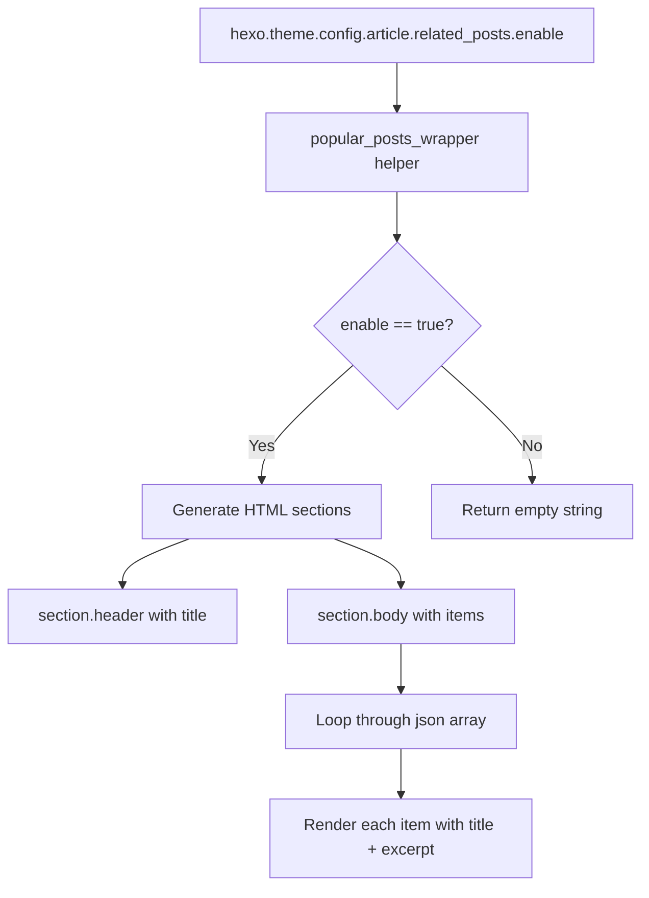
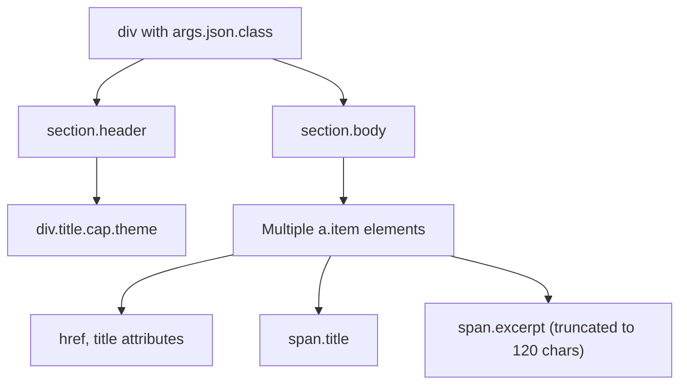
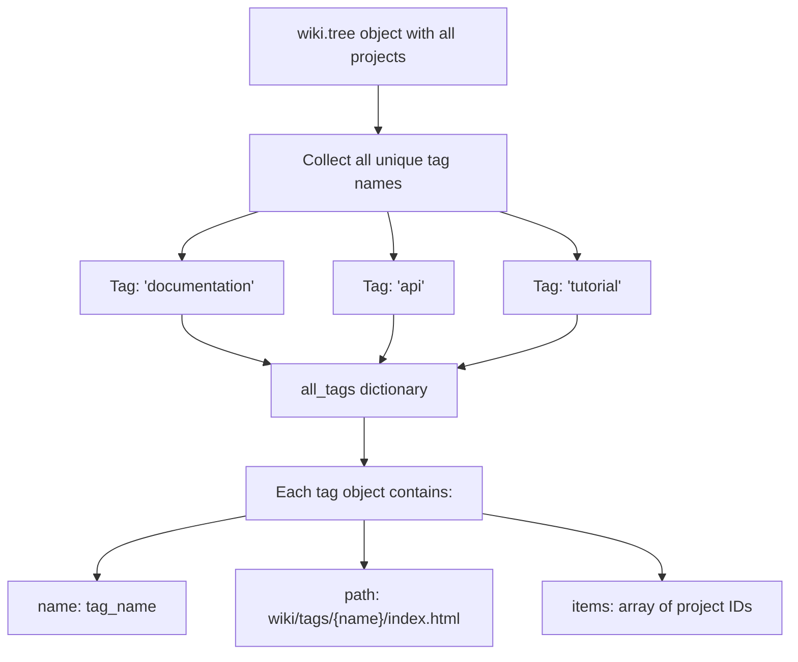
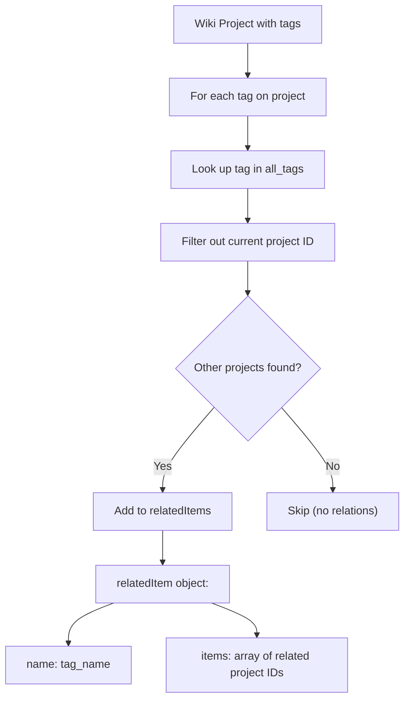
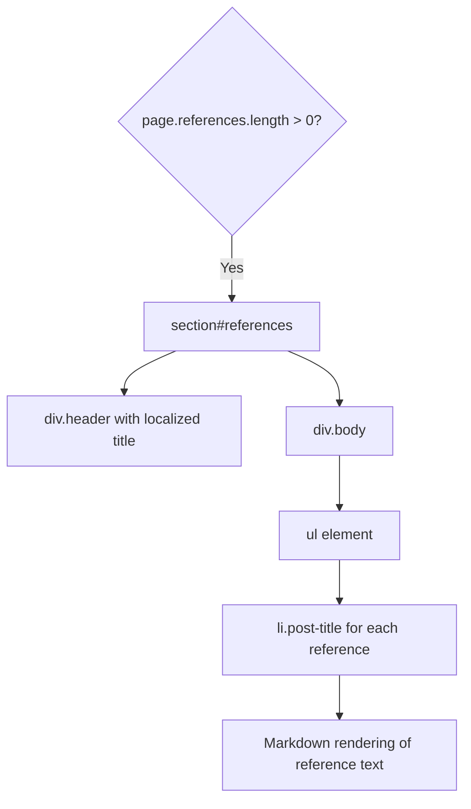
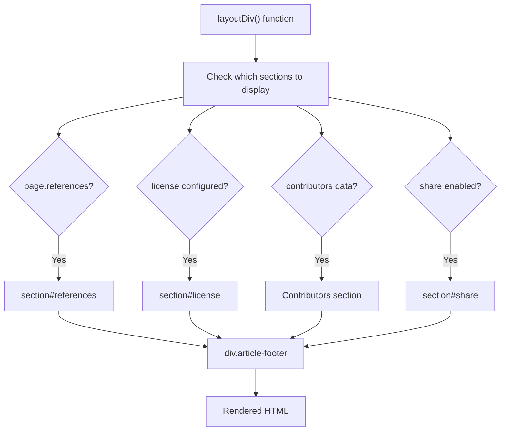
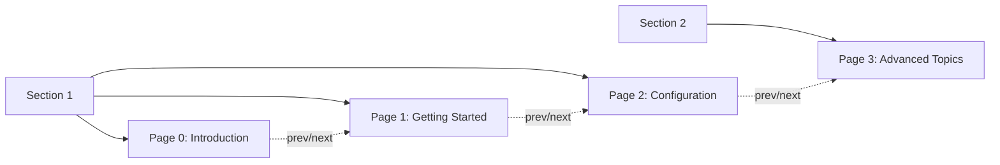

# 相关内容与导航

<details>
<summary>相关源码文件</summary>

生成此页面时参考的主题源码文件：

- [layout/404.ejs](../../../layout/404.ejs)
- [layout/_partial/main/article/article_footer.ejs](../../../layout/_partial/main/article/article_footer.ejs)
- [scripts/events/lib/doc_tree.js](../../../scripts/events/lib/doc_tree.js)
- [scripts/helpers/related_posts.js](../../../scripts/helpers/related_posts.js)

</details>

## 目的与范围

本文介绍 Stellar 中连接相关内容、促进页面间导航的系统：博客文章的相关文章、基于标签的 wiki 项目关系、文章页脚引用与面包屑导航。这些功能帮助用户发现相关内容并理解自己在站点结构中的位置。

侧边栏小部件与 TOC 导航见[小部件系统架构](../06-数据服务与组件/widget-architecture.md)；页面导航机制见[页面导航与预加载](../07-外部集成/pjax-navigation.md)。

---

## 相关文章系统

相关文章功能在博客文章末尾显示推荐文章，依赖外部插件 `hexo-related-popular-posts` 分析内容相似度并生成推荐。

### 配置与启用

相关文章系统由 `article.related_posts.enable` 配置标志控制。辅助函数在该标志不是 `true` 时提前返回：

**配置检查流程**



**参考源码**：[scripts/helpers/related_posts.js](../../../scripts/helpers/related_posts.js)

### 辅助函数：`popular_posts_wrapper`

该辅助函数注册在 Hexo 辅助系统，接收 `hexo-related-popular-posts` 插件数据：

| 参数 | 类型 | 用途 |
|------|------|------|
| `args.title` | String | 区块标题（如 "Related Posts"） |
| `args.json.json` | Array | 相关文章对象数组（`path`、`title`、`excerpt`） |
| `args.json.class` | String | 容器样式类名 |

辅助函数做校验，无相关文章时返回空字符串。

**参考源码**：[scripts/helpers/related_posts.js](../../../scripts/helpers/related_posts.js)

### HTML 生成

辅助函数生成带标题与正文的两段结构：

**相关文章 HTML 结构**



每项的渲染逻辑包含文章查找与摘要处理：

- `<a>` 标签链接到文章，带 `href` 与 `title` 属性
- `span.title` 包含文章标题
- `span.excerpt` 包含截断并去 HTML 的摘要（最多 120 字符）

摘要用 `hexo-util` 库的 `util.truncate()` 与 `util.stripHTML()` 处理。

**参考源码**：[scripts/helpers/related_posts.js](../../../scripts/helpers/related_posts.js)

---

## Wiki 相关项目系统

wiki 项目用基于标签的关系系统连接相关文档项目，在 `doc_tree.js` 数据处理阶段构建。

### 标签聚合过程

`doc_tree.js` 聚合所有 wiki 项目的标签建立关系：

**基于标签的关系构建**



**参考源码**：[scripts/events/lib/doc_tree.js](../../../scripts/events/lib/doc_tree.js)

`all_tags` 中每个标签包含：

- `name`：标签名字符串
- `path`：标签索引页 URL 路径
- `items`：带此标签的项目 ID 数组

### 相关项目生成

标签聚合后，脚本为每个 wiki 项目生成 `relatedItems`：

**相关项目算法**



**参考源码**：[scripts/events/lib/doc_tree.js](../../../scripts/events/lib/doc_tree.js)

每个 `relatedItem` 对象包含：

- `name`：建立关系的标签名
- `items`：共享此标签的其他项目 ID 数组

例如项目 A、B、C 都有标签 "api"，则项目 A 的 `relatedItems` 包含 `name: "api"`、`items: ["B", "C"]`。

### 数据结构示例

`wiki.tree[project_id].relatedItems` 结构：

```
wiki.tree['my-project'].relatedItems = [
  {
    name: 'documentation',
    items: ['other-project-1', 'other-project-2']
  },
  {
    name: 'api',
    items: ['other-project-3']
  }
]
```

该结构让 wiki 布局按共享标签分组渲染相关项目。

**参考源码**：[scripts/events/lib/doc_tree.js](../../../scripts/events/lib/doc_tree.js)

---

## 引用区块

引用区块出现在文章页脚，用于引用外部来源或相关资料。与相关文章不同，引用在 front-matter 中手动指定。

### Front-Matter 配置

引用定义为页面 front-matter 中的数组：

```yaml
references:
  - "[Article Title](https://example.com)"
  - "[Another Source](https://example.com/page)"
```

`article_footer.ejs` 模板检查引用的存在。

### HTML 渲染

存在引用时模板生成专属区块：

**引用区块结构**



每个引用：

1. 包装在 `<li class="post-title">` 元素中
2. 经 `markdown()` 辅助函数把 markdown 链接转为 HTML
3. 用 `__('meta.references')` 本地化标题显示

**参考源码**：[layout/_partial/main/article/article_footer.ejs](../../../layout/_partial/main/article/article_footer.ejs)

---

## 导航模式

### 文章页脚布局结构

文章页脚把多个导航与关系特性组合为统一布局：

**文章页脚组件组成**



`item` 数组跟踪存在的区块。所有检查都失败（`item.length === 0`）时函数返回空字符串，避免渲染空页脚。

**参考源码**：[layout/_partial/main/article/article_footer.ejs](../../../layout/_partial/main/article/article_footer.ejs)

### 面包屑导航

面包屑基于分类为博客文章提供层级导航，显示从博客索引到当前文章的路径：

**面包屑层级模式**


面包屑为 `page_type: 'post'` 布局渲染，反映文章 front-matter 定义的分类层级。

### Wiki 页面序列导航

wiki 页面通过 `doc_tree.js` 建立的 `page_number` 系统支持顺序导航。

每个 wiki 项目页面按 `tree` 配置顺序分配从 0 开始的顺序 `page_number`，支持文档序列中的上一篇/下一篇导航。

**Wiki 页面导航流程**



`page_number` 让 wiki 布局识别序列中的上一篇与下一篇。

**参考源码**：[scripts/events/lib/doc_tree.js](../../../scripts/events/lib/doc_tree.js)

---

## 与内容展示的集成

### 各布局中的相关内容

| 系统 | 布局类型 | 触发条件 | 显示位置 |
|------|----------|----------|----------|
| 相关文章 | `post` | 插件生成推荐 | 文章内容末尾 |
| Wiki 相关项目 | `wiki` | 标签匹配 | 侧边栏或页脚 |
| 引用 | 任意文章类型 | front-matter 的 `page.references` | 文章页脚区块 |
| 面包屑 | `post` | 分类层级 | 文章标题上方 |
| 上一篇/下一篇 | `wiki` | `page_number` 序列 | 文章页脚或侧边栏 |

### 空状态处理

所有相关内容系统都有优雅的空状态处理：

- **相关文章**：`json.length == 0` 时返回空字符串
- **Wiki 相关项目**：仅共享标签存在时创建 `relatedItems`
- **引用**：`page.references` 为 null 或空时不渲染区块
- **文章页脚**：无区块启用时返回空字符串

这保证导航元素只在真正有用时出现。

**参考源码**：[scripts/helpers/related_posts.js](../../../scripts/helpers/related_posts.js)、[scripts/events/lib/doc_tree.js](../../../scripts/events/lib/doc_tree.js)、[layout/_partial/main/article/article_footer.ejs](../../../layout/_partial/main/article/article_footer.ejs)

---

## 总结

Stellar 实现三套针对不同内容类型优化的相关内容系统：

1. **相关文章**：用 `popular_posts_wrapper` 辅助函数为博客文章做算法推荐
2. **Wiki 相关项目**：数据处理阶段（`doc_tree.js`）构建的基于标签的项目关系
3. **引用**：front-matter 手动指定、文章页脚渲染的引用

这些系统与导航模式（面包屑、上一篇/下一篇、页码）配合，构成完整的内容发现与定位体验。所有系统都基于配置与内容可用性做空状态处理和条件渲染。
