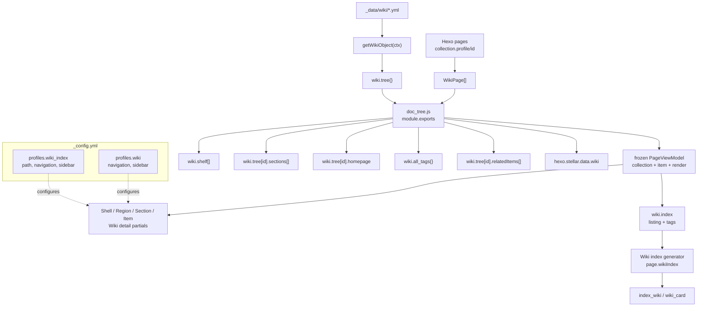
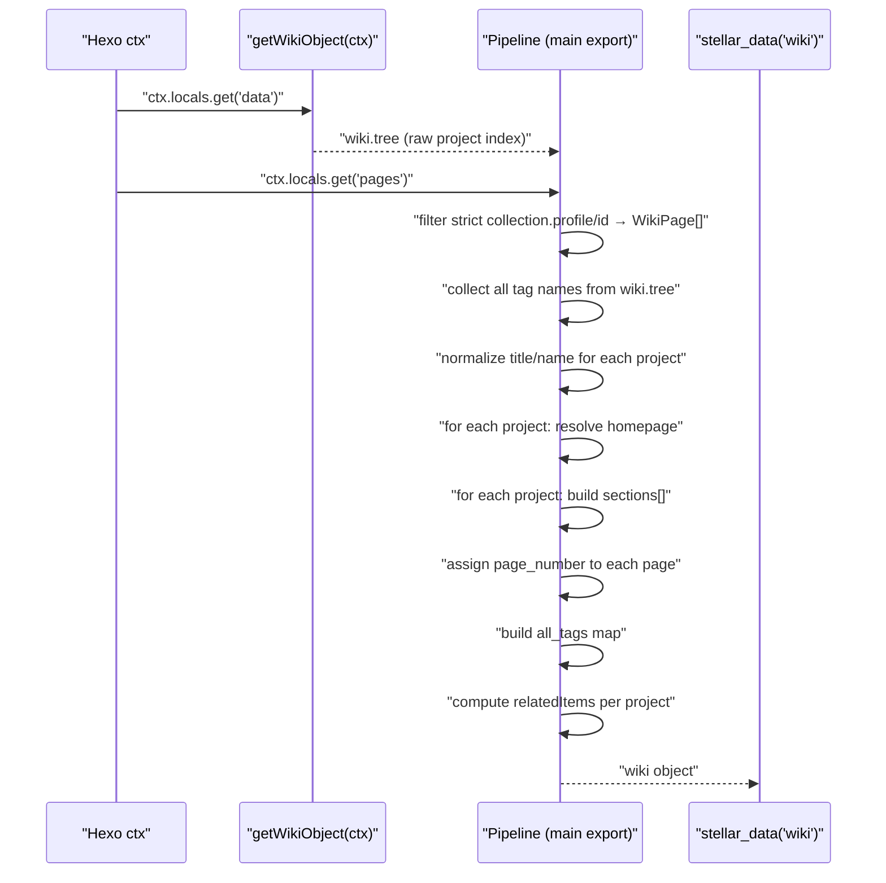
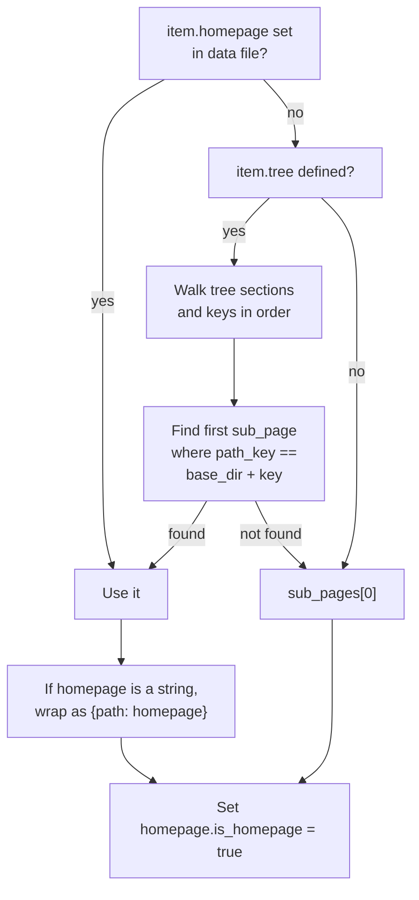
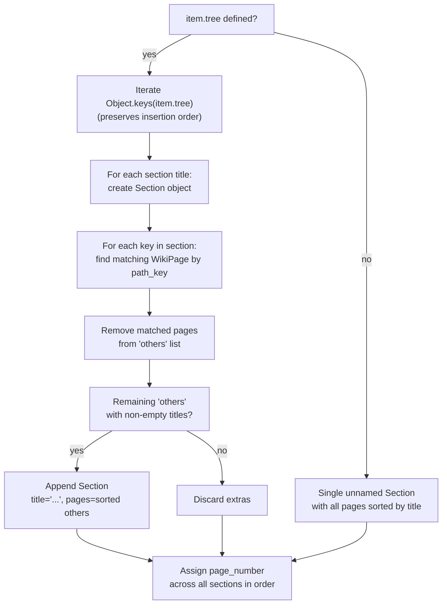
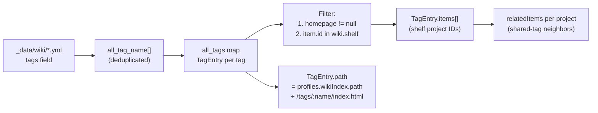
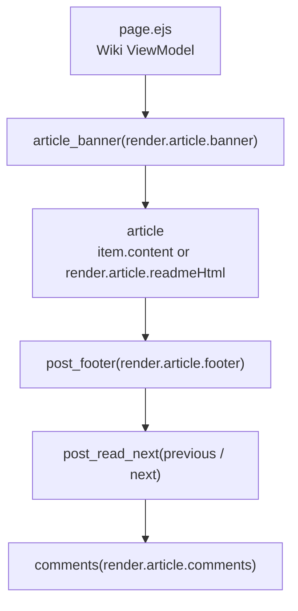

# 文档系统（Wiki）

> [!IMPORTANT]
> v2 已重构 Wiki 配置与页面 Front Matter；本页涉及字段名时，以[内容配置 Schema v2](content-schema-v2.md)为准。

<details>
<summary>相关源码文件</summary>

生成此页面时参考的主题源码文件：

- [.github/workflows/npm-publish.yml](../../../.github/workflows/npm-publish.yml)
- [.npmignore](../../../.npmignore)
- [LICENSE](../../../LICENSE)
- [README.md](../../../README.md)
- [_config.yml](../../../_config.yml)
- [package.json](../../../package.json)
- [scripts/events/lib/doc_tree.js](../../../scripts/events/lib/doc_tree.js)
- [scripts/lib/doc_tree.js](../../../scripts/lib/doc_tree.js)
- [scripts/lib/models/index.js](../../../scripts/lib/models/index.js)
- [scripts/lib/source-config.js](../../../scripts/lib/source-config.js)
- [layout/page.ejs](../../../layout/page.ejs)
- [source/js/main.js](../../../source/js/main.js)
- [source/js/plugins/galaxy.js](../../../source/js/plugins/galaxy.js)

</details>

本页说明 wiki 数据处理流水线、产生的数据结构、wiki 导航树与小节的构建方式，以及 wiki 页面的渲染。涵盖 `doc_tree.js` 事件脚本与 `page.ejs` 模板对 wiki 内容的处理。

wiki 侧边栏渲染见[侧边栏系统](../02-布局系统/sidebar-system.md)；列表中的 wiki 条目卡片见[文章列表与卡片组件](post-lists-cards.md)；wiki 页面间的前一篇/下一篇导航见[相关内容与导航](related-content.md)。

---

## 架构概览

wiki 系统有两个阶段：**构建期数据处理阶段**（Node.js 服务端）与**渲染期模板阶段**（EJS）。数据处理阶段每次构建运行一次，先组装结构化的 `wiki` 树，再为严格 v2 Wiki 页面生成带必需 `render` 的冻结 `page.viewModel`；索引数据由首页 ViewModel 的 `render.listing` 投影得到。详情页 EJS 只消费显式 ViewModel locals，索引页只消费生成器提供的 `wikiIndex`，不再从原始 Wiki 配置树重做级联。

wiki 系统由 `_config.yml` 的两个 Layout Profile 配置：

- `profiles.wiki_index`——wiki 列表/索引页
- `profiles.wiki`——单个 wiki 文档页

**Wiki 系统架构**



**参考源码**：[scripts/events/lib/doc_tree.js](../../../scripts/events/lib/doc_tree.js)、[_config.yml](../../../_config.yml)

---

## 数据结构

### `WikiPage`

定义于 [scripts/lib/doc_tree.js](../../../scripts/lib/doc_tree.js)。每个经共享归属解析器确定为 Wiki 成员的 Hexo 页面被包装为 `WikiPage` 实例；归属可来自唯一的项目、源码路径、route 与 tree 信号，也可由合法的显式 `collection` 消歧。

| 字段 | 来源 | 说明 |
|---|---|---|
| `id` | `page._id` | Hexo 内部页面 ID |
| `collectionId` | `page.collection.id` | 页面所属 Wiki 项目 ID |
| `title` | `page.title` | 页面标题 |
| `path` | `page.path` | URL 路径（如 `docs/intro.html`） |
| `path_key` | `page.path` 去掉 `.html` | 用于树匹配（如 `docs/intro`） |
| `layout` | `page.layout` | Hexo 布局名 |
| `updated` | `page.updated` | 最后更新时间戳 |
| `page_number` | 流水线分配 | wiki 内顺序号，用于前后页导航 |
| `is_homepage` | 流水线分配 | 指定首页时为 `true` |

### Wiki 项目条目（`wiki.tree` 中的条目）

`wiki.tree` 的每个条目对应一个 wiki 项目，内容直接来自 `_data/wiki/*.yml` 文件加流水线分配的字段。

| 字段 | 来源 | 说明 |
|---|---|---|
| `id` | 由文件名派生 | `wiki.tree` 中的键 |
| `name` | 数据文件 | 短名 |
| `headline` | 数据文件 | 主标题，缺失时在构建期使用 `name` |
| `tags` | 数据文件 | 标签名字符串或数组；规范化为数组 |
| `tree` | 数据文件 | 导航树（见下文） |
| `route.path` | 数据文件 | 页面键匹配的路径前缀 |
| `listing.sort` | 数据文件 | 普通项目排序，默认 `0` |
| `listing.priority` | 数据文件 | 置顶优先级 |
| `homepage` | 数据文件或流水线 | 指定首页 `WikiPage` |
| `sections` | 流水线 | 由 `tree` 构建的有序 `Section[]` |
| `pages` | 流水线 | 属于该项目的全部 `WikiPage[]` |
| `relatedItems` | 流水线 | 基于共享标签的 `RelatedItem[]` |

### `Section`

`Section` 是 wiki 项目内的导航分组。

```
{
  title: string,   // 节标题（未命名根节为空字符串 ''）
  pages: WikiPage[]
}
```

标题为 `'...'` 的小节是自动生成的，用于容纳未在 `tree` 配置中列出的页面。

### `TagEntry`

`wiki.all_tags` 中的条目，按标签名索引。

```
{
  name: string,    // 标签名
  path: string,    // 标签索引页 URL
  items: string[]  // 带此标签的 wiki 项目 ID（仅 shelf 内且有 homepage 的）
}
```

### `RelatedItem`

项目 `relatedItems` 数组中的条目。

```
{
  name: string,    // 连接项目的标签名
  items: string[]  // 共享此标签的其他 wiki 项目 ID
}
```

**参考源码**：[scripts/events/lib/doc_tree.js](../../../scripts/events/lib/doc_tree.js)

### Wiki `PageViewModel`

`scripts/events/lib/doc_tree.js` 在树形导航解析完成后调用 `buildWikiPageViewModel()`。输出顶层与 Post 一致，固定为 `collection`、`item` 和 Wiki 必需的 `render`：

- `collection` 固定包含 `id`、`profile`、`identity`、`source`、`route`、`navigation`、`listing`、`presentation`、`visibility`。
- `navigation.tree` 是 `sections` 的普通对象投影，不保留 `WikiPage` 实例；路径、页码与首页标记已规范化。
- `item` 已完成项目源码继承以及页面级导航、列表、展示和可见性覆盖；项目 `hero.background.image` 已解析为页面 Banner 图片默认值。
- collection 的 `visibility.listed` 反映 shelf 状态；页面 `item.visibility` 独立从默认可列出、可搜索起算。
- `render.document/layout/seo` 固化语言、head 注入、主题状态、布局状态、最终 Brand、Wiki 返回入口、面包屑，以及 title、description、keywords、robots、canonical、Open Graph 和 WebPage JSON-LD。
- `render.cover` 固化 Hero 背景、预览、操作、源码和 release 数据；只有集合首页可以启用 Hero，普通内页始终为禁用状态。
- `render.article` 固化 Banner、远程 README 占位、Footer、上下篇、评论、related 与正文排版状态；远程 README 也只在首页正文为空且仓库可解析时生成。
- `render.listing` 固化 Wiki 索引卡片需要的链接、身份、标签、受众、图标、封面、仓库、排序、置顶与可见性。
- 整个输出深度冻结且仅含普通对象/数组，不保留 Hexo Document、Query、Moment 或输入配置引用。

由于 Hexo Page 文档不会持久保存任意自定义字段，构建事件同时按 source/path/id 登记冻结 ViewModel，并在 `after_post_render` 恢复到最终模板数据。详情链缺少合法 Wiki `render` 时按源文件构建失败，不回退到原始配置。

---

## 配置系统

wiki 系统采用三层配置：全局主题配置、项目数据文件、页面级 front-matter。

### 全局配置（_config.yml）

**profiles.wiki_index**——wiki 列表/索引页配置：

| 字段 | 默认 | 用途 |
|---|---|---|
| `path` | `/wiki/` | wiki 索引页的根相对 URL 路径 |
| `active_menu` | `null` | wiki 索引页高亮的菜单项 |
| `listing_nav.tabs` | `[]` | 索引页显示的附加导航标签 |
| `leftbar.widgets` | `[related, recent]` | Leftbar Widget 配置 |
| `rightbar.widgets` | `[]` | Rightbar Widget 配置 |

**profiles.wiki**——单个 wiki 页面配置：

| 字段 | 默认 | 用途 |
|---|---|---|
| `active_menu` | `null` | 高亮的菜单项 |
| `leftbar.widgets` | `[tree, related, recent]` | Leftbar 含导航树 |
| `rightbar.widgets` | `[ghrepo, toc]` | Rightbar 显示 TOC 与 GitHub 仓库 |

### 项目数据文件

wiki 项目配置位于**用户站点**的 `source/_data/wiki/`。`getWikiObject()` 加载该目录下（排除 `.DS_Store`）每个键包含 `wiki/` 的 `.yml` 文件。

**示例项目配置：**

```yaml
name: My Project
headline: Build something remarkable
tagline: Project tagline
identity:
  icon: /images/project.svg
card:
  cover: /images/project-card.webp
hero:
  enabled: true
  background:
    image: /images/project-hero.webp
    effect:
      type: galaxy
      options:
        starSpeed: 0.5
routing:
  base_dir: docs/
listing:
  priority: 1
  sort: 10
tags:
  - javascript
  - tutorial
tree:
  Getting Started:
    - docs/intro
    - docs/install
  Advanced:
    - docs/config
    - docs/api
```

**字段契约：**

| 字段 | 行为 | 位置 |
|---|---|---|
| `tree` | 数组包装为 `{ '': array }` | doc_tree.js |
| `routing.base_dir` | 去掉开头 `/`，补结尾 `/` | doc_tree.js |
| `tags` | 必须是字符串数组 | content-config.js |
| `headline` | 缺失时回退 `name` | wiki_card.ejs、wiki_cover.ejs |
| `hero.background.image` | 静态 Hero 背景，并让 Hero 文字按图片平均色自适应 | wiki_cover.ejs、adaptive-text.js |
| `hero.background.effect` | `type: galaxy` 启用内置 WebGL 星场；`options` 保持 React Bits props 原名 | wiki_cover.ejs、galaxy.js |
| `hero.preview` | `terminal` 使用 `commands[].codes`；`image` 使用 `src` / `alt` | wiki_cover.ejs |
| `hero.actions` | 自定义 Hero 按钮数组（`title`、`url`、可选 `icon`） | wiki_cover.ejs |
| `listing.sort` | 缺失时按 `0` 处理 | doc_tree.js |
| `listing.priority` | 大于 `0` 时进入置顶轮播，按数值降序 | pin_slider.ejs |

**wiki.shelf**——根文件 `_data/wiki.yml`（非子目录）定义哪些项目 ID 视为「已发布」。只有 shelf 中的项目出现在标签索引与相关项目列表中。

`hero.background.effect.type: galaxy` 会由 `main.js` 检测 Canvas 后按需加载 `source/js/plugins/galaxy.js`。插件使用四层 WebGL 星场，默认启用纵深移动、低强度辉光、闪烁、自动旋转和轻量鼠标排斥；鼠标离开 Hero 后交互强度平滑淡出。`hero.background.effect.options` 可逐项覆盖 `focal`、`rotation`、`starSpeed`、`density`、`hueShift`、`disableAnimation`、`speed`、`mouseInteraction`、`glowIntensity`、`saturation`、`mouseRepulsion`、`twinkleIntensity`、`rotationSpeed`、`repulsionStrength`、`autoCenterRepulsion`、`transparent`。这些键保持 React Bits 上游命名；未知键或错误类型会在构建期报错。

Galaxy 默认以透明 Canvas 渲染。与 `hero.background.image` 同时配置时，图片位于动态层下方，文字仍按图片平均色自适应；WebGL、着色器或脚本失败时图片保持可用。显式设置 `transparent: false` 会让不透明 Canvas 覆盖图片。仅配置 Galaxy 时使用纯黑 `#000000` 作为静态底色与文字取色基准。Hero 离开视口或页面进入后台时暂停，返回后恢复；用户启用 `prefers-reduced-motion` 时不加载动画。Canvas 不接收指针事件，不影响 Hero 中的链接、按钮和终端操作。

Wiki Hero 的左侧导航是无背景的站点标题按钮：文字取 Hexo `config.title`，颜色为 `--text-banner`，点击返回站点首页。项目配置 `source.repository` 时，最新版本标签作为外链按钮显示在项目标题上方，与站点导航分离；其边框沿用该主题色并以 50% 透明度显示。加载期间标签保留高度但不显示占位文字、边框或交互；成功取得 tag 后淡入。数据服务优先使用 tag 响应已提供的 `html_url`（如 Release 页面），否则按仓库地址与 tag 拼接引用页；新标签页打开；无 tag 或请求失败时移除标签。主标题独立以 `data-text-adaptive="contrast"` 按封面明暗在黑白之间切换，不使用主题色填充；其轮廓以 `--text-banner-theme` 的半透明色呈现柔和外发光。说明与按钮等辅助文字继续使用该主题色变体。“源码”按钮的背景与边框使用 `--text-banner`，其文字和图标单独反转相同变量，因此深浅封面下始终与背景相反。启用 `features.card_hover.enabled` 后，源码、文档和 `hero.actions` 按钮均显示鼠标跟随 Spotlight，但不启用 Tilt 或上浮；源码按钮的文字与图标反色不会作用于 Spotlight 层。`hero.preview.type: terminal` 时，终端以封面平均色派生的 `--text-banner-theme` 与透明色 50% 混合填充、再以背景模糊呈现；变量不可用时回退到 `--background`。未配置 `hero.background.image` 和 `hero.background.effect` 时不会运行自适应取色：`--text-banner-theme` 回退为 `--text-p2`，版本标签与普通操作按钮的边框单独回退为 `--block-border`。工具栏文字使用 `--text-banner`，命令与 `$` 提示符使用 `--text-banner-theme`。内置按钮、终端标签与辅助标签均通过 `__()` 读取 `languages/`；它们随站点语言切换。`hero.actions[].title` 是项目自定义内容，保持原值，不由主题翻译。

Wiki Hero 完成后直接进入正文布局，不额外输出分隔线；正文或页脚自己的分隔线保持各自组件负责。

### 页面级 Front-Matter

单个 Wiki 页面通常放在 `source/wiki/<project-id>/`，并在对应项目 `navigation.tree` 中登记；唯一候选会自动确定归属。需要消歧时可写严格 v2 `collection` Front Matter：

```yaml
---
title: Page Title
collection:
  profile: wiki
  id: project-id
---
```

`collection.profile` 必须为 `wiki`，`collection.id` 必须匹配 `_data/wiki/` 中的项目 id，并与 route/tree 成员关系一致。Wiki 物理目录名可作为历史别名被合法显式 id 覆盖；无显式声明时的命名空间零候选、多候选或显式成员冲突会在构建期报告来源、候选项目和最小修复方式。普通 Page 零候选则保持普通页面；v1 `wiki` 字段与 layout 不参与归属。

**参考源码**：[scripts/events/lib/doc_tree.js](../../../scripts/events/lib/doc_tree.js)、[_config.yml](../../../_config.yml)

---

## 构建流水线

`doc_tree.js` 导出的函数按顺序运行完整组装流水线。

**doc_tree.js 流水线时序**



**参考源码**：[scripts/events/lib/doc_tree.js](../../../scripts/events/lib/doc_tree.js)

---

## 首页确定逻辑

每个 wiki 项目按以下优先级链解析单个 `WikiPage` 作为首页：



`path_key` 匹配时两侧都去掉 `.html`，因此 `docs/intro.html` 匹配树键 `docs/intro`。

**参考源码**：[scripts/events/lib/doc_tree.js](../../../scripts/events/lib/doc_tree.js)

---

## README 主页（首页空正文 + repo 触发）

wiki 项目数据文件配置 `repo`（必填）与可选 `branch` 后，若项目首页（如 `source/wiki/{id}/index.md`）正文为空——剪裁多余空行、空格后为空——该页正文自动渲染为该 GitHub 仓库的 README.md：

- 渲染复用底层远程 md 组件（`scripts/lib/mdrender_html.js` 通用占位生成器 + `scripts/lib/wiki_readme.js` wiki 应用判定 + `source/js/services/mdrender.js` 客户端服务），占位元素被原地替换，最终 DOM 无外部容器；
- README 地址由 `scripts/lib/wiki_readme.js` 的 `readmeUrl` 按 `services.github.raw_url` 完整 URL 构造（Schema 默认值是唯一来源，代码不兼容裸 host），相对图片/链接解析到同一镜像基址；
- 标题默认适配本地文章格式：补齐标题 id、追加 `headerlink` 锚点（与 hexo-renderer-marked 输出一致），h1 视为页面标题直接隐藏（页面标题已由 banner 展示，不降级）；
- 首页正文非空时以本地内容为准（本地内容优先）；`branch` 缺省用 GitHub `HEAD`（自动指向默认分支）。

页面本身是真实 Hexo 页，走 `page.ejs` → `layout.ejs` 完整渲染链路，封面、banner、侧栏、评论与导航行为与本地 wiki 页一致。由于正文在页面加载后才渲染，右侧 TOC 由 `layout/_partial/widgets/toc.ejs` 预留空容器，mdrender 服务渲染完成后派发 `stellar:mdrender` 事件，`source/js/main.js` 监听并按服务端 `toc()` 同款结构重建（滚动高亮动态查询标题）。

---

## 小节与导航树构建

小节代表 wiki 项目的侧边栏导航分组。是否配置显式 `tree` 会影响构建过程。

**小节构建逻辑**



**page_number 分配**是项目所有小节内的顺序计数器。该整数供 `read_next` 组件决定上一篇/下一篇（见[相关内容与导航](related-content.md)）。

**参考源码**：[scripts/events/lib/doc_tree.js](../../../scripts/events/lib/doc_tree.js)

---

## 标签系统

标签把 wiki 项目连接起来并生成标签索引页。

**标签数据流**



- 标签路径用冻结的 `profiles.wikiIndex.path` 构造
- 项目只有同时满足「在 `wiki.shelf` 中」且「已解析 homepage」才出现在标签的 `items`
- 项目的 `relatedItems` 由所有共享至少一个标签的其他项目构建，按标签名分组

**参考源码**：[scripts/events/lib/doc_tree.js](../../../scripts/events/lib/doc_tree.js)

---

## Wiki 页面渲染

wiki 页面使用标准布局系统，但带 wiki 专属配置与小部件。

### 布局判定

`layout.ejs` 以 `page.viewModel.collection.profile === 'wiki'` 进入 Wiki 新链；Front Matter 已解析为 Wiki、但渲染数据缺少合法 `render` 时立即构建失败。合法 Wiki 详情页：

- 与普通 Post 共用 Shell、Region、Section、Item、Navigation 原语，同时由 `render.layout` 提供页面类型、缩进、背景、侧栏表面、最终 Brand、返回入口、侧栏和面包屑。
- Hero、Brand、搜索、tree、related、ghrepo、Banner、Footer、上下篇、评论与 head partial 都接收显式 ViewModel locals。
- Topic 与 Notebook 不满足 Wiki profile 判定，分别进入各自要求严格 ViewModel 的 v2 布局分支。

### 侧边栏小部件

wiki 专属侧边栏配置启用专用小部件：

| 小部件 | 位置 | 用途 |
|---|---|---|
| `tree` | 左栏 | 显示 `viewModel.collection.navigation.tree` 的冻结层级导航 |
| `related` | 左栏 | 显示 `viewModel.render.article.related` 的普通对象投影 |
| `recent` | 左栏 | 当前 wiki 项目的最近页面 |
| `toc` | 右栏 | 当前页面目录 |
| `ghrepo` | 右栏 | 使用 `render.listing.repositoryApi` 加载 GitHub 仓库信息 |

`tree` 小部件是 wiki 页面独有的，渲染基于 `doc_tree.js` 构建的小节导航。

### 内容区结构

wiki 页面经标准 `page.ejs` 模板渲染，带条件小节：



Footer、上下篇和评论复用普通 Post 的显式 locals partial，DOM 和 class 保持原状。上下篇已由模型根据冻结导航树中的 `pageNumber` 投影，EJS 不再自行查询 Wiki tree。

### Wiki 索引页

wiki 索引页（`index_wiki` 布局）保留通用 index Shell，但生成器必须显式提供 `page.wikiIndex`。其中 `items/allItems` 来自各项目首页 ViewModel 的 `render.listing`，`tags` 是普通标签导航对象；筛选、tabs、置顶与卡片只消费这份投影，不读取 `wiki.tree`。仅配置 `cover` 的卡片使用全幅背景图、同图渐变模糊层与不透明度约 0.25 至 0 的黑色蒙版；未配置时保留纯色空背景。卡片显示：

- `listing.tags`、`headline` 和可选 `audience`；“适用于”由 `meta.available` 语言键输出
- 有 `listing.repositoryApi` 时动态加载 star 数；无仓库或加载失败时隐藏该项
- 底栏中的 `listing.icon`、`name` 和已解析 `caption`
- 指向 `listing.href` 的链接

索引页使用 `profiles.wiki_index` 配置其侧边栏与导航。

**参考源码**：[_config.yml](../../../_config.yml)、[scripts/events/lib/doc_tree.js](../../../scripts/events/lib/doc_tree.js)

---

## 数据对象参考

流水线最终产生的 `hexo.stellar.data.wiki` 对象结构（EJS 通过 `stellar_data('wiki')` 访问）：

```
wiki
├── tree                     # { [id: string]: WikiProjectItem }
│   └── [id]
│       ├── id
│       ├── title, name, tags, sort, base_dir
│       ├── homepage         # is_homepage = true 的 WikiPage
│       ├── sections         # Section[]
│       │   └── { title, pages: WikiPage[] }
│       ├── pages            # WikiPage[]（全部，无序）
│       └── relatedItems     # RelatedItem[]
├── shelf                    # string[]（来自 _data/wiki.yml 的 ID）
├── all_tags                 # { [tag_name]: TagEntry }
│   └── [tag_name]
│       ├── name
│       ├── path
│       └── items            # string[]（项目 ID）
├── all_pages                # WikiPage[]（跨全部项目）
└── index
    ├── items                # render.listing[]（仅 shelf 且 listed）
    └── tags                 # { name, path, itemIds }[]
```

**参考源码**：[scripts/events/lib/doc_tree.js](../../../scripts/events/lib/doc_tree.js)
