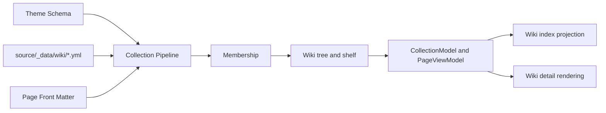

# 文档系统（Wiki）

Stellar v2 的 Wiki 是 Collection Pipeline 中的一个封闭 profile。主题先解析主题配置、Collection YAML 与页面 Front Matter，再确定成员归属、构建目录树和冻结 PageViewModel；模板只消费最终模型，不重新读取原始 YAML。

公开字段及用法以[内容配置 Schema v2](content-schema-v2.md)为准；本文说明主题内部的数据流和消费边界。

## 输入与归属

Wiki Collection 位于站点 `source/_data/wiki/<id>.yml`，页面通常位于 `source/wiki/<id>/`。页面可显式声明：

```yaml
collection:
  profile: wiki
  id: handbook
```

共享归属解析器也会结合标准目录、`route.path` 与 `navigation.tree` 推导唯一候选。显式声明与可推导归属冲突、零候选或多候选时，流水线报告来源和候选，不随意选择一个项目。v1 的 `wiki` Front Matter 只作为迁移诊断，不参与当前归属。

Wiki Collection 支持共享身份、Banner、Region、Footer、Comments、Source 与 Visibility 字段，另外只开放：

- `hero`；
- `navigation.tree`；
- `listing.priority` 与 `listing.order`。

`route.start`、`listing.excerpt_length/per_page/sort` 属于其它 Collection profile，在 Wiki 中会因能力不匹配而失败。

## 构建流水线



执行顺序如下：

1. `scripts/lib/collection-pipeline/index.js` 以 recover 模式解析普通字段；无法恢复的根结构与归属冲突仍会终止构建，不适用的表现参数警告并忽略，缺少显示名时使用 Collection ID。
2. Wiki adapter 收集已归属的页面和 Collection，调用 `scripts/lib/doc_tree.js` 建立目录、首页、标签与相关项目。
3. 每个页面先建立 Wiki CollectionModel 与内容 Item；所有首页 listing 可用后，再完成 related、Hero、SEO、Footer、Comments 与上下篇等渲染模型。
4. 最终 PageViewModel 深度冻结，并按页面登记给 Hexo 渲染阶段恢复。
5. Wiki generator 只读取 `wiki.index` 的普通对象投影，生成总索引和标签索引。

## 目录、首页与上架状态

`navigation.tree` 的键顺序就是文档阅读顺序。数组会规范化为一个未命名分组；未被树列出但 `visibility.listed` 为 true 的页面进入 `...` 分组。上下篇只沿最终目录中的可列出页面移动。

首页优先取目录树中第一个能匹配 `route.path + key` 的页面；没有可匹配条目时使用该 Collection 的第一个成员。v2 不再公开单独的 `homepage` 字段。

站点根 `source/_data/wiki.yml` 的 ID 数组仍是 Wiki 展示墙的 shelf 顺序。只有在 shelf 中、存在首页且 Collection `visibility.listed` 为 true 的项目进入总索引；成员的 `visibility.listed/searchable` 分别控制主题列表与站内搜索，不删除详情路由。

`listing.order` 只用于内部 Collection 树顺序；展示墙按 shelf 的声明顺序投影，因此不能用它代替 shelf 排序。`listing.priority` 决定支持置顶的索引呈现。

## PageViewModel

Wiki PageViewModel 固定包含 `collection`、`item` 和 `render`：

- `collection` 保存身份、源码、路由、目录、展示与可见性；
- `item` 保存当前页面的标题、内容、永久链接、封面及 Collection/Page 级联后的配置；
- `render.layout` 保存最终 Region、Brand、面包屑和页面外壳状态；
- `render.seo` 保存 title、description、canonical、Open Graph 与 JSON-LD；
- `render.cover` 保存仅首页可用的 Hero；
- `render.article` 保存 Banner、远程 README、Footer、分享、评论、上下篇与相关内容；
- `render.listing` 保存 Wiki 卡片所需的完整投影。

详情模板缺少合法 Wiki PageViewModel 时直接失败，不回退读取 `theme.config`、原始 Collection 或旧 Front Matter。

## Hero

`hero` 只在 Wiki 首页且 `hero.enabled: true` 时生成。背景图片与动态效果分别位于 `hero.background.image` 和 `hero.background.effect`，可以叠加；Canvas 不接收指针事件，失败时保留静态图片或效果注册表提供的底色。

内置效果由 `scripts/lib/hero-effect-registry.js` 单源登记：

| ID | 表现 | 无图片时的底色 |
| --- | --- | --- |
| `ferrofluid` | WebGL 磁流体轮廓 | `backgroundColor`，默认 `#03010A` |
| `galaxy` | WebGL 星场、纵深与鼠标排斥 | 黑色；`transparent: false` 时 Canvas 可覆盖图片 |
| `light-rays` | WebGL 体积光束 | 默认黑色；`lightMode: true` 时白色 |

每个效果的允许参数、类型和默认值都来自同一注册表；未知效果、未知参数、错误类型、非法方向／颜色、Ferrofluid 超过八种颜色或非正数 DPR 会被 Schema 报告。`pause_when_hidden` 与 `respect_reduced_motion` 默认 true，可在 effect 的 `runtime` 中覆盖。

浏览器 Runtime Manifest 只在页面包含 `canvas[data-hero-effect]` 时加载 Hero Effect Extension，再按 ID 动态导入对应 `source/js/runtime/hero-effects/*.js`。离开视口或页面进入后台时可暂停；减少动态效果策略生效时不加载持续动画。

终端预览使用 `hero.preview.commands[].label/codes`，图片预览使用 `src/alt`；操作按钮使用 `hero.actions[].title/url/icon`。内置按钮文案走主题语言文件，自定义 action 标题保持原值。

## 远程 README

Collection 配置 `source.repository` 且首页正文为空时，主题用 `services.github.raw_url` 构造该仓库的 `README.md` 地址；`source.branch` 省略时使用 GitHub `HEAD`。本地正文非空时始终优先。

远程 Markdown 在浏览器中替换占位元素，并以同一 Raw 基址解析相对图片和链接。加载完成后会重建 TOC。远程请求失败只影响 README 内容，不改变页面路由、Banner、Region、Footer 或评论结构。

## 渲染与索引

Wiki 详情复用标准 Shell、Region 与文章 partial：可选 Hero、Banner、正文／README、分享、Footer、上下篇和评论。Collection 内容默认继承 Article 许可协议和标签开关，但分享默认关闭；Collection 或 Page 可显式恢复全局分享服务或选择服务数组。

Wiki 索引由 `scripts/generators/wiki.js` 读取 `wiki.index.items/tags`。卡片只消费 `render.listing`，包括项目名称、headline、tagline、audience、图标、封面、仓库、链接、排序和可见性；缺少封面时使用无图样式，不拿 Hero、Banner 或图标跨角色补图。

## 主要实现

- [`scripts/lib/collection-pipeline/adapters/wiki.js`](../../../scripts/lib/collection-pipeline/adapters/wiki.js)：profile 能力与流水线入口
- [`scripts/events/lib/doc_tree.js`](../../../scripts/events/lib/doc_tree.js)：树与两阶段 ViewModel 编排
- [`scripts/lib/doc_tree.js`](../../../scripts/lib/doc_tree.js)：目录、首页、标签与 related 纯逻辑
- [`scripts/lib/models/index.js`](../../../scripts/lib/models/index.js)：CollectionModel、Item 与 render 投影
- [`scripts/lib/hero-effect-registry.js`](../../../scripts/lib/hero-effect-registry.js)：Hero 效果、参数和默认值
- [`scripts/lib/wiki_readme.js`](../../../scripts/lib/wiki_readme.js)：README 触发与地址
- [`layout/_partial/cover/wiki_cover.ejs`](../../../layout/_partial/cover/wiki_cover.ejs)：Hero 模板
- [`layout/page.ejs`](../../../layout/page.ejs)：详情页消费
- [`scripts/generators/wiki.js`](../../../scripts/generators/wiki.js)：索引与标签路由
