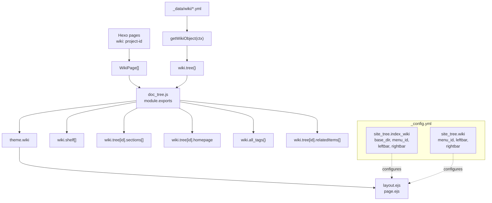
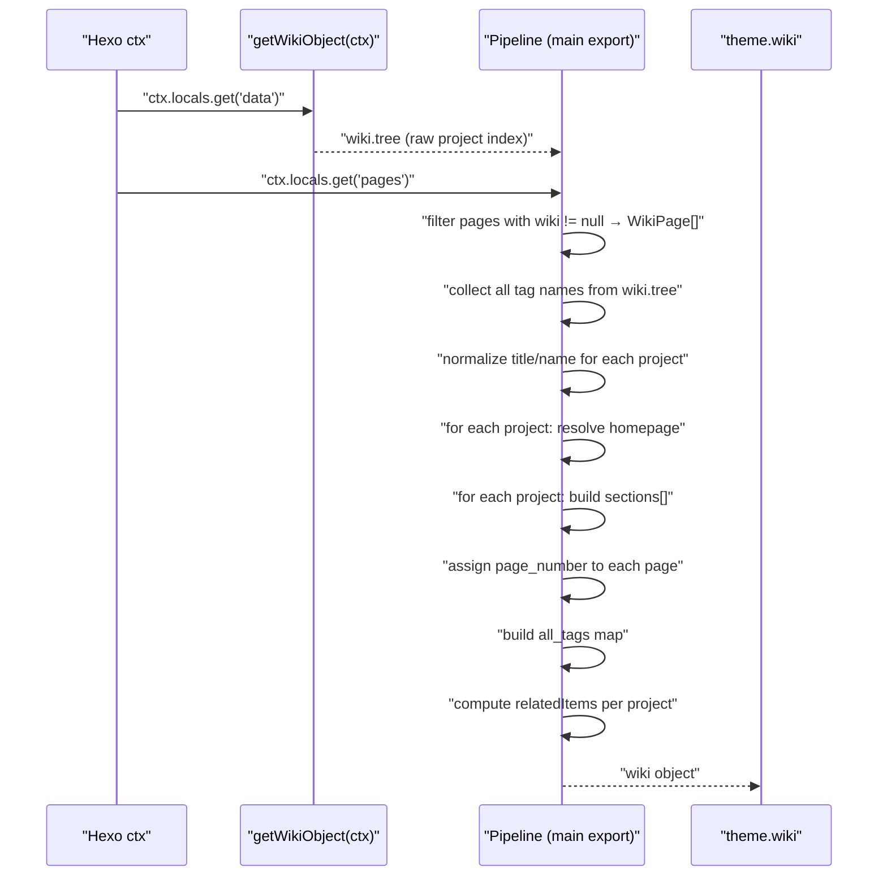
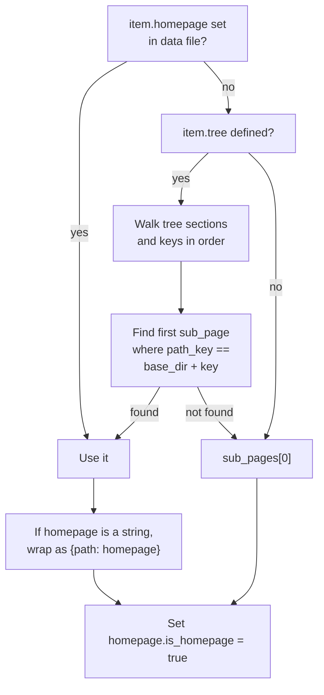
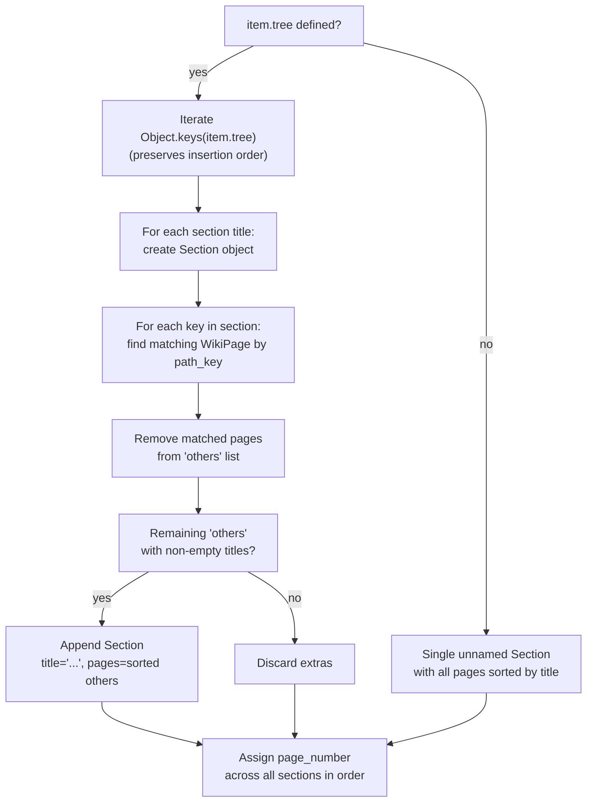
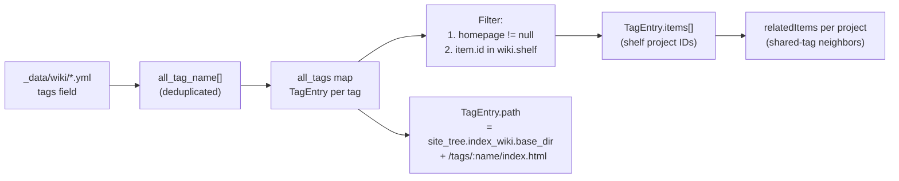
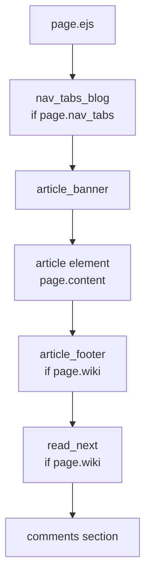

# 文档系统（Wiki）

<details>
<summary>相关源码文件</summary>

生成此页面时参考的主题源码文件：

- [.github/workflows/npm-publish.yml](../../../.github/workflows/npm-publish.yml)
- [.npmignore](../../../.npmignore)
- [LICENSE](../../../LICENSE)
- [README.md](../../../README.md)
- [_config.yml](../../../_config.yml)
- [package.json](../../../package.json)
- [scripts/events/lib/doc_tree.js](../../../scripts/events/lib/doc_tree.js)
- [layout/page.ejs](../../../layout/page.ejs)

</details>

本页说明 wiki 数据处理流水线、产生的数据结构、wiki 导航树与小节的构建方式，以及 wiki 页面的渲染。涵盖 `doc_tree.js` 事件脚本与 `page.ejs` 模板对 wiki 内容的处理。

wiki 侧边栏渲染见[侧边栏系统](../02-布局系统/sidebar-system.md)；列表中的 wiki 条目卡片见[文章列表与卡片组件](post-lists-cards.md)；wiki 页面间的前一篇/下一篇导航见[相关内容与导航](related-content.md)。

---

## 架构概览

wiki 系统有两个阶段：**构建期数据处理阶段**（Node.js 服务端）与**渲染期模板阶段**（EJS）。数据处理阶段每次构建运行一次，组装一个结构化的 `wiki` 对象（挂载为 `theme.wiki`）。模板在渲染期读取该对象。

wiki 系统由 `_config.yml` 的两个小节配置：

- `site_tree.index_wiki`——wiki 列表/索引页
- `site_tree.wiki`——单个 wiki 文档页

**Wiki 系统架构**



**参考源码**：[scripts/events/lib/doc_tree.js](../../../scripts/events/lib/doc_tree.js)、[_config.yml](../../../_config.yml)

---

## 数据结构

### `WikiPage`

定义于 [scripts/events/lib/doc_tree.js](../../../scripts/events/lib/doc_tree.js)。每个带 `wiki` front-matter 字段的 Hexo 页面被包装为 `WikiPage` 实例。

| 字段 | 来源 | 说明 |
|---|---|---|
| `id` | `page._id` | Hexo 内部页面 ID |
| `wiki` | `page.wiki` | 页面所属 wiki 项目 ID |
| `title` | `page.title` | 页面标题 |
| `path` | `page.path` | URL 路径（如 `docs/intro.html`） |
| `path_key` | `page.path` 去掉 `.html` | 用于树匹配（如 `docs/intro`） |
| `layout` | `page.layout` | Hexo 布局名 |
| `updated` | `page.updated` | 最后更新时间戳 |
| `page_number` | 流水线分配 | wiki 内顺序号，用于前后页导航 |
| `is_homepage` | 流水线分配 | 指定首页时为 `true` |

### Wiki 项目条目（`wiki.tree` 中的条目）

`wiki.tree` 的每个条目对应一个 wiki 项目，内容直接来自 `_data/wiki/*.yml` 文件加流水线分配的字段。

| 字段 | 来源 | 说明 |
|---|---|---|
| `id` | 由文件名派生 | `wiki.tree` 中的键 |
| `title` | 数据文件 | 显示标题 |
| `name` | 数据文件 | 短名 |
| `tags` | 数据文件 | 标签名字符串或数组；规范化为数组 |
| `tree` | 数据文件 | 导航树（见下文） |
| `base_dir` | 数据文件 | 页面键匹配的路径前缀 |
| `sort` | 数据文件 | 排序；默认 `0` |
| `pin` | 数据文件 | 置顶轮播排序值（可选，设置即置顶，数值降序，`true` 视作 1，0/负数同样参与） |
| `homepage` | 数据文件或流水线 | 指定首页 `WikiPage` |
| `sections` | 流水线 | 由 `tree` 构建的有序 `Section[]` |
| `pages` | 流水线 | 属于该项目的全部 `WikiPage[]` |
| `relatedItems` | 流水线 | 基于共享标签的 `RelatedItem[]` |

### `Section`

`Section` 是 wiki 项目内的导航分组。

```
{
  title: string,   // 节标题（未命名根节为空字符串 ''）
  pages: WikiPage[]
}
```

标题为 `'...'` 的小节是自动生成的，用于容纳未在 `tree` 配置中列出的页面。

### `TagEntry`

`wiki.all_tags` 中的条目，按标签名索引。

```
{
  name: string,    // 标签名
  path: string,    // 标签索引页 URL
  items: string[]  // 带此标签的 wiki 项目 ID（仅 shelf 内且有 homepage 的）
}
```

### `RelatedItem`

项目 `relatedItems` 数组中的条目。

```
{
  name: string,    // 连接项目的标签名
  items: string[]  // 共享此标签的其他 wiki 项目 ID
}
```

**参考源码**：[scripts/events/lib/doc_tree.js](../../../scripts/events/lib/doc_tree.js)

---

## 配置系统

wiki 系统采用三层配置：全局主题配置、项目数据文件、页面级 front-matter。

### 全局配置（_config.yml）

**site_tree.index_wiki**——wiki 列表/索引页配置：

| 字段 | 默认 | 用途 |
|---|---|---|
| `base_dir` | `wiki` | wiki 索引页 URL 路径前缀 |
| `menu_id` | `wiki` | wiki 页面高亮的菜单项 |
| `leftbar` | `related, recent` | 左栏小部件配置 |
| `rightbar` | （空） | 右栏小部件配置 |
| `nav_tabs` | （自定义） | 索引页显示的导航标签 |

**site_tree.wiki**——单个 wiki 页面配置：

| 字段 | 默认 | 用途 |
|---|---|---|
| `menu_id` | `wiki` | 高亮的菜单项 |
| `leftbar` | `tree, related, recent` | 左栏含导航树 |
| `rightbar` | `ghrepo, toc` | 右栏显示 TOC 与 GitHub 仓库 |

### 项目数据文件

wiki 项目配置位于**用户站点**的 `source/_data/wiki/`。`getWikiObject()` 加载该目录下（排除 `.DS_Store`）每个键包含 `wiki/` 的 `.yml` 文件。

**示例项目配置：**

```yaml
title: My Project
name: my-project
sort: 10
pin: 1
base_dir: docs/
tags:
  - javascript
  - tutorial
tree:
  Getting Started:
    - docs/intro
    - docs/install
  Advanced:
    - docs/config
    - docs/api
```

**字段规范化：**

| 字段 | 规范化 | 位置 |
|---|---|---|
| `tree` | 数组包装为 `{ '': array }` | doc_tree.js |
| `base_dir` | 去掉开头 `/`，补结尾 `/` | doc_tree.js |
| `tags` | 字符串转为单元素数组 | doc_tree.js |
| `sort` | 为 null 时默认 `0` | doc_tree.js |
| `pin` | 仅用于置顶轮播收集（有置顶内容即渲染），不改变列表顺序；设置即置顶，按数值降序 | pin_slider.ejs |

**wiki.shelf**——根文件 `_data/wiki.yml`（非子目录）定义哪些项目 ID 视为「已发布」。只有 shelf 中的项目出现在标签索引与相关项目列表中。

### 页面级 Front-Matter

单个 wiki 页面通过 `wiki` front-matter 字段指定所属项目：

```yaml
---
wiki: project-id
title: Page Title
---
```

`wiki` 字段值必须匹配 `_data/wiki/` 中的项目 `id`。页面随后被过滤并包装为 `WikiPage` 实例。

**参考源码**：[scripts/events/lib/doc_tree.js](../../../scripts/events/lib/doc_tree.js)、[_config.yml](../../../_config.yml)

---

## 构建流水线

`doc_tree.js` 导出的函数按顺序运行完整组装流水线。

**doc_tree.js 流水线时序**



**参考源码**：[scripts/events/lib/doc_tree.js](../../../scripts/events/lib/doc_tree.js)

---

## 首页确定逻辑

每个 wiki 项目按以下优先级链解析单个 `WikiPage` 作为首页：



`path_key` 匹配时两侧都去掉 `.html`，因此 `docs/intro.html` 匹配树键 `docs/intro`。

**参考源码**：[scripts/events/lib/doc_tree.js](../../../scripts/events/lib/doc_tree.js)

---

## README 主页（首页空正文 + repo 触发）

wiki 项目数据文件配置 `repo`（必填）与可选 `branch` 后，若项目首页（如 `source/wiki/{id}/index.md`）正文为空——剪裁多余空行、空格后为空——该页正文自动渲染为该 GitHub 仓库的 README.md：

- 渲染复用底层远程 md 组件（`scripts/lib/mdrender_html.js` 通用占位生成器 + `scripts/lib/wiki_readme.js` wiki 应用判定 + `source/js/services/mdrender.js` 客户端服务），占位元素被原地替换，最终 DOM 无外部容器；
- README 地址由 `scripts/lib/wiki_readme.js` 的 `readmeUrl` 按主题配置 `api_host.ghraw` 构造（配置即唯一默认值来源，代码不兜底），相对图片/链接解析到同一镜像基址；
- 标题默认适配本地文章格式：补齐标题 id、追加 `headerlink` 锚点（与 hexo-renderer-marked 输出一致），h1 视为页面标题直接隐藏（页面标题已由 banner 展示，不降级）；
- 首页正文非空时以本地内容为准（本地内容优先）；`branch` 缺省用 GitHub `HEAD`（自动指向默认分支）。

页面本身是真实 Hexo 页，走 `page.ejs` → `layout.ejs` 完整渲染链路，封面、banner、侧栏、评论与导航行为与本地 wiki 页一致。由于正文在页面加载后才渲染，右侧 TOC 由 `layout/_partial/widgets/toc.ejs` 预留空容器，mdrender 服务渲染完成后派发 `stellar:mdrender` 事件，`source/js/main.js` 监听并按服务端 `toc()` 同款结构重建（滚动高亮动态查询标题）。

---

## 小节与导航树构建

小节代表 wiki 项目的侧边栏导航分组。是否配置显式 `tree` 会影响构建过程。

**小节构建逻辑**



**page_number 分配**是项目所有小节内的顺序计数器。该整数供 `read_next` 组件决定上一篇/下一篇（见[相关内容与导航](related-content.md)）。

**参考源码**：[scripts/events/lib/doc_tree.js](../../../scripts/events/lib/doc_tree.js)

---

## 标签系统

标签把 wiki 项目连接起来并生成标签索引页。

**标签数据流**



- 标签路径用 `theme.site_tree.index_wiki.base_dir` 构造
- 项目只有同时满足「在 `wiki.shelf` 中」且「已解析 homepage」才出现在标签的 `items`
- 项目的 `relatedItems` 由所有共享至少一个标签的其他项目构建，按标签名分组

**参考源码**：[scripts/events/lib/doc_tree.js](../../../scripts/events/lib/doc_tree.js)

---

## Wiki 页面渲染

wiki 页面使用标准布局系统，但带 wiki 专属配置与小部件。

### 布局判定

`layout.ejs` 根据 `page.wiki` 字段决定页面特征。存在 `page.wiki` 时：

- `menu_id` 默认为 `site_tree.wiki.menu_id`（通常 `'wiki'`）
- 左栏配置为 `tree, related, recent`
- 右栏配置为 `ghrepo, toc`

### 侧边栏小部件

wiki 专属侧边栏配置启用专用小部件：

| 小部件 | 位置 | 用途 |
|---|---|---|
| `tree` | 左栏 | 显示来自 `wiki.tree[id].sections` 的层级导航树 |
| `related` | 左栏 | 经 `wiki.tree[id].relatedItems` 显示相关 wiki 项目 |
| `recent` | 左栏 | 当前 wiki 项目的最近页面 |
| `toc` | 右栏 | 当前页面目录 |
| `ghrepo` | 右栏 | GitHub 仓库信息小部件 |

`tree` 小部件是 wiki 页面独有的，渲染基于 `doc_tree.js` 构建的小节导航。

### 内容区结构

wiki 页面经标准 `page.ejs` 模板渲染，带条件小节：



`article_footer` 包含许可与贡献者信息。`read_next` 组件用 `page.page_number` 顺序导航 wiki 页面。

### Wiki 索引页

wiki 索引页（`index_wiki` 布局）显示 `wiki.shelf` 中所有已发布项目。每个项目卡片显示：

- 项目标题与描述
- `wiki.tree[id].tags` 的标签
- 指向 `wiki.tree[id].homepage.path` 的链接
- 配置了封面图时显示项目封面

索引页使用 `site_tree.index_wiki` 配置其侧边栏与导航。

**参考源码**：[_config.yml](../../../_config.yml)、[scripts/events/lib/doc_tree.js](../../../scripts/events/lib/doc_tree.js)

---

## 数据对象参考

流水线最终产生的 `theme.wiki` 对象结构：

```
wiki
├── tree                     # { [id: string]: WikiProjectItem }
│   └── [id]
│       ├── id
│       ├── title, name, tags, sort, base_dir
│       ├── homepage         # is_homepage = true 的 WikiPage
│       ├── sections         # Section[]
│       │   └── { title, pages: WikiPage[] }
│       ├── pages            # WikiPage[]（全部，无序）
│       └── relatedItems     # RelatedItem[]
├── shelf                    # string[]（来自 _data/wiki.yml 的 ID）
├── all_tags                 # { [tag_name]: TagEntry }
│   └── [tag_name]
│       ├── name
│       ├── path
│       └── items            # string[]（项目 ID）
└── all_pages                # WikiPage[]（跨全部项目）
```

**参考源码**：[scripts/events/lib/doc_tree.js](../../../scripts/events/lib/doc_tree.js)
