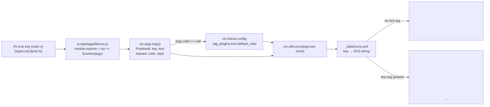
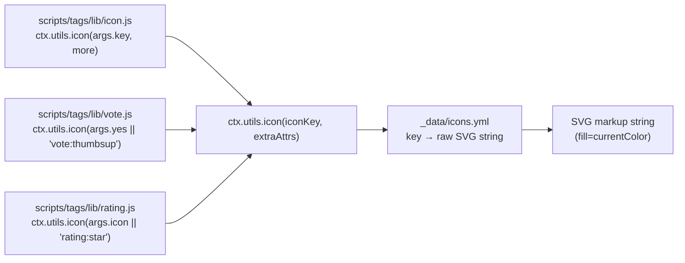
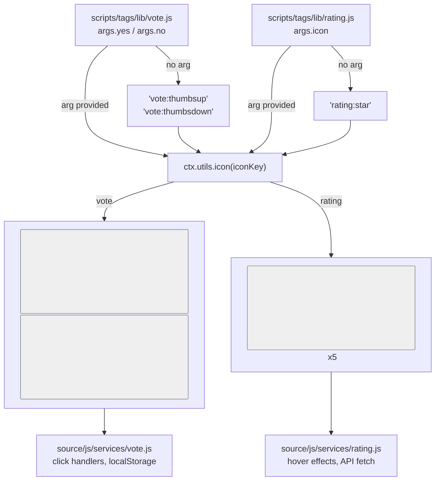

# 图标标签插件

<details>
<summary>相关源码文件</summary>

生成此页面时参考的主题源码文件：

- [scripts/tags/lib/icon.js](../../../scripts/tags/lib/icon.js)
- [scripts/tags/lib/vote.js](../../../scripts/tags/lib/vote.js)
- [scripts/tags/lib/rating.js](../../../scripts/tags/lib/rating.js)
- [_data/icons.yml](../../../_data/icons.yml)
- [source/css/_components/tag-plugins/vote.styl](../../../source/css/_components/tag-plugins/vote.styl)
- [source/css/_components/tag-plugins/rating.styl](../../../source/css/_components/tag-plugins/rating.styl)

</details>

图标标签插件通过 `` 标签在 Markdown 内容中渲染 SVG 图标。实现在 [scripts/tags/lib/icon.js](../../../scripts/tags/lib/icon.js)：用 `ctx.args.map()` 解析参数，用 `ctx.theme.config.tag_plugins.icon.default_color` 作兜底颜色，并经 `ctx.utils.icon()` 解析图标键。

## 系统架构

**图标标签插件：模块解析流程**



**参考源码**：[scripts/tags/lib/icon.js](../../../scripts/tags/lib/icon.js)、[_data/icons.yml](../../../_data/icons.yml)

## 参数解析

**ctx.args.map() 函数签名**

```javascript
ctx.args.map(rawArgs, ['color', 'style'], ['key', 'text'])
```

| 参数 | 类型 | 说明 |
|------|------|------|
| `rawArgs` | Array | 空格分隔的标签参数 |
| `['color', 'style']` | Array | 要提取的命名参数键（格式：`name:value`） |
| `['key', 'text']` | Array | 位置参数名 |

**解析行为**

| 输入 | 解析结果 | 说明 |
|------|----------|------|
| `example:planet` | `args.key = 'example:planet'` | 第一个位置参数 |
| `color:#4ecdc4` | `args.color = '#4ecdc4'` | 命名参数 |
| `style:font-size:2em` | `args.style = 'font-size:2em'` | 命名参数 |
| `Projects`（key 之后） | `args.text = 'Projects'` | 第二个位置参数 |

**标签语法**

```

```

**参考源码**：[scripts/tags/lib/icon.js](../../../scripts/tags/lib/icon.js)

## 实现

**代码结构**

| 位置 | 函数 | 变量 | 输出 |
|------|------|------|------|
| `ctx.args.map()` | 参数解析 | `args.key`、`args.color`、`args.style`、`args.text` | 解析后的参数对象 |
| 默认颜色检查 | — | `args.color = ctx.theme.config.tag_plugins.icon.default_color` | 确保颜色值存在 |
| 初始化 | — | `var el = ''` | HTML 字符串累加器 |
| 条件包装 | — | `el += '<div class="tag-plugin icon-wrap">'` | `args.text` 存在时添加 |
| 图标容器 | — | `el += '<span class="tag-plugin icon colorful" ' + ctx.args.joinTags(args, ['color']).join(' ') + '>'` | 带颜色属性的 span |
| 样式属性 | — | `var more = 'style="' + args.style + '"'` | 内联 CSS 字符串 |
| `ctx.utils.icon()` | — | `el += ctx.utils.icon(args.key, more)` | 解析后的 SVG 标记 |
| 关闭 span | — | `el += '</span>'` | 关闭图标容器 |
| 文本标签 | — | `el += '<span class="text">' + args.text + '</span></div>'` | `args.text` 存在时添加 |
| 返回 | — | `return el` | 完整 HTML 字符串 |

**HTML 输出结构**

无文本：

```html
<span class="tag-plugin icon colorful" color="value">
  <svg>...</svg>
</span>
```

有文本：

```html
<div class="tag-plugin icon-wrap">
  <span class="tag-plugin icon colorful" color="value">
    <svg>...</svg>
  </span>
  <span class="text">Text content</span>
</div>
```

**参考源码**：[scripts/tags/lib/icon.js](../../../scripts/tags/lib/icon.js)

## 默认颜色配置

未提供 `color` 参数时，图标标签插件应用主题配置中的默认颜色。

**默认颜色解析**

```javascript
if (args.color == null) {
  args.color = ctx.theme.config.tag_plugins.icon.default_color
}
```

**配置路径**

默认颜色定义在 `_config.yml`：

```yaml
tag_plugins:
  icon:
    default_color: 'auto'
```

**颜色值行为**

| 配置值 | 行为 | HTML 输出 |
|--------|------|-----------|
| `'auto'` | 继承父元素颜色 | `<span ... color="auto">` |
| `'#hexcode'` | 应用指定十六进制色 | `<span ... color="#ff0000">` |
| `'var(--theme)'` | 用 CSS 变量 | `<span ... color="var(--theme)">` |
| `undefined` | 回退到 `'auto'` | `<span ... color="auto">` |

**颜色属性应用**

解析出的颜色经 `ctx.args.joinTags` 作为 HTML 属性应用：

```javascript
el += `<span class="tag-plugin icon colorful" ${ctx.args.joinTags(args, ['color']).join(' ')}>`
```

生成 `<span class="tag-plugin icon colorful" color="value">`。`color` 属性随后由 CSS 处理，设置图标的实际颜色。

**参考源码**：[scripts/tags/lib/icon.js](../../../scripts/tags/lib/icon.js)

## ctx.utils.icon() 辅助函数

**函数签名**

```javascript
ctx.utils.icon(iconKey, additionalAttributes, inline)
```

| 参数 | 类型 | 必填 | 说明 |
|------|------|------|------|
| `iconKey` | String | 是 | `_data/icons.yml` 中的键（如 `'vote:thumbsup'`） |
| `additionalAttributes` | String | 否 | 附加到图标元素的 HTML 属性 |
| `inline` | Boolean | 否 | `true` 时 SVG 原样内联输出；缺省时非首屏图标输出占位符由客户端异步替换 |

**异步渲染**

非首屏图标默认不内联进 HTML：服务端输出 `<svg class="icon" data-icon="key">` 占位符，客户端 `/js/icons.js`（defer）按命名空间拉取构建期生成的 `js/icons/{ns}.json` 后原位替换为完整 SVG，最终 DOM 与全量内联一致，CSS 钩子不受影响。首屏关键图标（搜索、菜单、leftbar/rightbar、arrow-left）与 TOC 底部操作按钮（回到顶部/参与讨论）由对应模板调用处传 `inline=true` 保持内联；站点通过 `source/_data/icons.yml` 覆盖或补充同名键。无 JS 时非关键图标不显示（主题本身强依赖 JS）。

**图标解析：ctx.utils.icon() 调用方**



**用法示例**

| 标签插件 | 代码 | 默认图标键 |
|----------|------|------------|
| 投票插件 | `ctx.utils.icon(args.yes \|\| 'vote:thumbsup')` | `vote:thumbsup` |
| 评分插件 | `ctx.utils.icon(args.icon \|\| 'rating:star')` | `rating:star` |
| 图标插件 | `ctx.utils.icon(args.key, more)` | 无（必填参数） |

**参考源码**：[scripts/tags/lib/icon.js](../../../scripts/tags/lib/icon.js)、[scripts/tags/lib/vote.js](../../../scripts/tags/lib/vote.js)、[scripts/tags/lib/rating.js](../../../scripts/tags/lib/rating.js)

## 与其他标签插件的集成

图标系统与其他标签插件紧密集成，为交互组件提供视觉元素。

**图标集成映射**

| 标签插件 | 图标用法 | 可配置 | 默认图标 |
|----------|----------|--------|----------|
| **投票插件** | 赞/踩按钮 | 是（`yes`/`no` 参数） | `vote:thumbsup`、`vote:thumbsdown` |
| **评分插件** | 星级评分 | 是（`icon` 参数） | `rating:star` |
| **链接插件** | 链接卡片装饰 | 否 | 各种默认图标 |
| **提示框插件** | 标注框图标 | 是 | 依上下文 |

**投票插件图标集成**

投票插件支持自定义图标：

```

```

默认行为：

```javascript
el += `<button class="vote-up">${ctx.utils.icon(args.yes || 'vote:thumbsup')} <span class="up">0</span></button>`
el += `<button class="vote-down">${ctx.utils.icon(args.no || 'vote:thumbsdown')} <span class="down">0</span></button>`
```

**评分插件图标集成**

评分插件生成多个星形图标：

```

```

默认行为：

```javascript
const star = ctx.utils.icon(args.icon || 'rating:star')
let el = `<div class="tag-plugin ds-rating" data-api="${api}" data-id="${id}">`
el += `<div class="body">`
for (let i = 1; i <= 5; i++) {
  el += `<button class="star" data-value="${i}">${star}</button>`
}
```

**投票与评分插件图标选择**



**参考源码**：[scripts/tags/lib/vote.js](../../../scripts/tags/lib/vote.js)、[scripts/tags/lib/rating.js](../../../scripts/tags/lib/rating.js)

## 图标样式

**SVG 颜色继承**

所有图标使用 `fill="currentColor"` 继承父元素颜色：

```svg
<svg xmlns="http://www.w3.org/2000/svg" fill="currentColor" viewBox="0 0 24 24">
  <path fill="currentColor" d="..."/>
</svg>
```

**CSS 样式层**

| 样式表 | 选择器 | 属性 | 用途 |
|--------|--------|------|------|
| `vote.styl` | `button svg` | `font-size: 1.5em; margin: 8px` | 投票按钮图标尺寸 |
| `vote.styl` | `button` | `color: var(--theme)` | 经继承的图标颜色 |
| `rating.styl` | `button svg` | `font-size: 1.5em; margin: 4px` | 评分星形尺寸 |
| `rating.styl` | `button` | `color: var(--theme); opacity: 0.2` | 默认星形外观 |

**icons.yml 中的特殊类**

| 类 | 图标 | 用途 | 效果 |
|----|------|------|------|
| `.loading` | 自定义图标（如 `custom:spinner`） | 加载中 | 旋转动画（仅内联 SVG 适用） |
| `.active-icon` | `default:bookmark.active` | 选中状态 | 激活状态指示 |

**颜色属性应用**

图标标签插件在 `icon.js` 中经 HTML 属性应用颜色：

```javascript
`<span class="tag-plugin icon colorful" ${ctx.args.joinTags(args, ['color']).join(' ')}>`
```

输出 `<span class="tag-plugin icon colorful" color="#4ecdc4">`。

**参考源码**：[_data/icons.yml](../../../_data/icons.yml)、[source/css/_components/tag-plugins/vote.styl](../../../source/css/_components/tag-plugins/vote.styl)、[source/css/_components/tag-plugins/rating.styl](../../../source/css/_components/tag-plugins/rating.styl)、[scripts/tags/lib/icon.js](../../../scripts/tags/lib/icon.js)

## 配置

图标系统行为通过 `_config.yml` 配置。

**配置结构**

```yaml
tag_plugins:
  icon:
    default_color: 'auto'  # 默认图标颜色
```

未提供 color 参数时应用默认颜色：

```javascript
if (args.color == null) {
  args.color = ctx.theme.config.tag_plugins.icon.default_color
}
```

**常用颜色值**

| 值 | 说明 |
|----|------|
| `'auto'` | 继承父元素颜色 |
| `'#hexcode'` | 指定十六进制色 |
| `'var(--theme)'` | CSS 变量引用 |
| `'currentColor'` | 显式当前颜色继承 |

**参考源码**：[scripts/tags/lib/icon.js](../../../scripts/tags/lib/icon.js)

## iconData() 辅助函数

`hexo.utils.iconData(key)` 返回 icons.yml 的原始值（内联 SVG 或 URL，不包 ``），供需要原始字符串的场景使用：

| 场景 | 用法 |
|------|------|
| 加载失败兜底 onerror | `ctx.theme.config.default.image_onerror \|\| ctx.utils.iconData('image:onerror')` |
| 加载占位（`--icon-loading`） | `head.ejs` 由 `icons['default:loading']` 内联 SVG 经 `encodeURIComponent` 生成 data URI；`.lazy-icon` 经 `svg-mask-icon` 蒙版 + `background-color: var(--theme)` 上色 |
| CSS 变量生成（head.ejs） | 从 `theme.icons[key]` 经 `encodeURIComponent` 生成 data URI |

**参考源码**：[scripts/events/lib/utils.js](../../../scripts/events/lib/utils.js)

## 客户端图标注册表

`layout/_partial/scripts/defines.ejs` 把客户端用到的图标白名单注入 `ctx.icons`（`default:tocomment`、`default:warning`、`weibo:repeat`、`weibo:like`），浏览器端 JS（weibo/timeline 服务、utils 警告图标）按 `ctx.icons['key']` 读取渲染。注入时去除 SVG 注释并转义 `<`，防止 `<!--` / `</script>` 解析问题。

**参考源码**：[layout/_partial/scripts/defines.ejs](../../../layout/_partial/scripts/defines.ejs)

## 内置图标键

`_data/icons.yml` 除历史命名空间（solar/default/github/share/ph/bxs/vote/rating）外，新增：

- 主题基础功能（非标签插件）图标键统一为 `default:语义名`（如 `default:calendar`、`default:arrow-left`），键不绑定用途、可任意复用；仅出现在 `_config.yml` 注释示例中的图标用 `example:` 命名空间（如 `example:planet`）；非 Solar 值图标放在顶部「非 Solar 值保留图标」组并逐个备注来源与原因（`default:search` 三态着色依赖 `p-id="1562"`、`default:rss` 经典 RSS 视觉、`default:leftbar/rightbar` `#sep` 位移动画、`default:loading` 内联 SVG（`fill="currentColor"`，SMIL 三圆点动画），经 `head.ejs` 生成 `--icon-loading`，图片懒加载/评论区/异步数据服务占位共用）
- `github:logo-alt`：ghuser 头部 GitHub logo
- `chat:` 浏览器来源（google/safari/ie/uc/qq/baidu/firefox/360/qq-mini）、文件类型（file-word/file-ppt/file-txt/file-pdf/file-archive/file-excel/file-code/file-photo/file-video/file-voice/file-config/file-database/file-link/file-exe/file-3d/file-unknown）、聊天控件（earphone/bluetooth/signal/wifi/battery/back/nav-more-wechat/nav-more-qq/arrow-up/pause/play/download/voice-qq/voice-wechat/photos/camera/red-envelope/smile-qq/smile-wechat/more-qq/more-wechat）
- `weibo:repeat`、`weibo:like`：微博/时间线数据服务（）的转发/点赞图标（替代 emoji，客户端注册表）；评论数图标复用 `default:tocomment`（与右栏「参与讨论」一致）

## 添加自定义图标

向主题添加自定义图标的步骤：

1. **在 YAML 中定义图标**：在 `_data/icons.yml` 添加键值对
2. **使用命名空间约定**：遵循 `namespace:iconname` 模式
3. **包含必需属性**：SVG 含 `viewBox`，fill 用 `currentColor`
4. **添加特殊类**：按需加 `.loading` 或 `.active-icon`

**自定义图标示例**

```yaml
# 带命名空间的自定义图标
custom:myicon: <svg xmlns="http://www.w3.org/2000/svg" viewBox="0 0 24 24"><path fill="currentColor" d="..."/></svg>

# 带动画类的图标
custom:spinner: <svg class="loading" xmlns="..." viewBox="0 0 24 24">...</svg>
```

**自定义图标用法**

```markdown


```

**参考源码**：[_data/icons.yml](../../../_data/icons.yml)
