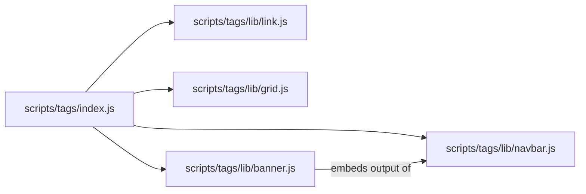
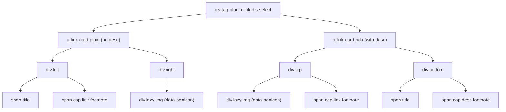
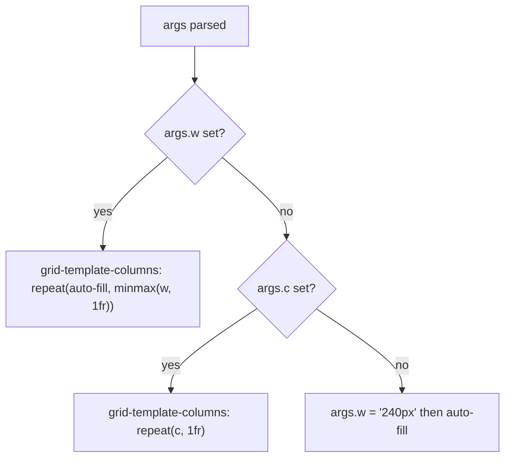
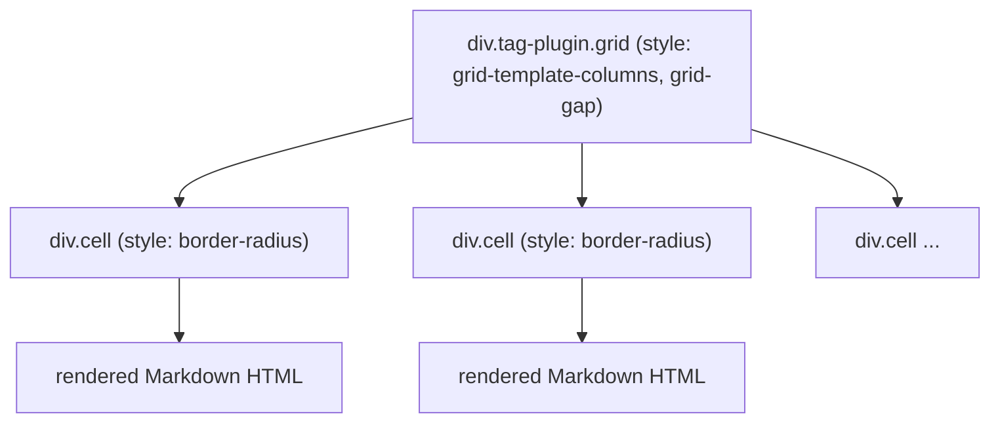
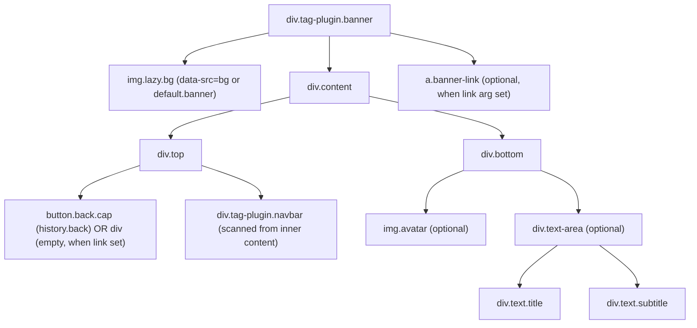

# 链接、网格与横幅标签

<details>
<summary>相关源码文件</summary>

生成此页面时参考的主题源码文件：

- [.github/workflows/npm-publish.yml](../../../.github/workflows/npm-publish.yml)
- [.npmignore](../../../.npmignore)
- [LICENSE](../../../LICENSE)
- [README.md](../../../README.md)
- [_config.yml](../../../_config.yml)
- [package.json](../../../package.json)
- [scripts/tags/index.js](../../../scripts/tags/index.js)
- [scripts/tags/lib/link.js](../../../scripts/tags/lib/link.js)
- [scripts/tags/lib/grid.js](../../../scripts/tags/lib/grid.js)
- [scripts/tags/lib/banner.js](../../../scripts/tags/lib/banner.js)
- [scripts/tags/lib/navbar.js](../../../scripts/tags/lib/navbar.js)

</details>

本页介绍 hexo-theme-stellar 中三个面向布局的 Hexo 标签插件：`link`、`grid`、`banner`，以及 `banner` 内部配套使用的 `navbar` 插件。这些插件直接在 Markdown 内容中生成结构化 HTML 组件。

标签插件注册入口与通用架构见[标签插件总览](tag-plugins-overview.md)；使用类似 `data-service` 模式的社交与内容卡片插件见[内容展示标签](social-content-card-tags.md)；媒体类插件见[时间线与媒体标签](timeline-media-tags.md)。

---

## 插件文件映射

**标签插件源文件**



**参考源码**：[scripts/tags/lib/link.js](../../../scripts/tags/lib/link.js)、[scripts/tags/lib/grid.js](../../../scripts/tags/lib/grid.js)、[scripts/tags/lib/banner.js](../../../scripts/tags/lib/banner.js)、[scripts/tags/lib/navbar.js](../../../scripts/tags/lib/navbar.js)

---

## 链接标签插件

### 用途

渲染带图标、标题、URL 说明与可选描述的样式化链接卡片。外部链接自动获得 `target="_blank"` 与 `rel` 属性。

### 语法

```

```

| 参数 | 类型 | 必填 | 说明 |
|------|------|------|------|
| `url` | 位置参数 | 是 | 链接目标 URL |
| `title` | 位置参数 | 否 | 显示标题（省略时自动填充） |
| `icon` | 命名参数 | 否 | 图标图片 URL（省略时自动填充） |
| `desc` | 命名参数 | 否 | 描述字符串，或 `true`/`false` 切换描述区 |

参数经 `ctx.args.map(args, ['icon', 'desc'], ['url', 'title'])` 解析：先列命名参数，再列位置参数。

**参考源码**：[scripts/tags/lib/link.js](../../../scripts/tags/lib/link.js)

### 布局模式

`desc` 是否存在决定渲染两种布局之一：

**link 标签 HTML 结构**



**参考源码**：[scripts/tags/lib/link.js](../../../scripts/tags/lib/link.js)

### 自动填充与数据 API

`title`、`icon` 或 `desc` 缺失时，对应字段名追加到锚元素的 `autofill` 属性。`cardlink` 属性同时标记元素。配置了 `ctx.theme.config.data_services.siteinfo.api` 时，URL 以 `args.api.replace('{href}', url)` 插值并作为 `data-api` 存储到锚上，启用客户端自动填充。

```
<a class="link-card plain" cardlink autofill="title,icon,desc" data-api="...">
```

**参考源码**：[scripts/tags/lib/link.js](../../../scripts/tags/lib/link.js)

### 外部 URL 处理

`args.url` 含 `://` 时锚元素获得：

```
target="_blank" rel="external nofollow noopener noreferrer"
```

**参考源码**：[scripts/tags/lib/link.js](../../../scripts/tags/lib/link.js)

### 图标渲染

图标始终渲染为懒加载背景图：

```html
<div class="lazy img" data-bg="<icon-url or default.link>"></div>
```

兜底图标 URL 来自 `ctx.theme.config.default.link`。

**参考源码**：[scripts/tags/lib/link.js](../../../scripts/tags/lib/link.js)

---

## 网格标签插件

### 用途

渲染 CSS Grid 容器，把 Markdown 内容按 `<!-- cell -->` HTML 注释分隔为单元格。

### 语法

```

<!-- cell -->
Left content (Markdown)
<!-- cell -->
Right content (Markdown)

```

| 参数 | 类型 | 默认 | 说明 |
|------|------|------|------|
| `bg` | 命名参数 | — | 背景样式变体（`box`、`card` 等） |
| `w` | 命名参数 | `240px` | `auto-fill` 网格的最小单元格宽 |
| `c` | 命名参数 | — | 固定列数 |
| `gap` | 命名参数 | — | CSS `grid-gap` 值 |
| `br` | 命名参数 | — | 应用到每个单元格的 CSS `border-radius` |

`w` 与 `c` 都未提供时 `w` 默认 `240px`。

**参考源码**：[scripts/tags/lib/grid.js](../../../scripts/tags/lib/grid.js)

### 列布局逻辑



**参考源码**：[scripts/tags/lib/grid.js](../../../scripts/tags/lib/grid.js)

### 单元格解析与渲染

内容按正则 `/<!--\s*cell(.*?)-->/g` 切分。切分后的空段经 `.filter(item => item.trim().length > 0)` 丢弃。每个剩余段经以下方式渲染为 Markdown：

```js
ctx.render.renderSync({text: cell, engine: 'markdown'})
```

每个单元格成为 `<div class="cell" style="border-radius:...">`。

**参考源码**：[scripts/tags/lib/grid.js](../../../scripts/tags/lib/grid.js)

### 输出结构



`bg` 与 `columns` 属性经 `ctx.args.joinTags(args, ['bg', 'columns'])` 序列化到容器 div 上。

**参考源码**：[scripts/tags/lib/grid.js](../../../scripts/tags/lib/grid.js)

---

## 导航条标签插件

### 用途

渲染带可点击链接的横向导航条，可标记一个激活链接。主要作为 `` 内的配套组件，也可独立使用。

### 语法

```

```

| 参数 | 类型 | 说明 |
|------|------|------|
| `active` | 命名参数 | 当前激活链接的 URL |
| 其余 | 位置参数（空格分隔） | Markdown 格式链接 `[text](href)` |

**参考源码**：[scripts/tags/lib/navbar.js](../../../scripts/tags/lib/navbar.js)

### 链接解析

每个位置参数与 `/\[(.*?)\]\((.*?)\)/i` 匹配。匹配成功时 `matches[1]` 是显示文本、`matches[2]` 是 `href`。参数不匹配 Markdown 链接语法时，同时用作 `href`（加 `#` 前缀）与链接文本。

`href` 等于 `args.active` 的链接获得额外的 `active` CSS 类。

**参考源码**：[scripts/tags/lib/navbar.js](../../../scripts/tags/lib/navbar.js)

### 输出结构

```html
<div class="tag-plugin navbar">
  <a class="link" href="/url1">text1</a>
  <a class="link active" href="/url2">text2</a>
</div>
```

**参考源码**：[scripts/tags/lib/navbar.js](../../../scripts/tags/lib/navbar.js)

---

## 横幅标签插件

### 用途

渲染带背景图、可选头像、标题、副标题与内嵌 `navbar` 的全宽横幅面板。可选 `link` 参数把整个横幅包装为可点击覆盖层。

### 语法

```



```

| 参数 | 类型 | 说明 |
|------|------|------|
| `title` | 位置参数 | 横幅标题文本 |
| `subtitle` | 位置参数 | 横幅副标题文本 |
| `bg` | 命名参数 | 背景图 URL（回退 `ctx.theme.config.default.banner`） |
| `avatar` | 命名参数 | 头像图片 URL |
| `link` | 命名参数 | 设置后把横幅包装为 `<a class="banner-link">` 并隐藏返回按钮 |

**参考源码**：[scripts/tags/lib/banner.js](../../../scripts/tags/lib/banner.js)

### HTML 结构

**banner 标签 HTML 结构**



**参考源码**：[scripts/tags/lib/banner.js](../../../scripts/tags/lib/banner.js)

### 导航条嵌入

`...` 的内部内容逐行扫描。第一行包含 `tag-plugin navbar` 字符串的行直接注入 `div.top`：

```js
const rows = content.split('\n').filter(item => item.trim().length > 0)
for (let row of rows) {
  if (row.includes('tag-plugin navbar')) {
    el += row
    break
  }
}
```

即 `` 标签必须出现在 banner 块内，且 banner 处理插入前 Hexo 必须已渲染它。

**参考源码**：[scripts/tags/lib/banner.js](../../../scripts/tags/lib/banner.js)

### 返回按钮与链接模式

| 条件 | `div.top` 左侧 |
|------|----------------|
| `args.link` 缺失或为空 | `button.back.cap`，带调用 `window.history.back()` 的 SVG 左箭头 |
| 设置了 `args.link` | 空的 `<div>` 占位 |

设置 `args.link` 时，`<a class="banner-link" href="..."></a>` 作为 `div.content` 的兄弟元素追加，充当全区域覆盖链接。

**参考源码**：[scripts/tags/lib/banner.js](../../../scripts/tags/lib/banner.js)

### 背景图

```js
el += ``
```

图片用 `data-src` 属性与 `lazy` 类懒加载。懒加载图片解析见[懒加载与图片处理](../07-外部集成/lazy-loading-images.md)。

**参考源码**：[scripts/tags/lib/banner.js](../../../scripts/tags/lib/banner.js)

---

## 参数解析模式

四个插件共用 `ctx.args.map` 工具：

```js
// link.js
args = ctx.args.map(args, ['icon', 'desc'], ['url', 'title'])

// grid.js
args = ctx.args.map(args, ['bg', 'w', 'c', 'gap', 'br'])

// banner.js
args = ctx.args.map(args, ['bg', 'avatar', 'link'], ['title', 'subtitle'])

// navbar.js
args = ctx.args.map(args, ['active'], ['links'])
```

第一个数组列出命名（`key:value`）参数；第二个（可选）数组按顺序列出位置参数。这与主题中所有标签插件使用的约定一致。`ctx.args.map` 详见[标签插件总览](tag-plugins-overview.md)。

**参考源码**：[scripts/tags/lib/link.js](../../../scripts/tags/lib/link.js)、[scripts/tags/lib/grid.js](../../../scripts/tags/lib/grid.js)、[scripts/tags/lib/banner.js](../../../scripts/tags/lib/banner.js)、[scripts/tags/lib/navbar.js](../../../scripts/tags/lib/navbar.js)

---

## CSS 入口点

| 插件 | 主要 CSS 类 |
|------|------------|
| `link` | `.tag-plugin.link`、`.link-card`、`.link-card.plain`、`.link-card.rich` |
| `grid` | `.tag-plugin.grid`、`.cell` |
| `banner`（标签） | `.tag-plugin.banner`、`.banner-link` |
| `navbar` | `.tag-plugin.navbar`、`.link`、`.link.active` |
| `banner`（文章级） | `.article.banner` |

> **注意**：`source/css/_components/partial/article-banner.styl` 中定义的 `.article.banner` 是用于页面级文章横幅的独立组件，不是 `` 标签插件。两者视觉相似，但由不同系统渲染。

**参考源码**：[source/css/_components/partial/article-banner.styl](../../../source/css/_components/partial/article-banner.styl)
