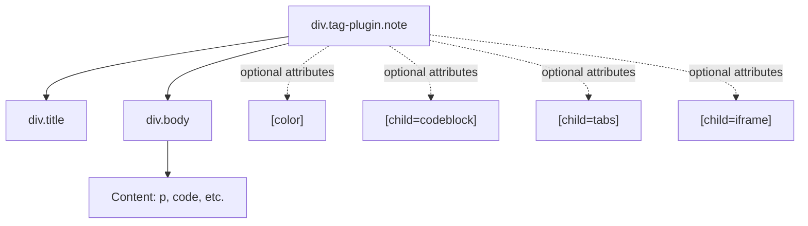
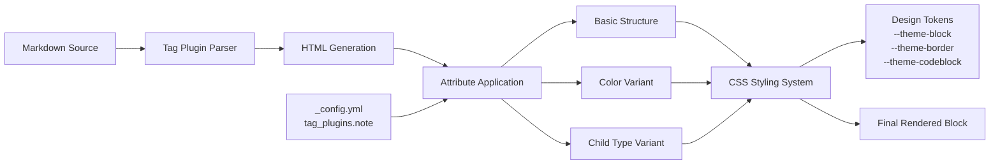
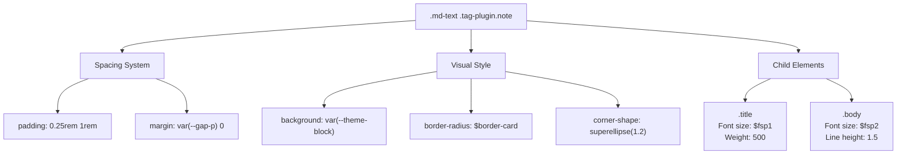
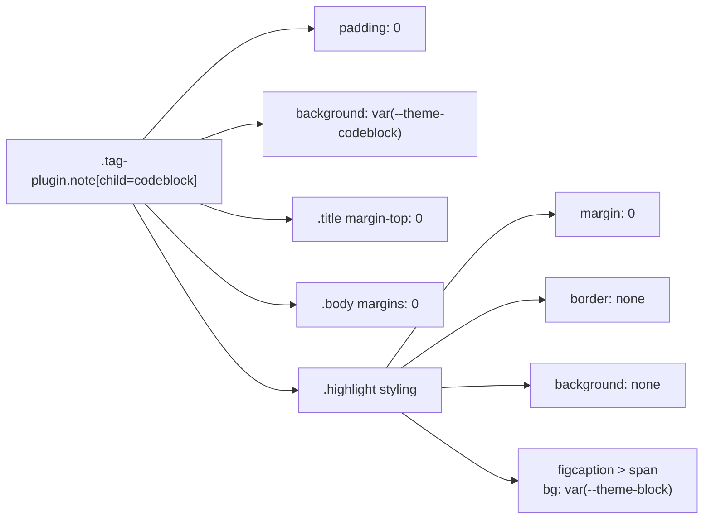
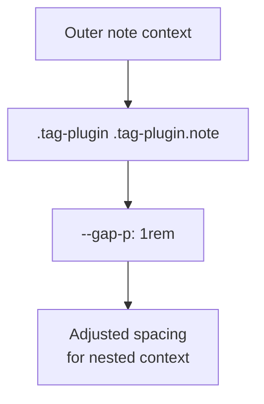
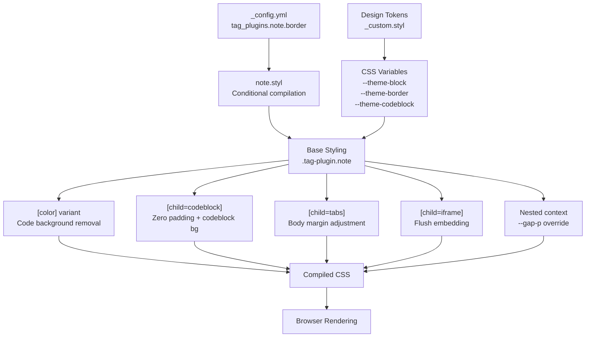

# 提示框与容器标签插件

<details>
<summary>相关源码文件</summary>

生成此页面时参考的主题源码文件：

- [scripts/tags/lib/icon.js](../../../scripts/tags/lib/icon.js)
- [source/css/_common/loading.styl](../../../source/css/_common/loading.styl)
- [source/css/_components/md.styl](../../../source/css/_components/md.styl)
- [source/css/_components/partial/article-footer.styl](../../../source/css/_components/partial/article-footer.styl)
- [source/css/_components/tag-plugins/note.styl](../../../source/css/_components/tag-plugins/note.styl)
- [source/css/_components/tag-plugins/timeline.styl](../../../source/css/_components/tag-plugins/timeline.styl)
- [source/css/_plugins/comments/twikoo.styl](../../../source/css/_plugins/comments/twikoo.styl)

</details>

本文介绍 Stellar 中 note/box 容器标签插件系统的实现与样式架构。这些标签插件提供可配置颜色、边框的内容块，并支持代码块、标签页、iframe 等多种子内容类型。

其他标签插件见[图标标签插件](icon-tag.md)、[时间线与媒体标签](timeline-media-tags.md)、[交互式标签插件](link-grid-banner-tags.md)与[内容展示标签](social-content-card-tags.md)。

## 概览

note 标签插件创建可容纳多种内容的样式化容器块。它是纯 CSS 系统（无需 JavaScript），用 HTML 属性控制样式变体与子内容适配。

**关键特性：**

- 经主题配置控制边框显示
- 带主题感知 CSS 变量的颜色属性系统
- 自动适配不同子内容类型（代码块、标签页、iframe）
- 支持嵌套 note，间距调整
- 与设计令牌系统集成

**参考源码**：[source/css/_components/tag-plugins/note.styl](../../../source/css/_components/tag-plugins/note.styl)

## 标签结构与 HTML 输出

### 基础 HTML 结构



**note 标签 HTML 结构**

note 标签生成两个主要区块的容器：

- `.title` 元素（可选）——显示 note 标题
- `.body` 元素——包含实际内容

在 markdown 上下文中渲染时，父选择器 `.md-text .tag-plugin.note` 保证与周围内容的间距与集成。

**参考源码**：[source/css/_components/tag-plugins/note.styl](../../../source/css/_components/tag-plugins/note.styl)

### 渲染流水线



**note 标签渲染流程**

渲染过程经级联选择器应用样式：

1. 基础 `.tag-plugin.note` 类提供基础样式
2. `[color]` 属性激活颜色专属 CSS 变量
3. `[child=*]` 属性触发子内容专属布局适配
4. `_custom.styl` 的设计令牌决定实际颜色值

**参考源码**：[source/css/_components/tag-plugins/note.styl](../../../source/css/_components/tag-plugins/note.styl)、[source/css/_components/md.styl](../../../source/css/_components/md.styl)

## 配置系统

### 边框配置

note 标签支持由主题配置控制的可选边框：

```stylus
if hexo-config('tag_plugins.note.border') == true
  border: 1px solid var(--theme-border)
```

启用时添加 1px 边框，用 `--theme-border` CSS 变量（随深浅模式适配）。

**配置路径**：`_config.yml` → `tag_plugins.note.border`

**参考源码**：[source/css/_components/tag-plugins/note.styl](../../../source/css/_components/tag-plugins/note.styl)

### CSS 变量系统

note 标签用三个主要 CSS 变量做主题化：

| 变量 | 用途 | 用于 |
|------|------|------|
| `--theme-block` | note 容器背景色 | 基础 note 背景 |
| `--theme-border` | 边框颜色（启用时） | 可选边框、嵌套高亮 |
| `--theme-codeblock` | 代码块变体的背景 | `[child=codeblock]` 变体 |

这些变量按 `[color]` 属性动态设置，并与 `_custom.styl` 定义的全局设计令牌系统集成。

**参考源码**：[source/css/_components/tag-plugins/note.styl](../../../source/css/_components/tag-plugins/note.styl)

## 样式架构

### 基础样式



**基础样式属性**

基础 note 样式建立：

- **容器**：相对定位，superellipse 圆角形状
- **内边距**：水平 1rem、垂直 0.25rem
- **背景**：`--theme-block` 变量（主题感知）
- **溢出**：隐藏以包含圆角效果

**参考源码**：[source/css/_components/tag-plugins/note.styl](../../../source/css/_components/tag-plugins/note.styl)

### 标题与正文元素

`.title` 元素：

- 字号 `$fsp1`（较大）
- 字重 500
- 颜色 `--text`（高对比）
- 顶部边距 `var(--gap-p-compact)`

`.body` 元素：

- 字号 `$fsp2`（小于标题）
- 应用于容器与其内 `<p>` 元素
- 垂直边距 `var(--gap-p-compact)`
- 特例：body 是唯一子元素时，边距调整为 `calc(var(--gap-p) - 0.25rem)`

**参考源码**：[source/css/_components/tag-plugins/note.styl](../../../source/css/_components/tag-plugins/note.styl)

### 颜色属性系统

存在 `[color]` 属性时，note 内的代码元素移除背景，防止视觉冲突：

```stylus
.md-text .tag-plugin.note[color]
  code
    background: none
```

保证行内代码与彩色 note 背景无缝集成。

**参考源码**：[source/css/_components/tag-plugins/note.styl](../../../source/css/_components/tag-plugins/note.styl)

## 子内容适配

### 代码块子类型



`[child=codeblock]` 属性触发大量布局调整：

1. **容器调整：**
   - 移除内边距（padding: 0）
   - 背景改为 `--theme-codeblock`（代码优化主题）
   - 标题与正文边距重置为 0

2. **高亮块集成：**
   - 移除 `.highlight` 元素的边距、边框与背景
   - `figcaption span` 用 `--theme-block` 背景
   - 多个连续 `.highlight` 块用虚线边框分隔

这让代码块作为 note 原生内容呈现，无视觉割裂。

**参考源码**：[source/css/_components/tag-plugins/note.styl](../../../source/css/_components/tag-plugins/note.styl)

### 标签页子类型

`[child=tabs]` 属性为标签页组件提供最小适配：

```stylus
.md-text .tag-plugin.note[child=tabs]
  >.body
    margin: 0
    >.tabs
      margin-top: .5rem
```

- 移除正文边距
- 标签页组件获得 0.5rem 顶部边距做视觉分隔

让标签页插件可以嵌入 note 容器并保持合适间距。

**参考源码**：[source/css/_components/tag-plugins/note.styl](../../../source/css/_components/tag-plugins/note.styl)

### Iframe 子类型

`[child=iframe]` 属性为内嵌 iframe 内容优化容器：

```stylus
.md-text .tag-plugin.note[child=iframe]
  padding: 0
  >.body
    margin: 0
    iframe
      margin: 0
```

移除全部 padding 与 margin，实现 iframe 填满整个 note 容器的平贴嵌入。适合视频、地图或交互小部件等外部内容。

**参考源码**：[source/css/_components/tag-plugins/note.styl](../../../source/css/_components/tag-plugins/note.styl)

## 嵌套 note 处理



note 嵌套在其他标签插件内时重新定义段落间距变量：

```stylus
.md-text .tag-plugin .tag-plugin.note
  --gap-p: 1rem
```

该 CSS 自定义属性覆盖调整垂直间距，防止嵌套结构累积过多空白。

**参考源码**：[source/css/_components/tag-plugins/note.styl](../../../source/css/_components/tag-plugins/note.styl)

## 与 Markdown 内容的集成

### 上下文与间距

note 标签通过 `.md-text` 中的父选择器与更广泛的 markdown 内容系统集成：

```stylus
.md-text
  p,blockquote,.tag-plugin,ul,ol,.highlight,table
    *
      --gap-p: var(--gap-p-compact)
  .tag-plugin,iframe
    margin-top: var(--gap-p)
    margin-bottom: var(--gap-p)
```

标签插件（含 note）获得用 `--gap-p` 变量的垂直边距（紧凑布局中为 `--gap-p-compact`），保证 note 与周围内容（段落、列表等）间距一致。

**参考源码**：[source/css/_components/md.styl](../../../source/css/_components/md.styl)

### 特殊布局上下文

story 类型布局中 note 标题有特殊处理：

```stylus
.l_body[type=story] .tag-plugin.note .title p:not([class])
  text-indent: 0
```

移除 story 布局可能应用的文本缩进，保证 note 标题保持左对齐。

**参考源码**：[source/css/_components/tag-plugins/note.styl](../../../source/css/_components/tag-plugins/note.styl)

## CSS 架构总结



note 标签样式系统展示三层架构：

1. **配置层**：主题配置控制边框等可选特性
2. **令牌层**：设计令牌提供随主题适配的语义颜色值
3. **选择器层**：属性选择器实现无需 JavaScript 的变体样式

该架构实现：

- **零 JavaScript**：所有样式与变体都是纯 CSS
- **主题集成**：经 CSS 变量自动适配深浅模式
- **可维护性**：设计令牌变更传播到所有 note 实例
- **性能**：样式无需运行时计算

**参考源码**：[source/css/_components/tag-plugins/note.styl](../../../source/css/_components/tag-plugins/note.styl)、[source/css/_components/md.styl](../../../source/css/_components/md.styl)
