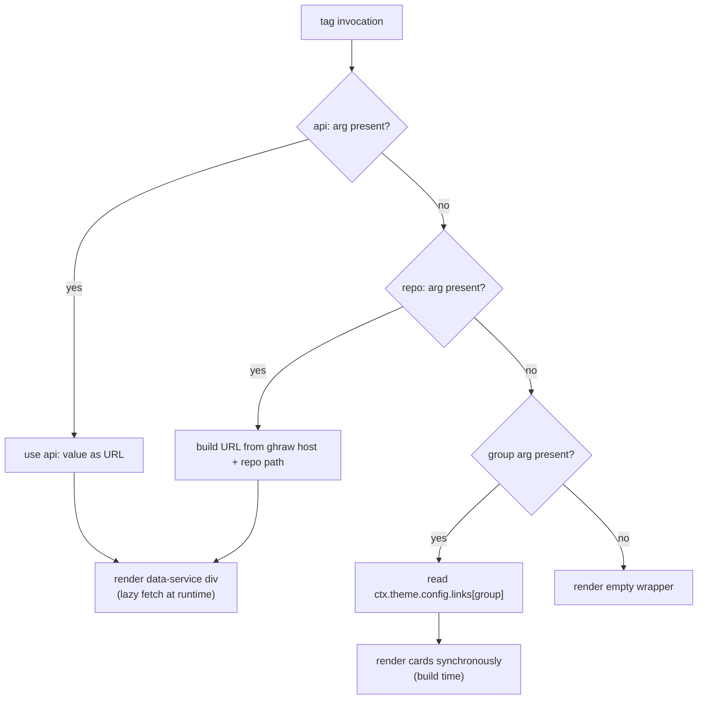
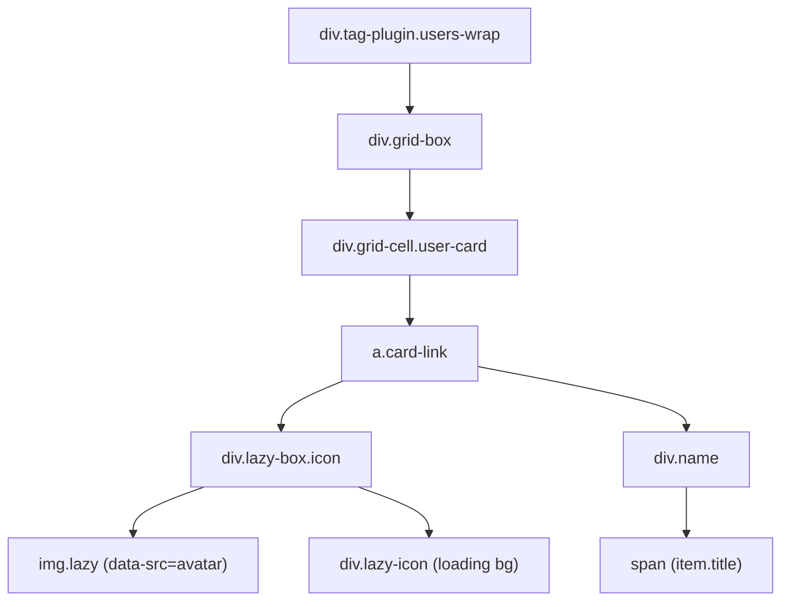
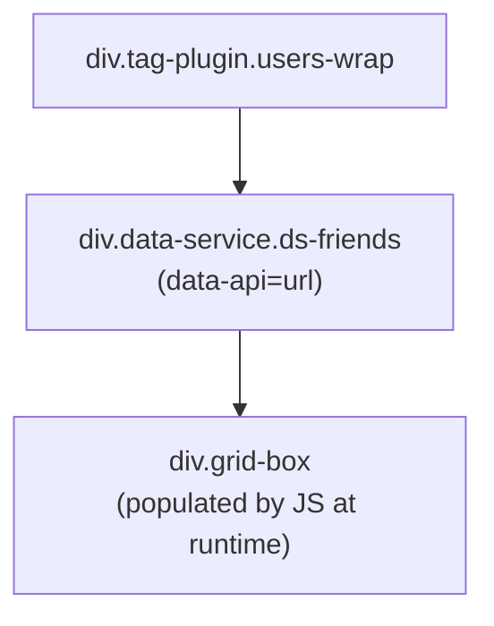
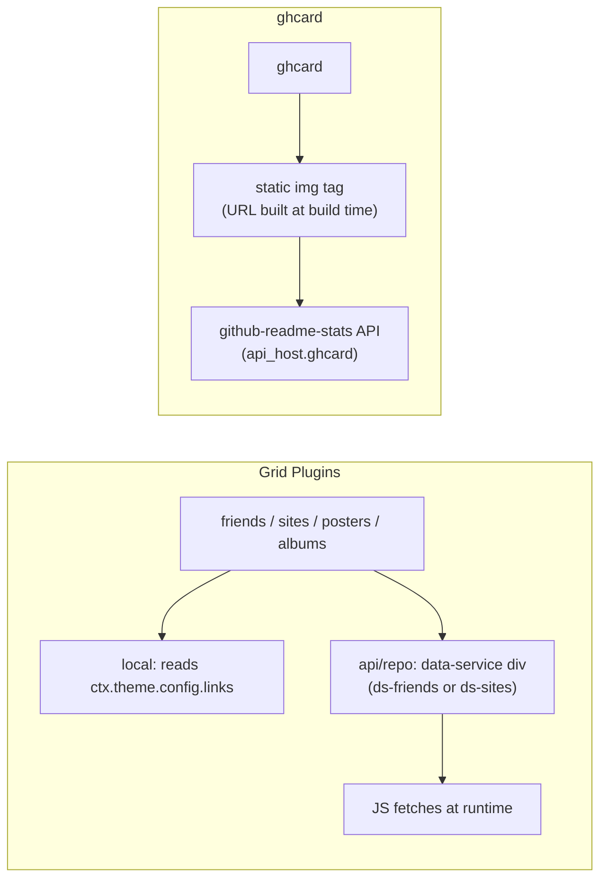

# 内容展示标签（社交与卡片）

<details>
<summary>相关源码文件</summary>

生成此页面时参考的主题源码文件：

- [.github/workflows/npm-publish.yml](../../../.github/workflows/npm-publish.yml)
- [.npmignore](../../../.npmignore)
- [LICENSE](../../../LICENSE)
- [README.md](../../../README.md)
- [_config.yml](../../../_config.yml)
- [package.json](../../../package.json)
- [scripts/tags/lib/friends.js](../../../scripts/tags/lib/friends.js)
- [scripts/tags/lib/sites.js](../../../scripts/tags/lib/sites.js)
- [scripts/tags/lib/posters.js](../../../scripts/tags/lib/posters.js)
- [scripts/tags/lib/albums.js](../../../scripts/tags/lib/albums.js)
- [scripts/tags/lib/ghcard.js](../../../scripts/tags/lib/ghcard.js)

</details>

本页介绍四个渲染社交链接卡片网格的标签插件——`friends`、`sites`、`posters`、`albums`，以及嵌入 GitHub 统计卡片的 `ghcard` 标签。四个网格插件共享双模式数据架构：数据可来自 `_config.yml` 中本地配置的分组，也可来自运行时懒加载的远程 API 端点。

浏览器端数据服务懒加载机制见[数据服务与组件](../06-数据服务与组件/data-widgets-overview.md)；标签插件注册系统见[标签插件总览](tag-plugins-overview.md)。

---

## 通用架构

四个社交卡片插件（`friends`、`sites`、`posters`、`albums`）遵循同一解析模式：

**数据源解析顺序：**

1. 提供 `api:` 参数 → 直接使用该 URL
2. 提供 `repo:` 参数 → 构造 URL `https://{ghraw_host}/{owner/repo}/output/v2/data.json`
3. 提供位置参数 `group` → 从 `ctx.theme.config.links[group]` 同步读取

`ghraw` 主机值来自 `ctx.theme.config.api_host.ghraw`（见 `_config.yml` 的 `api_host`）。

**数据源解析图**



**参考源码**：[scripts/tags/lib/friends.js](../../../scripts/tags/lib/friends.js)、[scripts/tags/lib/sites.js](../../../scripts/tags/lib/sites.js)、[scripts/tags/lib/posters.js](../../../scripts/tags/lib/posters.js)、[scripts/tags/lib/albums.js](../../../scripts/tags/lib/albums.js)

---

## `friends` 标签插件

**文件**：`scripts/tags/lib/friends.js`

**语法：**

```

```

### 参数

| 参数 | 类型 | 默认 | 说明 |
|------|------|------|------|
| `group` | 位置参数 | — | `ctx.theme.config.links` 中读取条目的键 |
| `repo` | 命名参数 | — | GitHub 托管数据文件的 `owner/repo` 路径 |
| `api` | 命名参数 | — | 显式 API URL |
| `posts` | 命名参数 | — | 为 `true` 时在友链旁包含最近文章 |

### 渲染输出结构

- **API 模式**：输出带 `data-api` 属性的 `div.data-service.ds-friends`（`posts:true` 时为 `ds-friends_and_posts`），内含 `div.grid-box`。浏览器数据服务处理器在运行时填充。
- **本地模式**：输出含每条目一个 `div.grid-cell.user-card` 的 `div.grid-box`。

本地用户卡片包含：

- `img.lazy`，`data-src` 解析为 `item.icon || item.avatar || default.avatar`
- 含条目 `title` 的 `div.name`

容器类取决于 `posts` 参数：

- `posts` 为假 → `div.users-wrap`
- `posts` 为真 → `div.users-posts-wrap`

**参考源码**：[scripts/tags/lib/friends.js](../../../scripts/tags/lib/friends.js)

---

## `sites` 标签插件

**文件**：`scripts/tags/lib/sites.js`

**语法：**

```

```

### 参数

| 参数 | 类型 | 默认 | 说明 |
|------|------|------|------|
| `group` | 位置参数 | — | `ctx.theme.config.links` 中的键 |
| `repo` | 命名参数 | — | GitHub 托管数据源 |
| `api` | 命名参数 | — | 显式 API URL |

### 渲染输出结构

- **API 模式**：带 `data-api` 与内层 `div.grid-box` 的 `div.data-service.ds-sites`。
- **本地模式**：含每条目 `div.grid-cell.site-card` 的 `div.grid-box`。

本地站点卡片渲染全宽截图图片加小图标与标题行。截图 `data-src` 解析为：

```
item.cover
  || item.snapshot
  || item.screenshot
  || 'https://image.thum.io/get/width/1280/crop/720/' + item.url
```

图标 `data-src` 解析为 `item.icon || item.avatar || default.link`。

条目必须同时有 `url` 与 `title` 才渲染；缺任一项静默跳过。

**参考源码**：[scripts/tags/lib/sites.js](../../../scripts/tags/lib/sites.js)

---

## `posters` 标签插件

**文件**：`scripts/tags/lib/posters.js`

**语法：**

```

```

### 参数

| 参数 | 类型 | 默认 | 说明 |
|------|------|------|------|
| `group` | 位置参数 | — | `ctx.theme.config.links` 中的键 |
| `repo` | 命名参数 | — | GitHub 托管数据源 |
| `api` | 命名参数 | — | 显式 API URL |
| `size` | 命名参数 | `xs` | 网格单元格尺寸变体 |

### 渲染输出结构

- **API 模式**：带 `data-api` 的 `div.data-service.ds-friends`；内层 `div.tag-plugin.gallery.grid-box`，`layout="grid"`、`ratio="portrait"`。
- **本地模式**：相同 `gallery grid-box` 结构内联渲染，每个条目一个 `div.grid-cell.poster-card`。

每张海报卡片：`<a>` 链接内的懒加载 `img`。封面解析为 `item.cover || item.icon || item.avatar || default.cover`。

条目只需 `url`（无 `title` 也可渲染；有 `title` 时填充 `span.image-caption`）。

注意：API 模式复用 `ds-friends` 数据服务类，同一客户端处理器处理 `friends`（API 模式）与 `posters`（API 模式）。

**参考源码**：[scripts/tags/lib/posters.js](../../../scripts/tags/lib/posters.js)

---

## `albums` 标签插件

**文件**：`scripts/tags/lib/albums.js`

**语法：**

```

```

### 参数

| 参数 | 类型 | 默认 | 说明 |
|------|------|------|------|
| `group` | 位置参数 | — | `ctx.theme.config.links` 中的键 |
| `repo` | 命名参数 | — | GitHub 托管数据源 |
| `api` | 命名参数 | — | 显式 API URL |
| `size` | 命名参数 | `s` | 网格单元格尺寸变体 |

### 渲染输出结构

结构上与 `posters` 相同，差异：

- 默认尺寸 `s`（posters 为 `xs`）
- 网格 `ratio="square"`（posters 为 `ratio="portrait"`）
- 本地模式输出 `div.grid-cell.album-card`（而非 `poster-card`）
- 外层包装 `div.albums-wrap`（而非 `posters-wrap`）

API 模式同样复用 `ds-friends` 数据服务类。

**参考源码**：[scripts/tags/lib/albums.js](../../../scripts/tags/lib/albums.js)

---

## 插件对比表

| 插件 | CSS 包装 | 卡片类 | API 服务类 | 网格比例 | 默认尺寸 | 需要 title？ |
|------|----------|--------|------------|----------|----------|--------------|
| `friends` | `.users-wrap` | `.user-card` | `ds-friends` | —（列表） | — | 是 |
| `sites` | `.sites-wrap` | `.site-card` | `ds-sites` | —（列表） | — | 是 |
| `posters` | `.posters-wrap` | `.poster-card` | `ds-friends` | `portrait` | `xs` | 否 |
| `albums` | `.albums-wrap` | `.album-card` | `ds-friends` | `square` | `s` | 否 |

---

## HTML 结构图

**本地模式——DOM 布局（friends 示例）**



**API 模式——DOM 布局（friends 示例）**



**参考源码**：[scripts/tags/lib/friends.js](../../../scripts/tags/lib/friends.js)、[scripts/tags/lib/sites.js](../../../scripts/tags/lib/sites.js)、[scripts/tags/lib/posters.js](../../../scripts/tags/lib/posters.js)、[scripts/tags/lib/albums.js](../../../scripts/tags/lib/albums.js)

---

## 本地数据源：`ctx.theme.config.links`

四个插件都从 `ctx.theme.config.links` 读取，对应 `_config.yml` 的 `links:` 键。每个值都是条目对象数组。

**各插件支持的条目字段：**

| 字段 | 用于 |
|------|------|
| `url` | 全部（渲染必需） |
| `title` | 全部（friends/sites 必需；posters/albums 的可选标题） |
| `icon` / `avatar` | friends、sites、posters、albums（图标兜底） |
| `cover` | sites、posters、albums（主图） |
| `snapshot` / `screenshot` | sites（截图） |
| `description` | sites（标题下方副标题） |

`_config.yml` 结构示例：

```yaml
links:
  my-friends:
    - title: Example Blog
      url: https://example.com
      avatar: https://example.com/avatar.png
      description: A great blog
```

**参考源码**：[scripts/tags/lib/friends.js](../../../scripts/tags/lib/friends.js)、[scripts/tags/lib/sites.js](../../../scripts/tags/lib/sites.js)、[scripts/tags/lib/posters.js](../../../scripts/tags/lib/posters.js)、[scripts/tags/lib/albums.js](../../../scripts/tags/lib/albums.js)

---

## `ghcard` 标签插件

**文件**：`scripts/tags/lib/ghcard.js`

**语法：**

```


```

该插件嵌入由 [github-readme-stats](https://github.com/anuraghazra/github-readme-stats) API 驱动的静态 GitHub 统计图片。与四个网格插件不同，它没有本地数据模式，也不懒加载——构建期直接渲染普通 `` 标签。

### 参数

| 参数 | 类型 | 说明 |
|------|------|------|
| `repo` | 位置参数 | GitHub 用户名或 `owner/repo` 路径 |
| `theme` | 命名参数 | 卡片视觉主题名 |
| `title_color` | 命名参数 | 标题十六进制色 |
| `text_color` | 命名参数 | 文本十六进制色 |
| `icon_color` | 命名参数 | 图标十六进制色 |
| `bg_color` | 命名参数 | 背景十六进制色 |
| `hide_border` | 命名参数 | 是否隐藏边框 |
| `cache_seconds` | 命名参数 | 缓存 TTL |
| `locale` | 命名参数 | 语言/区域代码 |
| `show_owner` | 命名参数 | 是否显示仓库所有者（默认 `true`） |

### URL 构造

插件主机读取自 `ctx.theme.config.api_host.ghcard`。

- `repo` 参数含 `/` 时视为仓库：
  `https://{ghcard_host}/api/pin/?username={owner}&repo={name}`
- 否则视为用户主页：
  `https://{ghcard_host}/api/?username={path}`

所有命名参数经 `ctx.args.joinURLParams` 作为 URL 查询参数追加。未显式设置 `show_owner` 时自动追加 `show_owner=true`。

### 渲染输出

```
div.tag-plugin.ghcard
  a.ghcard [href=https://github.com/{path}]
    img [src={api_url}]
```

**参考源码**：[scripts/tags/lib/ghcard.js](../../../scripts/tags/lib/ghcard.js)

---

## `ghcard` 与网格插件的关键差异



**参考源码**：[scripts/tags/lib/ghcard.js](../../../scripts/tags/lib/ghcard.js)、[scripts/tags/lib/friends.js](../../../scripts/tags/lib/friends.js)
