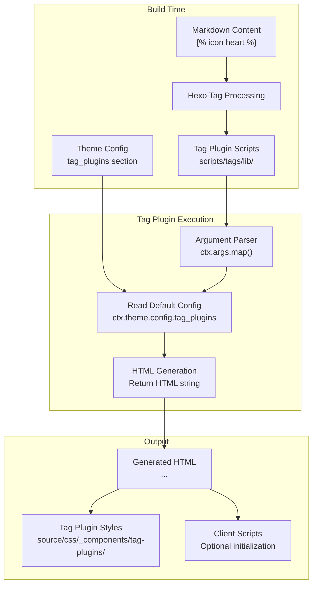
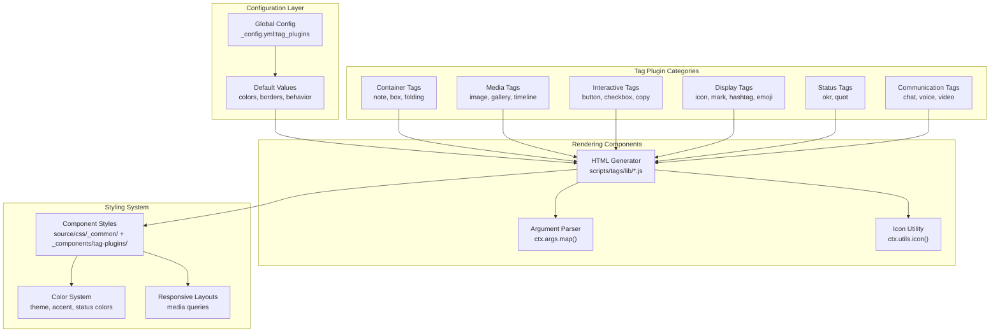
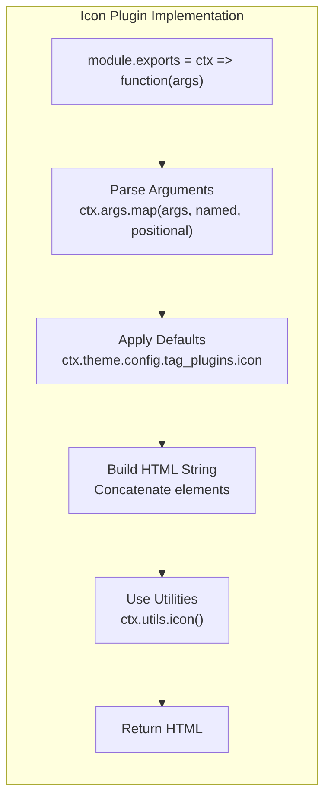

# 标签插件总览

<details>
<summary>相关源码文件</summary>

生成此页面时参考的主题源码文件：

- [.github/workflows/npm-publish.yml](../../../.github/workflows/npm-publish.yml)
- [.npmignore](../../../.npmignore)
- [LICENSE](../../../LICENSE)
- [README.md](../../../README.md)
- [_config.yml](../../../_config.yml)
- [package.json](../../../package.json)
- [scripts/tags/index.js](../../../scripts/tags/index.js)
- [scripts/tags/lib/](../../../scripts/tags/lib/)
- [source/css/_common/dropdown.styl](../../../source/css/_common/dropdown.styl)

</details>

标签插件是自定义 Markdown 扩展，提供超越标准 Markdown 语法的丰富交互内容组件。作者可以在内容中直接用标签语法嵌入图标、提示框、时间线、图库与交互小部件等专用元素。

本页提供标签插件系统的架构与配置概览。具体插件见：

- [图标标签插件](icon-tag.md)——行内图标渲染
- [提示框与容器标签插件](note-container-tags.md)——标注框与容器
- [时间线与媒体标签](timeline-media-tags.md)——时序展示与图库
- [交互式标签插件](link-grid-banner-tags.md)——按钮、复选框、聊天界面
- ``——带图标链接项的通用下拉菜单
- [内容展示标签](social-content-card-tags.md)——状态指示、引用、表情集

## 系统架构

标签插件作为 Hexo 构建期处理的一部分运行，在页面渲染前把自定义标签转换为 HTML。系统采用注册-执行模式：每个标签插件在主题初始化时注册到 Hexo 的标签处理引擎。

**标签插件处理流水线**



**参考源码**：[_config.yml](../../../_config.yml)、[scripts/tags/index.js](../../../scripts/tags/index.js)

**标签插件组件架构**



**参考源码**：[_config.yml](../../../_config.yml)、[scripts/tags/lib/](../../../scripts/tags/lib/)

## 配置系统

标签插件在 `_config.yml` 的 `tag_plugins` 小节配置。每种插件类型有独立配置小节，定义默认行为、颜色与插件专属选项。

### 配置结构

配置遵循层级模式，主题级默认可被标签使用级覆盖：

| 配置层级 | 位置 | 用途 |
|----------|------|------|
| 主题默认 | `_config.yml:tag_plugins` | 所有标签插件的全局默认 |
| 插件默认 | `_config.yml:tag_plugins.{plugin}` | 特定插件类型的默认 |
| 标签参数 | Markdown 内联 | 覆盖单个标签实例的默认 |

**示例配置小节：**

```yaml
tag_plugins:
  note:
    default_color: ''  # light, dark, red, orange, yellow, green, cyan, blue, purple
    border: true
  
  icon:
    default_color: accent  # theme, accent, red, orange, yellow, green, cyan, blue, purple
  
  button:
    default_color: theme
  
  timeline:
    max-height: 80vh
  
  okr:
    border: true
    status:
      in_track:
        color: blue
        label: 正常
```

**参考源码**：[_config.yml](../../../_config.yml)

### 颜色系统

标签插件使用与主题颜色系统一致的颜色词汇：

| 颜色名 | 使用场景 | CSS 变量 |
|--------|----------|----------|
| `theme` | 主题主色 | `--color-theme` |
| `accent` | 强调色 | `--color-accent` |
| `light` | 浅中性色 | `--text-p0` |
| `dark` | 深中性色 | `--text-p1` |
| `red`、`orange`、`yellow` | 状态色 | `--color-{name}` |
| `green`、`cyan`、`blue`、`purple` | 强调变体 | `--color-{name}` |
| `warning`、`error` | 语义色 | `--color-{name}` |

**参考源码**：[_config.yml](../../../_config.yml)

## 使用模式

标签插件遵循受 Liquid 模板启发的统一语法。

### 基础语法

```

```

带内容的块式插件：

```

content here

```

### 参数解析

标签插件参数用键值模式解析：

1. **位置参数**：无键按顺序解析
2. **命名参数**：`key:value` 语法
3. **可选参数**：从配置取默认值

**图标插件示例：**

```javascript
args = ctx.args.map(args, ['color', 'style'], ['key', 'text'])
```

该解析器期望：

- 命名参数：`color`、`style`
- 位置参数：`key`（第一）、`text`（第二）

**参考源码**：[scripts/tags/lib/icon.js](../../../scripts/tags/lib/icon.js)

### 常见参数模式

| 模式 | 示例 | 说明 |
|------|------|------|
| 单位置参数 | `` | 一个必填参数 |
| 命名颜色 | `` | 覆盖默认颜色 |
| 多位置参数 | `` | 图标键 + 文本标签 |
| 混合参数 | `` | 组合命名与位置参数 |

### dropdown 通用下拉菜单

`dropdown` 是一个块级标签，以标题和位于其右侧的圆角端点箭头作为触发按钮，用 Markdown 链接声明子项。它与 Footer Social 共用 `.dropdown` 样式、原生 `<details>/<summary>` 结构和全局浮层定位逻辑，不包含具体业务语义。展开时箭头旋转 180°。

```md

- icon:default:documents [文档](/wiki/)
- [GitHub](https://github.com/)

```

参数说明：

| 参数 | 类型 | 默认 | 说明 |
|------|------|------|------|
| `title` | 位置参数 | — | 主按钮标题，必填 |
| `direction` | `up` / `down` | `auto` | 菜单展开方向；未指定时根据触发按钮上下空间自动判断 |
| `align` | `left` / `right` | `auto` | 菜单贴合触发按钮的左边或右边；未指定时根据视口空间自动选择 |
| `open` | `true` | — | 是否默认展开 |

主按钮固定使用位于标题右侧的内联 SVG 箭头，不需要 `icon` 参数；为兼容既有内容，传入的 `icon:` 参数会被忽略。

子项格式为 `[标题](URL)`，可在链接前后增加 `icon:key`；缺少图标时仅显示标题，格式不匹配的行会被忽略。不支持嵌套 dropdown。菜单打开后挂载到 `body` 下的全局浮层，使用通用玻璃背景；菜单自身声明 glass surface，最小宽度固定为 150px，条目复用 collection list 的结构、`compact` 密度与 hover 样式。带图标与无图标条目共用由 leading 高度和纵向 padding 推导的最小行高；无图标项不输出空白 leading。浮层会自动调整上下和左右位置，不受正文或 sidebar 祖先容器裁剪；鼠标移入触发按钮时自动展开，透明桥接区连接触发按钮与菜单之间的间隙，离开三者后立即关闭，不使用延迟计时器；菜单定位完成后淡入显示；菜单高度受视口限制，超出后垂直滚动。

**参考源码**：[scripts/tags/lib/dropdown.js](../../../scripts/tags/lib/dropdown.js)、[scripts/tags/index.js](../../../scripts/tags/index.js)、[source/js/plugins/dropdown.js](../../../source/js/plugins/dropdown.js)、[source/css/_common/dropdown.styl](../../../source/css/_common/dropdown.styl)

## 可用标签插件

### 容器与布局标签

| 标签 | 用途 | 配置小节 |
|------|------|----------|
| `note` / `box` | 带可选边框的彩色标注框 | `tag_plugins.note` |
| `folding` | 可折叠内容区 | N/A |
| `dropdown` | 带图标链接项的通用下拉菜单 | N/A |
| `tabs` | 标签页内容区 | N/A |
| `table` | 表格样式容器（`scroll` / `wrap` / `compact`） | N/A |

**参考源码**：[_config.yml](../../../_config.yml)

### 媒体与图库标签

| 标签 | 用途 | 配置小节 |
|------|------|----------|
| `image` | 增强图片显示（支持 fancybox） | `tag_plugins.image` |
| `gallery` | 图片集合的网格或流式布局 | `tag_plugins.gallery` |
| `timeline` | 带时间节点的时间线展示 | `tag_plugins.timeline` |
| `video` | 视频嵌入（需数据服务） | `data_services.video` |

**参考源码**：[_config.yml](../../../_config.yml)

### 交互标签

| 标签 | 用途 | 配置小节 |
|------|------|----------|
| `button` | 样式化可点击按钮 | `tag_plugins.button` |
| `checkbox` | 交互复选框 | `tag_plugins.checkbox` |
| `copy` | 复制到剪贴板 | `tag_plugins.copy` |
| `chat` | 聊天风格对话展示 | `tag_plugins.chat` |

**参考源码**：[_config.yml](../../../_config.yml)

### 内容展示标签

| 标签 | 用途 | 配置小节 |
|------|------|----------|
| `icon` | 行内图标渲染 | `tag_plugins.icon` |
| `emoji` | 表情集（qq、twemoji、aru、tieba、blobcat） | `tag_plugins.emoji` |
| `mark` | 带背景色的高亮文本 | `tag_plugins.mark` |
| `hashtag` | 样式化话题标签 | `tag_plugins.hashtag` |
| `quot` | 装饰性引用标记 | `tag_plugins.quot` |
| `tip` | 气泡注解（桌面 hover / 移动端点击） | N/A |

**参考源码**：[_config.yml](../../../_config.yml)

### 状态与进度标签

| 标签 | 用途 | 配置小节 |
|------|------|----------|
| `okr` | 带状态色的 OKR 进度指示 | `tag_plugins.okr` |
| `progress` | 可视化进度条 | N/A |

`okr` 标签支持自定义状态，带对应颜色与标签：

```yaml
okr:
  status:
    in_track:      # 进行中状态
      color: blue
      label: 正常
    at_risk:
      color: yellow
      label: 风险
    finished:      # 结果状态
      color: green
      label: 已完成
```

**参考源码**：[_config.yml](../../../_config.yml)

### 通信标签

| 标签 | 用途 | 所需数据服务 |
|------|------|--------------|
| `chat` | AI 聊天界面 | `tag_plugins.chat.api` |
| `voice` | 语音消息播放器 | `data_services.voice` |
| `download-file` | 文件下载界面 | `data_services.download-file` |

**参考源码**：[_config.yml](../../../_config.yml)

## 实现模式

标签插件实现遵循一致模式（以图标插件为例）：

**标签插件结构：**



**参考源码**：[scripts/tags/lib/icon.js](../../../scripts/tags/lib/icon.js)

### 关键实现元素

1. **模块导出模式**：`module.exports = ctx => function(args)`
2. **参数映射**：`ctx.args.map(args, namedArgs, positionalArgs)`
3. **配置访问**：`ctx.theme.config.tag_plugins.{plugin}`
4. **工具函数**：`ctx.utils.icon()`、`ctx.args.joinTags()`
5. **HTML 生成**：带正确转义的字符串拼接
6. **CSS 类命名**：`.tag-plugin` 命名空间

**图标插件示例：**

```javascript
var el = '<span class="tag-plugin icon colorful" ${ctx.args.joinTags(args, ['color']).join(' ')}>'
el += ctx.utils.icon(args.key, more)
el += '</span>'
```

生成带以下内容的 HTML：

- 命名空间类：`tag-plugin`
- 插件专属类：`icon`
- 修饰类：`colorful`
- 动态属性：颜色 data 属性

**参考源码**：[scripts/tags/lib/icon.js](../../../scripts/tags/lib/icon.js)

## 样式集成

标签插件样式经 Stylus 编译流水线集成到主题样式系统。样式遵循组件架构，每个插件类别有专属文件。

**样式组织：**

| 样式类别 | 文件模式 | 用途 |
|----------|----------|------|
| 标签插件基础 | `source/css/_components/tag-plugins/*.styl` | 核心标签插件样式 |
| 通用组件 | `source/css/_common/*.styl` | 被标签、布局或其它主题组件复用的通用结构样式 |
| 颜色变体 | `_custom.styl` 中的工具混入 | 颜色系统集成 |
| 响应式布局 | 插件样式中的媒体查询 | 自适应显示 |

标签插件自动继承主题的：

- 颜色系统变量（`--color-theme`、`--color-accent`）
- 排版比例（`--fs-*`）
- 间距系统（`--gap-*`）
- 圆角值（`--border-radius-*`）

**参考源码**：[_config.yml](../../../_config.yml)

## 按需加载

部分标签插件需要额外客户端 JavaScript 或外部数据服务，检测到内容中使用对应标签时按需加载：

**标签插件的数据服务：**

| 标签插件 | 数据服务 | 加载触发 |
|----------|----------|----------|
| `chat` | `tag_plugins.chat.api` | 检测到标签使用 |
| `voice` | `data_services.voice.js` | 检测到标签使用 |
| `video` | `data_services.video.js` | 检测到标签使用 |
| `download-file` | `data_services.download-file.js` | 检测到标签使用 |

懒加载确保内容中实际使用这些资源时才引入，保证最优性能。

**参考源码**：[_config.yml](../../../_config.yml)
