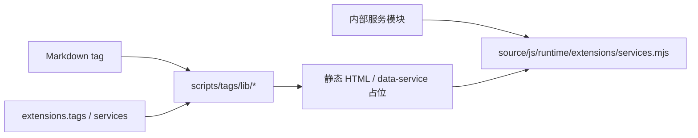

# 标签插件总览

Stellar 标签插件在 Markdown 中使用 `` 语法，由 `scripts/tags/` 在 Hexo 构建期转换为 HTML。v2 的主题级默认集中在 `extensions.tags`，解析后只通过冻结的 `hexo.stellar.config.extensions.tags` 消费。

## 配置契约

```yaml
extensions:
  tags:
    note:
      default_color: ''
      border: true
    checkbox:
      interactive: false
    image:
      parse_markdown: false
    timeline:
      max_height: 80vh
    chat:
      endpoint: https://siteinfo.listentothewind.cn/api/v1
```

Stellar 字段使用 snake_case，运行时为 camelCase。官方 tag ID 的父级对象严格封闭；`quot` 的 variant、`emoji` 的 provider 与 `okr.status` 是明确声明的动态记录。旧 `tag_plugins` 根、`max-height` 与 `chat.api` 不兼容读取。

## 标签分类

| 分类 | 标签 | 配置路径 |
| --- | --- | --- |
| 标注 | `note`、`box`、`mark`、`hashtag`、`quot` | `extensions.tags.<id>` |
| 媒体 | `image`、`gallery`、`albums`、`posters`、`video`、`voice` | `extensions.tags.image/gallery` 或内部服务模块 |
| 交互 | `button`、`checkbox`、`copy`、`chat` | `extensions.tags.button/checkbox/copy/chat` |
| 图标与表情 | `icon`、`emoji` | `extensions.tags.icon/emoji` |
| 数据组件 | `sites`、`friends`、`rating`、`vote`、`timeline`、GitHub 卡片 | `extensions.services` 与内部服务模块 |
| 结构 | `tabs`、`folding`、`grid`、`okr` | `extensions.tags.okr` 或标签参数 |

并非每个标签都需要主题配置。标签语法参数仍由各处理器解析；只有跨页面默认值或业务端点进入 `extensions`。

## 数据服务边界

标签输出 `.data-service` 占位时，客户端模块来自主题内部资源注册表。例如 voice、video、download-file、sites、rating 与 vote 的 JavaScript 路径均不可由站点覆盖。站点可配置的业务地址位于：

- `extensions.tags.chat.endpoint`
- `extensions.services.site_info.endpoint`
- `extensions.services.rating.endpoint`
- `extensions.services.vote.endpoint`
- `extensions.services.github.*_url`

完整服务契约见[数据服务 API](../06-数据服务与组件/data-service-apis.md)。

## 消费链



标签处理器使用 `ctx.stellar.config.extensions.tags` 与 `ctx.stellar.config.extensions.services`，不读取原始 `theme.config`。官方模块和 CDN 资源由主题维护，参数袋不会成为任意脚本注入口。

## 参考源码

- [_config.yml](../../../_config.yml)（`extensions.tags`）
- [scripts/tags/](../../../scripts/tags/)
- [scripts/lib/extension-assets.js](../../../scripts/lib/extension-assets.js)
- [source/js/runtime/extensions/services.mjs](../../../source/js/runtime/extensions/services.mjs)
- [source/css/_components/tag-plugins/](../../../source/css/_components/tag-plugins/)

具体语法见本目录各专题页面与 [README](README.md)。
