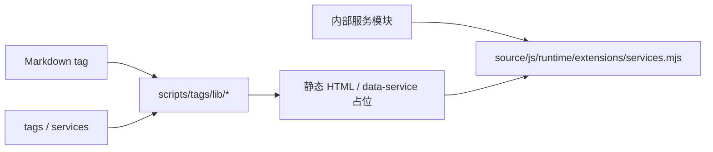

# 标签插件总览

Stellar 标签插件在 Markdown 中使用 `` 语法，由 `scripts/tags/` 在 Hexo 构建期转换为 HTML。v2 的主题级默认集中在 `tags`，解析后只通过冻结的 `hexo.stellar.config.tags` 消费。

## 配置契约

```yaml
tags:
  note:
    default_color: ''
    border: true
  checkbox:
    interactive: false
  gallery:
    size: mix
    aspect_ratio: square
```

Stellar 字段使用 snake_case，运行时为 camelCase。公开 Tag 配置只保留 `note/checkbox/quot/emoji/icon/button/mark/hashtag/gallery`；其它标签采用固定内部策略。

## 标签分类

| 分类 | 标签 | 配置路径 |
| --- | --- | --- |
| 标注 | `note`、`box`、`mark`、`hashtag`、`quot` | `tags.<id>` |
| 媒体 | `image`、`gallery`、`albums`、`posters`、`video`、`voice` | `tags.gallery` 或内部服务模块 |
| 交互 | `button`、`checkbox`、`copy`、`chat` | `tags.button/checkbox` 或固定策略 |
| 图标与表情 | `icon`、`emoji` | `tags.icon/emoji` |
| 数据组件 | `sites`、`friends`、`rating`、`vote`、`timeline`、GitHub 卡片 | `services` 与内部服务模块 |
| 结构 | `tabs`、`folding`、`grid`、`okr` | 标签参数或固定策略 |

并非每个标签都需要主题配置。标签语法参数仍由各处理器解析；只有跨页面默认值或业务端点进入根级 `tags` 或 `services` 配置。

## 数据服务边界

标签输出 `.data-service` 占位时，客户端模块来自主题内部资源注册表。例如 voice、video、download-file、sites、rating 与 vote 的 JavaScript 路径均不可由站点覆盖。站点可配置的业务地址位于：

- `services.site_info.site_info_api.endpoint`
- `services.rating.star_vote.endpoint`
- `services.vote.star_vote.endpoint`
- `services.github.*_url`
- `services.github_card.github_readme_stats.endpoint`

前三项可通过各自的 `provider: null` 关闭；消费链只读取所选 provider 的封闭参数袋。

完整服务契约见[数据服务 API](../06-数据服务与组件/data-service-apis.md)。

新增标签时，注册、实现、Schema、样式、service Extension、语言与测试的维护面见[贡献架构指南](../../guides/contribution-architecture.md) 和[标签插件设计规范](../../guides/tag-plugins-style-guide.md)。

## 消费链



标签处理器使用 `ctx.stellar.config.tags` 与 `ctx.stellar.config.services`，不读取原始 `theme.config`。官方模块和 CDN 资源由主题维护，参数袋不会成为任意脚本注入口。

## 参考源码

- [_config.yml](../../../_config.yml)（`tags`）
- [scripts/tags/](../../../scripts/tags/)
- [scripts/lib/extension-assets.js](../../../scripts/lib/extension-assets.js)
- [source/js/runtime/extensions/services.mjs](../../../source/js/runtime/extensions/services.mjs)
- [source/css/_components/tag-plugins/](../../../source/css/_components/tag-plugins/)

具体语法见本目录各专题页面与[标签插件索引](index.md)。
