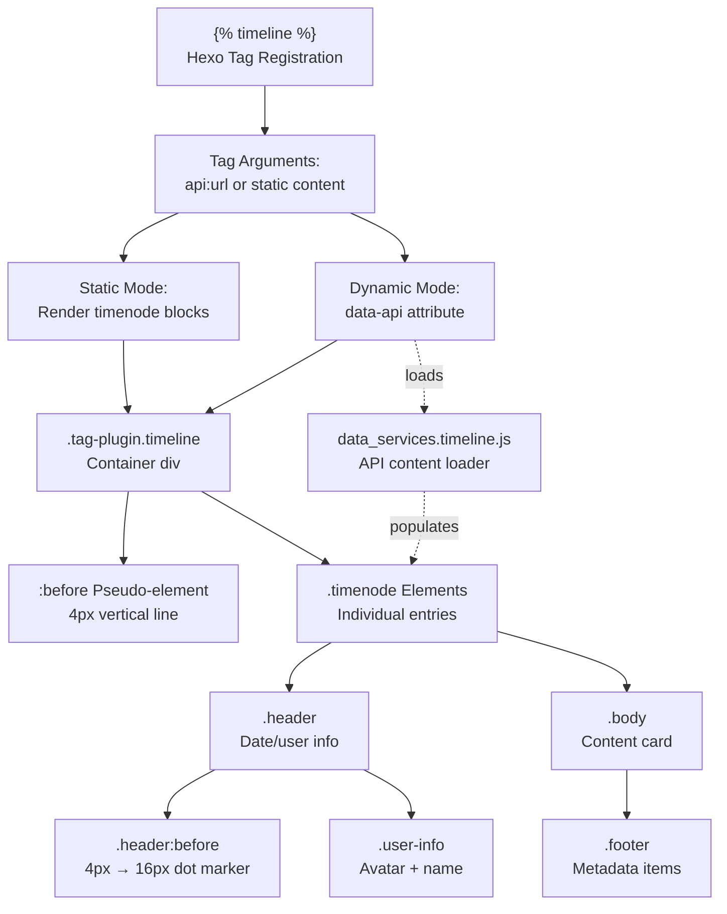
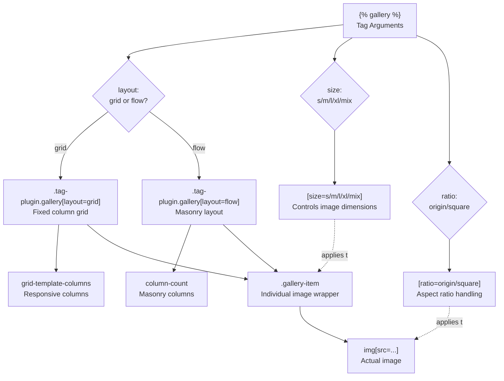
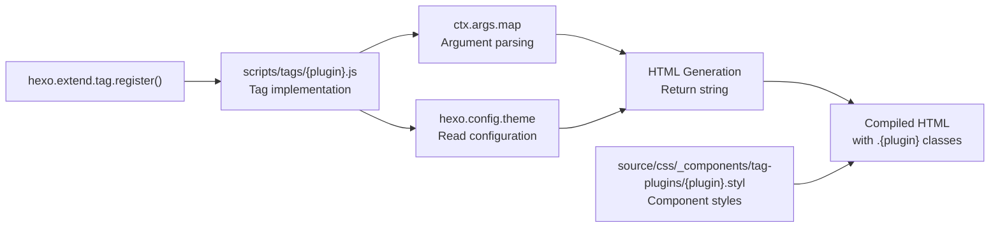

# 时间线与媒体标签

<details>
<summary>相关源码文件</summary>

生成此页面时参考的主题源码文件：

- [.github/workflows/npm-publish.yml](../../../.github/workflows/npm-publish.yml)
- [.npmignore](../../../.npmignore)
- [LICENSE](../../../LICENSE)
- [README.md](../../../README.md)
- [_config.yml](../../../_config.yml)
- [package.json](../../../package.json)
- [source/css/_defines/const.styl](../../../source/css/_defines/const.styl)
- [source/css/_components/tag-plugins/timeline.styl](../../../source/css/_components/tag-plugins/timeline.styl)
- [source/css/_components/tag-plugins/gallery.styl](../../../source/css/_components/tag-plugins/gallery.styl)
- [source/css/_components/tag-plugins/chat.styl](../../../source/css/_components/tag-plugins/chat.styl)
- [source/css/comments/artalk.styl](../../../source/css/comments/artalk.styl)

</details>

## 概览

本页介绍用于展示时序内容、图片图库与内嵌媒体的时间线和媒体标签插件。timeline 标签创建带时间节点的垂直事件展示，gallery 处理图片网格布局。媒体嵌入标签支持聊天对话、语音与视频内容。

**相关页面：**

- [交互式标签插件](link-grid-banner-tags.md)——按钮、复制、聊天交互标签
- [内容展示标签](social-content-card-tags.md)——OKR、mark、hashtag 样式
- [提示框与容器标签插件](note-container-tags.md)——容器与提示框插件

## 标签插件架构

媒体标签经 Hexo 的 `hexo.extend.tag.register()` API 注册，并在 `_config.yml` 中配置。每个生成带特定 CSS 类前缀的 HTML：

| 标签插件 | 主要用途 | 配置路径 | 样式文件 |
|----------|----------|----------|----------|
| `timeline` | 带垂直线的时序事件 | `tag_plugins.timeline` | `source/css/_components/tag-plugins/timeline.styl` |
| `gallery` | 图片网格/流式布局 | `tag_plugins.gallery` | `source/css/_components/tag-plugins/gallery.styl` |
| `chat` | 对话展示 | `tag_plugins.chat` | `source/css/_components/tag-plugins/chat.styl` |
| `emoji` | 行内表情图片 | `tag_plugins.emoji` | N/A（CDN 图片） |

**参考源码**：[_config.yml](../../../_config.yml)

---

## 时间线标签插件

timeline 标签创建带独立时间节点的垂直时序展示，节点由样式化垂直线连接。支持静态内容与动态 API 加载数据。

### 配置

```yaml
tag_plugins:
  timeline:
    max-height: 80vh
```

`max-height` 限制可滚动时间线高度，防止页面过长。

**参考源码**：[_config.yml](../../../_config.yml)

### 时间线渲染流水线



**参考源码**：[_config.yml](../../../_config.yml)、[source/css/_components/tag-plugins/timeline.styl](../../../source/css/_components/tag-plugins/timeline.styl)

### HTML 结构

时间线生成带嵌套时间节点的垂直容器：

```html
<div class="tag-plugin timeline" data-api="...">
  <!-- 垂直线经 :before 伪元素渲染 -->
  
  <div class="timenode" highlight>
    <div class="header">
      <div class="user-info">
        
        <span>Username</span>
      </div>
      <span>2024-01-15</span>
    </div>
    <div class="body">
      <p>Content here</p>
    </div>
  </div>
  
  <div class="timenode">
    <!-- 更多时间节点 -->
  </div>
</div>
```

**关键元素：**

- `.tag-plugin.timeline`——容器，可带 `[data-api]` 属性做动态加载
- `:before` 伪元素——4px 垂直线（`left: 0px`、`background: var(--block)`）
- `.timenode`——单条条目；可选 `[highlight]` 属性做强调
- `.header`——日期/用户元数据，带圆点标记伪元素
- `.body`——内容卡片，`border-radius: 16px`、`background: var(--card)`

**参考源码**：[source/css/_components/tag-plugins/timeline.styl](../../../source/css/_components/tag-plugins/timeline.styl)

### 时间节点组件

#### 带圆点标记的头部

头部包含元数据与悬停时过渡的定位圆点标记：

```stylus
.header:before
  position: absolute
  left: -16px
  width: 4px
  height: 4px
  border-radius: 12px
  background: var(--text-meta)
  transform: scale(2)
  
.timenode:hover .header:before
  background: var(--theme)
  height: 16px
  transform: scale(1)
```

**标记状态：**

- 默认：4px 圆点，`left: -16px`，缩放 2x
- 悬停：扩展到 16px 高度，主题色
- 高亮：`[highlight]` 属性永久设置 `background: var(--theme)`

**参考源码**：[source/css/_components/tag-plugins/timeline.styl](../../../source/css/_components/tag-plugins/timeline.styl)

#### 用户信息显示

可选的头像与名称：

```stylus
.user-info
  display: flex
  align-items: center
  font-size: $fs-13
  font-weight: 500
  color: var(--text-p1)
  margin-right: 8px
  
  img
    background: white
    height: 16px
    border-radius: 16px
    margin: 0 4px 0 0
```

**参考源码**：[source/css/_components/tag-plugins/timeline.styl](../../../source/css/_components/tag-plugins/timeline.styl)

#### 正文内容卡片

带圆角卡片样式与垂直间距的内容区：

```stylus
.body
  background: var(--card)
  border-radius: 16px
  border-top-left-radius: 2px  // 与垂直线连接
  padding: 0.5rem 1rem
  margin-top: 4px
  box-shadow: $boxshadow-block
  
  p, .highlight, ol, ul, .tag-plugin
    margin: 0.5rem 0
```

**卡片特性：**

- `corner-shape: superellipse(1.25)` 平滑圆角
- `border-top-left-radius: 2px` 与时间线视觉连接
- 支持嵌套标签插件（copy、image、代码块）
- 图片用 `border-radius: $border-image-s`

**参考源码**：[source/css/_components/tag-plugins/timeline.styl](../../../source/css/_components/tag-plugins/timeline.styl)

### 垂直线样式

时间线垂直线经容器 `:before` 伪元素渲染：

```stylus
.tag-plugin.timeline:before
  content: ''
  position: absolute
  z-index: 0
  background: var(--block)
  width: 4px
  left: 0px
  border-radius: 8px
  top: 0.5rem
  bottom: 0
```

**线的特性：**

- 4px 宽，`border-radius: 8px` 圆角端
- 绝对定位 `left: 0px`
- 从 `top: 0.5rem` 延伸到 `bottom: 0`
- `background: var(--block)` 与卡片背景一致
- `z-index: 0` 置于内容之后

动态内容加载时，时间线含 `.loading-wrap` 会隐藏线。

**参考源码**：[source/css/_components/tag-plugins/timeline.styl](../../../source/css/_components/tag-plugins/timeline.styl)

### 动态内容加载

时间线经 `data-api` 属性支持 API 驱动内容：

```markdown


```

**数据服务配置：**

```yaml
data_services:
  timeline:
    js: /js/services/timeline.js
```

检测到 `[data-api]` 属性时按需加载 `/js/services/timeline.js`，从指定 URL 获取 JSON 并动态填充时间节点。

**参考源码**：[_config.yml](../../../_config.yml)

#### API 时间线样式

动态时间线用增强样式，含标题卡片与元数据页脚：

```stylus
.tag-plugin.timeline[data-api] .body
  p.title
    font-weight: 700
    margin: 0.5rem 0 0.75rem
    border-bottom: 1px solid var(--block-border)
    
    a
      color: inherit
      padding-bottom: 0.75rem
      display: inline-block
      
      &:hover
        color: var(--accent)
  
  .footer
    display: flex
    justify-content: space-between
    align-items: stretch
    font-size: $fs-13
    
    .item
      border: 1px solid var(--block-border)
      margin: 2px
      border-radius: 4px
      padding: 0 0.5rem
```

**页脚结构：**

- `.footer .left`——左对齐元数据（日期、作者）
- `.footer .right`——右对齐元数据（反应、评论）
- `.footer .item`——带边框样式的单个元数据徽章
- `.footer a.item`——可点击项，悬停背景变化

**参考源码**：[source/css/_components/tag-plugins/timeline.styl](../../../source/css/_components/tag-plugins/timeline.styl)

### 图片处理

时间线图片统一样式：

```stylus
.tag-plugin.timeline
  p > img
    border-radius: $border-image-s
    corner-shape: superellipse(1.25)
```

**数据服务时间线中的图片尺寸（memos 风格紧凑显示）：**

```stylus
.tag-plugin.timeline.ds-memos .body img
  margin: 0.5rem 0
  max-height: 128px
  cursor: zoom-in
```

**Fancybox 集成：**

启用 Fancybox 插件时，时间线图片支持灯箱缩放：

```yaml
plugins:
  fancybox:
    selector: .timenode p>img
```

灯箱功能专门应用于 `.timenode` 内 `<p>` 标签中的 `` 元素。

**参考源码**：[_config.yml](../../../_config.yml)、[source/css/_components/tag-plugins/timeline.styl](../../../source/css/_components/tag-plugins/timeline.styl)

### 时间线用法示例

**静态时间线：**

```markdown



Initial release



Major update



```

**API 动态时间线：**

```markdown


```

**参考源码**：[_config.yml](../../../_config.yml)、[source/css/_components/tag-plugins/timeline.styl](../../../source/css/_components/tag-plugins/timeline.styl)

---

## 图库标签插件

gallery 标签创建带可配置尺寸与宽高比的图片网格或流式布局。

### 配置

```yaml
tag_plugins:
  gallery:
    layout: grid  # grid | flow
    size: mix     # s | m | l | xl | mix
    ratio: square # origin | square
```

**配置项：**

| 参数 | 值 | 效果 |
|------|-----|------|
| `layout` | `grid`、`flow` | grid 创建固定列；flow 创建瀑布流布局 |
| `size` | `s`、`m`、`l`、`xl`、`mix` | 设置图片尺寸；mix 允许混合尺寸 |
| `ratio` | `origin`、`square` | square 强制 1:1；origin 保留原比例 |

**参考源码**：[_config.yml](../../../_config.yml)

### 图库布局系统



**参考源码**：[_config.yml](../../../_config.yml)

### HTML 输出结构

图库生成基于属性的样式容器：

```html
<div class="tag-plugin gallery" layout="grid" size="mix" ratio="square">
  <div class="gallery-item">
    
  </div>
  <div class="gallery-item">
    
  </div>
  <!-- 更多图片 -->
</div>
```

**CSS 属性选择器：**

```css
.tag-plugin.gallery[layout="grid"] { /* 网格布局规则 */ }
.tag-plugin.gallery[layout="flow"] { /* 瀑布流布局规则 */ }
.tag-plugin.gallery[size="s"] .gallery-item { /* 小尺寸 */ }
.tag-plugin.gallery[size="mix"] .gallery-item { /* 混合尺寸 */ }
.tag-plugin.gallery[ratio="square"] img { /* 1:1 宽高比 */ }
```

基于属性的方式允许每个图库独立定制，无需修改全局样式。

**参考源码**：[_config.yml](../../../_config.yml)

### 布局模式

**网格布局：**

- CSS Grid，`grid-template-columns: repeat(auto-fill, ...)`
- 固定列数，随视口宽度响应
- `grid-gap` 统一间距
- 适合尺寸一致的图片

**流式布局：**

- CSS `column-count` 实现瀑布流
- 图片垂直填充列后换行
- `column-gap` 控制水平间距
- 更适合 `ratio: origin` 的混合高度图片

**尺寸类：**

- `s`、`m`、`l`、`xl`——固定尺寸类
- `mix`——同图库内经每图尺寸属性混合尺寸

**宽高比处理：**

- `square`——经 `aspect-ratio: 1/1` 或 padding 技巧强制 1:1
- `origin`——保留原始宽高比

**参考源码**：[_config.yml](../../../_config.yml)

---

## 媒体嵌入标签

### 聊天标签

chat 标签显示对话风格内容，支持 API：

```yaml
tag_plugins:
  chat:
    api: https://siteinfo.listentothewind.cn/api/v1
```

API 端点提供聊天参与者与消息的元数据。

**参考源码**：[_config.yml](../../../_config.yml)

### 语音与视频插件

内容含语音/视频元素时按需加载媒体插件：

**语音插件：**

```yaml
data_services:
  voice:
    js: /js/plugins/voice.js
```

**视频插件：**

```yaml
data_services:
  video:
    js: /js/plugins/video.js
```

**下载插件：**

```yaml
data_services:
  download-file:
    js: /js/plugins/download-file.js
```

页面包含对应媒体标签或属性时按需加载 JS，避免不必要的包体积。

**参考源码**：[_config.yml](../../../_config.yml)

### 图片插件

image 标签插件提供带懒加载与 Fancybox 集成的增强图片处理：

```yaml
tag_plugins:
  image:
    fancybox: false  # true 时为 image 标签全局启用灯箱
```

启用后 `` 标签自动获得 Fancybox 灯箱功能。

**参考源码**：[_config.yml](../../../_config.yml)

---

## 表情标签插件

### URL 模板配置

每个表情包定义带 `{name}` 占位符的 URL 模板：

**默认表情包（QQ）：**

```
https://gcore.jsdelivr.net/gh/cdn-x/emoticons@3.1/qq/{name}.gif
```

**全部表情包：**

| 包 | 格式 | 路径模式 |
|----|------|----------|
| `default` | GIF | `/cdn-x/emoticons@3.1/qq/{name}.gif` |
| `twemoji` | SVG | `/twitter/twemoji/assets/svg/{name}.svg` |
| `qq` | GIF | `/cdn-x/emoticons@3.1/qq/{name}.gif` |
| `aru` | GIF | `/cdn-x/emoticons@3.1/aru/{name}.gif` |
| `tieba` | PNG | `/cdn-x/emoticons@3.1/tieba/{name}.png` |
| `blobcat` | GIF | `/cdn-x/emoticons@3.1/blobcat/{name}.gif` |

**参考源码**：[_config.yml](../../../_config.yml)

### 标签语法

```markdown

```

省略包名时用 `default` 包。标签解析器用提供的名称替换 URL 模板中的 `{name}`。

**评论集成**：Artalk 评论系统显示表情的专属样式：

- `max-height: 1.5em`
- `transform: scale(1.2)` 强调
- `margin: 0 4px` 间距
- `vertical-align: bottom` 文本对齐

**参考源码**：[_config.yml](../../../_config.yml)、[source/css/comments/artalk.styl](../../../source/css/comments/artalk.styl)

---

## 按钮标签插件

### 配置

```yaml
tag_plugins:
  button:
    default_color: theme  # theme, accent, red, orange, yellow, green, cyan, blue, purple
```

**参考源码**：[_config.yml](../../../_config.yml)

### 颜色映射

按钮颜色映射到设计系统的 CSS 自定义属性：

- `theme`：主题色
- `accent`：强调色
- `link`：链接色

命名颜色（`red`、`orange`、`yellow`、`green`、`cyan`、`blue`、`purple`）使用 `source/css/_defines/const.styl` 中预定义的颜色变量（`$color-md-*`）。

**参考源码**：[_config.yml](../../../_config.yml)、[source/css/_defines/const.styl](../../../source/css/_defines/const.styl)

---

## 复制标签插件

### 配置

```yaml
tag_plugins:
  copy:
    toast: 复制成功
```

**参考源码**：[_config.yml](../../../_config.yml)

### 实现

复制按钮用 `navigator.clipboard.writeText()` API。复制成功后用 `hud.toast()` 工具显示 toast 通知（见[核心 JavaScript 与页面初始化](../05-前端交互/core-js-init.md)）。

toast 消息文本读取自 `theme.tag_plugins.copy.toast` 配置值。

**时间线集成**：时间线正文内的 copy 标签固定宽度：

```stylus
.tag-plugin.timeline .body .tag-plugin.copy
  width: 240px
```

**参考源码**：[_config.yml](../../../_config.yml)、[source/css/_components/tag-plugins/timeline.styl](../../../source/css/_components/tag-plugins/timeline.styl)

---

## 话题标签插件

### 配置

```yaml
tag_plugins:
  hashtag:
    default_color: ''  # red, orange, yellow, green, cyan, blue, purple，或留空用默认
```

**参考源码**：[_config.yml](../../../_config.yml)

空的 `default_color` 使用继承的文本颜色。设置后应用主题颜色系统中的命名颜色。

**参考源码**：[_config.yml](../../../_config.yml)

---

## OKR 标签插件

### 配置结构

```yaml
tag_plugins:
  okr:
    border: true
    status:
      in_track:
        color: blue
        label: 正常
      at_risk:
        color: yellow
        label: 风险
      off_track:
        color: orange
        label: 延期
      finished:
        color: green
        label: 已完成
      unfinished:
        color: red
        label: 未完成
```

**参考源码**：[_config.yml](../../../_config.yml)

### 状态类型

**进行中状态：**

- `in_track`——按期
- `at_risk`——有延期风险
- `off_track`——落后进度

**结果状态：**

- `finished`——成功完成
- `unfinished`——未完成

### 标签语法

```markdown

Content

```

- `objective_id`：标识（如 `o1`、`o2`）
- `percent`：进度百分比 0-100
- `status`：`tag_plugins.okr.status` 配置中的键

**参考源码**：[_config.yml](../../../_config.yml)

---

## 标签插件实现模式

Stellar 中所有标签插件都经 Hexo 的 `hexo.extend.tag` 系统遵循一致注册与渲染模式：



**参考源码**：[_config.yml](../../../_config.yml)

该模式保证所有标签插件行为一致：配置驱动的默认值，可经内联参数逐标签覆盖。

---

## 汇总表

| 标签插件 | 主要用途 | 关键配置 | CSS 类前缀 |
|----------|----------|----------|------------|
| `gallery` | 图片网格 | layout、size、ratio | `.gallery-` |
| `timeline` | 事件历史 | max-height | `.timeline`、`.timenode` |
| `chat` | 对话 | api | `.chat-` |
| `emoji` | 表情图片 | 每包 CDN URL | `.emoji` |
| `button` | 样式化链接 | default_color | `.button` |
| `copy` | 可复制文本 | toast 消息 | `.copy` |
| `hashtag` | 标签样式 | default_color | `.hashtag` |
| `okr` | 进度跟踪 | border、状态色 | `.okr-` |

**参考源码**：[_config.yml](../../../_config.yml)
