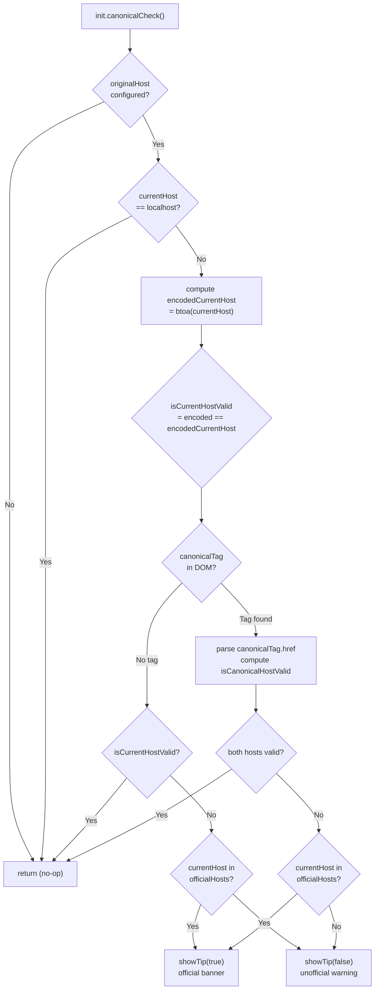
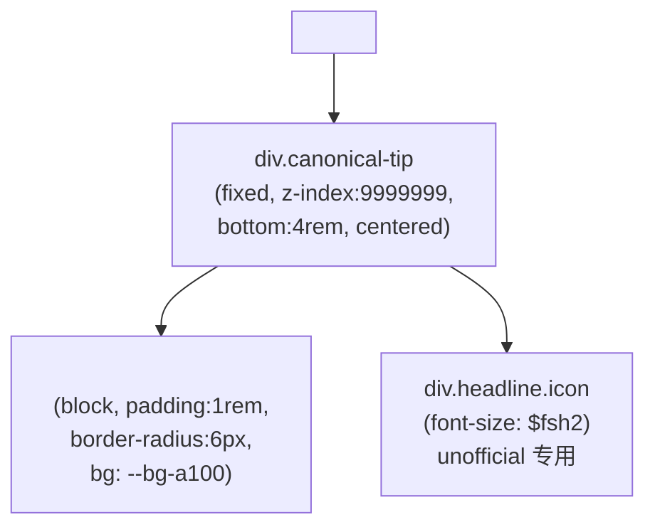
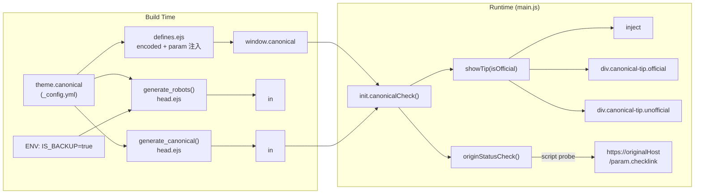

# 规范链接与克隆站检测

<details>
<summary>相关源码文件</summary>

生成此页面时参考的主题源码文件：

- [layout/_partial/head.ejs](../../../layout/_partial/head.ejs)
- [layout/_partial/scripts/defines.ejs](../../../layout/_partial/scripts/defines.ejs)
- [source/js/main.js](../../../source/js/main.js)
- [source/css/_common/canonical.styl](../../../source/css/_common/canonical.styl)

</details>

本页介绍两阶段规范链接系统与克隆/镜像站检测逻辑。系统分两个阶段：`head.ejs` 的**构建期 canonical 标签生成**与 `main.js` 的**运行时主机名校验**（检测未授权克隆站与官方备用站）。

更广泛的 `<head>` 模板与其他 SEO 元数据见[HTML Head 与 SEO 元数据](../02-布局系统/head-seo.md)；页面初始化见[核心 JavaScript 与页面初始化](core-js-init.md)。

---

## 概览

规范链接系统让站点运营者可以运行多个站点副本（主域名、官方镜像/备用、未授权克隆），同时提供恰当的 SEO 信号与用户警告。

**两阶段架构：**

| 阶段 | 组件 | 函数 | 时机 |
|------|------|------|------|
| **阶段 1：构建期** | `head.ejs` 中的 `generate_canonical()` | 输出 `<link rel="canonical">` 标签 | Hexo 构建 |
| **阶段 2：运行时** | `main.js` 中的 `init.canonicalCheck()` | 校验主机名、显示警告 | 页面加载 |

构建期阶段提供标准 SEO canonical URL。运行时阶段检测服务域名并采取行动：

- **主域名**：不采取行动
- **官方备用站**：显示「官方备用站」提示
- **未授权克隆站**：显示持久警告并注入 `noindex, nofollow` meta 标签

**参考源码**：[source/js/main.js](../../../source/js/main.js)、[layout/_partial/head.ejs](../../../layout/_partial/head.ejs)

---

## 配置

系统从 `window.canonical` 读取配置，该对象由主题 `canonical` 配置小节填充。`init.canonicalCheck()` 使用的配置字段：

| 字段 | 类型 | 必填 | 说明 |
|------|------|------|------|
| `originalHost` | `string` | 是 | 主规范主机名（如 `example.com`）。为空禁用系统。 |
| `encoded` | `string` | 是 | `originalHost` 的 base64：`btoa(originalHost)`。用于防篡改校验。 |
| `officialHosts` | `string[]` | 否 | 受信任的镜像/备用主机名数组。 |
| `param.checklink` | `string` | 否 | 可用性探测路径（如 `/js/check.js`）。 |
| `param.permalink` | `string` | 否 | 当前页面 URL，用于警告提示链接。 |

`encoded` 与 `param` 由 [layout/_partial/scripts/defines.ejs](../../../layout/_partial/scripts/defines.ejs) 在构建期计算注入（`encoded = base64(originalHost)`；`param.checklink` 取自 `theme.data_services.video.js`，`param.permalink` 取自 `page.permalink`）。

**参考源码**：[source/js/main.js](../../../source/js/main.js)、[layout/_partial/scripts/defines.ejs](../../../layout/_partial/scripts/defines.ejs)

---

## 构建期 Canonical 标签

`head.ejs` 中的 `generate_canonical()` 在 Hexo 渲染期运行，输出标准 HTML canonical 链接标签。

**逻辑：**

1. 读取 `theme.canonical.originalHost`
2. 为空则返回 `''`（不输出标签）
3. 跳过 404 页面（路径以 `/404` 或 `404` 开头）
4. 去掉路径的 `.html` 后缀
5. 输出 `<link rel="canonical" href="https://${originalHost}${path}">`

该标签在运行时被 `init.canonicalCheck()` 检测，判断当前页面是否有有效的 canonical 引用。

**参考源码**：[layout/_partial/head.ejs](../../../layout/_partial/head.ejs)

### 构建期 `IS_BACKUP` 标志

`head.ejs` 的 `generate_robots()` 检查 `IS_BACKUP` 环境变量。构建时设为 `"true"`（如用于已知的备用部署）则静态输出 `<meta name="robots" content="noindex, nofollow">`，无需运行时检查。

**参考源码**：[layout/_partial/head.ejs](../../../layout/_partial/head.ejs)

---

## 运行时检测：`init.canonicalCheck()`

该函数在初始页面加载时运行一次，不重复执行。

**检测流程**



**参考源码**：[source/js/main.js](../../../source/js/main.js)

### 主机有效性检查

主主机比较用 base64 编码而非普通字符串比较：

```
const encodedCurrentHost = window.btoa(currentHost);
const isCurrentHostValid = canonical.encoded === encodedCurrentHost;
```

`canonical.encoded` 预先计算为 `btoa(originalHost)` 并嵌入页面。比较前从当前 URL 与 canonical URL 都去掉 `www.` 前缀。

`getOriginalHost()` 优先从 `encoded` 反解真实主站域名（`atob`），避免「批量替换域名」的克隆站把提示指向自己。

**参考源码**：[source/js/main.js](../../../source/js/main.js)

### `originStatusCheck()`

该异步辅助函数判断原始（主）主机当前是否可达。仅在**官方**提示路径调用，主站不可达时抑制提示。

**机制**：动态追加指向 `https://{originalHost}{param.checklink}` 的 `<script>` 标签。脚本加载成功表示主站可达（`resolve(true)`）；出错表示不可达（`resolve(false)`）。

当前主机**就是**原始主机时立即 `resolve(true)`，不做网络探测。

**参考源码**：[source/js/main.js](../../../source/js/main.js)

---

## 提示渲染：`showTip(isOfficial)`

`showTip` 是 async 函数：

1. 动态向 `<head>` 注入 `<meta name="robots" content="noindex, nofollow">`
2. 创建 `<div>` 并追加到 `<body>`

**官方备用站提示（`isOfficial = true`）：**

- 调用 `originStatusCheck()`；主站不可达时抑制提示（没有意义把用户导向宕机站点）
- 分配 `canonical-tip official` 类
- 内容：`本站为官方备用站，仅供应急。点击移步主站` 链接，指向主站当前页面

**未授权克隆提示（`isOfficial = false`）：**

- 无关闭机制，始终显示
- 分配 `canonical-tip unofficial` 类
- 内容：☠️ 图标 + `本站为非法克隆站，请前往官方源站访问` + 源站链接

**参考源码**：[source/js/main.js](../../../source/js/main.js)

---

## 样式：`canonical.styl`

两种提示变体共享 `.canonical-tip` 基础类，未授权变体有额外样式。

**组件结构**



| 选择器 | 效果 |
|--------|------|
| `.canonical-tip` | 固定、水平居中于滚动区上方（`bottom: 4rem`）、`z-index: 9999999`、阴影堆叠 |
| `.canonical-tip.unofficial` | 红色背景（`hsl(5, 100%, 60%)`）、白色文字、CSS `breathe` 关键帧动画在浅红与深红间脉动 |
| `.canonical-tip.official` | 无额外颜色覆盖，用默认 `--text` 与 `--bg-a100` 令牌 |

呼吸动画在 `.canonical-tip.unofficial` 内联定义：

```
@keyframes breathe
  0%   background-color: hsl(5, 100%, 60%)
  50%  background-color: hsl(5, 100%, 30%)
  100% background-color: hsl(5, 100%, 60%)
```

**参考源码**：[source/css/_common/canonical.styl](../../../source/css/_common/canonical.styl)

---

## 完整系统图

从配置到渲染输出的完整 canonical 检查流水线：



**参考源码**：[source/js/main.js](../../../source/js/main.js)、[layout/_partial/head.ejs](../../../layout/_partial/head.ejs)、[layout/_partial/scripts/defines.ejs](../../../layout/_partial/scripts/defines.ejs)、[source/css/_common/canonical.styl](../../../source/css/_common/canonical.styl)

---

## 生命周期与调用位置

`init.canonicalCheck()` 只在初始页面加载时调用一次，位于 `stellar.initPage()` 之外：

```
stellar.initPage();       // 页面加载时执行
init.canonicalCheck();    // 仅加载时执行
```

它刻意不放入 `stellar.initPage()`，因为：

- 注入的 `noindex` meta 与警告 `<div>` 是持久 DOM 变更，不应在每次导航重复应用
- 同一域名下 canonical 主机不随导航变化

**参考源码**：[source/js/main.js](../../../source/js/main.js)
