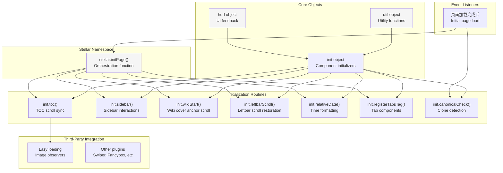
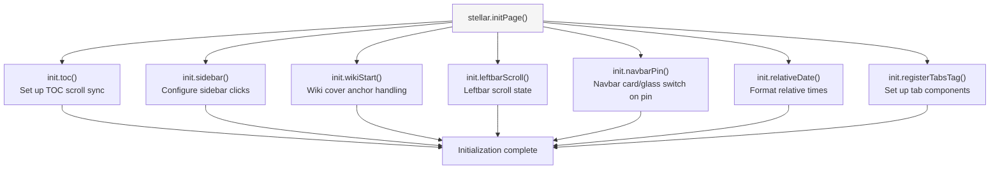
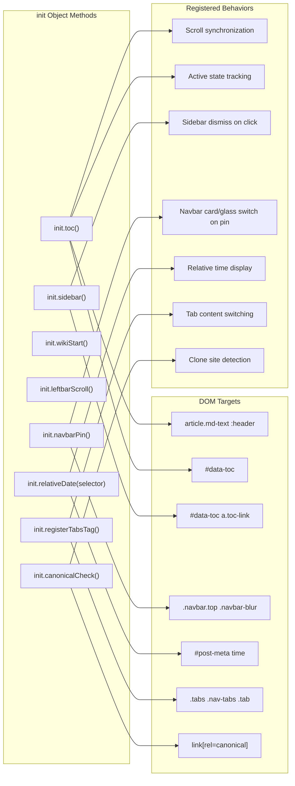
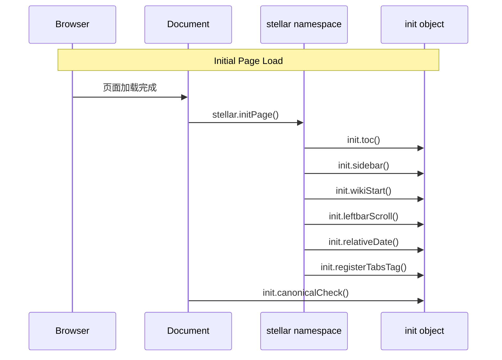

# 前端交互概览

<details>
<summary>相关源码文件</summary>

生成此页面时参考的主题源码文件：

- [source/js/main.js](../../../source/js/main.js)
- [source/js/utils.js](../../../source/js/utils.js)
- [source/js/theme.js](../../../source/js/theme.js)
- [source/js/services.js](../../../source/js/services.js)
- [source/js/tagtree.js](../../../source/js/tagtree.js)
- [layout/_partial/head.ejs](../../../layout/_partial/head.ejs)
- [layout/_partial/scripts/](../../../layout/_partial/scripts/)

</details>

## 目的与范围

本文概览 Stellar 主题的客户端 JavaScript 架构：初始化系统、核心工具函数、事件生命周期管理，以及客户端功能如何与服务端渲染内容集成。各子系统详见：

- 核心初始化例程：[核心 JavaScript 与页面初始化](core-js-init.md)
- TOC 滚动同步与激活状态管理：[目录系统](toc-system.md)
- 克隆站检测与规范链接校验：[规范链接与克隆站检测](canonical-url.md)
- 标签页组件与工具辅助函数：[标签页组件与工具函数](tabs-utils.md)

客户端层负责为服务端渲染的 HTML 增强交互功能，并协调第三方插件初始化。

---

## 客户端架构概览

Stellar 实现混合渲染模型：服务端生成初始 HTML，客户端渐进增强交互功能。架构围绕一个集中初始化系统组织。

### 系统组织



**参考源码**：[source/js/main.js](../../../source/js/main.js)

### 初始化生命周期

主题使用普通整页导航（PJAX 已于 v1.35.0 移除），因此初始化只在页面加载时运行一次：

| 阶段 | 触发 | 调用的函数 | 用途 |
|------|------|------------|------|
| **初始加载** | 页面加载完成后 | `stellar.initPage()`、`init.canonicalCheck()` | 设置页面交互功能 |

`stellar.initPage()` 是全部组件初始化的编排点。`init.canonicalCheck()` 只运行一次（克隆站检测会修改 meta 标签与提示，不需要重复执行）。

**参考源码**：[source/js/main.js](../../../source/js/main.js)

#### 解析期脚本与插件注册队列（utils bootstrap）

`utils.js` 是解析期依赖：页尾内联插件片段在解析时就调用 `utils.initPlugin(...)` 注册，因此主题要求其同步加载。为防御第三方优化器把 `utils.js` 改写为占位符/加 `defer`（曾导致首页文章列表空白、控制台大量 `utils is not defined`），`scripts.ejs` 在 `utils.js` 标签前输出 `layout/_partial/scripts/bootstrap.ejs`：

- `window.stellar.initPlugin(fn, name, options)`：utils 就绪时直接委托 `utils.initPlugin`，未就绪时入队 `window.stellar._pluginQueue`；utils.js 加载完成后经 `_flushPlugins()` 统一补跑。
- 紧随 `utils.js` 的解析期看门狗：`typeof utils === 'undefined'` 时用 `document.write` 同步补载，恢复「utils 先于插件片段定义」的不变量。
- `utils.js` 整体包 IIFE（`window.__stellarUtilsLoaded` 防重复执行），末尾暴露 `window.utils`；DOMContentLoaded 时若仍缺失则动态补载，失败时给 `<html>` 加 `sr-fallback` 兜底显示内容。
- scrollreveal 的 3 秒 `sr-fallback` 看门狗独立于 `utils`/ScrollReveal，即使插件初始化完全失败，`.slide-up` 内容也会在 3 秒后强制显示。
- `layout/_plugins/index.ejs` 另有兜底 shim：bootstrap 被第三方优化器改写/移除导致 `stellar.initPlugin` 缺失时，补一个等价注册点（utils 就绪时直接委托、未就绪时入队），避免 `stellar is not defined` 连锁报错。
- bootstrap 的动态补载脚本用 `s.setAttribute('src', ...)` 赋值：图片懒加载过滤器（`after_render:html`）与脚本延迟优化器都基于 `s.src = "..."` 做朴素正则，改为 `setAttribute` 后不再被误改写（曾因 `img_lazyload` 跨标签越界把补载 URL 改写成占位图 + `data-src` 导致整个 bootstrap 语法错误）。

**参考源码**：[layout/_partial/scripts/bootstrap.ejs](../../../layout/_partial/scripts/bootstrap.ejs)、[layout/_partial/scripts.ejs](../../../layout/_partial/scripts.ejs)、[source/js/utils.js](../../../source/js/utils.js)

---

### 置顶内容轮播（pin-slider）

列表页 navbar top 上方可渲染置顶内容轮播（`layout/_partial/main/pin_slider.ejs`，无需开关配置，有置顶内容即渲染，自动轮播间隔固定 5000ms）：纯原生实现（无第三方依赖），经 `utils.initPlugin` 注册并返回清理函数，支持自动播放（hover/focus/页面隐藏时暂停）、圆点点击切换、悬停显示左右翻页按钮（solar 双箭头图标 + navbar 玻璃效果容器）、触摸松手滑动与 `prefers-reduced-motion` 降级。分页圆点按钮无文本、不设 `aria-label`（避免用户内容注入 HTML 属性导致解析失败），激活态由 `aria-current` 标识。幻灯片中的标题、小字、封面 URL、wiki 标题/摘要/标签等用户内容均经 `escape_html` 转义后输出（属性与文本统一转义）。轮播进度按内容类型分组（`post`/`wiki`）缓存到 localStorage（键 `stellar.pin-slider.<group>`），内容或张数变化后自动失效。文章幻灯片为固定「标题 + 一行小字」结构：标题取 `title`，小字由 `subtitle()` helper 统一取值（`subtitle` > `description` > excerpt 前 50 字）；post 封面幻灯片与 wiki/项目幻灯片共用通用覆盖层 `cover-overlay()`（同文章列表封面，见[文章列表卡片](../03-内容系统/post-lists-cards.md#渐变模糊层与黑色蒙版)）：常驻底部同图渐变模糊层 + 黑色渐变蒙版（边缘不透明度约 0.25 → 垂直中线 0），hover 时背景图与模糊层同步放大至 `scale(1.05)`（图片 1.5s、模糊层 0.5s 缓动）并变暗（亮度 75%、饱和度 120%）；文字区与 hero 卡片 cover-info 观感一致，文字容器带 `data-text-adaptive="split"`（大字 headline/title 用低饱和 theme（接近黑白）、小字 caption/chip/excerpt 用完整 theme，见[文字自适应颜色插件](#文字自适应颜色插件)）；左右箭头图标颜色随当前幻灯片封面自适应（contrast：深色封面白箭头、浅色封面深箭头，随切换实时更新）；有封面时封面铺满整卡，无封面时为纯白卡片（文字按普通文章颜色）；轮播区宽高比与非置顶文章一致，由 `article.cover_ratio` 控制。启用 `plugins.card_hover` 时，外层 `.pin-slider` 组合 Spotlight + Tilt，内部 `.pin-slider-track` 仍独立维护横向切换 transform，圆点、箭头和暂停逻辑不变。

**参考源码**：[layout/_partial/main/pin_slider.ejs](../../../layout/_partial/main/pin_slider.ejs)、[source/css/_components/pin-slider.styl](../../../source/css/_components/pin-slider.styl)

---

### navbar top 背景条状态切换（navbar-blur）

列表页 navbar top 的背景条（`.navbar-blur`）未滚动/未吸顶时为卡片样式（`var(--card)` 底色 + `$boxshadow-card` 阴影，与文章卡片一致），吸顶且页面滚动达到阈值后恢复玻璃效果（`bar-glass()` 模糊/高光）。实现为 `init.navbarPin()`：直接测量 navbar 的实际视口位置，`getBoundingClientRect().top` 不高于 sticky 顶部（`getComputedStyle(el).top`，自动兼容桌面 `var(--gap-page)` 与移动端 `8pt`）加 2px 容差、且 `window.scrollY >= 2` 时切换 `.navbar-blur.pinned` 类——无轮播区页面（如 wiki）的 navbar 在页面顶部即已吸顶，需额外要求实际滚动，否则默认保持卡片样式，回到顶部（滚动小于 2px）恢复卡片；移动端浏览器顶栏伸缩会改变 `scrollY`（展开顶栏时 `scrollY` 减小），用 `scrollY` 推算吸顶状态会导致仍吸顶时玻璃误消失，因此吸顶判定仍以实际位置为准，`scrollY` 仅作为滚动阈值；rAF 节流监听 scroll，resize/pageshow 重算，`visualViewport` 存在时其 resize 也触发一次判定，初始化立即执行一次（兼容恢复滚动位置）；无 JS 时保持未吸顶的卡片样式。

**参考源码**：[source/js/main.js](../../../source/js/main.js)、[source/css/_components/partial/navbar.styl](../../../source/css/_components/partial/navbar.styl)

---

## stellar 命名空间

`stellar` 是全局对象，是主题 JavaScript 与外部插件集成的主要入口。

### stellar.initPage 函数

`stellar.initPage()` 是核心初始化编排器：



执行序列：

1. **TOC 初始化**——设置滚动监听与激活状态跟踪
2. **侧边栏初始化**——配置 TOC 链接点击处理
3. **Wiki 起始处理**——wiki 封面锚点滚动
4. **左栏滚动**——左栏滚动状态恢复
5. **导航栏背景条**——列表页 navbar 未吸顶卡片样式、吸顶恢复玻璃（吸顶边界切换 `.pinned`）
6. **相对时间格式化**——把时间戳转换为人类可读的相对时间
7. **标签页注册**——设置标签页组件事件处理

**参考源码**：[source/js/main.js](../../../source/js/main.js)

---

## 核心工具对象

主题提供两个贯穿客户端代码库的核心工具对象（原生 JavaScript，无 jQuery 依赖）。

### util 对象

`util` 对象提供通用工具函数：

| 函数 | 参数 | 用途 | 返回值 |
|------|------|------|--------|
| `diffDate` | `d`（日期）、`more`（布尔） | 计算与现在的相对时间差 | 字符串（如 "2 days"）或整数（天数） |
| `copy` | `id`（元素 ID）、`msg`（消息） | 复制元素内容到剪贴板 | void |
| `toggle` | `id`（元素 ID） | 切换元素上的 `.display` 类 | void |
| `scrollTop` | 无 | 平滑滚动到页面顶部 | void |
| `scrollComment` | 无 | 平滑滚动到评论区 | void |
| `viewportLazyload` | `target`（元素）、`func`（回调）、`enabled`（布尔） | 元素进入视口时执行函数 | void |

#### 相对日期计算

`diffDate` 把时间戳转换为人类可读的相对时间。`more = true` 时用 `ctx.date_suffix` 语言键返回本地化字符串：

- < 1 分钟：`ctx.date_suffix.just`
- < 1 小时：数量 + `ctx.date_suffix.min`
- < 1 天：数量 + `ctx.date_suffix.hour`
- < 14 天：数量 + `ctx.date_suffix.day`
- ≥ 14 天：`null`

`more = false` 时返回原始天数整数。

**参考源码**：[source/js/main.js](../../../source/js/main.js)

#### 视口懒加载

`viewportLazyload` 用 IntersectionObserver API 实现基于视口的懒加载。浏览器不支持 IntersectionObserver 或 `enabled` 为 false 时立即执行回调。

**参考源码**：[source/js/main.js](../../../source/js/main.js)

### hud 对象

`hud` 对象提供 UI 反馈机制：

| 函数 | 参数 | 用途 | 行为 |
|------|------|------|------|
| `toast` | `msg`（字符串）、`duration`（数字） | 显示临时通知 | 创建 `.toast` 元素，duration 后自动移除 |

toast 通知系统创建带 `.toast` 与 `.show` 类的临时覆盖元素，追加到 `document.body`，在指定时长（默认 2000ms）后自动移除。

**参考源码**：[source/js/main.js](../../../source/js/main.js)

---

## 初始化例程

`init` 对象包含针对不同页面组件的初始化函数。

### 组件初始化映射



**参考源码**：[source/js/main.js](../../../source/js/main.js)

### 原生 JavaScript 模式

初始化函数全部使用原生 DOM API（`utils.dom`、`document.querySelector` 等），主题不依赖 jQuery（jQuery 已于近期版本移除）。

**参考源码**：[source/js/main.js](../../../source/js/main.js)

---

## 事件生命周期

客户端系统随整页导航运行：每次页面加载执行一次初始化。

**事件流程**



`init.canonicalCheck()` 只在初始加载运行一次。

**参考源码**：[source/js/main.js](../../../source/js/main.js)

---

## 插件集成模式

第三方插件与特性经几种既定模式与 Stellar 集成。

### 自定义事件系统

标签页系统派发自定义事件供插件监听：

| 事件 | 触发 | 目标 | Bubbles | 用途 |
|------|------|------|---------|------|
| `tabs:click` | 用户点击标签 | `.tab-content` 子元素 | 是 | 通知插件标签激活 |
| `tabs:register` | 标签初始化完成 | `window` | N/A | 通知插件标签已就绪 |

**参考源码**：[source/js/main.js](../../../source/js/main.js)

### 文字自适应颜色插件

背景图/背景色上方的文字颜色自适应由内置插件 `adaptive_text` 提供（`_config.yml` 的 `plugins.adaptive_text.enable`，默认开启）。`layout/_plugins/adaptive_text.ejs` 经 `utils.initPlugin` 注册，仅当页面存在 `[data-text-adaptive]` 元素时按需加载 `source/js/color.js` 与 `source/js/plugins/adaptive-text.js`：插件按 `--cover-url` → `--pin-cover-url` → `--bg-url` → `background-image` → `background-color` 解析背景来源，调用 `stellar.color.getAverageColor()`（canvas 等比缩至最长边 ≤64px 取平均色与平均透明度，按 URL 缓存原始均值；透明图按元素/祖先/`body` 的实际背景色做 alpha 合成后再平均，避免透明像素把平均色拉偏；CORS/解码失败返回 `null`）或直接解析背景色，再用 `stellar.color.adaptiveTextColor()` 计算文字颜色并写入内联变量。属性值：`theme`（默认，背景图平均色为基色，背景偏暗时 lighten 到明度 0.85、偏亮时 darken 到明度 0.3，低饱和彩色平均色先经 `enhanceSaturation` 抬升饱和度再取色，`saturationScale` 可调小饱和度使其接近黑白）、`contrast`（黑白对比：深色背景白字、浅色背景深字）、`split`（封面/banner/轮播容器：大字用低饱和 theme（接近黑白）、小字用完整 theme）。明暗判定默认阈值 0.6、彩色背景（饱和度 > 0.2）上浮至 0.65，偏向采纳浅色文字。`split` 模式写入 `--text-banner`（大字，`saturationScale: 0.05`）与 `--text-banner-theme`（小字，完整 theme）两个变量，其余模式两个变量同色。元素已有内联 `--text-banner` 或内联 `color` 时插件跳过，用户显式覆盖优先。

**参考源码**：[layout/_plugins/adaptive_text.ejs](../../../layout/_plugins/adaptive_text.ejs)、[source/js/color.js](../../../source/js/color.js)、[source/js/plugins/adaptive-text.js](../../../source/js/plugins/adaptive-text.js)

### 卡片 Hover 生命周期

启用 `plugins.card_hover` 后，`layout/_plugins/card_hover.ejs` 经 `stellar.initPlugin` 条件加载本地脚本，并把已校验的光斑颜色和最大倾角写入 `ctx.card_hover`。`source/js/plugins/card-hover.js` 只扫描 `.card-hover`，再按 `.card-hover--spotlight` 与 `.card-hover--tilt` 挂载对应能力：

- `stellar.cardHover.mountAll(root)` 幂等扫描 Document、容器或单个卡片，供动态组件复用。
- `stellar.cardHover.unmountAll(root)` 清理指定容器自身及后代的已挂载卡片；省略 `root` 时清理全部，供动态搜索替换结果和插件销毁复用。
- `stellar:mdrender` 完成后自动对 `event.detail.target` 增量挂载。
- 指针移动经 `requestAnimationFrame` 合并；离开时取消待执行帧、移除激活类并立即复位倾角，Spotlight 则停在最后指针位置淡出，`opacity` 过渡完成且卡片未重新激活、未持有焦点后才回到中心。
- 页面隐藏时复位；`destroy()` 移除卡片与媒体查询监听、注入光斑层和根级配置变量。
- 粗指针、触屏或减少动态效果时不挂载；脚本加载失败时组合类保持无行为，不阻塞链接与原组件 hover。

Spotlight 是卡片末尾注入的独立 `span.card-hover__spotlight[aria-hidden=true]`，不接收指针事件；纯键盘进入或指针离开时仍保持 `focus-within`，都会立即使用居中光斑。快速重新移入后，旧的淡出结束事件不会覆盖新指针坐标。Tilt 作用于卡片本体，不占用 ScrollReveal 的 `.post-card-wrap` transform。

置顶轮播外层和专栏列表的最新文章封面卡片复用完整 Spotlight + Tilt；轮播轨道与专栏标题、描述、归档式文章条目不参与 Tilt。Wiki Hero 的源码、文档和自定义 action 按钮、搜索结果链接与标准 `.ui-collection__item` 复用 Spotlight-only 生命周期，因此保留原有 surface 背景且不会产生位移或 3D transform。搜索的 `.ui-collection-adapter` 列表本身不挂载，只有内部可点击链接动态挂载，页面标题留在链接外；TOC adapter 仍不接入。

**参考源码**：[layout/_plugins/card_hover.ejs](../../../layout/_plugins/card_hover.ejs)、[source/js/plugins/card-hover.js](../../../source/js/plugins/card-hover.js)、[source/css/_plugins/card-hover.styl](../../../source/css/_plugins/card-hover.styl)

### 与 Head 配置的集成

客户端系统与 HTML head 注入的配置协调。规范链接校验系统期望服务端渲染模板定义 `window.canonical` 对象：

```javascript
window.canonical = {
  originalHost: '...',
  encoded: '...',
  officialHosts: [...],
  param: {
    permalink: '...',
    checklink: '...'
  }
};
```

**参考源码**：[source/js/main.js](../../../source/js/main.js)、[layout/_partial/scripts/defines.ejs](../../../layout/_partial/scripts/defines.ejs)

---

## 性能考虑

客户端架构实现多种性能优化策略：

| 策略 | 实现 | 收益 |
|------|------|------|
| **防抖滚动** | TOC 滚动更新 50ms 超时 | 减少重排计算 |
| **IntersectionObserver** | `util.viewportLazyload()` 视口懒加载 | 元素可见时才执行工作 |
| **事件委托** | 标签点击用冒泡 | 减少事件监听器数量 |
| **外置脚本 + 按需样式** | 重复脚本外置为可缓存文件；插件/评论 CSS 按 DOM 检测注入 | 减小 HTML 体积、跨页命中缓存、无插件页面不下载对应样式 |

TOC 滚动同步系统用防抖模式限制重排计算。用户滚动时 `activeTOC()` 立即执行，`scrollTOC()` 以 50ms 超时防抖，降低 TOC 小部件滚动计算的频率。

**参考源码**：[source/js/main.js](../../../source/js/main.js)

---

## 总结

Stellar 的客户端功能围绕 `stellar.initPage()` 编排函数组织，协调交互组件初始化。架构支持普通整页加载，通过幂等初始化例程与清晰的插件集成点保证稳定。核心工具对象（`util` 与 `hud`）提供可复用功能，事件系统实现组件间松耦合。
