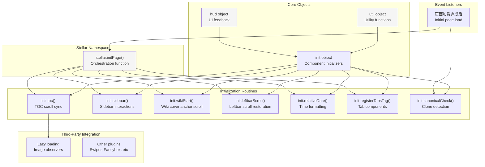
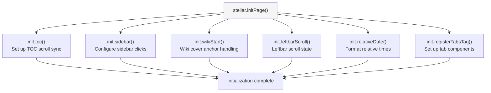
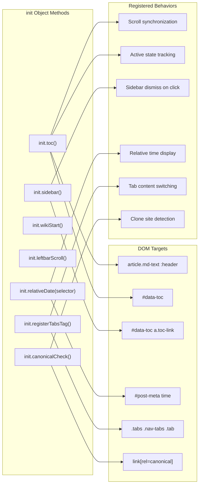
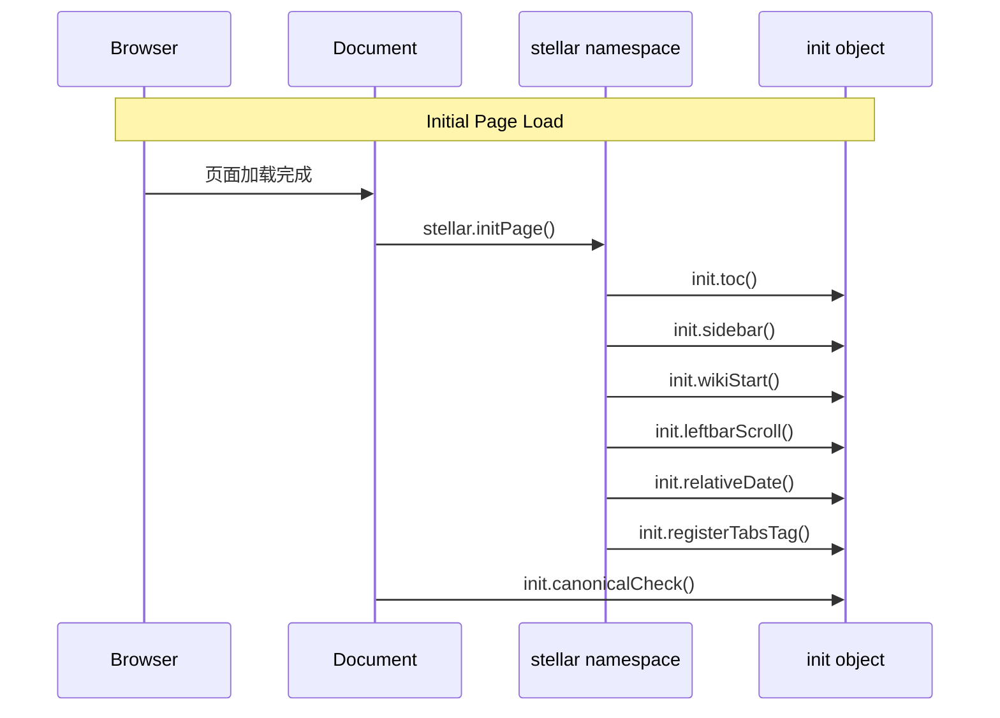

# 前端交互概览

<details>
<summary>相关源码文件</summary>

生成此页面时参考的主题源码文件：

- [source/js/main.js](../../../source/js/main.js)
- [layout/_partial/head.ejs](../../../layout/_partial/head.ejs)
- [layout/_partial/scripts/](../../../layout/_partial/scripts/)

</details>

## 目的与范围

本文概览 Stellar 主题的客户端 JavaScript 架构：初始化系统、核心工具函数、事件生命周期管理，以及客户端功能如何与服务端渲染内容集成。各子系统详见：

- 核心初始化例程：[核心 JavaScript 与页面初始化](core-js-init.md)
- TOC 滚动同步与激活状态管理：[目录系统](toc-system.md)
- 克隆站检测与规范链接校验：[规范链接与克隆站检测](canonical-url.md)
- 标签页组件与工具辅助函数：[标签页组件与工具函数](tabs-utils.md)

客户端层负责为服务端渲染的 HTML 增强交互功能，并协调第三方插件初始化。

---

## 客户端架构概览

Stellar 实现混合渲染模型：服务端生成初始 HTML，客户端渐进增强交互功能。架构围绕一个集中初始化系统组织。

### 系统组织



**参考源码**：[source/js/main.js](../../../source/js/main.js)

### 初始化生命周期

主题使用普通整页导航（PJAX 已于 v1.35.0 移除），因此初始化只在页面加载时运行一次：

| 阶段 | 触发 | 调用的函数 | 用途 |
|------|------|------------|------|
| **初始加载** | 页面加载完成后 | `stellar.initPage()`、`init.canonicalCheck()` | 设置页面交互功能 |

`stellar.initPage()` 是全部组件初始化的编排点。`init.canonicalCheck()` 只运行一次（克隆站检测会修改 meta 标签与提示，不需要重复执行）。

**参考源码**：[source/js/main.js](../../../source/js/main.js)

---

### 置顶内容轮播（pin-slider）

列表页 navbar top 上方可渲染置顶内容轮播（`layout/_partial/main/pin_slider.ejs`，无需开关配置，有置顶内容即渲染，自动轮播间隔固定 5000ms）：纯原生实现（无第三方依赖），经 `utils.initPlugin` 注册并返回清理函数，支持自动播放（hover/focus/页面隐藏时暂停）、圆点点击切换、悬停显示左右翻页按钮（solar 双箭头图标 + navbar 玻璃效果容器）、触摸松手滑动与 `prefers-reduced-motion` 降级。分页圆点按钮无文本、不设 `aria-label`（避免用户内容注入 HTML 属性导致解析失败），激活态由 `aria-current` 标识。幻灯片中的标题、小字、封面 URL、wiki 标题/摘要/标签等用户内容均经 `escape_html` 转义后输出（属性与文本统一转义）。轮播进度按内容类型分组（`post`/`wiki`）缓存到 localStorage（键 `stellar.pin-slider.<group>`），内容或张数变化后自动失效。文章幻灯片为固定「标题 + 一行小字」结构：标题取 `poster.headline` > `title`，小字取 `poster.caption` > `description` > excerpt（截断 50 字）；文字区与 poster 卡片 cover-info 一致：同款渐变模糊层（同图模糊 + 底部渐变 mask）、底部渐变背景与四周间距（padding 1rem）；有封面时封面铺满整卡，无封面时为纯白卡片（文字按普通文章颜色）；轮播区宽高比与非置顶文章一致，由 `article.cover_ratio` 控制。

**参考源码**：[layout/_partial/main/pin_slider.ejs](../../../layout/_partial/main/pin_slider.ejs)、[source/css/_components/pin-slider.styl](../../../source/css/_components/pin-slider.styl)

---

## stellar 命名空间

`stellar` 是全局对象，是主题 JavaScript 与外部插件集成的主要入口。

### stellar.initPage 函数

`stellar.initPage()` 是核心初始化编排器：



执行序列：

1. **TOC 初始化**——设置滚动监听与激活状态跟踪
2. **侧边栏初始化**——配置 TOC 链接点击处理
3. **Wiki 起始处理**——wiki 封面锚点滚动
4. **左栏滚动**——左栏滚动状态恢复
5. **相对时间格式化**——把时间戳转换为人类可读的相对时间
6. **标签页注册**——设置标签页组件事件处理

**参考源码**：[source/js/main.js](../../../source/js/main.js)

---

## 核心工具对象

主题提供两个贯穿客户端代码库的核心工具对象（原生 JavaScript，无 jQuery 依赖）。

### util 对象

`util` 对象提供通用工具函数：

| 函数 | 参数 | 用途 | 返回值 |
|------|------|------|--------|
| `diffDate` | `d`（日期）、`more`（布尔） | 计算与现在的相对时间差 | 字符串（如 "2 days"）或整数（天数） |
| `copy` | `id`（元素 ID）、`msg`（消息） | 复制元素内容到剪贴板 | void |
| `toggle` | `id`（元素 ID） | 切换元素上的 `.display` 类 | void |
| `scrollTop` | 无 | 平滑滚动到页面顶部 | void |
| `scrollComment` | 无 | 平滑滚动到评论区 | void |
| `viewportLazyload` | `target`（元素）、`func`（回调）、`enabled`（布尔） | 元素进入视口时执行函数 | void |

#### 相对日期计算

`diffDate` 把时间戳转换为人类可读的相对时间。`more = true` 时用 `ctx.date_suffix` 语言键返回本地化字符串：

- < 1 分钟：`ctx.date_suffix.just`
- < 1 小时：数量 + `ctx.date_suffix.min`
- < 1 天：数量 + `ctx.date_suffix.hour`
- < 14 天：数量 + `ctx.date_suffix.day`
- ≥ 14 天：`null`

`more = false` 时返回原始天数整数。

**参考源码**：[source/js/main.js](../../../source/js/main.js)

#### 视口懒加载

`viewportLazyload` 用 IntersectionObserver API 实现基于视口的懒加载。浏览器不支持 IntersectionObserver 或 `enabled` 为 false 时立即执行回调。

**参考源码**：[source/js/main.js](../../../source/js/main.js)

### hud 对象

`hud` 对象提供 UI 反馈机制：

| 函数 | 参数 | 用途 | 行为 |
|------|------|------|------|
| `toast` | `msg`（字符串）、`duration`（数字） | 显示临时通知 | 创建 `.toast` 元素，duration 后自动移除 |

toast 通知系统创建带 `.toast` 与 `.show` 类的临时覆盖元素，追加到 `document.body`，在指定时长（默认 2000ms）后自动移除。

**参考源码**：[source/js/main.js](../../../source/js/main.js)

---

## 初始化例程

`init` 对象包含针对不同页面组件的初始化函数。

### 组件初始化映射



**参考源码**：[source/js/main.js](../../../source/js/main.js)

### 原生 JavaScript 模式

初始化函数全部使用原生 DOM API（`utils.dom`、`document.querySelector` 等），主题不依赖 jQuery（jQuery 已于近期版本移除）。

**参考源码**：[source/js/main.js](../../../source/js/main.js)

---

## 事件生命周期

客户端系统随整页导航运行：每次页面加载执行一次初始化。

**事件流程**



`init.canonicalCheck()` 只在初始加载运行一次。

**参考源码**：[source/js/main.js](../../../source/js/main.js)

---

## 插件集成模式

第三方插件与特性经几种既定模式与 Stellar 集成。

### 自定义事件系统

标签页系统派发自定义事件供插件监听：

| 事件 | 触发 | 目标 | Bubbles | 用途 |
|------|------|------|---------|------|
| `tabs:click` | 用户点击标签 | `.tab-content` 子元素 | 是 | 通知插件标签激活 |
| `tabs:register` | 标签初始化完成 | `window` | N/A | 通知插件标签已就绪 |

**参考源码**：[source/js/main.js](../../../source/js/main.js)

### 与 Head 配置的集成

客户端系统与 HTML head 注入的配置协调。规范链接校验系统期望服务端渲染模板定义 `window.canonical` 对象：

```javascript
window.canonical = {
  originalHost: '...',
  encoded: '...',
  officialHosts: [...],
  param: {
    permalink: '...',
    checklink: '...'
  }
};
```

**参考源码**：[source/js/main.js](../../../source/js/main.js)、[layout/_partial/scripts/defines.ejs](../../../layout/_partial/scripts/defines.ejs)

---

## 性能考虑

客户端架构实现多种性能优化策略：

| 策略 | 实现 | 收益 |
|------|------|------|
| **防抖滚动** | TOC 滚动更新 50ms 超时 | 减少重排计算 |
| **IntersectionObserver** | `util.viewportLazyload()` 视口懒加载 | 元素可见时才执行工作 |
| **事件委托** | 标签点击用冒泡 | 减少事件监听器数量 |

TOC 滚动同步系统用防抖模式限制重排计算。用户滚动时 `activeTOC()` 立即执行，`scrollTOC()` 以 50ms 超时防抖，降低 TOC 小部件滚动计算的频率。

**参考源码**：[source/js/main.js](../../../source/js/main.js)

---

## 总结

Stellar 的客户端功能围绕 `stellar.initPage()` 编排函数组织，协调交互组件初始化。架构支持普通整页加载，通过幂等初始化例程与清晰的插件集成点保证稳定。核心工具对象（`util` 与 `hud`）提供可复用功能，事件系统实现组件间松耦合。
