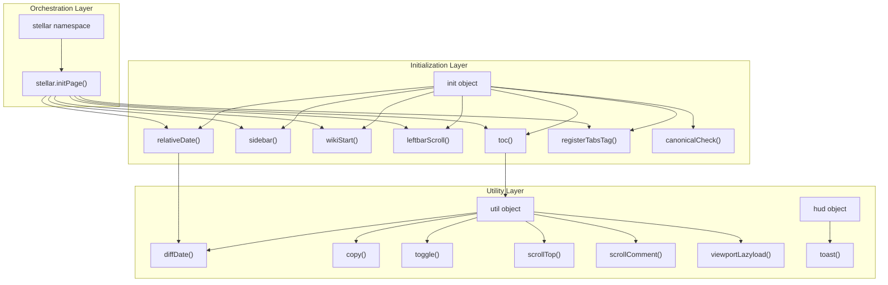
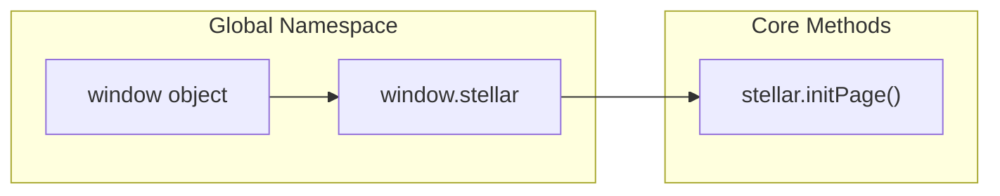
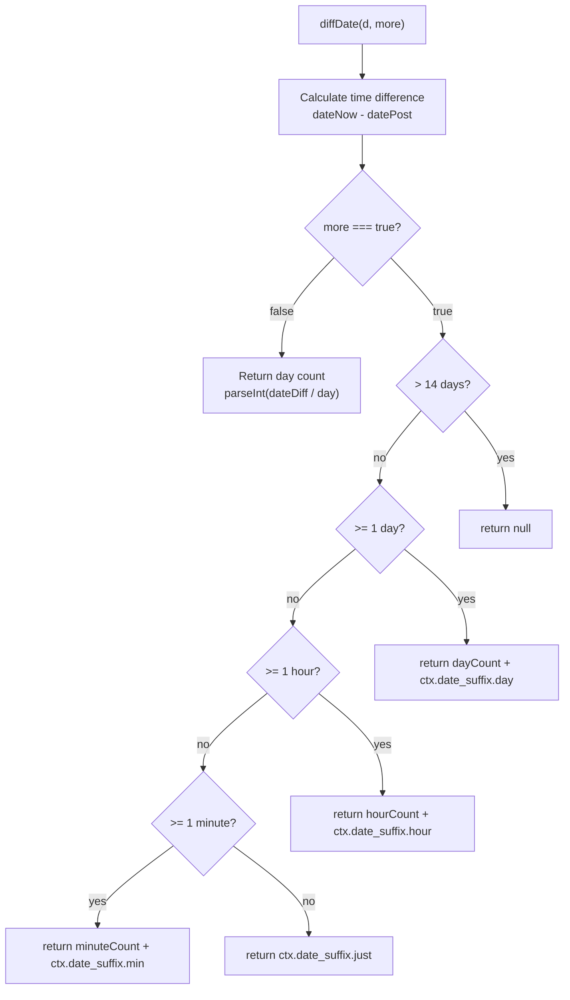
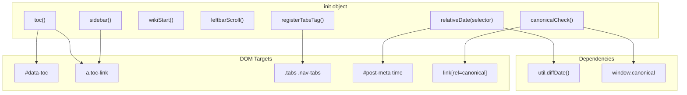
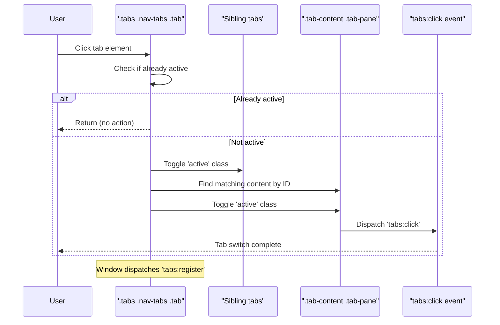
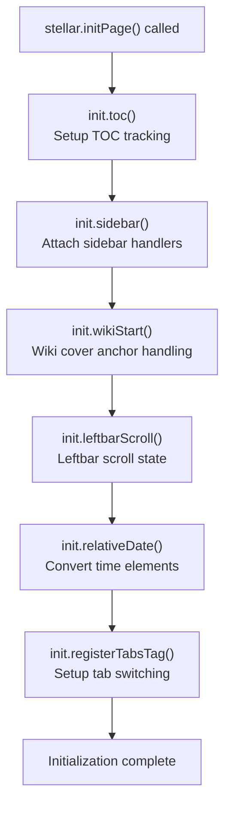
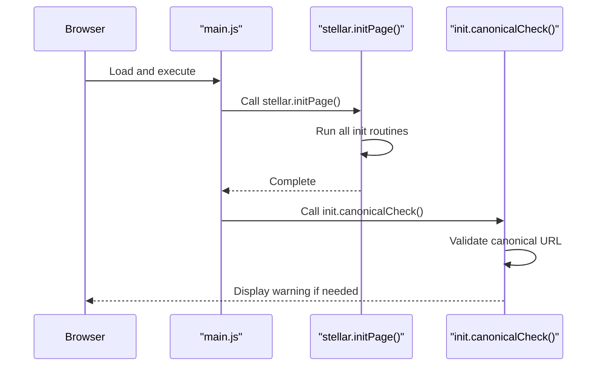

# 核心 JavaScript 与页面初始化

相关源码文件

生成此页面时参考的主题源码文件：

- [source/js/main.js](../../../source/js/main.js)
- [layout/_partial/head.ejs](../../../layout/_partial/head.ejs)
- [layout/_partial/scripts/defines.ejs](../../../layout/_partial/scripts/defines.ejs)

## 目的与范围

本文介绍 Stellar 的核心客户端 JavaScript 架构，重点是 `stellar.initPage()` 编排的页面初始化系统：工具辅助对象（`util` 与 `hud`）、交互功能初始化例程，以及系统如何与整页导航集成。

目录系统见[目录系统](toc-system.md)；规范链接检测与克隆站处理见[规范链接与克隆站检测](canonical-url.md)；页面导航机制见[页面导航与预加载](../07-外部集成/pjax-navigation.md)。

## 系统架构

JavaScript 初始化系统按三层组织：工具辅助函数提供底层功能，初始化例程配置页面专属特性，`stellar.initPage()` 编排器协调整个初始化过程。

**架构概览**：三层设计——工具函数提供可复用辅助，初始化函数配置具体特性，`stellar.initPage()` 编排完整设置。初始化在页面加载时运行一次，`canonicalCheck()` 只在初始加载执行。

**参考源码**：[source/js/main.js](../../../source/js/main.js)

## `stellar` 命名空间

`stellar` 全局命名空间是主题 JavaScript 功能的主要扩展点，初始化于 window 对象，提供核心 `initPage()` 函数。

命名空间用 `window.stellar = window.stellar || {};` 初始化，保证对象在脚本加载间保持。

**参考源码**：[source/js/main.js](../../../source/js/main.js)

## `util` 辅助对象

`util` 对象提供贯穿主题 JavaScript 的底层工具函数：日期格式化、元素操作、基于视口的懒加载等。

### 工具函数参考

| 函数 | 参数 | 返回类型 | 用途 |
|------|------|----------|------|
| `diffDate(d, more)` | `d`：日期字符串 `more`：布尔 | String 或 Number | 把日期转换为相对格式（"3 days ago"）或天数 |
| `copy(id, msg)` | `id`：元素 ID `msg`：toast 消息 | void | 复制元素内容到剪贴板并显示 toast |
| `toggle(id)` | `id`：元素 ID | void | 切换元素上的 "display" 类 |
| `scrollTop()` | 无 | void | 平滑滚动到页面顶部 |
| `scrollComment()` | 无 | void | 平滑滚动到评论区 |
| `viewportLazyload(target, func, enabled)` | `target`：元素 `func`：回调 `enabled`：布尔 | void | 元素进入视口时执行回调 |

### 日期格式化系统

`diffDate()` 实现双模式相对日期格式化。`more` 为 false 时返回天数整数；`more` 为 true 时按阈值返回本地化字符串。

函数用 `ctx.date_suffix` 对象中的本地化后缀做国际化。超过 14 天的日期在详细模式下返回 `null`，调用方回退显示完整日期。

**参考源码**：[source/js/main.js](../../../source/js/main.js)

### 剪贴板与元素操作

`copy()` 用 `navigator.clipboard.writeText()` API 复制输入框内容，然后经 `hud.toast()` 显示可选 toast 通知。

`toggle()` 切换元素上的 "display" 类（CSS 控制可见性）。

**参考源码**：[source/js/main.js](../../../source/js/main.js)

### 基于视口的懒加载

`viewportLazyload()` 用 IntersectionObserver API 实现懒加载，接受目标元素、回调函数与可选 enabled 标志。

功能禁用或浏览器不支持 IntersectionObserver 时立即执行回调；否则观察目标，元素进入视口时执行回调并断开观察器。

**参考源码**：[source/js/main.js](../../../source/js/main.js)

## `hud` 辅助对象

`hud`（Heads-Up Display）对象通过 toast 通知系统提供 UI 通知功能。

### Toast 通知系统

`toast()` 创建临时通知消息，接受消息字符串与可选时长（毫秒，默认 2000ms）。

实现细节：

1. 创建带 "toast" 与 "show" 类的 `div` 元素
2. 把消息内容设置为 inner HTML
3. 追加到 document.body
4. 指定时长后自动移除元素

toast 样式由 CSS 类处理，保证主题一致外观。该模式用于剪贴板复制等功能。

**参考源码**：[source/js/main.js](../../../source/js/main.js)

## `init` 初始化对象

`init` 对象包含各种页面特性的初始化例程，由 `stellar.initPage()` 调用。

### 初始化函数

**参考源码**：[source/js/main.js](../../../source/js/main.js)

### 目录初始化

`init.toc()` 设置目录激活状态跟踪与滚动同步：

1. 收集文章内全部标题元素（`article.md-text :header`）
2. 设置滚动事件监听，调用 `activeTOC()` 高亮当前小节
3. 实现防抖的 `scrollTOC()`，保持激活目录项可见
4. 用 32px 滚动偏移判定「当前」标题

函数用 50ms 超时防抖，避免目录小部件滚动更新过频。

详细行为见[目录系统](toc-system.md)。

**参考源码**：[source/js/main.js](../../../source/js/main.js)

### 侧边栏点击处理

`init.sidebar()` 为目录链接附加点击事件。点击目录链接时调用 `sidebar.dismiss()`，在移动端收起侧边栏。

**参考源码**：[source/js/main.js](../../../source/js/main.js)

### Wiki 起始处理

`init.wikiStart()` 处理用户点击 Wiki 封面“文档”按钮后的锚点滚动（如 `#start` 贴顶滚动）。不带 hash 初始打开 Wiki 首页时不会触发该定位，页面保持在顶部。

**参考源码**：[source/js/main.js](../../../source/js/main.js)

### 左栏滚动状态

`init.leftbarScroll()` 记录并恢复左栏滚动位置，使用 `localStorage`（`Stellar.leftbarScroll.` 前缀）跨页面保持左栏滚动状态。

**参考源码**：[source/js/main.js](../../../source/js/main.js)

### 相对日期转换

`init.relativeDate()` 把 datetime 属性转换为相对日期字符串。遍历元素列表（通常是 `<time>` 标签），提取 `datetime` 属性，用 `util.diffDate()` 替换 `innerText`。

`diffDate()` 返回 `null`（超过 14 天）时保留原文。

**参考源码**：[source/js/main.js](../../../source/js/main.js)

### 标签页系统注册

`init.registerTabsTag()` 实现标签页插件的切换功能：注册标签导航点击处理，管理导航标签与内容面板间的激活状态同步。

函数还在 window 上派发 `tabs:register` 事件，插件可据此检测标签系统已初始化。

**参考源码**：[source/js/main.js](../../../source/js/main.js)

### 规范链接校验

`init.canonicalCheck()` 实现两阶段校验系统，检测克隆站并显示适当警告，用于防止站点被未经授权复制。

完整文档见[规范链接与克隆站检测](canonical-url.md)。

**参考源码**：[source/js/main.js](../../../source/js/main.js)

## `stellar.initPage()` 编排器

`stellar.initPage()` 是协调全部页面初始化例程的核心编排器。

### 初始化序列

按顺序运行六个核心初始化例程：

1. **TOC 初始化**：设置滚动跟踪与激活状态管理
2. **侧边栏处理**：附加侧边栏收起点击处理
3. **Wiki 起始**：wiki 封面锚点处理
4. **左栏滚动**：左栏滚动状态恢复
5. **相对日期**：时间戳转相对日期字符串
6. **标签页注册**：启用标签页切换

**参考源码**：[source/js/main.js](../../../source/js/main.js)

## 页面加载集成

初始化系统在页面加载时运行一次（整页导航，PJAX 已移除）。

**初始页面加载**

初始加载执行两次函数调用：

1. `stellar.initPage();`
2. `init.canonicalCheck();`

canonical 检查只在初始加载运行一次（涉及网络请求并创建持久 UI 元素）。

**参考源码**：[source/js/main.js](../../../source/js/main.js)

## DOM 选择器与常量

脚本定义全局 DOM 选择器：

| 常量 | 选择器 | 用途 |
|------|--------|------|
| `l_body` | `.l_body` | 布局操作的主内容容器 |

**参考源码**：[source/js/main.js](../../../source/js/main.js)

## 与 Head 元数据的集成

初始化系统与 HTML head 中服务端渲染的元数据协调。

### 规范链接配置

`head.ejs` 模板用 `generate_canonical()` 生成 canonical link 标签，从 `theme.canonical.originalHost` 构造规范 URL。该值供 `init.canonicalCheck()` 校验当前主机名使用。

`window.canonical` 对象（含 `encoded` 与 `param`）在 [layout/_partial/scripts/defines.ejs](../../../layout/_partial/scripts/defines.ejs) 中注入。

**参考源码**：[layout/_partial/head.ejs](../../../layout/_partial/head.ejs)、[layout/_partial/scripts/defines.ejs](../../../layout/_partial/scripts/defines.ejs)

## 扩展点与插件集成

初始化系统为插件与外部脚本提供多个扩展点：

### 扩展点类型

| 扩展点 | 位置 | 用途 | 示例用法 |
|--------|------|------|----------|
| `window.stellar` | 命名空间 | 自定义功能 | 向 stellar 对象添加自定义方法 |
| 事件监听 | `tabs:register` | 响应系统事件 | 监听标签系统初始化 |
| 事件监听 | `tabs:click` | 响应用户操作 | 检测标签切换 |

### 插件集成模式

外部插件按此模式集成：

1. **扩展 stellar 命名空间**：向 `window.stellar` 添加自定义方法
2. **监听生命周期事件**：订阅 `tabs:register` 等事件
3. **使用工具辅助**：用 `util` 与 `hud` 处理常见操作

该架构允许插件接入主题生命周期而无需修改核心文件。

**参考源码**：[source/js/main.js](../../../source/js/main.js)
