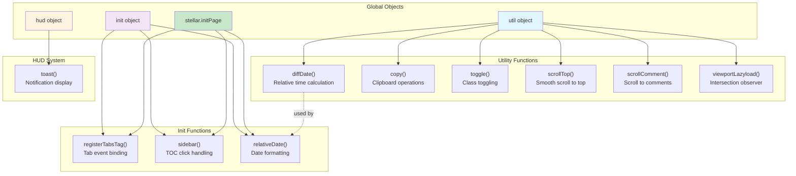
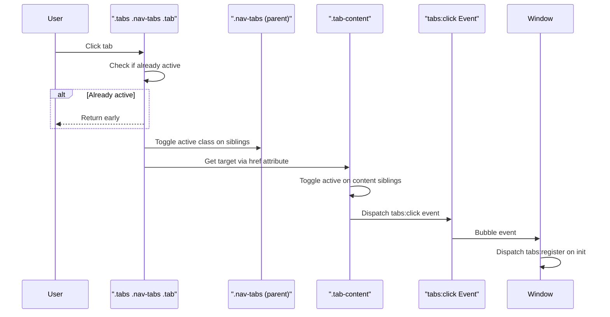
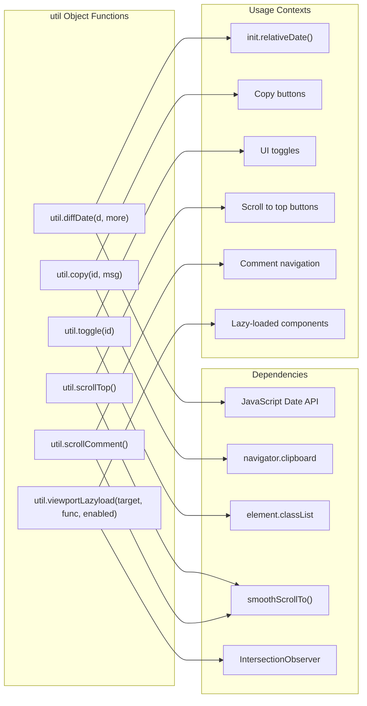
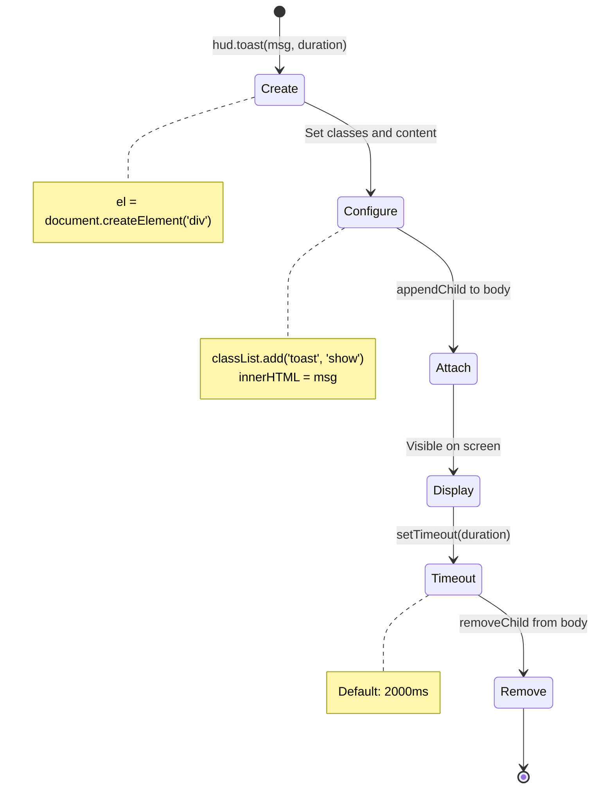
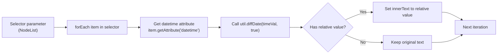
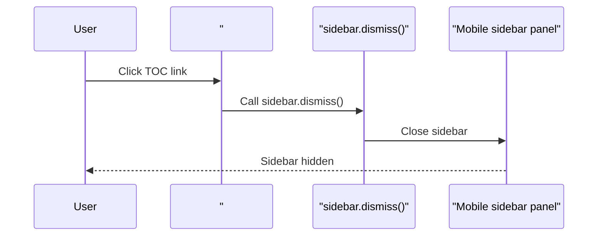

# 标签页组件与工具函数

<details>
<summary>相关源码文件</summary>

生成此页面时参考的主题源码文件：

- [source/js/main.js](../../../source/js/main.js)
- [layout/_partial/head.ejs](../../../layout/_partial/head.ejs)
- [source/js/theme.js](../../../source/js/theme.js)

</details>

本文介绍支持 Stellar 客户端交互的标签导航系统、工具函数、HUD 通知、相对日期转换与侧边栏交互辅助。这些组件为 DOM 操作、用户反馈与交互内容元素提供可复用功能。

整体页面初始化编排见[核心 JavaScript 与页面初始化](core-js-init.md)；TOC 专属功能见[目录系统](toc-system.md)；规范链接校验见[规范链接与克隆站检测](canonical-url.md)。

## 系统架构

标签与工具系统组织为 [source/js/main.js](../../../source/js/main.js) 内的四个主要对象：通用函数 `util`、UI 反馈 `hud`、初始化例程 `init` 与主题级 `stellar` 命名空间。

**组件组织与依赖**



**参考源码**：[source/js/main.js](../../../source/js/main.js)

## 标签页系统

标签页系统经 `registerTabsTag` 函数在内容页内实现交互标签导航，无需 Bootstrap 等外部库，用自定义事件处理标签切换。

### 标签事件处理

**标签事件流程**



注册过程查询所有匹配 `.tabs .nav-tabs .tab` 的元素并为每个附加点击监听。

**标签激活逻辑**

| 步骤 | 操作 |
|------|------|
| 1. 阻止点击默认 | `event.preventDefault()` |
| 2. 激活检查 | `element.classList.contains('active')` |
| 3. 兄弟取消激活 | `target.classList.toggle('active', target === element)` |
| 4. 内容选择 | 经 `element.querySelector('a').getAttribute('href').replace('#', '')` 查找元素 |
| 5. 内容激活 | `target.classList.toggle('active', target === tActive)` |
| 6. 事件派发 | `tActive.dispatchEvent(new Event('tabs:click', {bubbles: true}))` |

系统用展开运算符 `[...element.parentNode.children]` 遍历兄弟节点做类切换，保证导航内所有标签互斥——任一时刻只有一个激活。

**参考源码**：[source/js/main.js](../../../source/js/main.js)

### 自定义事件系统

标签页系统派发两个自定义事件：

1. **`tabs:click`**——标签内容面板激活时触发（可冒泡，其他组件可响应标签变化）
2. **`tabs:register`**——全部标签注册完成后在 window 上触发（提示标签系统已就绪）

外部脚本与插件可以接入标签生命周期事件，无需修改核心标签逻辑。

**参考源码**：[source/js/main.js](../../../source/js/main.js)

## 工具函数

`util` 对象提供贯穿主题的通用辅助函数，命名空间为 `util` 避免污染全局作用域。

**工具函数映射**



**参考源码**：[source/js/main.js](../../../source/js/main.js)

### 日期工具

`util.diffDate` 把时间戳转换为人类可读的相对时间字符串，接受两个参数：

- `d`——要转换的日期字符串或时间戳
- `more`（可选）——启用详细相对时间输出的布尔标志

`more` 为 `false`（默认）时返回原始天数整数；为 `true` 时返回本地化字符串（如 "3 天"、"5 小时"、"刚刚"）。

**相对时间计算逻辑**

级联阈值系统：

```
超过 14 天 → 返回 null
否则 >= 1 天 → 天数 + date_suffix.day
否则 >= 1 小时 → 小时数 + date_suffix.hour
否则 >= 1 分钟 → 分钟数 + date_suffix.min
否则 → date_suffix.just
```

`date_suffix` 字符串来自 `ctx` 全局上下文对象（含本地化翻译），服务端渲染时从语言文件注入（见[本地化](../08-本地化/localization.md)）。

**参考源码**：[source/js/main.js](../../../source/js/main.js)

### DOM 操作工具

**`util.copy(id, msg)`**——剪贴板复制辅助。选择给定 `id` 的元素，经 `navigator.clipboard.writeText()` 复制，可选经 `hud.toast()` 显示 `msg` 通知。

**`util.toggle(id)`**——类切换工具。切换指定 `id` 元素上的 `display` 类，常用于显示/隐藏 UI 面板。

**参考源码**：[source/js/main.js](../../../source/js/main.js)

### 滚动工具

**`util.scrollTop()`**——平滑滚动到页面顶部（经 `smoothScrollTo(0)`）。

**`util.scrollComment()`**——评论导航。滚动到 ID 为 `comments` 的元素（带 32px 偏移），通常绑定到文章布局中的「跳转评论」按钮。

**参考源码**：[source/js/main.js](../../../source/js/main.js)

### 基于视口的懒加载

`util.viewportLazyload(target, func, enabled)` 提供延迟执行模式，直到元素进入视口。

**参数：**

| 参数 | 类型 | 说明 |
|------|------|------|
| `target` | Element | 要观察的 DOM 元素 |
| `func` | Function | 可见时执行的回调 |
| `enabled` | Boolean | 是否启用观察（默认 true） |

**实现策略：**

1. `enabled` 为 false 或浏览器不支持 IntersectionObserver 时立即执行 `func()`
2. 创建 `IntersectionObserver` 实例
3. `intersectionRatio > 0` 时执行 `func()` 并断开观察器
4. 开始观察 `target` 元素

该模式用于懒加载评论系统与数据服务小部件等昂贵组件，见[数据服务 API](../06-数据服务与组件/data-service-apis.md)。

**参考源码**：[source/js/main.js](../../../source/js/main.js)

## HUD 系统

HUD（Heads-Up Display）系统通过 toast 通知提供瞬时用户反馈，由单个函数 `hud.toast(msg, duration)` 组成。

**Toast 通知生命周期**



**Toast 通知参数：**

| 参数 | 类型 | 默认 | 说明 |
|------|------|------|------|
| `msg` | String | 必填 | 显示的 HTML 内容 |
| `duration` | Number | 2000 | 显示时长（毫秒） |

函数创建带 `toast` 与 `show` 类的 `div` 元素，设置 innerHTML 为消息，追加到 `document.body`，指定时长后调度移除。`.toast` 样式定义在主题 Stylus 文件中。

**使用示例**：`util.copy` 提供消息时调用 `hud.toast` 确认剪贴板操作成功。

**参考源码**：[source/js/main.js](../../../source/js/main.js)

## 相对日期转换

`init.relativeDate(selector)` 把绝对 datetime 值转换为相对时间字符串，在页面初始化时经 `stellar.initPage()` 调用。

**转换过程：**



对选择器集合（通常是 `document.querySelectorAll('#post-meta time')`）逐个处理：

1. 提取 `datetime` 属性值
2. 传给 `util.diffDate(timeVal, true)` 转换
3. 返回相对值（非 null）时更新元素 `innerText`
4. 返回 null（超过 14 天）时保留原文

最近文章显示易读的相对日期，老内容显示绝对日期。14 天阈值定义在 `util.diffDate`。

**参考源码**：[source/js/main.js](../../../source/js/main.js)

## 侧边栏交互辅助

`init.sidebar()` 配置侧边栏行为，处理 TOC 链接交互（原生 JavaScript）。

**侧边栏收起流程：**



用户点击 `#data-toc` 内任何 `.toc-link` 时调用 `sidebar.dismiss()`，关闭移动端侧边栏面板，改善小屏导航体验。

移动端点击 TOC 链接后侧边栏自动收起，用户可直接阅读目标小节，无需手动关闭导航面板。

**参考源码**：[source/js/main.js](../../../source/js/main.js)

## 与页面初始化的集成

所有标签与工具函数经 `stellar.initPage()` 与主题初始化系统集成。

**初始化序列：**

| 顺序 | 调用函数 | 用途 |
|------|----------|------|
| 1 | `init.toc()` | TOC 激活状态跟踪 |
| 2 | `init.sidebar()` | 侧边栏点击处理 |
| 3 | `init.wikiStart()` | wiki 封面锚点处理 |
| 4 | `init.leftbarScroll()` | 左栏滚动状态 |
| 5 | `init.relativeDate(...)` | 转换文章日期 |
| 6 | `init.registerTabsTag()` | 标签事件绑定 |

`stellar.initPage()` 在初始页面加载时调用一次（整页导航，PJAX 已移除）。

**参考源码**：[source/js/main.js](../../../source/js/main.js)

## 配置上下文

工具函数依赖服务端渲染时注入的全局上下文对象：

**`ctx` 对象**——含 `util.diffDate()` 引用的本地化日期后缀：

- `ctx.date_suffix.day`——天单位字符串（如 "天"）
- `ctx.date_suffix.hour`——小时单位字符串（如 "小时"）
- `ctx.date_suffix.min`——分钟单位字符串（如 "分钟"）
- `ctx.date_suffix.just`——「刚刚」字符串

这些值来自语言文件（见[本地化](../08-本地化/localization.md)），由模板 partial 注入。

**参考源码**：[source/js/main.js](../../../source/js/main.js)、[source/js/theme.js](../../../source/js/theme.js)
