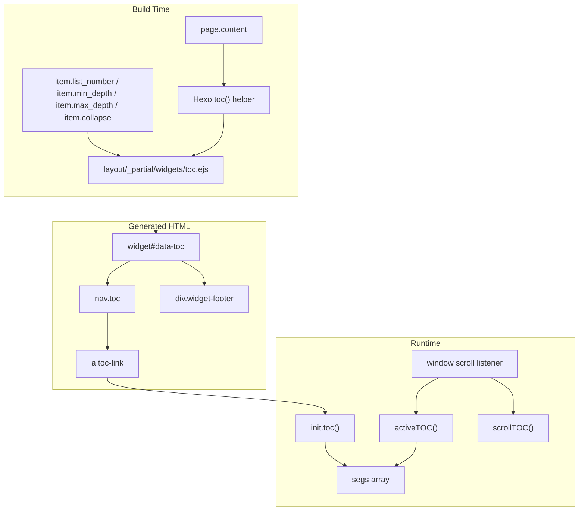
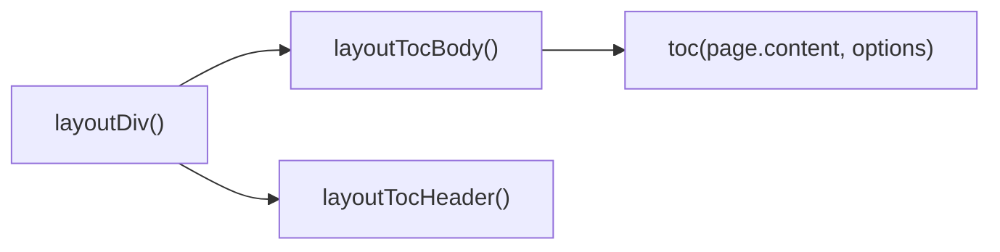
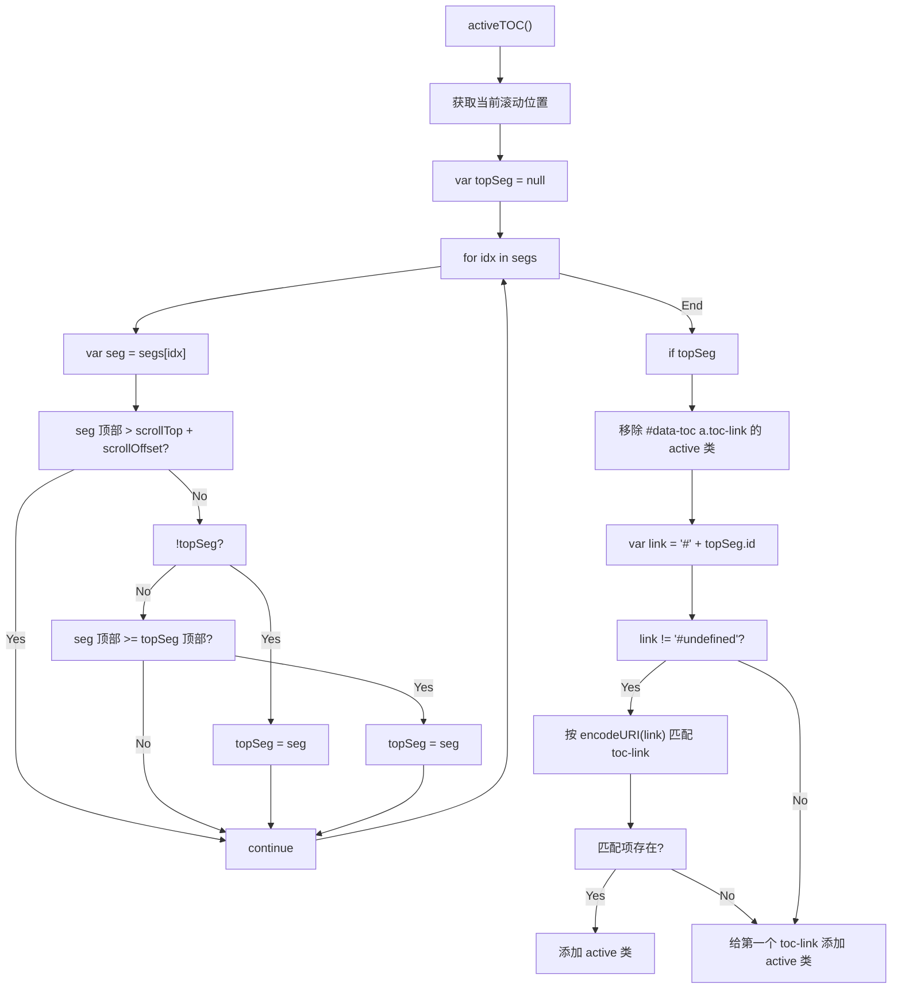
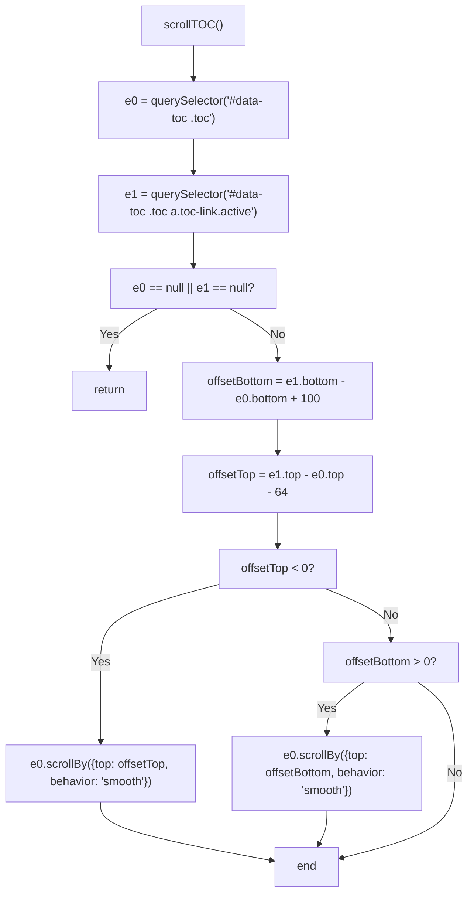
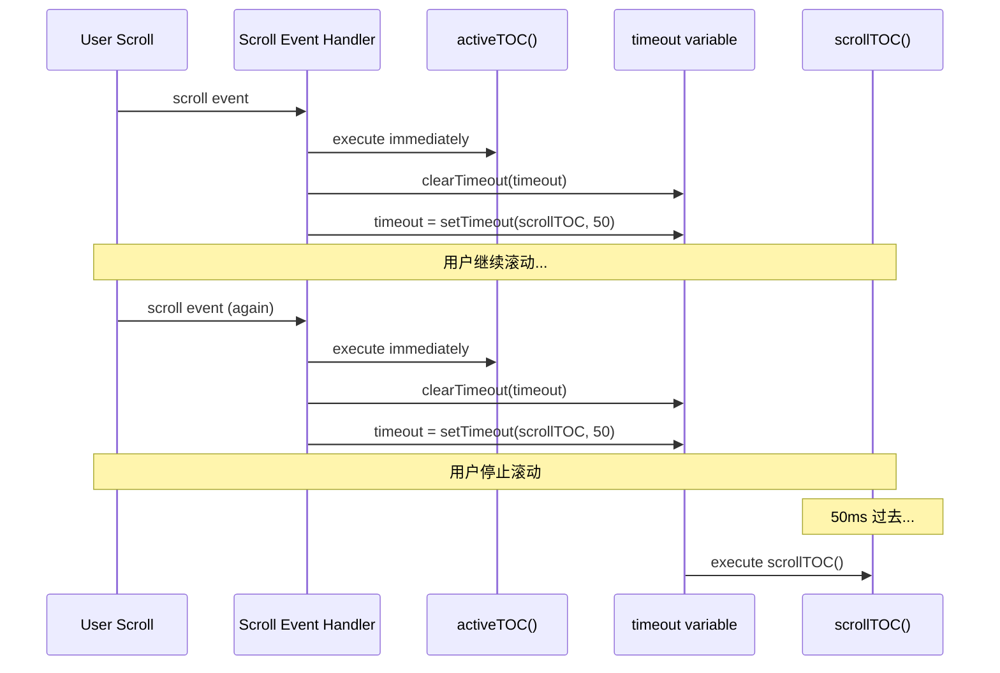
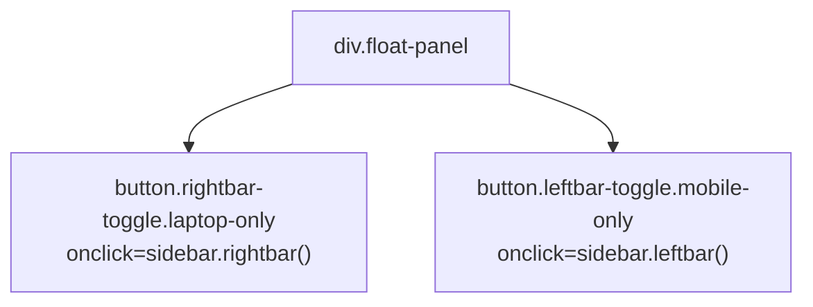
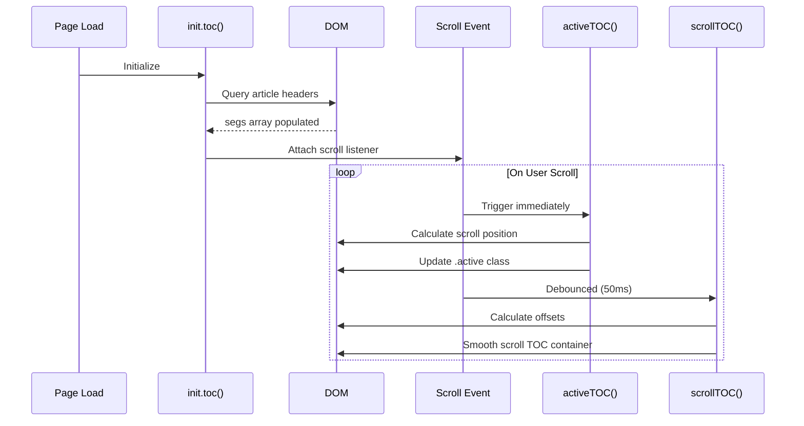

# 目录系统（TOC）

<details>
<summary>相关源码文件</summary>

生成此页面时参考的主题源码文件：

- [layout/_partial/widgets/toc.ejs](../../../layout/_partial/widgets/toc.ejs)
- [layout/_partial/menubtn.ejs](../../../layout/_partial/menubtn.ejs)
- [source/js/main.js](../../../source/js/main.js)
- [languages/zh-CN.yml](../../../languages/zh-CN.yml)

</details>

## 目的与范围

本文介绍 TOC 系统：从文章标题自动生成导航侧栏、跟踪读者滚动位置、高亮当前可见小节、自动滚动 TOC 容器保持激活链接可见。系统分两阶段运行：构建期服务端 HTML 生成与浏览器端客户端动态行为。

侧边栏组件上下文见[侧边栏系统](../02-布局系统/sidebar-system.md)；客户端初始化架构见[核心 JavaScript 与页面初始化](core-js-init.md)。

## 系统架构

**TOC 系统——构建期到运行时**



**参考源码**：[source/js/main.js](../../../source/js/main.js)、[layout/_partial/widgets/toc.ejs](../../../layout/_partial/widgets/toc.ejs)

## TOC 生成（服务端）

TOC 在构建期由 [layout/_partial/widgets/toc.ejs](../../../layout/_partial/widgets/toc.ejs) 生成。

### 模板函数链

**toc.ejs 中的服务端模板函数**



| 函数 | 角色 |
|------|------|
| `layoutTocBody()` | 调用 Hexo `toc()` 辅助函数；无标题时返回 `''` |
| `layoutTocHeader(title)` | 构建带标题 span 与切换按钮的 `div.widget-header` |
| `layoutToc(fallback)` | 无页脚的组件（备选变体） |
| `layoutDiv(fallback)` | 带页脚的完整组件 |

**参考源码**：[layout/_partial/widgets/toc.ejs](../../../layout/_partial/widgets/toc.ejs)

### 配置项

传给组件的 `item` 对象控制生成：

| 选项 | 类型 | 说明 |
|------|------|------|
| `item.list_number` | Boolean | 目录中显示有序列表编号 |
| `item.min_depth` | Number | 包含的最小标题级别（1–6） |
| `item.max_depth` | Number | 包含的最大标题级别（1–6） |
| `item.collapse` | Boolean | 组件元素上的初始折叠状态 |

**参考源码**：[layout/_partial/widgets/toc.ejs](../../../layout/_partial/widgets/toc.ejs)

### 生成的 HTML 结构

```
widget.widget-wrapper.toc#data-toc[collapse="..."]
  ├── div.widget-header.dis-select
  │   ├── span.name           （经 __("meta.toc") 本地化）
  │   └── a.cap-action        （onclick="sidebar.toggleTOC()"）
  ├── div.widget-body
  │   └── nav.toc
  │       └── ol.toc-child
  │           └── li.toc-item
  │               └── a.toc-link[href="#heading-id"]
  └── div.widget-footer
      ├── a.top               （onclick="util.scrollTop()"）
      └── a.buttom            （onclick="util.scrollComment()"）[条件渲染]
```

`a.buttom` 元素仅在 `theme.comments.service` 非空且 `page.comments !== false` 时渲染。

**参考源码**：[layout/_partial/widgets/toc.ejs](../../../layout/_partial/widgets/toc.ejs)

## 激活状态跟踪（客户端）

`init.toc()`（[source/js/main.js](../../../source/js/main.js)）实现基于滚动的激活状态跟踪（原生 JavaScript）。

### 初始化

加载时 `init.toc()` 收集文章内全部标题元素：

```
const scrollOffset = 32;
var segs = [];
document.querySelectorAll("article.md-text :header").forEach(...)  // 存入 segs
```

选择器 `article.md-text :header` 匹配文章正文内的全部 `h1`–`h6` 节点，存入 `segs` 供滚动位置比较。随后附加单个 `window.addEventListener('scroll', ...)` 监听器，立即触发 `activeTOC()`，`scrollTOC()` 带防抖执行。

**参考源码**：[source/js/main.js](../../../source/js/main.js)

### 激活小节检测：`activeTOC()`

**`activeTOC()` 逻辑流程**



要点：

- 找到**最靠下**、顶部仍在 `scrollTop + scrollOffset` 之下的标题——即已滚过检测阈值的最后一个标题
- 应用新激活类前清除 `#data-toc a.toc-link` 的全部 `.active` 类
- 用 `encodeURI(link)` 安全匹配 `href` 属性
- 无法解析标题 ID 时回退到 `#data-toc a.toc-link:first`

**参考源码**：[source/js/main.js](../../../source/js/main.js)

### 滚动偏移常量

| 常量 | 值 | 用途 |
|------|-----|------|
| `scrollOffset` | `32` px | 迟滞——标题在视口顶部下方多少像素后才视为激活 |

**参考源码**：[source/js/main.js](../../../source/js/main.js)

## TOC 自动滚动：`scrollTOC()`

激活 TOC 链接变化时，TOC 容器本身可能需要滚动以保持激活链接可见，由 `scrollTOC()` 处理。

**`scrollTOC()` 逻辑流程**



| 边距 | 值 | 用途 |
|------|-----|------|
| 顶部边距 | `64px` | TOC 容器内激活项上方空间 |
| 底部边距 | `100px` | TOC 容器内激活项下方空间 |

**参考源码**：[source/js/main.js](../../../source/js/main.js)

### 防抖执行

`activeTOC()` 在每次滚动事件立即执行；`scrollTOC()` 防抖以提升性能：

**滚动事件防抖模式**



**实现细节：**

| 组件 | 值/行为 |
|------|---------|
| 超时变量 | `var timeout = null` |
| 清除超时 | `clearTimeout(timeout)` |
| 防抖延迟 | `50` 毫秒 |
| 立即调用 | `activeTOC()` |

闭包变量 `timeout` 在每次滚动事件清除并重置。滚动停止 50ms 后才执行 `scrollTOC()`，防止过度滚动计算。

**参考源码**：[source/js/main.js](../../../source/js/main.js)

## 用户交互

### 回到顶部

`div.widget-footer` 中的 `a.top` 调用 `util.scrollTop()`，平滑滚动到页面顶部。

**参考源码**：[source/js/main.js](../../../source/js/main.js)、[layout/_partial/widgets/toc.ejs](../../../layout/_partial/widgets/toc.ejs)

### 滚动到评论

`div.widget-footer` 中的 `a.buttom` 调用 `util.scrollComment()`，平滑滚动到评论区（带 32px 偏移）。

**条件渲染：**

该按钮仅在两条件同时满足时渲染：

1. `theme.comments.service` 已配置（非空字符串）
2. `page.comments !== false`（页面未禁用评论）

模板中的条件检查防止在未启用评论的页面出现按钮。

**参考源码**：[source/js/main.js](../../../source/js/main.js)、[layout/_partial/widgets/toc.ejs](../../../layout/_partial/widgets/toc.ejs)

### 页内锚点平滑滚动

文档级委托监听（`bindAnchorClick`，`source/js/main.js`）拦截所有同页 `#` 链接（标题左侧 `.headerlink` 锚点、`` 页内导航、脚注回链等），统一走 `smoothScrollTo` 平滑滚动：

- 偏移量：`#start` 贴顶（0），其余锚点与 TOC 点击滚动保持一致（32px）
- 命中后 `preventDefault()` 并用 `history.pushState` 更新 URL hash
- 已由其他处理器拦截的点击（TOC、tabs、wiki 封面按钮、tagtree 等）通过 `e.defaultPrevented` 跳过，不重复滚动
- 片段先 `decodeURIComponent` 解码（异常时按原样查找），目标元素不存在时放行浏览器默认行为

初始带 `#锚点` 的 URL 打开仍由 `layout/_partial/scripts/defines.ejs` 直接定位（无动画），两者互不干扰。

**参考源码**：[source/js/main.js](../../../source/js/main.js)

### TOC 折叠

`div.widget-header` 中的 `a.cap-action` 调用 `sidebar.toggleTOC()`，展开或折叠 TOC 组件，与侧边栏折叠系统集成。

**参考源码**：[layout/_partial/widgets/toc.ejs](../../../layout/_partial/widgets/toc.ejs)

### 移动端侧边栏收起

`init.sidebar()` 为所有 TOC 链接附加点击处理：

```javascript
utils.dom("#data-toc a.toc-link").click(function (e) {
  sidebar.dismiss();
});
```

**用途**：移动端点击 TOC 链接时：

1. 关闭侧边栏覆盖层（`sidebar.dismiss()`）
2. 允许默认浏览器导航到标题锚点

这会在页面滚动到目标标题前自动收起覆盖层，改善移动端体验。

**参考源码**：[source/js/main.js](../../../source/js/main.js)

## 本地化

TOC 组件标题经 `layoutTocHeader()` 中的 `__("meta.toc")` 设置。页脚按钮标签用 `__('btn.top')` 与 `__('btn.comments')`。

| 键 | English | zh-CN | zh-TW |
|-----|---------|-------|-------|
| `meta.toc` | "On This Page" | "本文目录" | "本文目錄" |
| `btn.top` | "Scroll to Top" | "回到顶部" | "回到頂部" |
| `btn.comments` | "Join Discussion" | "参与讨论" | "參與討論" |

**参考源码**：[languages/en.yml](../../../languages/en.yml)、[languages/zh-CN.yml](../../../languages/zh-CN.yml)、[languages/zh-TW.yml](../../../languages/zh-TW.yml)

## 与侧边栏系统的集成

TOC 组件与更广泛的侧边栏架构集成。

### 侧边栏位置

TOC 组件通常出现在内容页右栏（`rightbar`），经[侧边栏系统](../02-布局系统/sidebar-system.md)描述的侧边栏组装系统渲染。

### 移动端切换

移动端通过侧边栏切换按钮访问 TOC：



**参考源码**：[layout/_partial/menubtn.ejs](../../../layout/_partial/menubtn.ejs)

### 组件 ID 参考

TOC 系统依赖固定 ID `data-toc` 供 JavaScript 查询：

| 元素 | ID/类 | 用途 |
|------|--------|------|
| 组件容器 | `#data-toc` | DOM 查询的根元素 |
| TOC 导航 | `#data-toc .toc` | 可滚动容器元素 |
| TOC 链接 | `#data-toc a.toc-link` | 各标题链接 |
| 激活链接 | `#data-toc a.toc-link.active` | 当前可见小节链接 |

这些选择器用于 main.js 的激活状态管理与自动滚动。

## 事件流程总结

从页面加载到用户交互的完整事件流：



**参考源码**：[source/js/main.js](../../../source/js/main.js)
