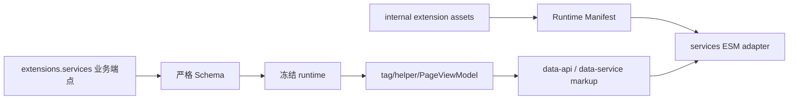

# 数据服务 API

数据服务为标签插件、小部件和页面组件提供按需请求能力。v2 把公开业务端点放入 `extensions.services`，把官方客户端模块放入内部资源注册表；旧 `data_services` 与 `api_host` 不再是公开入口。

## 公开服务配置

```yaml
extensions:
  services:
    site_info:
      endpoint:
    rating:
      endpoint: https://star-vote.xaox.cc/api/rating
    vote:
      endpoint: https://star-vote.xaox.cc/api/vote
    contributors:
      edit_page:
        '_posts/':
        'wiki/stellar/': https://github.com/xaoxuu/hexo-theme-stellar-docs/blob/main/
    github:
      api_url: https://api.github.com
      raw_url: https://raw.githubusercontent.com
      gist_url: https://gist.github.com
      card_url: https://github-readme-stats.vercel.app
```

YAML 解析后分别投影为 `siteInfo.endpoint`、`contributors.editPage` 和 `github.apiUrl/rawUrl/gistUrl/cardUrl`。GitHub 地址统一使用完整 URL，避免调用方重复决定协议与 host 拼接规则。

### Site Info

`site_info.endpoint` 支持 `{href}` 占位符。Link 与 Sites 标签在卡片缺少 icon/avatar 时可请求站点元信息；未配置 endpoint 时保留主题兜底，不自动发请求。

```yaml
extensions:
  services:
    site_info:
      endpoint: https://api.example.com/site?url={href}
```

### Rating 与 Vote

`rating.endpoint` 和 `vote.endpoint` 分别供评分与投票标签构造 `data-api`。端点是业务 URL；客户端模块由主题内部提供。

### Contributors

`contributors.edit_page` 是动态记录：键为主题可识别的源文件路径前缀，值为对应仓库的编辑 URL 前缀或 `null`。Post PageViewModel 用最长可用前缀生成“编辑本页”链接，并通过 `github.api_url` 生成提交记录请求。

### GitHub 服务

| 字段 | 消费方 |
|------|--------|
| `api_url` | ghuser、ghrepo、ghissues、contributors、Wiki release 数据 |
| `raw_url` | 远程 Markdown、Wiki README、仓库资源 |
| `gist_url` | Gist 链接/资源构造 |
| `card_url` | GitHub Readme Stats 卡片 |

## 内部服务注册表

`mdrender/siteinfo/ghinfo/rating/vote/sites/friends/timeline/memos/comments latest` 等浏览器模块的脚本路径登记在 `scripts/lib/extension-assets.js`，不属于公开配置。构建期把冻结注册表投影到 Runtime Manifest；`services` ESM adapter 只在 DOM 命中 `.data-service` / `.ds-<id>` 等标记时 import，再加载对应内部模块。



## 缓存策略

```yaml
extensions:
  cache:
    enabled: true
    default_ttl: 3600
    ttl:
      siteinfo: 86400
      giscus: 600
    max_entries: 200
```

`ttl.<service>` 是动态记录，省略时使用 `default_ttl`。`max_entries: 0` 与 `enabled: false` 均按原值保留，不做类型强转。ESM request/cache 客户端直接消费最终 camelCase 配置，提供 GET 并发去重、超时重试、fresh 命中、stale 失败回退、单条 200 KiB 限制和按最旧时间淘汰；非 GET、`no-store` 与时间戳破坏参数不缓存。

缓存前缀为 `Stellar.request-cache.v2.`。客户端不替换 `window.fetch` 或 `XMLHttpRequest`，只在自身请求开始/结束时派发 `stellar:request-start/end`。`utils.request` / `requestWithoutLoading` 是迁移期数据服务 callback/loading 适配，不再包含第二份缓存算法。

## 远程 Markdown

`mdrender` 与 Wiki README 使用 `github.raw_url` 的完整 origin 替换标准 `raw.githubusercontent.com`，并输出同一目录的 `data-base` 供相对资源解析。非 GitHub Raw 地址保持原样。

## 扩展边界

- 站点只能配置已声明业务端点，不能覆盖官方 `js/css/inject`。
- 服务 ID 使用 snake_case；浏览器内部旧 ID 仅是当前运行时桥接，不是公开 YAML。
- 标签或小部件自带的单次 `api` 参数仍属于组件输入，不自动上升为全局服务配置。
- 第三方响应与 CORS 由端点提供方负责；主题在请求失败时保持静态兜底或空状态。

相关源码：[scripts/lib/extension-assets.js](../../../scripts/lib/extension-assets.js)、[scripts/schema/config-schema.js](../../../scripts/schema/config-schema.js)、[scripts/lib/browser-runtime.js](../../../scripts/lib/browser-runtime.js)、[source/js/runtime/extensions/services.mjs](../../../source/js/runtime/extensions/services.mjs)、[source/js/runtime/request-cache.mjs](../../../source/js/runtime/request-cache.mjs)、[source/js/runtime/legacy-request-adapter.mjs](../../../source/js/runtime/legacy-request-adapter.mjs)。
