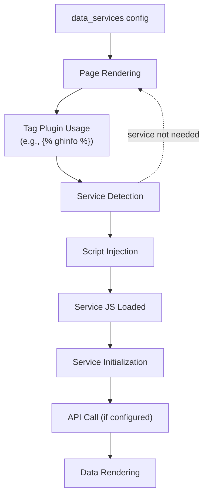
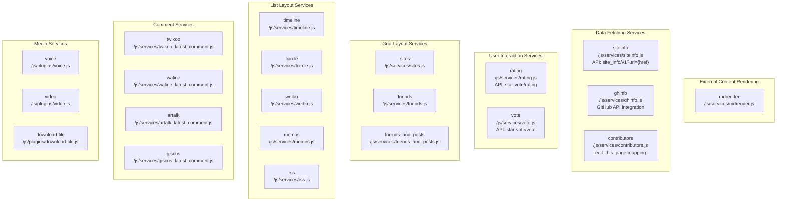
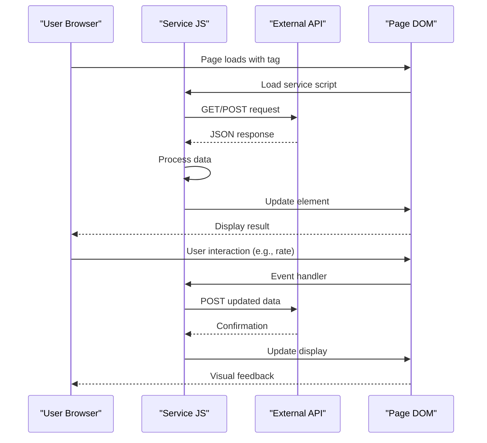
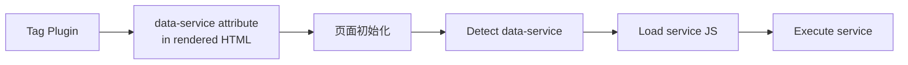

# 数据服务 API

<details>
<summary>相关源码文件</summary>

生成此页面时参考的主题源码文件：

- [.github/workflows/npm-publish.yml](../../../.github/workflows/npm-publish.yml)
- [.npmignore](../../../.npmignore)
- [LICENSE](../../../LICENSE)
- [README.md](../../../README.md)
- [_config.yml](../../../_config.yml)
- [package.json](../../../package.json)
- [source/js/services/](../../../source/js/services/)
- [source/js/plugins/](../../../source/js/plugins/)

</details>

## 目的与范围

本文介绍 Stellar 的**数据服务系统**：按需加载获取并渲染动态内容的 JavaScript 模块。数据服务在保持静态站点生成的同时支持 GitHub 仓库信息、站点预览、评分系统与远程 Markdown 渲染等动态功能。服务仅在内容中出现对应标签时加载，避免不必要的脚本执行以优化性能。

数据服务通常填充的小部件渲染系统见[小部件系统架构](widget-architecture.md)；全局加载的插件化功能见[插件系统](../07-外部集成/plugin-system.md)。

---

## 系统架构

数据服务系统采用懒加载模型：服务在配置中注册，但仅在经标签插件或小部件使用显式请求时加载。

### 服务加载流程



**参考源码**：[_config.yml](../../../_config.yml)

### 配置结构

数据服务定义在 `_config.yml` 的 `data_services` 小节。每个服务包含：

| 字段 | 类型 | 说明 |
|------|------|------|
| `js` | String | 实现服务的 JavaScript 文件路径 |
| `api` | String（可选） | 外部 API 端点 URL，可含 `{placeholder}` 占位符 |
| 自定义字段 | 各种 | 服务专属配置（如 contributors 的 `edit_this_page`） |

**配置模式：**

```yaml
data_services:
  service_name:
    js: /js/services/service_name.js
    api: https://api.example.com/endpoint  # 可选
    custom_field: value  # 可选
```

**参考源码**：[_config.yml](../../../_config.yml)

---

## 服务分类

Stellar 按用途把数据服务组织为功能分类：

### 服务分类映射



**参考源码**：[_config.yml](../../../_config.yml)

---

## 外部内容渲染服务

### mdrender 服务

把外部 Markdown 文件渲染进页面，常用于嵌入仓库 README。

**配置：**

```yaml
data_services:
  mdrender:
    js: /js/services/mdrender.js
```

**用法示例：**

```markdown

```

服务获取 Markdown 内容，用 `marked` 库处理（见 `_config.yml` 的 `dependencies`），把渲染后的 HTML 注入页面。

**参考源码**：[_config.yml](../../../_config.yml)

---

## 数据获取服务

### siteinfo 服务

从外部 URL 自动提取网站元数据（标题、图标、描述），用于链接预览。

**配置：**

```yaml
data_services:
  siteinfo:
    js: /js/services/siteinfo.js
    api: https://api.xaox.cc/site_info/v1?url={href}
```

**API 端点模式：**

`api` 字段用 `{href}` 占位符，会被替换为实际 URL。未配置 `api` 时服务以受限模式运行，不自动提取元数据。

**参考源码**：[_config.yml](../../../_config.yml)

### ghinfo 服务

用 GitHub API 获取仓库信息。

**配置：**

```yaml
data_services:
  ghinfo:
    js: /js/services/ghinfo.js
```

**API 主机：**

服务使用 `api_host` 小节定义的 GitHub API 主机：

```yaml
api_host:
  ghapi: api.github.com
  ghraw: raw.githubusercontent.com
  gist: gist.github.com
  ghcard: github-readme-stats.vercel.app
```

**参考源码**：[_config.yml](../../../_config.yml)

### contributors 服务

把文件路径映射到 GitHub 仓库位置，显示内容文件贡献者信息。

**配置：**

```yaml
data_services:
  contributors:
    edit_this_page:
      '_posts/': # 映射到仓库路径
      'wiki/stellar/': https://github.com/xaoxuu/hexo-theme-stellar-docs/blob/main/
    js: /js/services/contributors.js
```

**路径映射：**

`edit_this_page` 对象把本地文件路径前缀映射到 GitHub 仓库 URL，启用「编辑本页」功能与贡献者跟踪。

**参考源码**：[_config.yml](../../../_config.yml)

---

## 用户交互服务

### API 通信模式



### rating 服务

实现带外部 API 持久化的星级评分系统。

**配置：**

```yaml
data_services:
  rating:
    js: /js/services/rating.js
    api: https://star-vote.xaox.cc/api/rating
```

**API 集成：**

- 获取内容当前评分
- 提交用户评分
- 用聚合分数更新显示

**参考源码**：[_config.yml](../../../_config.yml)

### vote 服务

提供带外部 API 持久化的投票/民意功能。

**配置：**

```yaml
data_services:
  vote:
    js: /js/services/vote.js
    api: https://star-vote.xaox.cc/api/vote
```

**参考源码**：[_config.yml](../../../_config.yml)

---

## 布局与内容服务

### 网格布局服务

以卡片网格布局渲染内容的服务：

| 服务 | 用途 | 配置 |
|------|------|------|
| `sites` | 通用网站卡片 | `js: /js/services/sites.js` |
| `friends` | 友链卡片 | `js: /js/services/friends.js` |
| `friends_and_posts` | 友链 + 文章流 | `js: /js/services/friends_and_posts.js` |

**参考源码**：[_config.yml](../../../_config.yml)

### 列表布局服务

以时序或顺序列表渲染内容的服务：

| 服务 | 用途 | 配置 |
|------|------|------|
| `timeline` | 基于时间的内容显示 | `js: /js/services/timeline.js` |
| `fcircle` | 朋友圈聚合 | `js: /js/services/fcircle.js` |
| `weibo` | 微博风格内容 | `js: /js/services/weibo.js` |
| `memos` | memo/便签显示 | `js: /js/services/memos.js` |
| `rss` | RSS 源渲染 | `js: /js/services/rss.js` |

**参考源码**：[_config.yml](../../../_config.yml)

memos 服务内置多版本识别（`source/js/services/memos.js` 的 `versionHandlers`）：`22-`（数组格式）、`22+`、`25+` 与 `v1`（新版接口 `{ memos: [...] }`，creator 为 `users/xxx` 字符串形式）；识别失败时回退 `feature` 兜底，不阻断渲染。

---

## 评论集成服务

---

## 评论集成服务

这些服务从各评论系统获取并显示最新评论：

**配置模式：**

```yaml
data_services:
  twikoo:
    js: /js/services/twikoo_latest_comment.js
  waline:
    js: /js/services/waline_latest_comment.js
  artalk:
    js: /js/services/artalk_latest_comment.js
  giscus:
    js: /js/services/giscus_latest_comment.js
```

**集成：**

这些服务连接到 `comments` 小节配置的评论系统 API（见[评论系统](../07-外部集成/comment-systems.md)），获取并显示近期评论活动。

Artalk 最新评论渲染时保留表情图（`atk-emoticon`，CSS 限高 1.5em），其余标签转纯文本并截断 50 字符，空评论跳过，避免大表情图与段落撑爆侧栏卡片布局。

waline 最新评论兼容数组与 `{ data: [...] }` 两种返回结构；Artalk 评论页加载后清理 `?atk_*` 查询参数，避免其 hash 监听干扰目录定位（#598）。

**参考源码**：[_config.yml](../../../_config.yml)

---

## 媒体服务

媒体服务处理音频、视频与文件下载：

```yaml
data_services:
  voice: 
    js: /js/plugins/voice.js
  video: 
    js: /js/plugins/video.js
  download-file: 
    js: /js/plugins/download-file.js
```

**注意**：这些服务位于 `/js/plugins/` 而非 `/js/services/`，提供插件式功能而非纯数据获取。

**参考源码**：[_config.yml](../../../_config.yml)

---

## 按需加载实现

### 加载触发机制



**加载特性：**

1. **条件加载**——服务仅在渲染页面中存在对应标签时加载
2. **去重**——每个服务每页加载一次，即使多次使用
3. **依赖管理**——服务可访问 `marked` 等共享工具
4. **整页导航适配**——主题为普通整页导航，每次加载重新扫描初始化

**参考源码**：[_config.yml](../../../_config.yml)

---

## 依赖集成

数据服务依赖 `dependencies` 小节定义的基础依赖：

```yaml
dependencies:
  marked: https://gcore.jsdelivr.net/npm/marked@13.0/lib/marked.umd.min.js
  lazyload:
    js: https://gcore.jsdelivr.net/npm/vanilla-lazyload@19.1/dist/lazyload.min.js
    transition: fade
    fix_ratio: true
```

**依赖用途：**

- **marked**——`mdrender` 等服务的 Markdown 处理必需（主题无 jQuery 依赖，客户端为原生 JavaScript）
- **lazyload**——渲染图片的服务集成

**参考源码**：[_config.yml](../../../_config.yml)

---

## 配置最佳实践

### API 安全考虑

配置 API 端点时：

1. **仅 HTTPS**——API 端点始终用 HTTPS URL
2. **CORS 配置**——确保外部 API 支持浏览器请求的 CORS
3. **速率限制**——注意 API 速率限制，尤其 GitHub API
4. **令牌管理**——部分服务（如 GitHub 集成）可能需要认证令牌

### 性能优化

1. **选择性启用**——只配置实际使用的服务
2. **API 端点测试**——部署前验证 API 端点响应
3. **CDN 使用**——自托管时用 CDN URL 分发服务 JS
4. **懒加载**——按需加载机制自动优化性能

**参考源码**：[_config.yml](../../../_config.yml)

---

## 服务扩展

添加自定义数据服务的步骤：

1. **创建服务 JavaScript**：放在 `/source/js/services/your_service.js`
2. **在配置中注册**：
   ```yaml
   data_services:
     your_service:
       js: /js/services/your_service.js
       api: https://your-api.com/endpoint
   ```
3. **实现标签插件**：创建引用该服务的标签插件
4. **添加数据属性**：确保渲染 HTML 包含 `data-service="your_service"`

**集成点：**

- 服务脚本在 `stellar` 命名空间内执行
- 使用 CDN 全局（如 `marked`）与主题工具函数
- 用服务专属选择器更新 DOM 元素

**参考源码**：[_config.yml](../../../_config.yml)
