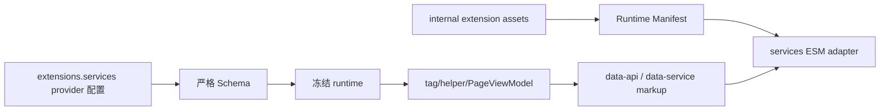

# 数据服务 API

数据服务为标签插件、小部件和页面组件提供按需请求能力。v2 把可替换的第三方实现收敛为 `provider + providers`，把官方客户端模块放入内部资源注册表；旧 `data_services` 与 `api_host` 不再是公开入口。

## 公开服务配置

```yaml
extensions:
  services:
    site_info:
      provider: site_info_api
      providers:
        site_info_api:
          endpoint: https://api.xaox.cc/site_info/v1?url={href}
    rating:
      provider: star_vote
      providers:
        star_vote:
          endpoint: https://star-vote.xaox.cc/api/rating
    vote:
      provider: star_vote
      providers:
        star_vote:
          endpoint: https://star-vote.xaox.cc/api/vote
    contributors:
      provider: github
      providers:
        github:
          repositories:
            - source_prefix: wiki/stellar/
              repository: xaoxuu/hexo-theme-stellar-docs
              branch: main
    github:
      api_url: https://api.github.com
      raw_url: https://raw.githubusercontent.com
      gist_url: https://gist.github.com
    github_card:
      provider: github_readme_stats
      providers:
        github_readme_stats:
          endpoint: https://github-readme-stats.vercel.app
```

YAML 解析后字段转为 camelCase。标签、PageViewModel、模板和 Runtime Manifest 先通过统一接缝解析选中的 provider，只消费该参数袋；未选中的 provider 配置不会投影给浏览器。每个 provider 参数袋使用封闭 Schema，未知字段会被拒绝。

### Site Info

`site_info` 默认选择 `site_info_api`，其 `endpoint` 支持 `{href}` 占位符并默认使用 `https://api.xaox.cc/site_info/v1?url={href}`。Link 与 Sites 标签在卡片缺少 icon/avatar 时可请求站点元信息；将 `provider` 显式设为 `null` 时不发请求，公共或自定义服务失败时保留原始标题、图标、描述等静态兜底。

```yaml
extensions:
  services:
    site_info:
      provider: site_info_api
      providers:
        site_info_api:
          endpoint: https://api.example.com/site?url={href}
```

### Rating 与 Vote

`rating` 与 `vote` 是两个独立能力，均默认选择 `star_vote`；各自参数袋内的 `endpoint` 分别默认使用 `https://star-vote.xaox.cc/api/rating` 和 `https://star-vote.xaox.cc/api/vote`。站点可覆盖为自己的 [star-vote](https://github.com/xaoxuu/star-vote) 部署地址；将对应 `provider` 设为 `null` 时标签仍可构建，但输出不可交互的静态状态。加载或提交失败时不显示错误、不输出控制台日志；加载保留初始值，失败的提交撤销本地乐观状态。

### Contributors

`contributors` 默认选择 `github`，`providers.github.repositories` 是 `{source_prefix,repository,branch}` 数组。PageViewModel 只读取选中 provider 的仓库映射，并按最长 `source_prefix` 匹配生成“编辑本页”和提交记录 URL；空数组继续表示无贡献者映射。

### GitHub 服务

| 字段 | 消费方 |
|------|--------|
| `api_url` | ghuser、ghrepo、ghissues、contributors、Wiki release 数据 |
| `raw_url` | 远程 Markdown、Wiki README、仓库资源 |
| `gist_url` | `` 脚本地址 |

`github` 表示明确的 GitHub 平台与共享代理地址，不采用 provider 结构。GitHub Readme Stats 卡片是可替换能力，`github_card` 默认选择 `github_readme_stats`，其服务地址位于 `providers.github_readme_stats.endpoint`。

## 内部服务注册表

`mdrender/siteinfo/ghinfo/rating/vote/sites/friends/timeline/memos/comments latest` 等浏览器模块的脚本路径登记在 `scripts/lib/internal-constants.js`，不属于公开配置。构建期把冻结注册表投影到 Runtime Manifest；`services` ESM adapter 只在 DOM 命中 `.data-service` / `.ds-<id>` 等标记时 import，再加载对应内部模块。



## 缓存策略

request/cache 是主题运行时实现策略，由 `scripts/lib/internal-constants.js` 集中所有，不再暴露 `extensions.cache` 站点配置。构建期把冻结 policy 写入 Runtime Manifest，ESM request/cache 客户端必须显式消费该 policy，提供 GET 并发去重、超时重试、fresh 命中、stale 失败回退、单条 200 KiB 限制和按最旧时间淘汰；非 GET、`no-store` 与时间戳破坏参数不缓存。

缓存前缀为 `Stellar.request-cache.v2.`。客户端不替换 `window.fetch` 或 `XMLHttpRequest`，只在自身请求开始/结束时派发 `stellar:request-start/end`。`utils.request` / `requestWithoutLoading` 是迁移期数据服务 callback/loading 适配，不再包含第二份缓存算法。

## 远程 Markdown

`mdrender` 与 Wiki README 使用 `github.raw_url` 的完整 origin 替换标准 `raw.githubusercontent.com`，并输出同一目录的 `data-base` 供相对资源解析。非 GitHub Raw 地址保持原样。

## 扩展边界

- 站点只能配置已声明业务端点，不能覆盖官方 `js/css/inject`。
- 可替换服务统一使用 `provider + providers`；新增实现只增加 provider ID、封闭配置袋和适配器，不改变服务根结构。
- 服务 ID 使用 snake_case；浏览器内部旧 ID 仅是当前运行时桥接，不是公开 YAML。
- 标签或小部件自带的单次 `api` 参数仍属于组件输入，不自动上升为全局服务配置。
- 第三方响应与 CORS 由端点提供方负责；Site Info、Rating 与 Vote 在预期远程失败时完全静默并保持静态兜底或撤销失败交互，其它服务沿用各自的失败策略。

相关源码：[scripts/lib/internal-constants.js](../../../scripts/lib/internal-constants.js)、[scripts/schema/config-schema.js](../../../scripts/schema/config-schema.js)、[scripts/lib/browser-runtime.js](../../../scripts/lib/browser-runtime.js)、[source/js/runtime/extensions/services.mjs](../../../source/js/runtime/extensions/services.mjs)、[source/js/runtime/request-cache.mjs](../../../source/js/runtime/request-cache.mjs)、[source/js/runtime/legacy-request-adapter.mjs](../../../source/js/runtime/legacy-request-adapter.mjs)。
