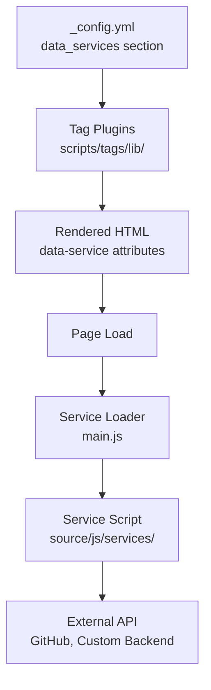
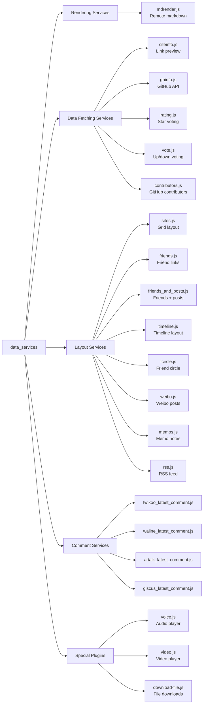
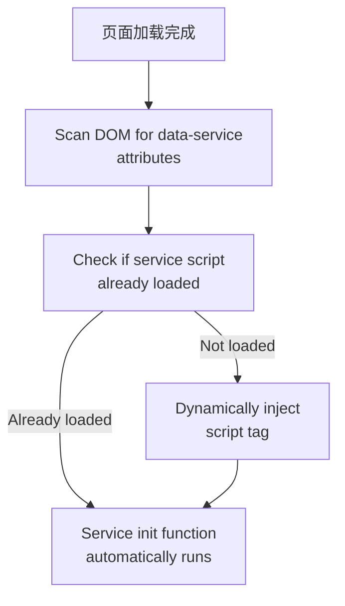
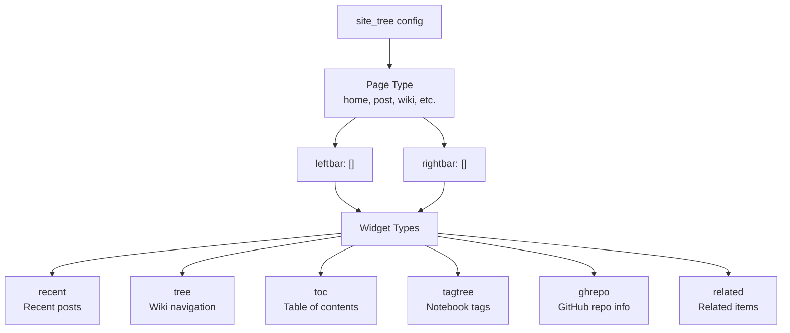

# 数据服务与组件总览

<details>
<summary>相关源码文件</summary>

生成此页面时参考的主题源码文件：

- [.github/workflows/npm-publish.yml](../../../.github/workflows/npm-publish.yml)
- [.npmignore](../../../.npmignore)
- [LICENSE](../../../LICENSE)
- [README.md](../../../README.md)
- [_config.yml](../../../_config.yml)
- [package.json](../../../package.json)
- [scripts/events/lib/doc_tree.js](../../../scripts/events/lib/doc_tree.js)
- [source/js/services/](../../../source/js/services/)
- [source/js/plugins/](../../../source/js/plugins/)

</details>

本页介绍 hexo-theme-stellar 的按需数据服务加载系统与组件架构。数据服务系统支持无需重建站点即可动态加载内容；组件系统为导航与内容发现提供模块化侧边栏组件。

数据服务系统实现懒加载：服务脚本仅在页面内容中出现对应标签时加载。该优化减小初始页面体积，同时保持丰富的动态功能。

组件实现细节见[小部件系统架构](widget-architecture.md)；各数据服务 API 规格见[数据服务 API](data-service-apis.md)。

---

## 数据服务系统概览

数据服务系统经三阶段架构实现动态内容加载：

1. **配置阶段**——`_config.yml` 定义服务元数据，包括 JavaScript 路径与 API 端点
2. **标签检测阶段**——标签插件经 `data-service` 属性在渲染 HTML 中嵌入服务引用
3. **运行时加载阶段**——客户端加载器检测服务引用并动态注入脚本

**数据服务加载架构**



**参考源码**：[_config.yml](../../../_config.yml)、[source/js/main.js](../../../source/js/main.js)

---

## 数据服务配置

`_config.yml` 的 `data_services` 小节定义全部可用服务。每个服务条目指定 JavaScript 文件路径与可选 API 端点：

**数据服务配置结构**

| 字段 | 必填 | 说明 |
|------|------|------|
| `js` | 是 | 服务 JavaScript 文件路径（相对站点根） |
| `api` | 否 | 后端通信的外部 API 端点 URL |

**可用数据服务分类**



**参考源码**：[_config.yml](../../../_config.yml)

### 服务分类

**渲染服务**

- `mdrender`——获取并渲染远程 Markdown 文件（如 GitHub README）

**数据获取服务**

- `siteinfo`——经自定义 API 提取网站元数据（标题、图标）
- `ghinfo`——经 GitHub API 获取仓库信息
- `rating`——带后端持久化的星级评分
- `vote`——带后端持久化的赞/踩投票
- `contributors`——显示 GitHub 仓库贡献者

**布局服务**

- `sites`——网格布局渲染站点卡片
- `friends`——渲染友链并自动检测状态
- `friends_and_posts`——友链与文章流组合
- `timeline`——时序内容的时间线布局
- `fcircle`——朋友圈聚合
- `weibo`——微博内容嵌入
- `memos`——memo/便签显示系统
- `rss`——RSS 源读取

**评论服务**

- `twikoo`——最新 Twikoo 评论组件
- `waline`——最新 Waline 评论组件
- `artalk`——最新 Artalk 评论组件
- `giscus`——最新 Giscus 讨论组件

**特殊插件**

- `voice`——音频播放器组件
- `video`——视频播放器组件
- `download-file`——经 Blob API 浏览器文件下载

**参考源码**：[_config.yml](../../../_config.yml)、[source/js/services/](../../../source/js/services/)、[source/js/plugins/](../../../source/js/plugins/)

---

## 按需加载机制

数据服务系统实现条件脚本加载优化页面性能。服务仅在 DOM 中检测到对应 HTML 元素时加载。

**加载检测流程**



**参考源码**：[source/js/main.js](../../../source/js/main.js)

### 脚本注入模式

数据服务脚本采用自初始化模式。服务脚本加载后：

1. 扫描 DOM 找对应选择器（如 `.ds-rating`、`.ds-vote`、`.ds-ghinfo`）
2. 为每个匹配元素初始化事件监听与 API 调用
3. 注册自身防止重复加载

该模式保证服务可在页面生命周期任意时刻加载（主题为整页导航，每次加载重新扫描）。

**参考源码**：[source/js/services/rating.js](../../../source/js/services/rating.js)、[source/js/services/vote.js](../../../source/js/services/vote.js)、[source/js/services/ghinfo.js](../../../source/js/services/ghinfo.js)

---

## 组件系统架构

组件是定义在 `_config.yml` `site_tree` 小节中的模块化侧边栏组件。组件系统支持左右两个侧边栏，每种页面类型有不同组件集。

**组件配置层级**



**参考源码**：[_config.yml](../../../_config.yml)

### 内置组件类型

| 组件 ID | 用途 | 布局模板 | 典型位置 |
|---------|------|----------|----------|
| `recent` | 最近文章列表 | `_partial/widgets/recent.ejs` | 左栏，大多数页面 |
| `related` | 按标签的相关 wiki 项目 | `_partial/widgets/related.ejs` | 左栏，wiki 页面 |
| `tree` | wiki 项目树导航 | `_partial/widgets/tree.ejs` | 左栏，wiki 页面 |
| `toc` | 目录 | `_partial/widgets/toc.ejs` | 右栏，内容页 |
| `tagtree` | 笔记本标签树 | `_partial/widgets/tagtree.ejs` | 左栏，笔记本页面 |
| `ghrepo` | GitHub 仓库信息卡片 | `_partial/widgets/ghrepo.ejs` | 右栏，项目页 |
| `ghuser` | GitHub 用户卡片 | `_partial/widgets/ghuser.ejs` | 右栏，作者页 |
| `author` | 作者信息 | `_partial/widgets/author.ejs` | 左栏，作者页 |
| `tagcloud` | 标签云 | `_partial/widgets/tagcloud.ejs` | 各种布局 |
| `timeline` | 作者时间线 | `_partial/widgets/timeline.ejs` | 双栏，作者页 |
| `latest_comment` | 最新评论 | `_partial/widgets/timeline.ejs`（widgets.yml 中 `layout: timeline`） | 各种布局 |

注意：`welcome` 组件已不在 `_data/widgets.yml` 定义，配置中的 `welcome` 引用实际不再渲染。完整组件列表以 `_data/widgets.yml` 为准。

**参考源码**：[_data/widgets.yml](../../../_data/widgets.yml)、[layout/_partial/widgets/](../../../layout/_partial/widgets/)

### 组件配置示例

```yaml
site_tree:
  post:
    leftbar: related, recent
    rightbar: ghrepo, toc
  wiki:
    leftbar: tree, related, recent
    rightbar: ghrepo, toc
```

组件列表按从左到右、从上到下顺序处理。`leftbar` 与 `rightbar` 字段接受逗号分隔的组件 ID。无效组件 ID 静默忽略。

**参考源码**：[_config.yml](../../../_config.yml)

---

## 图标配置

rating 与 vote 系统都引用 `_data/icons.yml` 中解析的图标键。相关内建条目：

| 键 | 用于 |
|-----|------|
| `rating:star` | 评分组件的默认星形图标 |
| `vote:thumbsup` | 默认赞按钮图标 |
| `vote:thumbsdown` | 默认踩按钮图标 |

可通过对应标签插件的 `icon`、`yes`、`no` 参数指定自定义图标。图标键解析见[图标标签插件](../04-标签插件/icon-tag.md)。

**参考源码**：[_data/icons.yml](../../../_data/icons.yml)

---

## 配置参考

交互组件需要 `_config.yml` 中的 `data_services` 条目：

```yaml
data_services:
  rating:
    api: https://your-api-host.com
  vote:
    api: https://your-api-host.com
```

标签插件在构建期读取。`api` 字段缺失或为空时渲染 HTML 上的 `data-api` 属性为空，客户端 JavaScript 对该元素静默跳过初始化（`loadRating` 与 `loadVote` 都检查 `if (!id || !api) return`）。

完整的 `data_services` 配置与组件系统见[数据服务 API](data-service-apis.md)与[小部件系统架构](widget-architecture.md)。

**参考源码**：[scripts/tags/lib/rating.js](../../../scripts/tags/lib/rating.js)、[scripts/tags/lib/vote.js](../../../scripts/tags/lib/vote.js)、[source/js/services/rating.js](../../../source/js/services/rating.js)、[source/js/services/vote.js](../../../source/js/services/vote.js)
