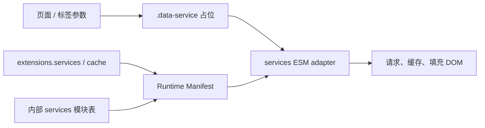

# 数据服务与组件总览

Stellar 的数据组件采用“服务端生成占位、浏览器进入视口后请求”的模式。v2 将公开业务端点收敛到 `extensions.services`，将主题自带 JavaScript 模块收敛到内部资源注册表。

## 两类组件

- 静态组件：由 EJS、helper 或 tag handler 直接生成完整 HTML，不需要浏览器请求。
- 动态组件：生成 `.data-service` 占位，并由 Runtime Manifest 按 DOM 条件 import `source/js/runtime/extensions/services.mjs`，再按服务 ID 加载内部模块。



## 公开端点

```yaml
extensions:
  services:
    site_info:
      endpoint:
    rating:
      endpoint: https://star-vote.xaox.cc/api/rating
    vote:
      endpoint: https://star-vote.xaox.cc/api/vote
    contributors:
      edit_page: {}
    github:
      api_url: https://api.github.com
      raw_url: https://raw.githubusercontent.com
      gist_url: https://gist.github.com
      card_url: https://github-readme-stats.vercel.app
```

所有 GitHub 地址都是完整 URL，消费方不再为裸 host 补协议或路径。主题自带的 mdrender、siteinfo、ghinfo、rating、vote、sites、friends、timeline、memos、评论统计等模块路径不可配置。

## 缓存

`extensions.cache` 定义 `enabled/default_ttl/ttl/max_entries`。`ttl.<service>` 是开放的数值记录；`0` 表示该服务不缓存。浏览器 request/cache 客户端直接消费 camelCase manifest 投影，不修改原生 fetch/XHR。

## 失败降级

动态组件先保留可用的服务端占位或默认图标。模块、网络或接口失败时只影响当前组件，不阻断页面主体；缓存命中时先显示缓存，再按现有策略刷新。

## 参考源码

- [scripts/lib/extension-assets.js](../../../scripts/lib/extension-assets.js)
- [layout/_partial/scripts/runtime.ejs](../../../layout/_partial/scripts/runtime.ejs)
- [source/js/runtime/extensions/services.mjs](../../../source/js/runtime/extensions/services.mjs)
- [source/js/runtime/request-cache.mjs](../../../source/js/runtime/request-cache.mjs)
- [source/js/services/](../../../source/js/services/)
- [数据服务 API](data-service-apis.md)
- [小部件系统架构](widget-architecture.md)

旧 `data_services`、`data_cache` 与 `api_host` 根已被 Schema 拒绝，不再是现行接口。
