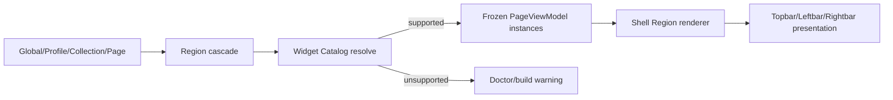

# Widget Catalog 架构

Widget Catalog 是 Stellar v2 所有页面外壳组件的统一注册与解析入口。Brand、Menu、Search、Actions、Visitor、Wiki Home 等系统元素与 `_data/widgets.yml` 中的内容 Widget 使用同一条实例化、能力校验和 Region 渲染管线。

Region 组合、级联、Leftbar Rail 与迁移规则见 [Region 与 Leftbar 系统](../02-布局系统/sidebar-system.md)。

## Descriptor 与实例

Catalog descriptor 至少包含 Widget ID 对应的 `layout`，类型可以声明 `presentations`。系统 Widget 由主题注册；用户 Widget 继续在站点 `source/_data/widgets.yml` 中按 ID 配置：

```yaml
welcome:
  layout: markdown
  title: 欢迎
  content: |
    这是一个自定义 Widget。

recent:
  layout: recent
  limit: 5
```

Region 的 `widgets` 接受字符串 ID，也接受带 `override` 的实例对象。每次引用都会获得包含 Region、顺序与 ID 的独立 `instanceId`；不自动去重，因此同一类型可以在不同 Region 使用各自 presentation。

实例只能调整内容参数，不能通过内联 `presentations` 扩大类型能力。自定义 descriptor 未声明能力时，默认支持 `leftbar`、`rightbar` 与 `drawer`。

## 系统 Widget

| ID | layout | 数据契约 |
| --- | --- | --- |
| `brand` | `brand` | PageViewModel `render.layout.brand` |
| `menu` | `menu` | `site.menu` 与当前导航投影 |
| `search` | `search` | Search Extension 与搜索范围投影 |
| `actions` | `actions` | `site.footer.actions` |
| `visitor` | `visitor` | 当前评论 Provider 的本地缓存；仅昵称与合法头像 |
| `wiki_home` | `wiki_home` | Wiki 索引地址 |

这些 ID 不需要写入 `_data/widgets.yml`。Region 负责摆放，原业务配置仍由各自 domain 所有。

## 能力检查

目标 Region 映射到 `topbar`、`leftbar` 或 `rightbar` presentation；Leftbar 折叠时进一步读取 `leftbarRail`，移动端读取 `drawer`。当前代表性规则：

- Brand、Menu、Search、Actions、Visitor：Topbar、Leftbar、Rail、Drawer。
- TOC：Topbar、Leftbar、Rail、Rightbar、Drawer。
- Tree、Tagtree：Leftbar、Rail、Rightbar、Drawer。
- Recent、Related、GitHub、Author：Leftbar、Rightbar、Drawer。
- Timeline、Markdown：Leftbar、Rightbar、Drawer。

能力缺失会产生 `unsupported_widget_presentation` warning。warning 记录 Widget、layout、Region、Profile 与支持列表；Doctor warning 不改变 `ok: true`。实例被跳过，Region 为空时 Shell 不渲染该 Region。

## 渲染流程



`layout/_partial/regions/widgets.ejs` 是唯一 Region Widget 渲染入口。模板只消费冻结实例，不读取原始配置。普通内容 Widget 继续复用 `layout/_partial/widgets/*.ejs`；系统 Widget 转发到各自已有 partial，以保留搜索、菜单激活、Collection Brand 和 Actions 契约。

Leftbar descriptor 还携带私有 `leftbarZone`：Brand/Search 为 `top`，Actions 为 `bottom`，Visitor 为 `system`，其余为 `body`。该字段不进入公开 Schema，也不改变用户数组和重复实例顺序。Visitor 禁止把邮箱、Token、Access Token 或管理员状态写入 DOM；不支持或不可读取的 Provider 统一匿名回退。

## 通用内容组件

`recent`、`related`、`tree`、`tagtree`、`linklist` 等复用以下服务端组件：

| Partial | 职责 |
| --- | --- |
| `_partial/components/widget-frame.ejs` | 标题、操作区、内容区、页脚与空内容跳过 |
| `_partial/components/collection.ejs` | list/grid 容器、variant、density 与列数 |
| `_partial/components/collection-item.ejs` | 图标、标题、描述、meta、激活态与尾部内容 |

这些组件通过 `data-ui-surface` 和 Appearance Token 适配 Card、Glass、Minimal，不判断自己位于哪一条物理栏。Topbar 的横向或紧凑 presentation 由 Region renderer 提供，丰富面板不会被自动塞进 Popover。

## 新增 Widget 的维护要求

1. 在 `_data/widgets.yml` 或系统 Catalog 注册 descriptor。
2. 明确 presentation 能力；只声明确实有可用 DOM 和交互的形态。
3. 为每个支持位置提供最小充分的模板/CSS 契约。
4. 验证同一 Widget 多实例时 `instanceId` 隔离。
5. 验证不支持位置的 warning 字段、跳过行为与空 Region 消失。
6. 浏览器增强必须可重复 mount/unmount，并覆盖 Drawer、键盘和减少动画场景。

实现入口：`scripts/lib/widget-registry.js`、`scripts/lib/regions.js`、`layout/_partial/regions/widgets.ejs`、`test/regions.test.js`。
