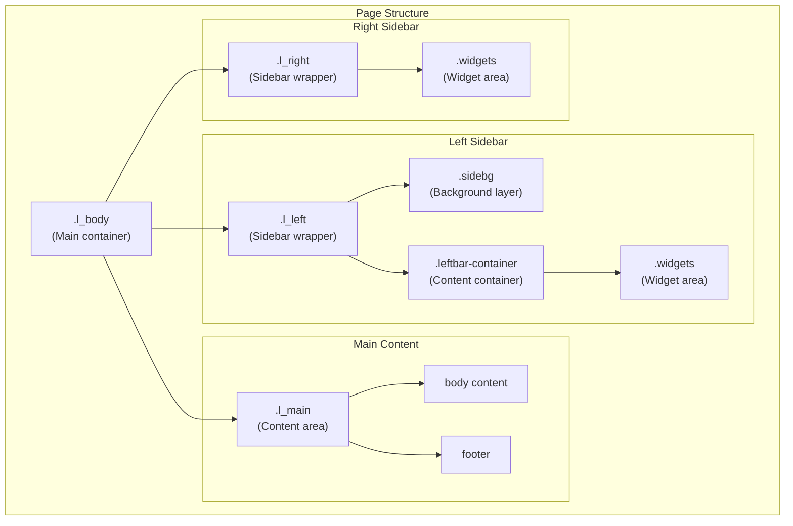
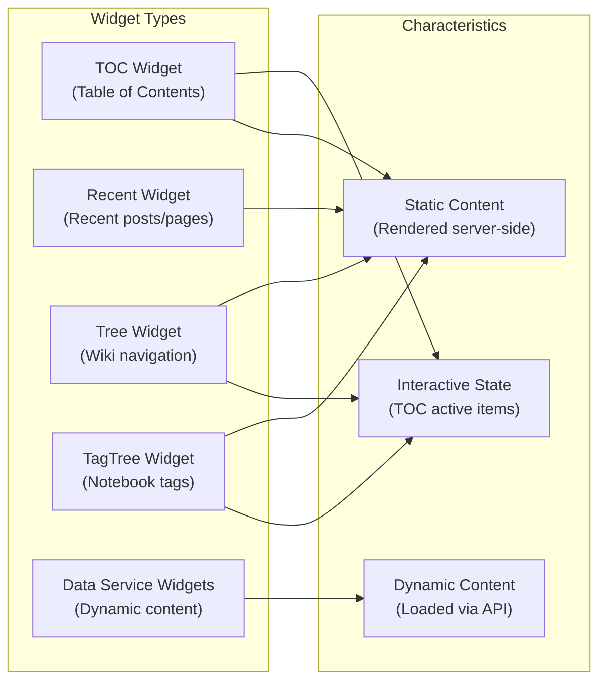
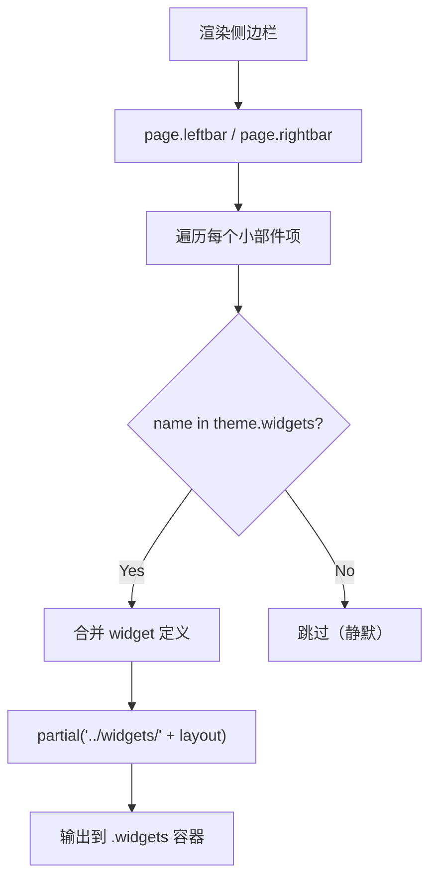

# 小部件系统架构

<details>
<summary>相关源码文件</summary>

生成此页面时参考的主题源码文件：

- [layout/layout.ejs](../../../layout/layout.ejs)
- [layout/_partial/sidebar/index_leftbar.ejs](../../../layout/_partial/sidebar/index_leftbar.ejs)
- [layout/_partial/sidebar/index_rightbar.ejs](../../../layout/_partial/sidebar/index_rightbar.ejs)
- [layout/_partial/components/widget-frame.ejs](../../../layout/_partial/components/widget-frame.ejs)
- [layout/_partial/components/collection.ejs](../../../layout/_partial/components/collection.ejs)
- [layout/_partial/components/collection-item.ejs](../../../layout/_partial/components/collection-item.ejs)
- [_data/widgets.yml](../../../_data/widgets.yml)
- [layout/_partial/widgets/](../../../layout/_partial/widgets/)
- [source/css/_components/collection.styl](../../../source/css/_components/collection.styl)

</details>

## 目的与范围

本文介绍 Stellar 主题的小部件系统架构：小部件如何渲染在侧边栏中、如何组织进容器。小部件是出现在左右侧边栏的可复用 UI 组件，提供导航、信息与交互功能。

各数据服务小部件（siteinfo、ghinfo、rating 等）见[数据服务 API](data-service-apis.md)。

---

## 小部件容器结构

Stellar 实现三栏布局，小部件容器位于左右侧边栏。这些容器在主布局模板中定义，跨页面类型保持。

### 页面布局层级



**参考源码**：[layout/layout.ejs](../../../layout/layout.ejs)

布局经嵌套结构建立小部件容器：

| 容器 | CSS 选择器 | 用途 | 位置 |
|------|------------|------|------|
| 左栏 | `.l_left` | Logo、导航与左栏小部件容器 | layout.ejs |
| 左栏小部件区 | `.l_left .widgets` | 左栏小部件 | layout.ejs |
| 右栏 | `.l_right` | 右栏小部件容器 | layout.ejs |
| 右栏小部件区 | `.l_right .widgets` | 右栏小部件 | layout.ejs |

`.leftbar-container` 在 `theme.style.leftbar.blur` 启用时经 `leftbar-blur` 类应用条件模糊效果。

**参考源码**：[layout/layout.ejs](../../../layout/layout.ejs)

---

## 小部件类型与组织

小部件系统支持多种服务于不同目的的小部件类型。每个小部件渲染为 `.widgets` 容器内的子元素，保持独立内部结构。

### 小部件类型分类



**参考源码**：[_data/widgets.yml](../../../_data/widgets.yml)

### 侧边栏结构部件

每个侧边栏分为组织小部件与其他侧边栏内容的结构部件：

| 部件 | CSS 选择器 | 用途 |
|------|------------|------|
| 页头 | `.header` | 侧边栏 Logo 与品牌 |
| 导航区 | `.nav-area` | 菜单导航链接 |
| 小部件容器 | `.widgets` | 小部件列表容器 |
| 页脚 | `.footer` | 侧边栏页脚内容 |

**参考源码**：[layout/_partial/sidebar/index_leftbar.ejs](../../../layout/_partial/sidebar/index_leftbar.ejs)、[layout/_partial/sidebar/index_rightbar.ejs](../../../layout/_partial/sidebar/index_rightbar.ejs)

---

## 小部件定义与渲染

### `_data/widgets.yml` 定义

小部件在主题的 `_data/widgets.yml` 中定义，每个小部件有 `layout` 字段指向 `layout/_partial/widgets/` 下的模板：

```yaml
ghrepo:
  layout: ghrepo
related:
  layout: related
recent:
  layout: recent
  rss: # /atom.xml
  limit: 10
tree:
  layout: tree
toc:
  layout: toc
  list_number: false
  min_depth: 1
  max_depth: 6
  collapse: false
```

小部件 ID 可以带自定义配置项（如 `recent.limit`、`toc.min_depth`），渲染时经 `theme.widgets[name]` 合并。

**参考源码**：[_data/widgets.yml](../../../_data/widgets.yml)

### 渲染流程

`index_leftbar.ejs` / `index_rightbar.ejs` 遍历配置的 `leftbar` / `rightbar` 数组：

1. 按名称从 `theme.widgets` 读取小部件定义
2. 支持对象形式覆盖（`override` / `layout` 字段）
3. 经 `partial('../widgets/' + widget.layout, {item: widget})` 渲染对应模板
4. 模板不存在或输出为空时静默跳过



**参考源码**：[layout/_partial/sidebar/index_leftbar.ejs](../../../layout/_partial/sidebar/index_leftbar.ejs)

### 小部件分类

| 类型 | 特性 | 示例 |
|------|------|------|
| 静态小部件 | 服务端渲染，内容固定 | `recent`、`related`、`ghrepo` |
| 交互小部件 | 带客户端状态 | `toc`（激活项）、`tree`（展开状态） |
| 动态小部件 | 经数据服务 API 加载 | `ghinfo`、`siteinfo`、`rating` |

---

## 侧边栏解析逻辑

左栏与右栏按页面上下文解析小部件列表（见 [index_leftbar.ejs](../../../layout/_partial/sidebar/index_leftbar.ejs)）：

| 页面上下文 | 侧边栏来源 |
|------------|------------|
| 首页 | `site_tree.home.leftbar` |
| 笔记本列表页 | `site_tree.notebooks.leftbar` |
| 笔记列表页 | 笔记本配置或 `site_tree.notes.leftbar` |
| 笔记本文章页 | 笔记本 `note_leftbar` / `note_rightbar` |
| 分类/标签/归档 | `site_tree.index_blog.leftbar` |
| 专栏列表页 | `site_tree.index_blog.leftbar` |
| wiki 列表页 | `site_tree.index_wiki.leftbar` |
| wiki 页面 | `site_tree.wiki.leftbar` |
| 404 | `site_tree.error_page.leftbar` |
| 通用页面 | `site_tree.page.leftbar` |
| 文章 | `site_tree.post.leftbar` |

专题/项目级配置（`topic.leftbar`、`wiki.leftbar`）可进一步覆盖。字符串数组经逗号切分，对象项支持 `override` 与 `layout`。

**参考源码**：[layout/_partial/sidebar/index_leftbar.ejs](../../../layout/_partial/sidebar/index_leftbar.ejs)

---

## 小部件渲染集成点

小部件经 EJS partial 模板服务端渲染，包含在侧边栏结构中：

| Partial | 用途 | 引入点 |
|---------|------|--------|
| `_partial/sidebar/index_leftbar` | 含小部件的左栏内容 | layout.ejs |
| `_partial/sidebar/index_rightbar` | 含小部件的右栏内容 | layout.ejs |
| `_partial/widgets/*.ejs` | 各小部件渲染模板 | 由小部件 `layout` 字段指定 |

**参考源码**：[layout/layout.ejs](../../../layout/layout.ejs)、[layout/_partial/sidebar/index_leftbar.ejs](../../../layout/_partial/sidebar/index_leftbar.ejs)、[layout/_partial/sidebar/index_rightbar.ejs](../../../layout/_partial/sidebar/index_rightbar.ejs)

---

## 通用集合组件

侧边栏中的紧凑导航、摘要列表与链接网格共享一套渲染原语，避免各 widget 重复维护图标、间距、圆角、激活圆点和 hover 状态：

| Partial | 职责 |
| --- | --- |
| `_partial/components/widget-frame.ejs` | 渲染 widget 标题、操作区、内容区、页脚，并在内容为空时跳过输出 |
| `_partial/components/collection.ejs` | 渲染 list/grid 容器，声明 variant、density 和 grid 最大列数 |
| `_partial/components/collection-item.ejs` | 渲染图标、前缀、标题、描述、meta、尾部内容和 active 指示 |

`collection.ejs` 的固定接口为：

- 容器：`layout: list | grid`、`variant: nav | summary | icon`、`density: auto | compact`、`columns`；
- 条目：`href`、`title`，以及可选的 `icon`、`prefix`、`description`、`meta`、`theme`、`active`、`className`；
- `title` 等普通文本由模板转义；`before` / `after` 仅供主题内部传入受信任 HTML。

调用 partial 时将上述字段放在 `options` 对象内，例如 `{options: {layout: 'grid', ...}}`。这是为了避开 Hexo/EJS 模板上下文中的同名 `layout` helper；对组件使用方而言，公开字段仍是 `options.layout`。

`compact` 用于 recent、related、文档树、标签树和 dropdown 等紧凑列表；menubar、用户 linklist 和普通集合使用默认 `auto`。其它 density 值（包括旧 `regular`）统一回退为 `auto`。menubar 不再单独覆盖条目间距，与其它 `auto` 集合共用默认几何契约。

生成的 DOM 以 `.ui-collection`、`.ui-collection__item/content/title/description/meta/indicator` 为独立命名空间，激活状态统一为 `.is-active`。list 布局显示 active 指示圆点；grid 布局保留相同 DOM 与 `aria-current`，但隐藏圆点，仅使用背景、文字和图标表达激活状态。menu、recent、related、tree、tagtree、linklist 和 dropdown 菜单项直接使用该结构；dropdown 因浮层挂载会脱离原页面区域，所以在菜单自身声明 glass surface 和 compact 密度，并在 dropdown 作用域通过 `--ui-item-min-height` 统一可选 leading 条目的高度，无图标项不生成占位。该覆盖不改变 collection 的全局默认。

标准 `.ui-collection__item` 同时输出 `.card-hover.card-hover--spotlight`，在 `plugins.card_hover` 启用时叠加鼠标跟随光斑，但不启用 3D 倾斜；插件关闭、粗指针或减少动态效果时保持原有 collection 交互。TOC 与搜索结果保留各自生成结构并通过 `.ui-collection-adapter` 消费相同 surface 令牌；TOC 不接入 Spotlight 生命周期，搜索则只为 adapter 内部的可点击链接动态挂载 Spotlight，不启用 Tilt，链接外的页面标题不参与。

collection 只读取 `--ui-item-*` 等语义变量，不判断 `.l_left` 或 `.l_right`。页面区域由 `layout.ejs` 的 `data-ui-surface="glass|card|sidebar|content"` 显式声明，因此同一组件可以放入左侧纯色/玻璃栏、右栏或正文区域。list/grid/summary 默认背景透明；作为组合内容层次的例外，`.widget-wrapper.markdown` 内的 collection 默认显示背景，glass surface 使用 `var(--bg-a10)`，card/sidebar/content 等其它 surface 使用 `var(--block)`。glass 的 hover/active 复用 menubar 玻璃高亮，深色模式使用更弱的半透明基底避免状态面过亮，其它表面使用 `var(--block)`；条目和 leading 图标在交互状态间立即切换，不做过渡。未激活的内联 SVG 通过 `currentColor` 统一使用 `var(--text-p2)`，不叠加灰阶、亮度或透明度滤镜；外部图片图标保留原图颜色。未激活 `img` / `svg` 整体透明度为 `0.5`，hover/active 时恢复为 `1`，SVG 仍按条目主题色或渐变高亮。

**参考源码**：[layout/_partial/components/](../../../layout/_partial/components/)、[source/css/_components/collection.styl](../../../source/css/_components/collection.styl)、[source/css/_components/widgets/widgets.styl](../../../source/css/_components/widgets/widgets.styl)

---

## 性能考虑

小部件系统的主要优化：

1. **按需渲染**——仅渲染配置中引用的小部件，未引用模板不加载
2. **静态优先**——静态小部件服务端渲染，无客户端开销
3. **动态懒加载**——数据服务小部件仅在内容中使用对应标签时加载脚本（见[数据服务与组件总览](data-widgets-overview.md)）
4. **空输出跳过**——模板无内容时静默省略，避免空容器

**参考源码**：[_data/widgets.yml](../../../_data/widgets.yml)、[layout/_partial/sidebar/index_leftbar.ejs](../../../layout/_partial/sidebar/index_leftbar.ejs)

---

## 错误处理与边界情况

| 边界情况 | 处理策略 |
|----------|----------|
| 小部件 ID 未在 `_data/widgets.yml` 定义 | 静默跳过，不报错 |
| 小部件模板缺失 | 静默跳过 |
| 小部件模板输出为空 | 静默跳过 |
| 字符串与对象混合的小部件列表 | 对象项支持 `override` / `layout` 覆盖 |

系统保证配置异常时优雅降级，页面始终正常渲染。

**参考源码**：[layout/_partial/sidebar/index_leftbar.ejs](../../../layout/_partial/sidebar/index_leftbar.ejs)
