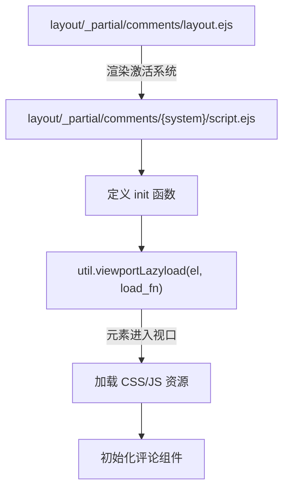
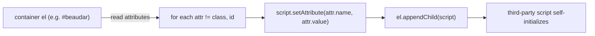
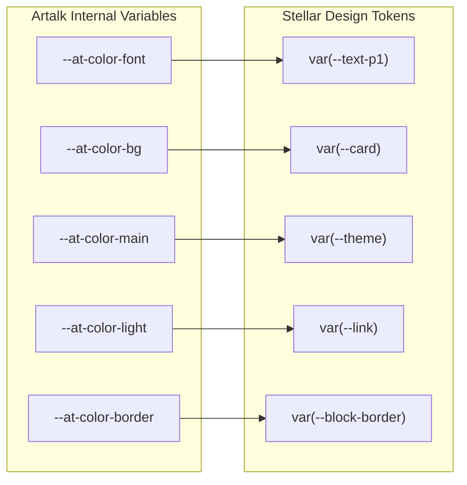

# 评论系统

<details>
<summary>相关源码文件</summary>

生成此页面时参考的主题源码文件：

- [.github/workflows/npm-publish.yml](../../../.github/workflows/npm-publish.yml)
- [.npmignore](../../../.npmignore)
- [LICENSE](../../../LICENSE)
- [README.md](../../../README.md)
- [_config.yml](../../../_config.yml)
- [package.json](../../../package.json)
- [layout/_partial/comments/](../../../layout/_partial/comments/)
- [source/css/comments/artalk.styl](../../../source/css/comments/artalk.styl)

</details>

本页介绍 hexo-theme-stellar 中可用的六个评论系统集成：**Artalk**、**Waline**、**Twikoo**、**Beaudar**、**Utterances** 与 **Giscus**，以及它们的 `_config.yml` 配置键与共享的懒加载机制。

更广泛的外部集成上下文见[外部集成总览](integrations-overview.md)。

---

## 架构概览

所有评论系统遵循相同结构模式：每个系统的 EJS partial 渲染容器元素与定义初始化函数的 `<script>` 块。实际评论库在容器滚动进入视口时懒加载（`util.viewportLazyload`），初始化在页面加载时执行一次（整页导航，PJAX 已移除）。

例外：Artalk 页面 URL 携带定位目标（`?atk_comment=<id>` 或 `#atk-comment-<id>`，如邮件通知链接与侧栏最近评论链接）时跳过视口懒加载立即初始化，以便 Artalk 的 `list-goto` 逻辑完成评论定位。

**评论系统加载流程**



**参考源码**：[layout/_partial/comments/](../../../layout/_partial/comments/)

---

## 支持的评论系统

| 系统 | 脚本风格 | 资源加载 | 容器 ID |
|------|----------|----------|---------|
| Artalk | IIFE（ES Module 包装） | `utils.css()` + `utils.js()` | `#artalk_container` |
| Waline | ES Module | `utils.css()` + 动态 `import` | `#waline_container` |
| Twikoo | IIFE | `utils.js()` | `#twikoo_container` |
| Beaudar | IIFE | 注入 `<script>` 标签 | `#comments #beaudar` |
| Utterances | IIFE | 注入 `<script>` 标签 | `#comments #utterances` |
| Giscus | IIFE | 注入 `<script>` 标签 | `#comments #giscus` |

---

## 通用模式

### 经 `util.viewportLazyload` 懒加载

每个评论系统都把加载逻辑包装在 `util.viewportLazyload` 调用中（默认启用视口懒加载，无需配置开关）：

```
util.viewportLazyload(el, load_fn)
```

- 元素进入浏览器视口前不加载评论库（内部用 IntersectionObserver）
- 元素进入视口后调用 `load_fn` 加载 CSS/JS 并初始化
- Artalk 例外：URL 含 `?atk_comment=<id>` / `#atk-comment-<id>` 时以 `viewportLazyload(el, load_fn, false)` 立即加载，保证邮件链接能自动滚动到目标评论

**参考源码**：[layout/_partial/comments/artalk/script.ejs](../../../layout/_partial/comments/artalk/script.ejs)、[layout/_partial/comments/waline/script.ejs](../../../layout/_partial/comments/waline/script.ejs)、[layout/_partial/comments/twikoo/script.ejs](../../../layout/_partial/comments/twikoo/script.ejs)

### 评论线程标识（`comment_id` 属性）

所有系统以相同方式解析评论线程标识：

```js
const path = el.getAttribute('comment_id') ?? decodeURI(window.location.pathname);
```

容器元素有 `comment_id` 属性时用该值作为线程键，否则用当前 URL pathname。这允许为多 URL 服务的页面指定自定义线程标识。

**参考源码**：[layout/_partial/comments/artalk/script.ejs](../../../layout/_partial/comments/artalk/script.ejs)、[layout/_partial/comments/waline/script.ejs](../../../layout/_partial/comments/waline/script.ejs)、[layout/_partial/comments/twikoo/script.ejs](../../../layout/_partial/comments/twikoo/script.ejs)

---

## 系统专属细节

### Artalk

Artalk 经其自托管 JS bundle 的 `Artalk.init()` 函数初始化。CSS 与 JS 都用 `utils.css()` 与 `utils.js()` 动态加载。

**`comments.artalk` 下的 `_config.yml` 键：**

| 键 | 说明 |
|----|------|
| `css` | Artalk CSS bundle URL |
| `js` | Artalk JS bundle URL |
| `server` | Artalk 后端服务器 URL |
| `site` | Artalk 中使用的站点名 |
| `darkMode` | 传给 `Artalk.init()` 的深色模式设置 |
| `imageUploader.api` | 可选图片上传端点 |
| `imageUploader.token` | 可选 Authorization 头值 |
| `imageUploader.resp` | 含上传图片 URL 的响应字段名 |

`imageUploader` 函数仅在设置 `theme.comments.artalk.imageUploader.api` 时条件渲染进 init 调用。

**参考源码**：[layout/_partial/comments/artalk/script.ejs](../../../layout/_partial/comments/artalk/script.ejs)

Artalk 邮件通知链接（`?atk_comment=<id>`，常带 `atk_notify_key`）与侧栏最近评论链接（`#atk-comment-<id>`）打开页面时自动定位到目标评论：主题检测到 atk 定位目标后跳过视口懒加载，并把评论 id 改写到 hash（保留 `atk_notify_key` 供已读回执），`list-loaded` 完成后清理残留查询参数，避免其 hash 监听干扰目录定位（#598）。

Artalk 有专属 CSS 覆盖与 Stellar 设计系统集成。主题 CSS 变量在 `.cmt-body` 作用域内映射到 Artalk 内部 CSS 变量（`--at-color-*` 前缀）。

**参考源码**：[source/css/comments/artalk.styl](../../../source/css/comments/artalk.styl)

### Waline

Waline 用 ES Module 导入模式（`<script type="module">`），从其 CDN URL 导入 `init` 函数。

**`comments.waline` 下的 `_config.yml` 键：**

| 键 | 说明 |
|----|------|
| `js` | `import { init }` 的 ES module URL |
| `css` | Waline 基础 CSS URL |
| `meta_css` | Waline 元数据 CSS URL |
| `imageUploader.api` | 可选图片上传端点 |
| `imageUploader.token` | 可选令牌头值 |
| `imageUploader.tokenName` | 令牌的头名 |
| `imageUploader.fileName` | 上传文件的 `FormData` 字段名 |
| `imageUploader.resp` | 含上传图片 URL 的响应字段名 |

`theme.comments.waline` 的其他属性经 `Object.assign` 展开进 `init()`，任何 Waline 原生选项都可直接经配置传入。

**参考源码**：[layout/_partial/comments/waline/script.ejs](../../../layout/_partial/comments/waline/script.ejs)

### Twikoo

Twikoo 经 `utils.js()` 加载 JS bundle，然后调用 `twikoo.init()`。

**`comments.twikoo` 下的 `_config.yml` 键：**

| 键 | 说明 |
|----|------|
| `js` | Twikoo JS bundle URL |
| （其他键） | 全部展开进 `twikoo.init()` |

与 Waline 类似，整个 `theme.comments.twikoo` 对象合并进 init 调用，Twikoo 原生选项（如 `envId`、`region`）直接透传。

**参考源码**：[layout/_partial/comments/twikoo/script.ejs](../../../layout/_partial/comments/twikoo/script.ejs)

### Beaudar、Utterances 与 Giscus

这三个系统遵循相同模式：向容器元素注入 `<script>` 标签，读取容器上除 `class`/`id` 外的全部属性设置为 script 属性。

**初始化流程：**



这意味着这些系统的配置完全以容器元素上的 HTML 属性表达，主题在对应 HTML partial 中从 `_config.yml` 值渲染。

- **Beaudar** 脚本源：`https://beaudar.lipk.org/client.js`
- **Utterances** 脚本源：`https://utteranc.es/client.js`
- **Giscus**：脚本源属性包含在容器属性中（加载器无硬编码 URL）

**参考源码**：[layout/_partial/comments/beaudar/script.ejs](../../../layout/_partial/comments/beaudar/script.ejs)、[layout/_partial/comments/utterances/script.ejs](../../../layout/_partial/comments/utterances/script.ejs)、[layout/_partial/comments/giscus/script.ejs](../../../layout/_partial/comments/giscus/script.ejs)

---

## Artalk CSS 集成

Artalk 是唯一在 `source/css/comments/artalk.styl` 中有专属 Stylus 覆盖的系统。覆盖策略把 Artalk 内部 CSS 变量系统桥接到 Stellar 设计令牌。

**CSS 变量映射**



映射限定在 `.cmt-body .artalk` 作用域，也应用于 `.atk-layer-wrap`（Artalk 模态层）及其深色模式变体，保证覆盖层中的自定义样式一致。

**参考源码**：[source/css/comments/artalk.styl](../../../source/css/comments/artalk.styl)

Artalk 编辑器、评论卡片与列表页脚的布局覆盖（圆角、间距、按钮形状）限定在 `.cmt-body.artalk` 作用域，避免干扰其他组件。

**参考源码**：[source/css/comments/artalk.styl](../../../source/css/comments/artalk.styl)

---

## 配置总结

各系统配置块都在 `_config.yml` 顶层 `comments` 键下：

| 配置路径 | 类型 | 说明 |
|----------|------|------|
| `comments.service` | `string` | 激活的评论系统 |
| `comments.comment_title` | `string` | 评论区块标题 |
| `comments.custom_css` | `array` | 额外评论样式覆盖 |
| `comments.artalk.*` | `object` | Artalk 专属选项（见上） |
| `comments.waline.*` | `object` | Waline 专属选项（见上） |
| `comments.twikoo.*` | `object` | Twikoo 专属选项（见上） |
| `comments.beaudar.*` | `object` | 渲染为容器 HTML 属性 |
| `comments.utterances.*` | `object` | 渲染为容器 HTML 属性 |
| `comments.giscus.*` | `object` | 渲染为容器 HTML 属性 |

完整的 `_config.yml` 参考（含 `comments` 小节）见[配置系统](../00-总览与安装配置/configuration.md)。
