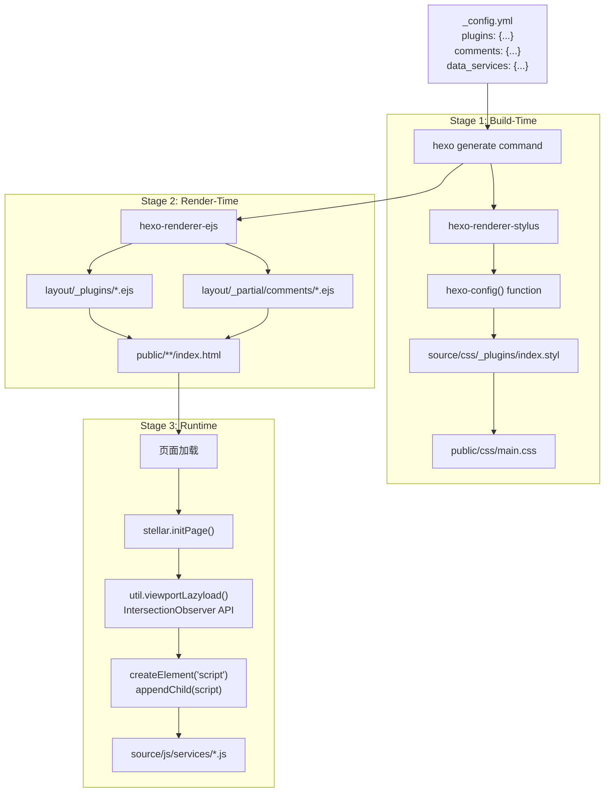
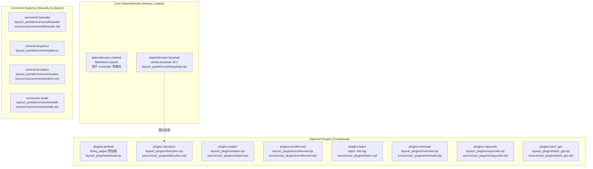
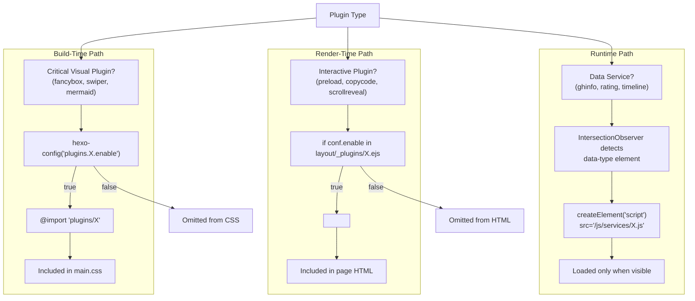
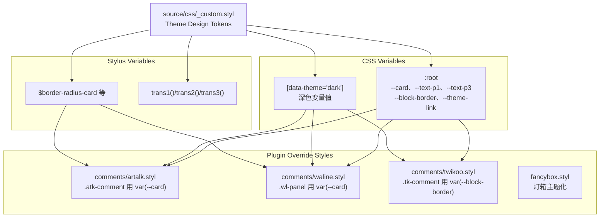

# 外部集成总览

<details>
<summary>相关源码文件</summary>

生成此页面时参考的主题源码文件：

- [.github/workflows/npm-publish.yml](../../../.github/workflows/npm-publish.yml)
- [.npmignore](../../../.npmignore)
- [LICENSE](../../../LICENSE)
- [README.md](../../../README.md)
- [_config.yml](../../../_config.yml)
- [layout/_partial/scripts/lazyload.ejs](../../../layout/_partial/scripts/lazyload.ejs)
- [layout/layout.ejs](../../../layout/layout.ejs)
- [package.json](../../../package.json)
- [scripts/helpers/json_ld.js](../../../scripts/helpers/json_ld.js)
- [source/css/_plugins/index.styl](../../../source/css/_plugins/index.styl)

</details>

hexo-theme-stellar 用 `_config.yml` 配置、条件 Stylus/EJS 编译与运行时 JavaScript 加载实现插件架构。本页介绍集成系统的技术架构、支持的插件与加载机制。

集成类型：

- **评论系统**（8.1）：六个评论后端（Artalk、Giscus、Waline、Twikoo、Beaudar、Utterances）
- **搜索功能**（8.2）：本地搜索与 Algolia 集成
- **媒体插件**（8.3）：懒加载、Fancybox 灯箱、图片优化
- **性能插件**（8.4）：preload 预加载、代码优化

## 集成架构

主题实现三层集成系统：构建期条件编译、渲染期模板生成、运行时动态加载。该架构允许通过 `_config.yml` 配置启用外部服务，无需修改主题源码。

### 集成加载流水线

**三层集成加载**



加载阶段特征：

| 阶段 | 执行时机 | 条件逻辑 | 输出 | 性能影响 |
|------|----------|----------|------|----------|
| **构建期** | `hexo generate` | Stylus 中 `if hexo-config('plugins.X.enable')` | 仅含启用插件样式的编译 CSS | 减小 CSS 包体积 |
| **渲染期** | 模板处理 | EJS 中 `<% if (conf.enable) { %>` | 带条件脚本标签的 HTML | 减小 HTML 体积 |
| **运行时** | 页面加载 + 视口相交 | JavaScript `data-type` 属性检测 | 动态脚本注入 | 延迟非关键资源 |

**参考源码**：[_config.yml](../../../_config.yml)、[source/css/_plugins/index.styl](../../../source/css/_plugins/index.styl)

## 插件系统实现

**插件生态与文件映射**



### 核心依赖

| 依赖 | 用途 | 引入方式 |
|------|------|----------|
| **marked** | Markdown 解析（mdrender 等服务） | CDN，`_config.yml` `dependencies` |
| **lazyload** | 图片懒加载（vanilla-lazyload 19.1） | CDN + `layout/_partial/scripts/lazyload.ejs` |

主题客户端无 jQuery 依赖（已移除），为原生 JavaScript。

### 可选插件

| 插件 | 启用标志 | 加载模板 | 样式文件 | CDN 默认 |
|------|----------|----------|----------|----------|
| **Preload** | `plugins.preload.enable` | `layout/_plugins/preload.ejs` | N/A | flying-pages@2 |
| **Fancybox** | `plugins.fancybox.enable` | `layout/_plugins/fancybox.ejs` | `source/css/_plugins/fancybox.styl` | @fancyapps/ui@5.0 |
| **Swiper** | `plugins.swiper.enable` | `layout/_plugins/swiper.ejs` | `source/css/_plugins/swiper.styl` | swiper@10.3 |
| **ScrollReveal** | `plugins.scrollreveal.enable` | `layout/_plugins/scrollreveal.ejs` | `source/css/_plugins/scrollreveal.styl` | scrollreveal@4.0 |
| **KaTeX** | `plugins.katex.enable` | 内联 inject | `source/css/_plugins/katex.styl` | katex CDN |
| **Mermaid** | `plugins.mermaid.enable` | `layout/_plugins/mermaid.ejs` | `source/css/_plugins/mermaid.styl` | mermaid CDN |
| **CopyCode** | `plugins.copycode.enable` | `layout/_plugins/copycode.ejs` | `source/css/_plugins/copycode.styl` | N/A |
| **Heti** | `plugins.heti.enable` | `layout/_plugins/heti.ejs` | N/A | heti@0.9 |
| **Tianli GPT** | `plugins.tianli_gpt.enable` | `layout/_plugins/tianli_gpt.ejs` | `source/css/_plugins/tianli_gpt.styl` | CDN |

### 评论系统

每个评论系统模板检查 `theme.comments.service` 激活：

```ejs
<% if (theme.comments.service == 'artalk') { %>
  <!-- Load Artalk CSS/JS -->
<% } %>
```

| 系统 | Service 值 | 模板 | 样式覆盖 | 说明 |
|------|-----------|------|----------|------|
| **Artalk** | `artalk` | `layout/_partial/comments/artalk/` | `comments/artalk.styl` | 自托管评论 |
| **Beaudar** | `beaudar` | `layout/_partial/comments/beaudar/` | `comments/beaudar.styl` | GitHub Issues |
| **Utterances** | `utterances` | `layout/_partial/comments/utterances/` | `comments/utterances.styl` | GitHub Issues |
| **Giscus** | `giscus` | `layout/_partial/comments/giscus/` | N/A | GitHub Discussions |
| **Twikoo** | `twikoo` | `layout/_partial/comments/twikoo/` | `comments/twikoo.styl` | 腾讯云/自托管 |
| **Waline** | `waline` | `layout/_partial/comments/waline/` | `comments/waline.styl` | 自托管 |

评论系统配置细节见[评论系统](comment-systems.md)。

### 内容增强插件

| 插件 | 启用标志 | 模板 | 样式 | 用途 |
|------|----------|------|------|------|
| **KaTeX** | `plugins.katex.enable` | 内联 inject | `katex.styl` | LaTeX 数学渲染 |
| **MathJax** | `plugins.mathjax.enable` | `layout/_plugins/mathjax.ejs` | N/A | 备选数学渲染器 |
| **Mermaid** | `plugins.mermaid.enable` | `layout/_plugins/mermaid.ejs` | `mermaid.styl` | 图表生成 |
| **CopyCode** | `plugins.copycode.enable` | `layout/_plugins/copycode.ejs` | `copycode.styl` | 代码块复制按钮 |
| **Heti** | `plugins.heti.enable` | `layout/_plugins/heti.ejs` | N/A | 中文排版 |
| **Tianli GPT** | `plugins.tianli_gpt.enable` | `layout/_plugins/tianli_gpt.ejs` | `tianli_gpt.styl` | AI 内容摘要 |

**参考源码**：[_config.yml](../../../_config.yml)、[source/css/_plugins/index.styl](../../../source/css/_plugins/index.styl)

## 配置结构

`_config.yml` 定义三种不同配置模式：

**模式 1：标准插件**（`plugins.*` 命名空间）

```yaml
plugins:
  fancybox:
    enable: true
    js: https://gcore.jsdelivr.net/npm/@fancyapps/ui@5.0/dist/fancybox/fancybox.umd.js
    css: https://gcore.jsdelivr.net/npm/@fancyapps/ui@5.0/dist/fancybox/fancybox.css
    selector: .timenode p>img
  swiper:
    enable: true
    css: https://unpkg.com/swiper@10.3/swiper-bundle.min.css
    js: https://unpkg.com/swiper@10.3/swiper-bundle.min.js
```

**模式 2：评论系统**（`comments.*` 命名空间，互斥）

```yaml
comments:
  service: artalk        # 激活的服务选择器
  comment_title: 快来参与讨论吧~
  custom_css: []         # 额外服务样式覆盖
  artalk:
    server: ''           # 后端 API URL
    site: ''             # 站点标识
    darkMode: auto       # 主题模式
```

**模式 3：数据服务**（`data_services.*` 命名空间，按需加载）

```yaml
data_services:
  siteinfo:
    js: /js/services/siteinfo.js
    api: https://api.xaox.cc/site_info/v1?url={href}
  ghinfo:
    js: /js/services/ghinfo.js
```

配置字段用法：

| 字段 | 类型 | 消费者 | 示例值 |
|------|------|---------|--------|
| `enable` | Boolean | Stylus 中 `hexo-config()`、EJS 条件 | `true` / `false` |
| `js` | String | EJS 模板中的 `utils.js()` | CDN URL 或本地路径 |
| `css` | String | EJS 模板中的 `utils.css()` | CDN URL 或本地路径 |
| `service` | String | 评论加载条件 | `'artalk'` / `'waline'` / `'giscus'` |
| `api` | String | 经 `theme.data_services.X.api` 的服务 JS | 支持 `{placeholder}` 的 URL |
| `inject` | String | 无需模板的直接 HTML 注入 | 原始 HTML/script 标签 |

**参考源码**：[_config.yml](../../../_config.yml)

## 数据服务与外部 API

数据服务用 IntersectionObserver API 实现基于视口的懒加载。带 `data-type` 属性的元素进入视口时动态加载服务。

**数据服务加载流程**

```mermaid
sequenceDiagram
    participant HTML["HTML Element<br/><div data-type='ghinfo' data-api='xaoxuu/hexo-theme-stellar'>"]
    participant STELLAR["stellar.initPage()"]
    participant VIEWPORT["util.viewportLazyload()"]
    participant OBSERVER["IntersectionObserver"]
    participant LOADER["Script Injector"]
    participant GHINFO["source/js/services/ghinfo.js"]
    participant CACHE["localStorage"]
    participant API["api.github.com/repos/X"]
    participant DOM["element.innerHTML"]
    
    HTML->>STELLAR: Page loaded
    STELLAR->>VIEWPORT: querySelectorAll('[data-type]')
    VIEWPORT->>OBSERVER: observe(element)
    
    Note over OBSERVER: Element scrolls into viewport
    
    OBSERVER->>LOADER: isIntersecting = true
    LOADER->>LOADER: createElement('script')
    LOADER->>GHINFO: Load and execute
    
    GHINFO->>CACHE: getItem(key)
    
    alt Cache Hit and Fresh
        CACHE-->>GHINFO: Return cached data
    else Cache Miss or Stale
        GHINFO->>API: fetch(repo_url)
        API-->>GHINFO: JSON response
        GHINFO->>CACHE: setItem(key, data)
    end
    
    GHINFO->>DOM: Render template with data
    OBSERVER->>OBSERVER: unobserve(element)
```

### 可用数据服务

数据服务在 `data_services` 小节配置，带匹配 `data-type` 属性的元素进入视口时激活：

| 服务 | 脚本 | API 模式 | HTML 用法 | 缓存 |
|------|------|----------|-----------|------|
| **mdrender** | `/js/services/mdrender.js` | 外部 markdown 文件 | `<div data-type="mdrender" data-url="...">` | 无 |
| **siteinfo** | `/js/services/siteinfo.js` | `{api}?url={href}` | `<div data-type="siteinfo" data-api="..." data-href="...">` | localStorage |
| **ghinfo** | `/js/services/ghinfo.js` | `{ghapi}/repos/{repo}` | `<div data-type="ghinfo" data-api="owner/repo">` | localStorage（24h） |
| **rating** | `/js/services/rating.js` | `{api}/rating` | `<div data-type="rating" data-id="..." data-api="...">` | localStorage + API |
| **vote** | `/js/services/vote.js` | `{api}/vote` | `<div data-type="vote" data-id="..." data-api="...">` | localStorage + API |
| **sites** | `/js/services/sites.js` | YAML 数据文件 | `<div data-type="sites" data-api="...">` | 无 |
| **friends** | `/js/services/friends.js` | YAML 数据文件 | `<div data-type="friends" data-api="...">` | 无 |
| **timeline** | `/js/services/timeline.js` | YAML 数据文件 | `<div data-type="timeline" data-api="...">` | 无 |
| **contributors** | `/js/services/contributors.js` | `{ghapi}/repos/{repo}/contributors` | `<div data-type="contributors" data-api="...">` | localStorage |
| **rss** | `/js/services/rss.js` | RSS/Atom 源 URL | `<div data-type="rss" data-api="...">` | 无 |
| **twikoo** | `/js/services/twikoo_latest_comment.js` | Twikoo API | `<div data-type="twikoo" data-api="...">` | 无 |
| **waline** | `/js/services/waline_latest_comment.js` | Waline API | `<div data-type="waline" data-api="...">` | 无 |
| **artalk** | `/js/services/artalk_latest_comment.js` | Artalk API | `<div data-type="artalk" data-api="...">` | 无 |
| **giscus** | `/js/services/giscus_latest_comment.js` | Giscus API | `<div data-type="giscus" data-api="...">` | 无 |

HTML 用法示例：

```html
<!-- GitHub 仓库信息卡片 -->
<div data-type="ghinfo" data-api="xaoxuu/hexo-theme-stellar"></div>

<!-- 星级评分组件 -->
<div data-type="rating" data-id="page-rating" data-api="https://star-vote.xaox.cc/api/rating"></div>

<!-- 外部站点信息卡片 -->
<div data-type="siteinfo" data-api="https://api.example.com/site_info/v1?url={href}" data-href="https://example.com"></div>
```

这些元素进入视口时 `util.viewportLazyload()` 动态注入对应服务脚本，脚本获取数据并渲染进元素。

**参考源码**：[_config.yml](../../../_config.yml)

### API 主机配置

`api_host` 小节允许 GitHub API 代理：

```yaml
api_host:
  ghapi: api.github.com                    # GitHub REST API 端点
  ghraw: raw.githubusercontent.com         # 原始内容 CDN
  gist: gist.github.com                    # Gist 服务
  ghcard: github-readme-stats.vercel.app   # anuraghazra/github-readme-stats
```

`ghinfo.js` 与 `contributors.js` 等服务用 `theme.api_host.ghapi` 构造 API URL：

```javascript
// ghinfo.js 伪代码
const apiUrl = `https://${theme.api_host.ghapi}/repos/${owner}/${repo}`;
fetch(apiUrl).then(response => response.json());
```

覆盖这些值的场景：

- **企业代理**：经内部代理服务器路由
- **限速缓解**：用 GitHub app 令牌经代理
- **大陆访问**：用镜像服务
- **本地开发**：指向 mock API 服务器

**参考源码**：[_config.yml](../../../_config.yml)

## 插件加载策略

主题为不同类型集成实现三种加载策略。

**构建期 vs 运行时加载决策树**



### 策略 1：构建期 CSS 编译

Stylus 编译器经 `hexo-config()` 读取 `_config.yml`，在 `hexo generate` 阶段条件导入插件样式表。

**[source/css/_plugins/index.styl](../../../source/css/_plugins/index.styl) 实现：**

```stylus
// 始终加载的核心插件
@import 'lazyload'
@import 'aplayer'

// 按 _config.yml 配置条件导入
if hexo-config('plugins.swiper.enable')
  @import 'swiper'
if hexo-config('plugins.scrollreveal.enable')
  @import 'scrollreveal'
if hexo-config('plugins.fancybox.enable')
  @import 'fancybox'
if hexo-config('plugins.mermaid.style_optimization')
  @import 'mermaid'
if hexo-config('plugins.copycode.enable')
  @import 'copycode'
if hexo-config('plugins.tianli_gpt.enable')
  @import 'tianli_gpt'
if hexo-config('plugins.katex.enable')
  @import 'katex'

// 评论（按 service 互斥）
if hexo-config('comments.service') == 'beaudar' or index(hexo-config('comments.custom_css'), 'beaudar') >= 0
  @import 'comments/beaudar'
if hexo-config('comments.service') == 'twikoo' or index(hexo-config('comments.custom_css'), 'twikoo') >= 0
  @import 'comments/twikoo'
if hexo-config('comments.service') == 'utterances' or index(hexo-config('comments.custom_css'), 'utterances') >= 0
  @import 'comments/utterances'
if hexo-config('comments.service') == 'waline' or index(hexo-config('comments.custom_css'), 'waline') >= 0
  @import 'comments/waline'
if hexo-config('comments.service') == 'artalk' or index(hexo-config('comments.custom_css'), 'artalk') >= 0
  @import 'comments/artalk'
```

`index(hexo-config('comments.custom_css'), 'service') >= 0` 条件允许在 `custom_css` 数组中指定非激活评论系统的样式，支持多评论场景。

**收益：**

- **减小 CSS 包体积**：禁用插件对 `main.css` 贡献 0 字节
- **无运行时开销**：无需 JavaScript 评估隐藏未用样式
- **缓存效率**：不同配置生成不同 CSS 哈希，支持长期缓存

**参考源码**：[source/css/_plugins/index.styl](../../../source/css/_plugins/index.styl)

### 策略 2：渲染期模板条件渲染

`layout/_plugins/` 目录的 EJS 模板接收配置对象，按启用标志条件渲染 HTML/JavaScript。

**模板上下文：**

- `conf` 对象包含 `theme.plugins.X`（来自 `_config.yml`）
- `url_for()` 辅助函数解析主题相对路径
- 主布局经 `partial('_plugins/X')` 引入模板

插件模板发现机制：

1. 主布局检查 `theme.plugins.*` 启用插件
2. 为每个启用插件引入 `layout/_plugins/<plugin_name>.ejs`
3. 插件模板接收 `conf` = `theme.plugins.<plugin_name>`

**收益：**

- **干净的 HTML 输出**：禁用插件产生零 HTML 标签
- **配置灵活**：模板内复杂条件逻辑
- **类型安全**：EJS 在构建期捕获模板错误

**参考源码**：[layout/_plugins/](../../../layout/_plugins/)

### 策略 3：运行时动态脚本注入

数据服务仅在触发元素进入视口时加载，用 IntersectionObserver API。

**加载机制**（`stellar.initPage()` 中实现）：

```javascript
// 实际实现的伪代码表示
const util = {
  viewportLazyload: function(element, callback) {
    const observer = new IntersectionObserver((entries) => {
      entries.forEach(entry => {
        if (entry.isIntersecting) {
          callback();
          observer.unobserve(entry.target);  // 加载一次后停止观察
        }
      });
    }, { 
      threshold: 0.01,      // 1% 可见时触发
      rootMargin: '50px'    // 进入视口前 50px 触发
    });
    observer.observe(element);
  }
};

// stellar.initPage() 中的服务初始化
document.querySelectorAll('[data-type]').forEach(element => {
  const serviceType = element.getAttribute('data-type');
  const serviceConfig = theme.data_services[serviceType];
  if (!serviceConfig) return;
  util.viewportLazyload(element, () => {
    const script = document.createElement('script');
    script.src = serviceConfig.js;
    script.onload = () => { /* 服务脚本自初始化 */ };
    document.head.appendChild(script);
  });
});
```

**收益：**

- **初始页面速度**：不可见服务不阻塞页面加载
- **带宽节省**：用户不会加载不滚动到的内容服务
- **内存效率**：观察器清理防止内存泄漏
- **渐进增强**：服务脚本失败时页面仍可用

**参考源码**：[layout/_partial/scripts/lazyload.ejs](../../../layout/_partial/scripts/lazyload.ejs)

## 插件样式集成

`source/css/_plugins/` 中的主题覆盖样式把设计令牌应用到第三方插件 CSS，保证视觉一致。

**设计令牌传播到插件**



### 插件覆盖中的 CSS 变量使用

插件样式引用主题配置的 CSS 自定义属性：

| CSS 变量 | 用途 | 文件 |
|----------|------|------|
| `var(--card)` | 评论背景、模态 | `comments/artalk.styl`、`comments/waline.styl` |
| `var(--text-p1)` | 评论文本、标签 | `comments/waline.styl` |
| `var(--block-border)` | 分隔线、边框 | `comments/twikoo.styl` |
| `var(--theme-link)` | 进度条、高亮 | 插件样式 |
| `$border-radius-card` | 圆角 | 所有插件样式 |

Artalk 评论覆盖示例：

```stylus
// source/css/comments/artalk.styl
.atk-comment
  background var(--card)
  color var(--text-p1)
  border 1px solid var(--block-border)
  border-radius $border-radius-card
```

### 深色模式自动适配

主题切换改变 `:root` 与 `[data-theme="dark"]` 变量。插件样式引用 CSS 变量而非硬编码颜色，自动适配：

```stylus
// 浅色模式（默认）
:root
  --card: hsl(0 0% 100%)
  --text-p1: hsl(0 0% 20%)

// 深色模式（经 data-theme 属性）
[data-theme="dark"]
  --card: hsl(0 0% 12%)
  --text-p1: hsl(0 0% 85%)
```

使用 `var(--card)` 的插件无需额外 CSS 即可自动从白色切换为深色背景。

**参考源码**：[source/css/_custom.styl](../../../source/css/_custom.styl)、[source/css/comments/](../../../source/css/comments/)

## 集成配置

所有集成经主题 `_config.yml` 控制：

| 配置小节 | 说明 |
|----------|------|
| `plugins.*` | 通用插件配置 |
| `plugins.*.enable` | 启用/禁用特定插件的布尔值 |
| `plugins.*.options` | 插件专属配置项 |
| `comments.service` | 选择激活的评论系统 |
| `comments.*` | 评论系统专属配置 |
| `data_services.*` | 数据服务配置 |

配置系统允许精细控制哪些集成激活及其行为，无需修改主题核心文件。

**参考源码**：[source/css/_plugins/index.styl](../../../source/css/_plugins/index.styl)

## 使用集成的最佳实践

1. 只启用需要的集成以优化站点性能
2. 启用新集成时同时测试深浅模式
3. 添加交互插件时考虑移动端兼容
4. 查阅集成专属文档了解高级配置
5. 保持插件版本与主题版本兼容

具体集成类型详见[评论系统](comment-systems.md)与[搜索功能](../07-外部集成/search.md)。
