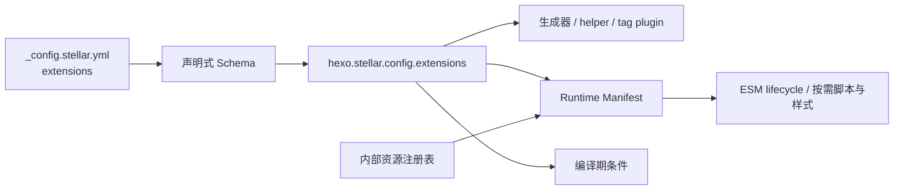

# 外部集成总览

Stellar v2 把用户可配置的外部能力统一放在 `extensions`。构建期先用声明式 Schema 校验主题默认与站点 `_config.stellar.yml` 覆盖，再把冻结的 camelCase 对象挂到 `hexo.stellar.config.extensions`；模板、生成器、标签插件与 Stylus 不直接读取原始主题配置。

## 配置分区

| 路径 | 职责 | 运行时键 |
| --- | --- | --- |
| `extensions.search` | 本地搜索或 Algolia provider | `extensions.search` |
| `extensions.comments` | 全局评论 provider、标题和第三方参数袋 | `extensions.comments` |
| `extensions.tags` | Stellar 官方标签插件行为参数 | `extensions.tags` |
| `extensions.features` | 懒加载、预加载、灯箱、动效、数学、图表等页面能力 | `extensions.features` |
| `extensions.services` | 站点信息、评分、投票、贡献者与 GitHub 端点 | `extensions.services` |

公开 YAML 使用 snake_case，冻结 JavaScript 使用 camelCase。Stellar 所有父级对象严格封闭；只有明确声明的第三方 provider 参数袋保留上游键名。数组完整替换，对象和参数袋按已声明边界逐键合并，不做类型强转。

## 按需加载链

`scripts/lib/browser-runtime.js` 根据搜索/评论 provider、全局 Feature、页面 profile 与 `render.math/render.diagrams` 生成严格、深冻结的 manifest。`layout/_partial/scripts/runtime.ejs` 只注入 JSON 与单一 module bootstrap；浏览器按 `when.selector/always` dynamic import search、comments、services 或 Feature adapter，并以 mount/unmount 管理实例。旧全局补载队列和网络 monkey patch 已删除。

## 内部资源

官方脚本、样式、主题自带服务模块、固定 provider 和 request/cache policy 由 `scripts/lib/internal-constants.js` 注册，不是公开配置：

- marked 与 lazyload CDN；
- 评论实现的 `js/css/src/meta_css`；
- Feature 的 `js/css/inject`；
- 旧数据服务对应的主题本地模块。

站点不能通过 provider 参数袋覆盖 `js`、`css`、`meta_css`、`src` 或 `inject`。公开参数只描述行为，资源版本和加载责任归主题所有。

## 搜索、评论与页面渲染

- 搜索：`extensions.search.provider` 为 `local` 或 `algolia`；provider 参数位于 `providers.<provider>`。
- 评论：`extensions.comments.provider/title/providers` 定义站点默认；Collection / Front Matter 通过 `comments.provider/options` 覆盖。
- 数学：全局 `extensions.features.math.provider` 可选择默认实现，页面 `render.math` 可覆盖。
- 图表：`extensions.features.diagrams` 定义 Mermaid 默认，页面 `render.diagrams` 决定单页启用或覆盖选项。
- 其它 Feature：统一使用 `enabled`，由 Runtime Manifest adapter 按页面声明与 DOM 条件加载内部资源。

Swiper 是主题内置容器能力，依据页面 DOM 按需加载，不提供公开配置。图片懒加载是主题基础行为，公开配置只保留过渡与比例修正参数。

## 服务与内部缓存

`extensions.services` 只公开业务端点和完整 GitHub URL。站点信息、评分与投票使用 `endpoint`；GitHub 使用 `api_url/raw_url/gist_url/card_url`，且必须是绝对 HTTP(S) URL。

request/cache 的 TTL、重试、超时、容量与淘汰规则是主题内部实现策略。ESM 客户端消费 Runtime Manifest 中的冻结 policy，不替换浏览器原生网络 API。

## 已移除入口

`search/comments/tag_plugins/dependencies/data_services/data_cache/plugins/api_host` 八个旧根以及 `enable`、`comment_title`、`custom_css` 等旧字段均由 Schema 拒绝。v2 不提供别名、兼容读取或自动迁移。

## 参考源码

- [_config.yml](../../../_config.yml)（`extensions`）
- [scripts/schema/config-schema.js](../../../scripts/schema/config-schema.js)
- [scripts/lib/internal-constants.js](../../../scripts/lib/internal-constants.js)
- [scripts/lib/browser-runtime.js](../../../scripts/lib/browser-runtime.js)
- [layout/_partial/scripts/runtime.ejs](../../../layout/_partial/scripts/runtime.ejs)
- [source/js/runtime/](../../../source/js/runtime/)
- [layout/_partial/comments/](../../../layout/_partial/comments/)
- [source/css/_plugins/index.styl](../../../source/css/_plugins/index.styl)

相关专题：[搜索](search.md)、[评论系统](comment-systems.md)、[插件系统](plugin-system.md)、[数据服务 API](../06-数据服务与组件/data-service-apis.md)、[性能优化](../09-高级主题/performance.md)。
